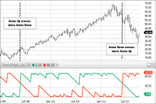

## Table of Contents

## What is the Aroon Indicator?

The Aroon Indicator is a technical analysis tool used by traders to identify trends and predict potential trend changes in the market. It consists of two lines: the Aroon Up line and the Aroon Down line. The Aroon Up line measures the number of periods since the highest price within a given time frame, while the Aroon Down line measures the number of periods since the lowest price. Both lines are calculated on a scale from 0 to 100, with higher values indicating a stronger trend.

Traders use the Aroon Indicator to determine whether a market is in a strong uptrend, downtrend, or if it is ranging. When the Aroon Up line is above 70 and the Aroon Down line is below 30, it suggests a strong uptrend. Conversely, if the Aroon Down line is above 70 and the Aroon Up line is below 30, it indicates a strong downtrend. When both lines are close to 50, it suggests that the market is in a consolidation phase with no clear trend. By analyzing these signals, traders can make more informed decisions about when to enter or exit trades.

## Who developed the Aroon Indicator and when was it introduced?

The Aroon Indicator was developed by Tushar Chande, who is a well-known researcher and trader. He introduced this tool to the world of technical analysis in 1995. Tushar Chande wanted to create an indicator that could help traders see when a new trend was starting or when an old trend was ending.

The Aroon Indicator became popular because it was easy to use and gave clear signals about market trends. Traders liked how it could show if the market was going up, going down, or just staying the same. Since its introduction, many traders have used the Aroon Indicator to make better decisions about buying and selling.

## What are the components of the Aroon Indicator?

The Aroon Indicator has two main parts: the Aroon Up line and the Aroon Down line. The Aroon Up line looks at how many days it has been since the highest price in a certain time period. If the highest price was very recent, the Aroon Up line will be high, close to 100. If it has been a long time since the highest price, the Aroon Up line will be low, closer to 0. On the other hand, the Aroon Down line checks how many days it has been since the lowest price in that same time period. A recent low price means the Aroon Down line will be high, while a long time since the lowest price means it will be low.

These two lines help traders see what the market is doing. When the Aroon Up line is above 70 and the Aroon Down line is below 30, it means the market is in a strong uptrend. This tells traders that prices are going up and it might be a good time to buy. If the Aroon Down line is above 70 and the Aroon Up line is below 30, it shows a strong downtrend, suggesting that prices are going down and it might be a good time to sell. When both lines are around 50, it means the market is not really going up or down much, and it might be a time to wait and see what happens next.

## How is the Aroon Up calculated?

The Aroon Up is calculated by looking at how many days it has been since the highest price in a certain time period. First, you pick a time period, like 25 days. Then, you find the highest price in those 25 days. Next, you count how many days it has been since that highest price happened. If the highest price was just 3 days ago, you use the number 3. If it was 20 days ago, you use the number 20.

After you have the number of days, you use a simple formula to turn it into the Aroon Up value. The formula is: Aroon Up = 100 - ((Number of days since the highest price / Time period) * 100). Using our examples, if the highest price was 3 days ago in a 25-day period, the Aroon Up would be 100 - ((3 / 25) * 100) = 88. If it was 20 days ago, it would be 100 - ((20 / 25) * 100) = 20. This way, the Aroon Up value is always between 0 and 100, with higher numbers meaning the highest price was more recent.

## How is the Aroon Down calculated?

The Aroon Down is calculated by looking at how many days it has been since the lowest price in a certain time period. First, you choose a time period, like 25 days. Then, you find the lowest price in those 25 days. Next, you count how many days it has been since that lowest price happened. If the lowest price was just 3 days ago, you use the number 3. If it was 20 days ago, you use the number 20.

After you have the number of days, you use a simple formula to turn it into the Aroon Down value. The formula is: Aroon Down = 100 - ((Number of days since the lowest price / Time period) * 100). Using our examples, if the lowest price was 3 days ago in a 25-day period, the Aroon Down would be 100 - ((3 / 25) * 100) = 88. If it was 20 days ago, it would be 100 - ((20 / 25) * 100) = 20. This way, the Aroon Down value is always between 0 and 100, with higher numbers meaning the lowest price was more recent.

## What does the Aroon Indicator tell traders?

The Aroon Indicator helps traders see if the market is going up, going down, or staying the same. It uses two lines: the Aroon Up line and the Aroon Down line. The Aroon Up line shows how many days it has been since the highest price in a certain time period. If this number is high, it means the market is in a strong uptrend. The Aroon Down line shows how many days it has been since the lowest price. A high number here means the market is in a strong downtrend. By looking at these lines, traders can tell what the market is doing right now.

When the Aroon Up line is above 70 and the Aroon Down line is below 30, it means the market is in a strong uptrend. This might be a good time for traders to buy. If the Aroon Down line is above 70 and the Aroon Up line is below 30, it means the market is in a strong downtrend, and it might be a good time to sell. When both lines are around 50, it means the market is not really moving up or down much. Traders might want to wait and see what happens next before making a decision.

## How can the Aroon Indicator be used to identify trends?

The Aroon Indicator helps traders figure out if the market is going up or down by using two lines: the Aroon Up line and the Aroon Down line. The Aroon Up line tells you how many days it's been since the highest price in a certain time. If this number is high, it means the market is in a strong uptrend. On the other hand, the Aroon Down line shows how many days it's been since the lowest price. If this number is high, it means the market is in a strong downtrend. By looking at these lines, traders can see what the market is doing right now.

Traders use the Aroon Indicator to make decisions about buying or selling. When the Aroon Up line is above 70 and the Aroon Down line is below 30, it's a sign that the market is in a strong uptrend. This might be a good time for traders to buy. If the Aroon Down line is above 70 and the Aroon Up line is below 30, it's a sign of a strong downtrend, which could be a good time to sell. When both lines are around 50, it means the market isn't moving much, so traders might want to wait and see what happens next before making a move.

## What is the Aroon Oscillator and how is it calculated?

The Aroon Oscillator is another tool that traders use to see if the market is going up or down. It's made by taking the difference between the Aroon Up line and the Aroon Down line. This difference helps traders see the strength of a trend more clearly. When the Aroon Oscillator is high and positive, it means the market is in a strong uptrend. When it's low and negative, it shows a strong downtrend. If the Aroon Oscillator is around zero, it means the market isn't moving much in either direction.

To calculate the Aroon Oscillator, you first need to find the Aroon Up and Aroon Down values. The Aroon Up value is 100 minus the number of days since the highest price, divided by the total number of days, times 100. The Aroon Down value is 100 minus the number of days since the lowest price, divided by the total number of days, times 100. Once you have these values, you subtract the Aroon Down value from the Aroon Up value. The result is the Aroon Oscillator. For example, if the Aroon Up is 70 and the Aroon Down is 30, the Aroon Oscillator would be 70 - 30 = 40.

## How can traders use the Aroon Oscillator in their analysis?

Traders use the Aroon Oscillator to see if the market is going up or down. When the Aroon Oscillator is high and positive, it means the market is in a strong uptrend. This could be a good time for traders to buy. If the Aroon Oscillator is low and negative, it shows a strong downtrend, and traders might want to sell. When the Aroon Oscillator is around zero, it means the market isn't moving much, so traders might want to wait and see what happens next before making any moves.

The Aroon Oscillator can also help traders spot when trends might be changing. If the oscillator moves from positive to negative, it could mean the market is switching from an uptrend to a downtrend. On the other hand, if it goes from negative to positive, it might mean the market is turning from a downtrend to an uptrend. By watching these changes, traders can make better decisions about when to buy or sell.

## What are common trading strategies that incorporate the Aroon Indicator?

Traders often use the Aroon Indicator to find good times to buy or sell. One common strategy is to buy when the Aroon Up line goes above 70 and the Aroon Down line stays below 30. This means the market is in a strong uptrend, and it might be a good time to buy. On the other hand, traders might sell when the Aroon Down line goes above 70 and the Aroon Up line stays below 30. This shows a strong downtrend, and it could be a good time to sell. By watching these lines, traders can make decisions based on clear signals from the market.

Another strategy involves using the Aroon Oscillator, which is the difference between the Aroon Up and Aroon Down lines. Traders might buy when the Aroon Oscillator moves from negative to positive, as this can signal the start of an uptrend. They might sell when the oscillator moves from positive to negative, indicating the start of a downtrend. This strategy helps traders catch the beginning of new trends. By combining the Aroon Indicator with other tools, like moving averages or support and resistance levels, traders can make even better decisions about when to enter or exit trades.

## What are the limitations and potential pitfalls of using the Aroon Indicator?

The Aroon Indicator can be very helpful for traders, but it has some limitations. One big problem is that it can give false signals. Sometimes the Aroon Indicator might show that the market is starting a new trend when it's not really happening. This can lead traders to make bad decisions, like buying when they should wait or selling too early. Another issue is that the Aroon Indicator works best in markets that are clearly going up or down. If the market is moving sideways, the Aroon Indicator might not be very useful because it's hard to see a clear trend.

Also, the Aroon Indicator looks at past prices to make predictions. This means it might not always be good at seeing what will happen next in the market. Traders need to be careful and use other tools along with the Aroon Indicator to get a better picture of what's going on. For example, using things like moving averages or [volume](/wiki/volume-trading-strategy) can help confirm what the Aroon Indicator is showing. By understanding these limitations, traders can use the Aroon Indicator more wisely and avoid some common pitfalls.

## How does the Aroon Indicator compare to other trend indicators like the Moving Average Convergence Divergence (MACD)?

The Aroon Indicator and the Moving Average Convergence Divergence (MACD) are both used to find trends in the market, but they work in different ways. The Aroon Indicator looks at how many days it has been since the highest and lowest prices in a certain time. It has two lines, Aroon Up and Aroon Down, and traders use these to see if the market is going up, going down, or staying the same. On the other hand, the MACD uses moving averages to show the difference between two trend lines. It has a MACD line and a signal line, and traders watch for when these lines cross each other to decide when to buy or sell.

While both tools help traders see trends, they have different strengths and weaknesses. The Aroon Indicator is good at showing when a new trend might be starting or when an old one might be ending. It's simple to use and gives clear signals, but it can sometimes give false alarms. The MACD is great at showing the strength of a trend and can be more reliable in telling traders when to buy or sell. However, it might not be as quick to spot the very beginning of a new trend. Traders often use both the Aroon Indicator and the MACD together to get a better picture of what's happening in the market.

## What is the Aroon Indicator?

The Aroon Indicator, introduced by Tushar Chande in 1995, is a prominent technical analysis tool integral to identifying and evaluating market trends in stock trading. This tool comprises two lines: Aroon Up and Aroon Down. Both lines are plotted on a scale ranging from 0 to 100, designed to help traders delineate the inception, magnitude, and potential persistence of a trend.

The calculation of the Aroon Up line revolves around assessing the number of periods since the occurrence of the highest high over a given time frame. Conversely, the Aroon Down line focuses on the periods elapsed since the lowest low was recorded within the same duration. Mathematically, these lines are expressed as:

$$
\text{Aroon Up} = \left( \frac{n - \text{Periods Since Highest High}}{n} \right) \times 100
$$

$$
\text{Aroon Down} = \left( \frac{n - \text{Periods Since Lowest Low}}{n} \right) \times 100
$$

where $n$ is the specified number of periods for the indicator's calculation, typically set to values like 14 or 25 depending on the trader's preference or the market’s time frame.

The core utility of the Aroon Indicator lies in its ability to assess the current trend's strength and foresee possible reversals. High readings on the Aroon Up line, nearing 100, suggest a robust upward trend, whereas high readings on the Aroon Down line indicate a prevailing downward trend. Should these lines cross, it may signal a potential trend reversal, guiding traders toward strategic market entry or [exit](/wiki/exit-strategy) points.

By evaluating both lines simultaneously, traders can gain insights into market [momentum](/wiki/momentum) and make informed decisions based on the strength and direction of the trend. Thus, the Aroon Indicator serves as an essential component of a trader's toolkit, enabling the identification of market trends and adjustments to trading strategies accordingly.

## What are the practical applications of the Aroon Indicator in trading?

The Aroon Indicator is widely utilized by traders to gauge market trends and potential reversals. A strong trend is typically identified when the Aroon Up line, which tracks the periods since the most recent high, is above 70, while the Aroon Down line, monitoring periods since the last low, is below 30. This configuration suggests a definitive upward trend, as recent highs are occurring frequently, while recent lows are less frequent.

Spotting trend reversals is another application where the Aroon Indicator proves beneficial. When the Aroon Up and Aroon Down lines cross, it may signal a possible change in the market direction. For instance, if the Aroon Down line crosses above the Aroon Up line, it might indicate a forthcoming downward trend, suggesting that recent lows are starting to occur more frequently than highs.

The Aroon Oscillator, derived from the Aroon Indicator, enhances trend analysis by providing more comprehensive signals. The Aroon Oscillator is typically calculated as the difference between the Aroon Up and Aroon Down values:

$$

\text{Aroon Oscillator} = \text{Aroon Up} - \text{Aroon Down} 
$$

A positive oscillator value signifies an upward trend, while a negative value indicates a downward trend. The magnitude of this value can give insights into the trend's strength, with larger absolute values reflecting stronger trends.

Traders employ these signals from the Aroon Indicator and the Aroon Oscillator to make informed decisions about entering or exiting positions. By examining these indicators together, along with other market factors, traders aim to better time their trades, maximizing potential gains or minimizing losses.

## References & Further Reading

[1]: Chande, T. S. (1997). ["The New Technical Trader: Boost Your Profit by Plugging into the Latest Indicators"](https://www.amazon.com/New-Technical-Trader-Plugging-Indicators/dp/0471597805). John Wiley & Sons.

[2]: Aronson, D. R. (2006). ["Evidence-Based Technical Analysis: Applying the Scientific Method and Statistical Inference to Trading Signals"](https://www.amazon.com/Evidence-Based-Technical-Analysis-Scientific-Statistical/dp/0470008741). Wiley.

[3]: Pring, M. J. (2014). ["Technical Analysis Explained, Fifth Edition: The Successful Investor's Guide to Spotting Investment Trends and Turning Points"](https://www.amazon.com/Technical-Analysis-Explained-Fifth-Successful/dp/0071825177). McGraw-Hill Education.

[4]: Chan, E. P. (2009). ["Quantitative Trading: How to Build Your Own Algorithmic Trading Business"](https://github.com/ftvision/quant_trading_echan_book). Wiley.

[5]: Jansen, S. (2020). ["Machine Learning for Algorithmic Trading: Predictive Models to Extract Signals from Market and Alternative Data for Systematic Trading Strategies with Python"](https://www.amazon.com/Machine-Learning-Algorithmic-Trading-alternative/dp/1839217715). Packt Publishing.

[6]: Murphy, J. J. (1999). ["Technical Analysis of the Financial Markets: A Comprehensive Guide to Trading Methods and Applications"](https://archive.org/details/technicalanalysi0000murp). New York Institute of Finance.