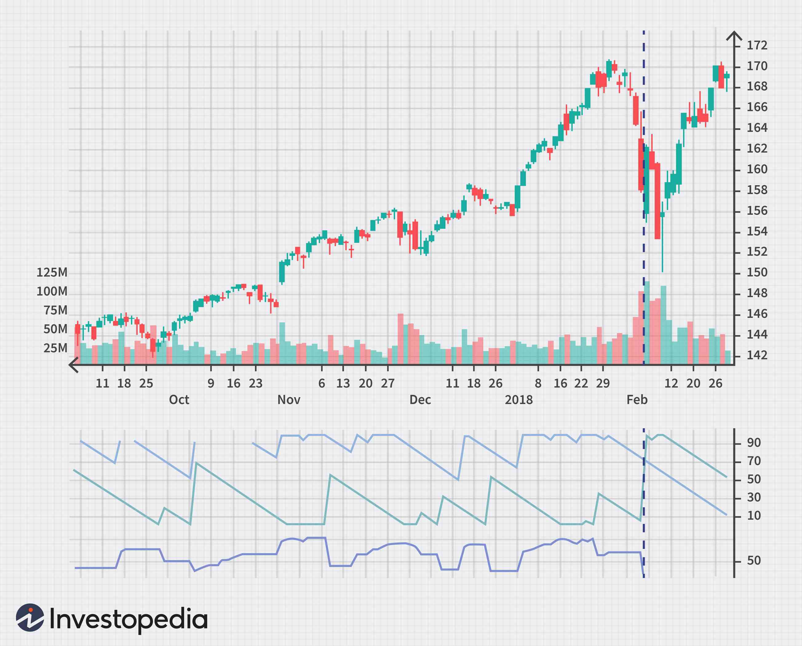

Understanding technical analysis tools is crucial for traders aiming to navigate the stock market effectively. These tools offer insights into market behavior, providing data-driven guidance to both novice and experienced traders. One such tool is the Aroon Indicator, developed by Tushar Chande in 1995. It has become popular for its ability to identify trends and potential reversals—key elements in making informed trading decisions.

The Aroon Indicator is particularly valued for its simplicity and effectiveness in analyzing market trends. It comprises two lines: Aroon Up and Aroon Down, which help traders assess the strength and direction of a trend. The Aroon Up line measures the periods since the highest high, while the Aroon Down line measures the periods since the lowest low. By plotting these lines on a scale from 0 to 100, traders obtain a visual representation of market trends, making it easier to anticipate potential changes.



This article explores the foundational aspects of the Aroon Indicator, its calculation methodology, and how it can be practically applied in stock trading and algorithmic trading. From understanding its basic principles to integrating it into algorithmic trading strategies, the Aroon Indicator provides traders with a robust framework to enhance their market analysis and execution strategies.

## Table of Contents

## What is the Aroon Indicator?

The Aroon Indicator, introduced by Tushar Chande in 1995, is a prominent technical analysis tool integral to identifying and evaluating market trends in stock trading. This tool comprises two lines: Aroon Up and Aroon Down. Both lines are plotted on a scale ranging from 0 to 100, designed to help traders delineate the inception, magnitude, and potential persistence of a trend.

The calculation of the Aroon Up line revolves around assessing the number of periods since the occurrence of the highest high over a given time frame. Conversely, the Aroon Down line focuses on the periods elapsed since the lowest low was recorded within the same duration. Mathematically, these lines are expressed as:

$$
\text{Aroon Up} = \left( \frac{n - \text{Periods Since Highest High}}{n} \right) \times 100
$$

$$
\text{Aroon Down} = \left( \frac{n - \text{Periods Since Lowest Low}}{n} \right) \times 100
$$

where $n$ is the specified number of periods for the indicator's calculation, typically set to values like 14 or 25 depending on the trader's preference or the market’s time frame.

The core utility of the Aroon Indicator lies in its ability to assess the current trend's strength and foresee possible reversals. High readings on the Aroon Up line, nearing 100, suggest a robust upward trend, whereas high readings on the Aroon Down line indicate a prevailing downward trend. Should these lines cross, it may signal a potential trend reversal, guiding traders toward strategic market entry or [exit](/wiki/exit-strategy) points.

By evaluating both lines simultaneously, traders can gain insights into market [momentum](/wiki/momentum) and make informed decisions based on the strength and direction of the trend. Thus, the Aroon Indicator serves as an essential component of a trader's toolkit, enabling the identification of market trends and adjustments to trading strategies accordingly.

## How Does the Aroon Indicator Work?

The Aroon Indicator functions by plotting two distinct lines on a chart: the Aroon Up and the Aroon Down. Each serves a specific purpose in analyzing market trends. The Aroon Up measures the number of days since the most recent highest high within a specified period. Conversely, the Aroon Down measures the number of days since the most recent lowest low within the same period. Both lines are plotted on a scale ranging from 0 to 100, providing traders with a straightforward visual representation of market momentum.

A high value in the Aroon Up indicator, typically above 70, suggests a strong upward trend, indicating that the price has recently hit new highs. Similarly, a high reading in the Aroon Down indicator, also above 70, signals a strong downward trend, reflecting recent new lows in price movement. Conversely, low readings indicate a weaker trend or potential consolidation phase.

The intersection, or crossover, of the Aroon Up and Aroon Down lines is a critical signal for potential trend reversals. When the Aroon Up line crosses above the Aroon Down line, it may indicate the onset of a new upward trend. Conversely, when the Aroon Down line surpasses the Aroon Up line, a downward trend could be commencing.

The calculation of these indicators involves a comparative analysis of the number of periods since the most recent high or low, assessed over a defined time frame, typically 25 periods. The formulae used are as follows:

For Aroon Up:
$$
\text{Aroon Up} = \left(\frac{\text{Number of periods} - \text{Periods since highest high}}{\text{Number of periods}}\right) \times 100
$$

For Aroon Down:
$$
\text{Aroon Down} = \left(\frac{\text{Number of periods} - \text{Periods since lowest low}}{\text{Number of periods}}\right) \times 100
$$

These calculations reflect the relative proximity of the most recent high or low within the examined timeframe, thereby providing insights into the market's current trend strength and potential future direction. By observing the movement and interaction of the Aroon Up and Down lines, traders can identify opportunities for entry or exit points, enhancing their decision-making process in stock or [algorithmic trading](/wiki/algorithmic-trading) strategies.

## Practical Applications of the Aroon Indicator in Trading

The Aroon Indicator is widely utilized by traders to gauge market trends and potential reversals. A strong trend is typically identified when the Aroon Up line, which tracks the periods since the most recent high, is above 70, while the Aroon Down line, monitoring periods since the last low, is below 30. This configuration suggests a definitive upward trend, as recent highs are occurring frequently, while recent lows are less frequent.

Spotting trend reversals is another application where the Aroon Indicator proves beneficial. When the Aroon Up and Aroon Down lines cross, it may signal a possible change in the market direction. For instance, if the Aroon Down line crosses above the Aroon Up line, it might indicate a forthcoming downward trend, suggesting that recent lows are starting to occur more frequently than highs.

The Aroon Oscillator, derived from the Aroon Indicator, enhances trend analysis by providing more comprehensive signals. The Aroon Oscillator is typically calculated as the difference between the Aroon Up and Aroon Down values:

$$

\text{Aroon Oscillator} = \text{Aroon Up} - \text{Aroon Down} 
$$

A positive oscillator value signifies an upward trend, while a negative value indicates a downward trend. The magnitude of this value can give insights into the trend's strength, with larger absolute values reflecting stronger trends.

Traders employ these signals from the Aroon Indicator and the Aroon Oscillator to make informed decisions about entering or exiting positions. By examining these indicators together, along with other market factors, traders aim to better time their trades, maximizing potential gains or minimizing losses.

## Algorithmic Trading and the Aroon Indicator

In algorithmic trading, the integration of technical indicators is pivotal for developing automated strategies that optimize entry and exit points. The Aroon Indicator, developed by Tushar Chande, is one such tool that can be pivotal in designing these strategies. It provides insights into trend identification and momentum, which are essential for executing timely trades.

Platforms such as TradingView and TrendSpider offer functionalities to incorporate the Aroon Indicator into automated trading systems. These platforms enable traders to backtest strategies based on historical data, providing valuable feedback on the performance and profitability of Aroon-based systems before real capital is at risk. Backtesting with platforms like these involves running the Aroon Indicator on past market data to determine how often it would have accurately predicted trend changes or continuations. The general implementation in Python might involve libraries such as `pandas` and `numpy` to handle data processing and manipulation, alongside modules like `TA-Lib` or `pandas-ta` for the actual technical analysis calculations.

Moreover, combining the Aroon Indicator with other indicators such as Moving Averages can enhance the effectiveness of algorithmic trading strategies. Moving Averages, which smooth out price data by creating a constantly updated average price, can help confirm trend directions indicated by Aroon. For example, an algorithmic strategy might look for situations where the Aroon Up line is above 70 and the Moving Average is trending upwards, signaling a strong upward trend. Conversely, the Aroon Down line crossing above 70, combined with a downward-trending Moving Average, could signal a strong downward trend.

A simple example of combining these indicators in a Python script could look like this:

```python
import pandas as pd
import talib

# Assume 'data' is a DataFrame with two columns: 'High' and 'Low'
aroon_up, aroon_down = talib.AROON(data['High'], data['Low'], timeperiod=14)
moving_average = talib.SMA(data['Close'], timeperiod=14)

# Generate buy/sell signals based on conditions
buy_signal = (aroon_up > 70) & (moving_average > moving_average.shift(1))
sell_signal = (aroon_down > 70) & (moving_average < moving_average.shift(1))
```

Here, `talib.AROON` and `talib.SMA` compute the Aroon Indicator and the Simple Moving Average respectively, allowing the trader to create conditions under which buy or sell signals are triggered. This nuanced approach, combining signals and confirmations from multiple indicators, can reduce the likelihood of false signals and improve the robustness of trading algorithms.

Through platforms and combined indicator strategies, automated trading algorithms that integrate the Aroon Indicator can be made more precise and adaptable, ultimately aiding traders in making informed decisions that capitalize on market movements.

## Backtesting Aroon Indicator Strategies

Backtesting is a crucial step in evaluating the performance and reliability of trading strategies that utilize the Aroon Indicator. This process involves simulating trades over historical market data to understand how an Aroon-based strategy would have performed in the past. By doing so, traders can infer the likelihood of similar performance in future market conditions, albeit with an understanding of the inherent limitations of historical projections.

Studies on the Aroon Indicator suggest that it performs variably across different time frames. It generally shows better accuracy and success rates on shorter time frames, such as 5-minute charts, compared to longer time frames like daily charts. This can be attributed to the indicator's sensitivity to recent price changes, which is more pronounced in short-term market movements.

Customizing the Aroon Indicator settings can potentially increase its effectiveness. Adjusting the lookback period, which is the number of days over which the Aroon Up and Aroon Down are calculated, allows traders to align the indicator more closely with their specific trading strategy. For instance, a shorter lookback period may offer more timely signals in fast-moving markets, while a longer period could be more suitable for identifying sustained trends in volatile conditions.

Furthermore, integrating the Aroon Indicator with other technical analysis tools can enhance its utility. For example, combining it with moving averages or momentum oscillators can help filter out false signals and confirm trend strength. Such combinations can be backtested using platforms that support algorithmic trading, like Python's [backtrader](/wiki/backtrader) library or specialized trading software.

An example of a simple Python script for [backtesting](/wiki/backtesting) Aroon Indicator strategies might look like this:

```python
import backtrader as bt

class AroonStrategy(bt.Strategy):
    params = (('period', 25), )

    def __init__(self):
        self.aroon = bt.indicators.AroonOscillator(self.data, period=self.params.period)

    def next(self):
        if self.aroon > 50:
            if not self.position:
                self.buy(size=100)
        elif self.aroon < -50:
            if self.position:
                self.sell(size=100)

cerebro = bt.Cerebro()
cerebro.addstrategy(AroonStrategy)
data = bt.feeds.YahooFinanceData(dataname='AAPL', fromdate=datetime(2020, 1, 1), todate=datetime(2021, 1, 1))
cerebro.adddata(data)
cerebro.run()
cerebro.plot()
```

This script sets up a basic trading strategy using Backtrader, where trades are executed based on the Aroon Oscillator values. Periods with an Aroon Oscillator value above 50 trigger a buy signal, whereas values below -50 trigger a sell signal. Conducting such backtests is pivotal in understanding the practical implications of the Aroon Indicator and refining strategies to adapt to specific trading goals and market environments.

## Pros and Cons of Using the Aroon Indicator

The Aroon Indicator is a widely utilized tool in technical analysis, offering several benefits to traders, especially in the context of detecting and observing trends in the market. One of its primary advantages is its capability to provide early detection of trend changes. The indicator helps identify the beginning phases of emerging trends by analyzing the time since the last recorded high and low within a specific period. This attribute allows traders to enter or exit positions more efficiently, optimizing their potential gains or minimizing losses.

Another significant advantage is its effectiveness in identifying directional price movements. By plotting the Aroon Up and Aroon Down lines on a scale from 0 to 100, traders can easily interpret the strength and direction of a trend. A strong upward trend is indicated when the Aroon Up line is above 70 and the Aroon Down line is below 30, while the opposite suggests a strong downward trend. This visual and quantifiable method aids traders in making informed decisions regarding market trends.

However, the Aroon Indicator is not without its drawbacks. One notable limitation is its susceptibility to generating false signals, particularly in volatile markets. During periods of high [volatility](/wiki/volatility-trading-strategies), the indicator may oscillate frequently, resulting in misleading interpretations of trend changes and leading to potential losses if traders rely solely on its readings. This volatility can cause a crossover between the Aroon Up and Aroon Down lines without a genuine trend reversal, posing a risk for traders who act prematurely based on these indications.

Moreover, the success rate of the Aroon Indicator can be lower compared to other technical indicators. While it excels in trending markets, its reliability diminishes in sideways or choppy market conditions where price movements do not establish clear trends. This limitation necessitates the integration of the Aroon Indicator with other analytical tools and strategies to enhance accuracy. For optimal results, the Aroon Indicator should be used in conjunction with other technical analysis methods, such as Moving Averages or the Relative Strength Index (RSI), to supplement its signals and confirm trend directions. This multi-faceted approach can help mitigate the risk of false signals and improve the overall effectiveness of trading strategies.

## Conclusion

The Aroon Indicator serves as a valuable tool for traders aiming to analyze market trends and identify potential reversals. Developed by Tushar Chande, this technical analysis instrument provides insights on the strength and continuation of market trends through its unique calculation of the time elapsed since market highs and lows. The effectiveness of the Aroon Indicator comes from its ability to highlight emerging trends, offering traders an edge in making timely decisions.

While the Aroon Indicator is not without its limitations, such as generating false signals during market volatility, its utility is enhanced when combined with other technical indicators. This approach allows traders to cross-verify signals, reducing the likelihood of taking positions based on erroneous data. For example, incorporating moving averages or relative strength index (RSI) alongside Aroon can provide a more comprehensive view of market conditions.

To fully leverage the Aroon Indicator's potential, traders are encouraged to perform thorough backtesting of Aroon-based strategies across historical data. Backtesting helps in understanding the indicator's performance in different market conditions and fine-tuning its settings for optimal results. Platforms that support algorithmic trading, such as TradingView and TrendSpider, offer robust environments for backtesting and automating trading strategies based on the Aroon Indicator. These platforms enable precise entry and exit point identification, allowing for more disciplined and less emotional trading.

In conclusion, the Aroon Indicator, while not a standalone solution, is an integral part of a well-rounded technical analysis toolkit. Its ability to detect trend changes early can be a significant advantage when navigated with caution and complemented by other analysis methods. Traders should remain prudent, using comprehensive backtesting and leveraging algorithmic trading platforms to maximize the indicator's potential effectiveness.

## References & Further Reading

[1]: Chande, T. S. (1997). ["The New Technical Trader: Boost Your Profit by Plugging into the Latest Indicators"](https://www.amazon.com/New-Technical-Trader-Plugging-Indicators/dp/0471597805). John Wiley & Sons.

[2]: Aronson, D. R. (2006). ["Evidence-Based Technical Analysis: Applying the Scientific Method and Statistical Inference to Trading Signals"](https://www.amazon.com/Evidence-Based-Technical-Analysis-Scientific-Statistical/dp/0470008741). Wiley.

[3]: Pring, M. J. (2014). ["Technical Analysis Explained, Fifth Edition: The Successful Investor's Guide to Spotting Investment Trends and Turning Points"](https://www.amazon.com/Technical-Analysis-Explained-Fifth-Successful/dp/0071825177). McGraw-Hill Education.

[4]: Chan, E. P. (2009). ["Quantitative Trading: How to Build Your Own Algorithmic Trading Business"](https://github.com/ftvision/quant_trading_echan_book). Wiley.

[5]: Jansen, S. (2020). ["Machine Learning for Algorithmic Trading: Predictive Models to Extract Signals from Market and Alternative Data for Systematic Trading Strategies with Python"](https://www.amazon.com/Machine-Learning-Algorithmic-Trading-alternative/dp/1839217715). Packt Publishing.

[6]: Murphy, J. J. (1999). ["Technical Analysis of the Financial Markets: A Comprehensive Guide to Trading Methods and Applications"](https://archive.org/details/technicalanalysi0000murp). New York Institute of Finance.