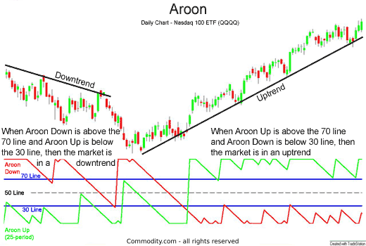

## Table of Contents

## What is the Aroon Indicator and its basic components?

The Aroon Indicator is a technical analysis tool used to identify trends and potential trend changes in the price of an asset. It was developed by Tushar Chande in 1995 and helps traders determine whether a stock is in a strong uptrend or downtrend, or if it's moving sideways. The indicator consists of two lines: the Aroon Up line and the Aroon Down line. These lines help traders see how recent the highest high and the lowest low are within a given time period.

The Aroon Up line measures the number of periods since the last highest high within a set time frame, usually 25 periods. If the highest high was very recent, the Aroon Up line will be close to 100, indicating a strong uptrend. On the other hand, the Aroon Down line measures the number of periods since the last lowest low. If the lowest low was recent, the Aroon Down line will be near 100, suggesting a strong downtrend. When both lines are low, it often means the price is moving sideways with no clear trend.

By comparing the Aroon Up and Aroon Down lines, traders can get a sense of the market's momentum. For example, if the Aroon Up line is above the Aroon Down line, it suggests that the market is in an uptrend. Conversely, if the Aroon Down line is above the Aroon Up line, it indicates a downtrend. The Aroon Indicator can also help identify potential trend reversals when the lines cross each other, making it a useful tool for traders looking to make informed decisions.

## How is the Aroon Up and Aroon Down calculated?

The Aroon Up is calculated by figuring out how many periods have passed since the last highest high within a set time frame, usually 25 periods. You start by counting the number of periods back to the highest high. Then, you subtract that number from the total periods and divide by the total periods. Finally, you multiply by 100 to get a percentage. So, if the highest high was 5 periods ago in a 25-period setting, the calculation would be (25 - 5) / 25 * 100, which equals 80. A higher Aroon Up value means the highest high was more recent, suggesting a stronger uptrend.

The Aroon Down is calculated in a similar way, but it looks at the lowest low instead. You count the number of periods back to the lowest low within the same time frame. Then, you subtract that number from the total periods and divide by the total periods. Finally, you multiply by 100 to get a percentage. For example, if the lowest low was 10 periods ago in a 25-period setting, the calculation would be (25 - 10) / 25 * 100, which equals 60. A higher Aroon Down value means the lowest low was more recent, suggesting a stronger downtrend.

## What does the Aroon Indicator tell traders about market trends?

The Aroon Indicator helps traders see if a market is going up, going down, or staying the same. It uses two lines: the Aroon Up line and the Aroon Down line. The Aroon Up line shows how many periods have passed since the last highest high. If this number is high, it means the market is in a strong uptrend because the highest high was recent. The Aroon Down line shows how many periods have passed since the last lowest low. If this number is high, it means the market is in a strong downtrend because the lowest low was recent.

When the Aroon Up line is higher than the Aroon Down line, it tells traders that the market is in an uptrend. This means prices are likely to keep going up. When the Aroon Down line is higher than the Aroon Up line, it tells traders that the market is in a downtrend. This means prices are likely to keep going down. If both lines are low, it means the market is not moving much and is probably in a sideways trend. By watching these lines, traders can make better decisions about when to buy or sell.

## How can beginners use the Aroon Indicator to identify trend strength?

Beginners can use the Aroon Indicator to figure out how strong a market trend is by looking at the Aroon Up and Aroon Down lines. The Aroon Up line shows how recent the highest high was. If it's close to 100, it means the market is in a strong uptrend because the highest high happened not long ago. On the other hand, the Aroon Down line shows how recent the lowest low was. If it's close to 100, it means the market is in a strong downtrend because the lowest low was recent. By comparing these two lines, beginners can see which trend is stronger.

For example, if the Aroon Up line is at 70 and the Aroon Down line is at 30, it means the market is in a stronger uptrend than downtrend. This tells beginners that the market is more likely to keep going up. If the Aroon Up line is low, like at 20, and the Aroon Down line is also low, like at 10, it means the market isn't moving much and is probably in a sideways trend. By watching these lines, beginners can get a good idea of how strong the current trend is and make better trading decisions.

## What are common entry and exit signals generated by the Aroon Indicator?

The Aroon Indicator gives traders entry and [exit](/wiki/exit-strategy) signals by showing when trends start and end. An entry signal for a new uptrend happens when the Aroon Up line goes above 70 and also above the Aroon Down line. This means the market is likely to keep going up, so it's a good time to buy. On the other hand, an entry signal for a new downtrend happens when the Aroon Down line goes above 70 and also above the Aroon Up line. This means the market is likely to keep going down, so it's a good time to sell or short sell.

Exit signals come when the trend might be ending. If you're in an uptrend and the Aroon Up line drops below 50 while the Aroon Down line goes above 50, it's a sign that the uptrend might be over. This means it's time to sell and take your profits. If you're in a downtrend and the Aroon Down line drops below 50 while the Aroon Up line goes above 50, it's a sign that the downtrend might be over. This means it's time to buy back your short position or stop selling. By watching these signals, traders can make better decisions about when to enter and exit the market.

## How does the Aroon Oscillator differ from the Aroon Indicator, and what additional insights does it provide?

The Aroon Oscillator is a bit different from the Aroon Indicator. The Aroon Indicator has two lines, the Aroon Up and Aroon Down, which help traders see if the market is going up or down. The Aroon Oscillator, on the other hand, is made by subtracting the Aroon Down value from the Aroon Up value. This gives you one line that moves above and below zero. When the Aroon Oscillator is above zero, it means the market is in an uptrend, and when it's below zero, it means the market is in a downtrend.

The Aroon Oscillator gives traders extra information by showing the strength of the trend more clearly. If the Aroon Oscillator is far above zero, it means the uptrend is very strong. If it's far below zero, it means the downtrend is very strong. Also, when the Aroon Oscillator crosses above zero, it can be a signal to buy, and when it crosses below zero, it can be a signal to sell. This makes it easier for traders to see when trends might be starting or ending, helping them make better trading decisions.

## Can you explain how to combine the Aroon Indicator with other technical indicators for more robust trading strategies?

Combining the Aroon Indicator with other technical indicators can help traders make better decisions by confirming trends and signals. One common way to do this is to use the Aroon Indicator with the Moving Average Convergence Divergence (MACD). The Aroon Indicator can show when a trend is starting or ending, and the MACD can confirm if the trend is strong. For example, if the Aroon Up line goes above 70 and the Aroon Down line goes below 30, it might be a good time to buy. If the MACD line also crosses above its signal line at the same time, it confirms that the uptrend is strong and it's a good time to enter the market.

Another useful combination is using the Aroon Indicator with the Relative Strength Index (RSI). The Aroon Indicator can help identify the direction of the trend, while the RSI can show if the market is overbought or oversold. If the Aroon Up line is high and the RSI is below 30, it might mean the market is in an uptrend but currently oversold, which could be a good buying opportunity. On the other hand, if the Aroon Down line is high and the RSI is above 70, it might mean the market is in a downtrend but currently overbought, which could be a good time to sell or short sell. By using these indicators together, traders can get a clearer picture of the market and make more informed trading decisions.

## What are the limitations and potential pitfalls of using the Aroon Indicator in trading?

The Aroon Indicator can be a helpful tool for traders, but it's not perfect and has some limitations. One big problem is that it can give false signals. Sometimes, the Aroon Indicator might say that a trend is starting or ending, but the market doesn't actually follow through. This can lead traders to make bad decisions, like buying when the market is about to drop or selling when it's about to rise. Also, the Aroon Indicator works best in markets that have clear trends. If the market is moving sideways or not trending at all, the Aroon Indicator might not be very useful because it's hard to tell if there's a strong trend or not.

Another limitation is that the Aroon Indicator doesn't tell traders how strong the trend is by itself. It can show if a trend is happening, but it doesn't say if the trend will keep going or how much the price might move. This means traders need to use other tools to figure out the strength of the trend and make better decisions. Also, the Aroon Indicator uses a set number of periods, usually 25, which might not work well for all traders or all markets. Different time frames might need different settings, and using the wrong setting can lead to bad trading signals. So, it's important to use the Aroon Indicator along with other indicators and always keep an eye on the bigger picture of the market.

## How can the Aroon Indicator be optimized for different time frames and trading styles?

The Aroon Indicator can be changed to work better with different time frames and trading styles by adjusting the number of periods used in its calculation. For short-term traders, like day traders, using a smaller number of periods, such as 10 or 14, can help catch quick trends and changes in the market. This means the Aroon Up and Aroon Down lines will be more sensitive to recent highs and lows, giving more signals but also more false ones. On the other hand, long-term traders, like swing traders or investors, might want to use a larger number of periods, like 50 or 100, to see bigger trends over time. This makes the Aroon Indicator less sensitive and can help avoid getting too many false signals.

Different trading styles also need different ways to use the Aroon Indicator. For example, trend-following traders might focus on the Aroon Up and Aroon Down lines crossing each other to find entry and exit points. When the Aroon Up line crosses above the Aroon Down line, it's a sign to buy, and when the Aroon Down line crosses above the Aroon Up line, it's a sign to sell. On the other hand, counter-trend traders might look for when the Aroon lines are near their extremes (close to 100 or 0) to find times when the market might reverse. By tweaking the Aroon Indicator to fit their trading time frame and style, traders can make better use of it and improve their trading results.

## What advanced techniques can traders use to refine Aroon Indicator signals?

Traders can refine Aroon Indicator signals by using it along with other indicators to confirm trends and avoid false signals. For example, combining the Aroon Indicator with the Moving Average Convergence Divergence (MACD) can help. When the Aroon Up line goes above 70 and the Aroon Down line goes below 30, it might be a good time to buy. But if the MACD line also crosses above its signal line at the same time, it's a stronger sign that the uptrend is real and it's a good time to enter the market. This way, traders can feel more confident in their decisions because they're not just relying on one indicator.

Another advanced technique is to use different time frames to get a better view of the market. Traders can look at the Aroon Indicator on both short-term and long-term charts. If the Aroon Indicator shows an uptrend on both a daily chart and a weekly chart, it's a stronger sign that the trend is real and likely to continue. This multi-time frame analysis helps traders see the bigger picture and avoid getting caught in short-term market noise. By using these techniques, traders can make better use of the Aroon Indicator and improve their trading results.

## How does the Aroon Indicator perform in various market conditions, such as trending vs. ranging markets?

The Aroon Indicator works best in markets that have clear trends. When the market is going up or down in a strong way, the Aroon Indicator can help traders see this trend early. The Aroon Up line will be high if the market is in a strong uptrend because the highest high was recent. The Aroon Down line will be high if the market is in a strong downtrend because the lowest low was recent. By watching these lines, traders can decide when to buy or sell. But, the Aroon Indicator can sometimes give false signals if the trend doesn't last long. So, it's important to use other tools to make sure the trend is real.

In markets that are not trending and are moving sideways, the Aroon Indicator is not as useful. When the market is just going up and down without a clear direction, both the Aroon Up and Aroon Down lines will be low. This means the market is not in a strong trend, and it's hard to make good trading decisions based on the Aroon Indicator alone. Traders need to be careful in these conditions because the Aroon Indicator might not give clear signals about when to buy or sell. Using other indicators along with the Aroon Indicator can help traders understand the market better and avoid making bad trades.

## What are some real-world examples or case studies of successful Aroon Indicator strategy implementations?

One real-world example of using the Aroon Indicator successfully is in the trading of a popular tech stock, like Apple. A trader noticed that the Aroon Up line on the daily chart of Apple's stock went above 70 and the Aroon Down line dropped below 30. This was a strong signal that an uptrend was starting. The trader decided to buy Apple's stock at this point. A few days later, the stock price did go up as expected, and the trader was able to sell the stock at a higher price, making a good profit. This shows how the Aroon Indicator can help traders find the right time to enter a market when a new trend is starting.

Another case study involves a [forex](/wiki/forex-system) trader who used the Aroon Indicator to trade the EUR/USD currency pair. The trader was looking at the weekly chart and saw that the Aroon Down line went above 70 while the Aroon Up line stayed below 30. This was a clear sign of a downtrend. The trader decided to short sell the EUR/USD pair at this point. Over the next few weeks, the EUR/USD pair did go down as the Aroon Indicator suggested. The trader was able to close the short position at a profit, showing how the Aroon Indicator can help in forex trading by identifying strong downtrends.

## What is the Aroon Indicator?

The Aroon Indicator, conceived by Tushar Chande in 1995, is a technical analysis tool designed to identify the strength and direction of market trends. Named after the Sanskrit word "Aroon," which means "dawn's early light," the indicator aims to reveal the beginning of a new trend in a financial market.

The Aroon Indicator consists of two primary components: Aroon Up and Aroon Down. These components each range from 0 to 100 and provide insights into the prevailing momentum of an asset.

**Aroon Up** is calculated by measuring the number of periods since the highest high within a specified lookback period. The formula for Aroon Up is:

$$
\text{Aroon Up} = \left( \frac{N - \text{Periods since highest high}}{N} \right) \times 100
$$

where $N$ is the chosen lookback period.

**Aroon Down**, conversely, is calculated by measuring the number of periods since the lowest low within the same lookback period. Its formula is:

$$
\text{Aroon Down} = \left( \frac{N - \text{Periods since lowest low}}{N} \right) \times 100
$$

The behavior of these two components offers insights into market trends. When Aroon Up is near 100, it indicates a recent high was observed during the lookback period, suggesting strong bullish [momentum](/wiki/momentum). Conversely, a high Aroon Down value indicates a recent low and suggests strong bearish conditions.

When the Aroon Up and Aroon Down values are both low, it often signals a lack of strong trend or a phase of market consolidation. These components, therefore, are crucial in determining whether an asset is experiencing strong trends or whether it is in a period of sideways movement.

By analyzing the interaction between Aroon Up and Aroon Down, traders can discern potential trend changes. For instance, when Aroon Up crosses above Aroon Down, it may signal an emerging bullish trend, whereas a crossing in the opposite direction could indicate a bearish trend onset. The Aroon Indicator, thus, serves as a valuable tool for traders to assess trend strength and potential reversal points effectively.

## How does the Aroon Indicator work?

The Aroon Indicator is a technical analysis tool used to quantify the degree of a financial instrument's price trend and its strength. It consists of two distinct components: Aroon Up and Aroon Down, designed to identify the timing of new trends and forecast their potential persistence. The calculation involves a user-defined lookback period $n$, typically set to 14 days, although traders may adjust it to suit their trading strategy.

### Calculation of Aroon Up and Down Lines

1. **Aroon Up Calculation**:
   The Aroon Up value measures the days since the last  **highest high** within the lookback period. It is calculated as:
$$
   \text{Aroon Up} = \left( \frac{n - \text{Days Since Last Highest High}}{n} \right) \times 100

$$

2. **Aroon Down Calculation**:
   Similarly, the Aroon Down value captures the days since the last **lowest low** and is determined by:
$$
   \text{Aroon Down} = \left( \frac{n - \text{Days Since Last Lowest Low}}{n} \right) \times 100

$$

These calculations yield a straightforward representation of momentum, with values oscillating between 0 and 100.

### Interpretation of Aroon Values

The values of Aroon Up and Aroon Down indicate the strength and direction of the market trend:

- **Strong Trends**: When Aroon Up is above 70 and Aroon Down is below 30, it suggests a strong upward trend. Conversely, an Aroon Down above 70 and Aroon Up below 30 signals a strong downward trend.

- **Weak Trends or Consolidation**: Both lines hovering around the middle range, especially between 30 and 70, typically represent a weak trend or consolidation phase, indicating an absence of directional momentum.

### Examples of Fluctuations

Visualizing data over time, the indicator naturally fluctuates:

- **High Aroon Up (e.g., 90)** and **Low Aroon Down (e.g., 20)**: This configuration occurs when recent highs are frequently updated, reinforcing upward movement.

- **High Aroon Down and Low Aroon Up**: Indicates persistent market declines.

- **Intermediate Values (~50)** of both lines suggest markets are in range-bound or sideways movements, devoid of trends.

To summarize, the Aroon Indicator's oscillation between 0 and 100 provides a nuanced view of market sentiment, assisting traders in gauging the prevailing trend's direction and strength. Understanding these dynamics allows for informed decision-making and strategic adjustments in [algorithmic trading](/wiki/algorithmic-trading) systems.

## How can the Aroon Indicator be implemented in algorithmic trading?

To incorporate the Aroon Indicator into trading algorithms, traders must understand its calculation and develop strategies that leverage its trend-identification capabilities. The Aroon Indicator consists of two lines: Aroon Up and Aroon Down, which help identify the direction and strength of a trend. Implementing the indicator in algorithmic systems involves several steps, from computation to strategy execution.

### Steps to Implement the Aroon Indicator:

1. **Define Parameters**: Choose a lookback period `n`, which dictates the length of time over which the highest high and lowest low are determined. Commonly, a 25-day period is used.

2. **Calculate Aroon Up and Aroon Down**:
   - **Aroon Up** represents the strength of an upward trend and is calculated as:
$$
     \text{Aroon Up} = \left( \frac{n - \text{Days since highest high}}{n} \right) \times 100

$$
   - **Aroon Down** indicates the strength of a downward trend and is derived as:
$$
     \text{Aroon Down} = \left( \frac{n - \text{Days since lowest low}}{n} \right) \times 100

$$

3. **Interpret the Indicators**: High values (close to 100) of Aroon Up suggest a strong uptrend, whereas high values of Aroon Down suggest a strong downtrend. Values around 50 indicate potential consolidation or weak trends.

4. **Develop Trading Strategies**:

   - **Crossover Strategy**: A simple strategy is based on the crossover of the Aroon Up and Aroon Down lines. For example:
     - Enter a long position when the Aroon Up crosses above the Aroon Down.
     - Enter a short position when the Aroon Down crosses above the Aroon Up.

   - **Threshold Method**: This method involves setting certain thresholds, such as entering long when Aroon Up exceeds 70 and exiting when it falls below 30.

### Benefits in Algorithmic Trading:

- **Automation of Decision-Making**: By embedding the Aroon Indicator within trading algorithms, traders can automate entry and exit decisions based on the predefined rules, facilitating swift reaction to market changes without human intervention.

- **Quantitative Analysis**: The indicator's mathematical nature allows integration with other technical tools for comprehensive data analysis, enhancing algorithm reliability.

Here is a simple Python code snippet for calculating the Aroon Indicator:

```python
import pandas as pd

def aroon(data, window=25):
    aroon_up = []
    aroon_down = []

    for i in range(len(data)):
        if i < window - 1:
            aroon_up.append(None)
            aroon_down.append(None)
        else:
            high_range = data['High'][i-window+1:i+1]
            low_range = data['Low'][i-window+1:i+1]

            days_since_high = window - high_range[::-1].idxmax()
            days_since_low = window - low_range[::-1].idxmin()

            aroon_up_value = ((window - days_since_high) / window) * 100
            aroon_down_value = ((window - days_since_low) / window) * 100

            aroon_up.append(aroon_up_value)
            aroon_down.append(aroon_down_value)

    return aroon_up, aroon_down

# DataFrame 'df' should contain columns 'High' and 'Low'
df['Aroon_Up'], df['Aroon_Down'] = aroon(df)
```

Implementing the Aroon Indicator in algorithmic trading enhances traders' portfolios by providing dynamic insights into market trends and [volatility](/wiki/volatility-trading-strategies), a vital edge in the fast-paced trading environment.

## What is an example use case for a Python implementation?

Implementing the Aroon Indicator in Python can be an efficient way to analyze market trends and incorporate this analysis into algorithmic trading strategies. Below is a step-by-step guide to calculating, plotting, and using the Aroon Indicator with Python, employing historical data for [backtesting](/wiki/backtesting) purposes.

### Calculating the Aroon Indicator

The Aroon Indicator comprises two lines: the Aroon Up and the Aroon Down. Both lines are calculated over a specific lookback period, typically using the high and low prices over that period.

The formulas for Aroon Up and Aroon Down are:

$$
\text{Aroon Up} = \left(\frac{\text{lookback} - \text{Periods since highest high}}{\text{lookback}} \right) \times 100
$$

$$
\text{Aroon Down} = \left(\frac{\text{lookback} - \text{Periods since lowest low}}{\text{lookback}} \right) \times 100
$$

Using Python, these calculations can be efficiently implemented with the help of the `pandas` library.

```python
import pandas as pd

def aroon(df, lookback_period=25):
    high_idx = df['High'].rolling(window=lookback_period + 1).apply(lambda x: x.argmax(), raw=False)
    low_idx = df['Low'].rolling(window=lookback_period + 1).apply(lambda x: x.argmin(), raw=False)

    aroon_up = ((lookback_period - high_idx) / lookback_period) * 100
    aroon_down = ((lookback_period - low_idx) / lookback_period) * 100

    df['Aroon Up'] = aroon_up
    df['Aroon Down'] = aroon_down
    return df

# Example usage with historical data
historical_data = pd.DataFrame({
    'High': [/* high prices here */],
    'Low': [/* low prices here */]
})

aroon_data = aroon(historical_data)
```

### Plotting the Aroon Indicator

Visual representation of the Aroon Indicator allows traders to interpret trends quickly. The `matplotlib` library in Python can be utilized for this purpose.

```python
import matplotlib.pyplot as plt

def plot_aroon(df):
    plt.figure(figsize=(14, 7))
    plt.plot(df['Aroon Up'], label='Aroon Up', color='green')
    plt.plot(df['Aroon Down'], label='Aroon Down', color='red')
    plt.title('Aroon Indicator')
    plt.xlabel('Time')
    plt.ylabel('Aroon Value')
    plt.legend()
    plt.show()

plot_aroon(aroon_data)
```

### Backtesting a Trading Strategy

To evaluate the efficacy of the Aroon Indicator, backtesting can be conducted on historical data. A simple strategy might involve placing trades based on Aroon crossover signals:

- Go long when Aroon Up crosses above Aroon Down.
- Sell or short when Aroon Down crosses above Aroon Up.

```python
def backtest(df, initial_balance=10000):
    balance = initial_balance
    position = 0  # 1 for long, -1 for short
    entry_price = 0

    for i in range(1, len(df)):
        if df['Aroon Up'][i] > df['Aroon Down'][i] and df['Aroon Up'][i-1] <= df['Aroon Down'][i-1]:
            if position == 0:
                position = 1
                entry_price = df['Close'][i]
        elif df['Aroon Down'][i] > df['Aroon Up'][i] and df['Aroon Down'][i-1] <= df['Aroon Up'][i-1]:
            if position == 1:
                balance += (df['Close'][i] - entry_price)
                position = 0
            elif position == 0:
                position = -1
                entry_price = df['Close'][i]
        elif position == -1:
            balance -= (df['Close'][i] - entry_price)
            position = 0

    return balance

# Use historical data with an additional 'Close' column for backtesting
historical_data['Close'] = [/* close prices here */]
final_balance = backtest(historical_data)
print(f"Final Balance: ${final_balance}")
```

Implementing the Aroon Indicator in Python allows for enhanced analysis of market trends, and integrating it into a trading strategy can potentially improve trading decisions. Automating this process with proper backtesting provides insights into the strategy's profitability and risk.

## References & Further Reading

[1]: Chande, T. S. (1995). ["The New Technical Trader: Boost Your Profit by Plugging into the Latest Indicators"](https://www.amazon.com/New-Technical-Trader-Plugging-Indicators/dp/0471597805) by Tushar S. Chande and Stanley Kroll.

[2]: Kaufman, P. J. (2013). ["Trading Systems and Methods"](https://onlinelibrary.wiley.com/doi/book/10.1002/9781119202561) by Perry J. Kaufman.

[3]: Aronson, D. R. (2006). ["Evidence-Based Technical Analysis: Applying the Scientific Method and Statistical Inference to Trading Signals"](https://www.amazon.com/Evidence-Based-Technical-Analysis-Scientific-Statistical/dp/0470008741) by David Aronson.

[4]: Chan, E. P. (2008). ["Quantitative Trading: How to Build Your Own Algorithmic Trading Business"](https://github.com/ftvision/quant_trading_echan_book) by Ernest P. Chan.

[5]: Jansen, S. (2020). ["Machine Learning for Algorithmic Trading: Predictive Models to Extract Signals from Market and Alternative Data for Systematic Trading Strategies with Python"](https://www.amazon.com/Machine-Learning-Algorithmic-Trading-alternative/dp/1839217715) by Stefan Jansen.