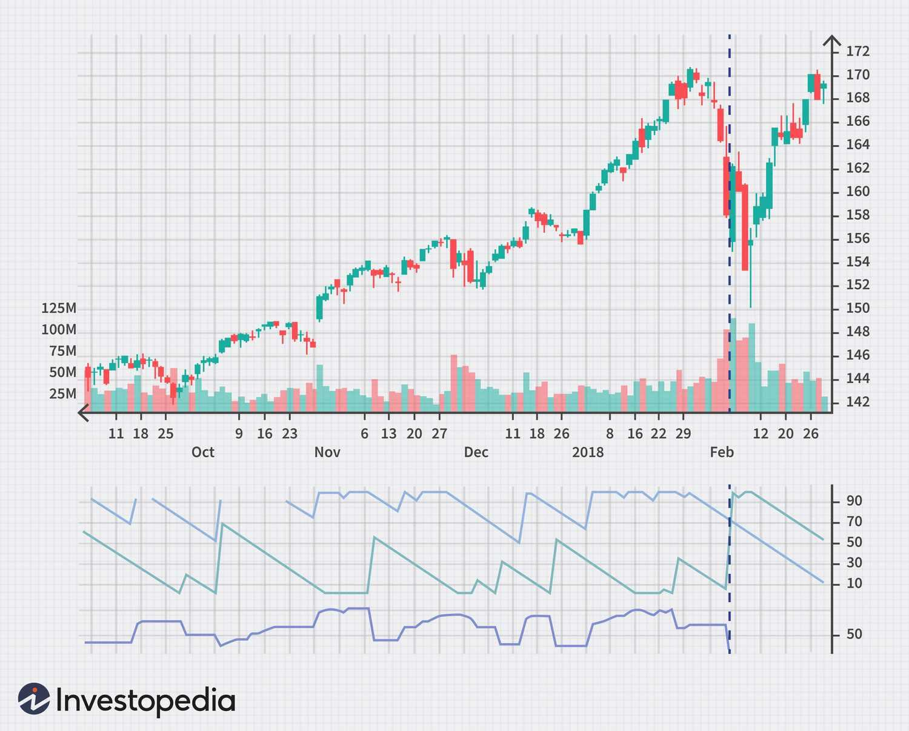

Technical indicators are essential tools in algorithmic trading. These mathematical calculations are derived from price, volume, or open interest information of a security or contract. They play a crucial role in assisting traders to identify market trends, measure volatility, and determine potential future price movements. Algorithmic trading, which involves using computer programs to execute trades at very high speeds, often leverages technical indicators to make data-driven decisions and optimize trading strategies.

Among the various technical indicators available, the Aroon Indicator stands out due to its effectiveness in identifying emerging trends and gauging market volatility. Developed by Tushar Chande in 1995, this indicator is designed to identify the beginning of a new trend, regardless of whether it is upward or downward. The Aroon Indicator consists of two separate lines: Aroon Up and Aroon Down. These components help traders visualize the strength and direction of a trend, as well as possible changes in market dynamics.



The purpose of this article is to explore the Aroon Indicator's unique features, its mathematical calculation, and its practical application in algorithmic trading. Understanding how the Aroon Indicator works will enable traders to implement it within their automated trading systems, thus enhancing their ability to make informed trading decisions. This discussion will be beneficial not only for traders seeking to incorporate the Aroon Indicator into their practice but also for anyone interested in understanding how technical indicators can support algorithmic trading strategies.

## Table of Contents

## What is the Aroon Indicator?

The Aroon Indicator, conceived by Tushar Chande in 1995, is a technical analysis tool designed to identify the strength and direction of market trends. Named after the Sanskrit word "Aroon," which means "dawn's early light," the indicator aims to reveal the beginning of a new trend in a financial market.

The Aroon Indicator consists of two primary components: Aroon Up and Aroon Down. These components each range from 0 to 100 and provide insights into the prevailing momentum of an asset.

**Aroon Up** is calculated by measuring the number of periods since the highest high within a specified lookback period. The formula for Aroon Up is:

$$
\text{Aroon Up} = \left( \frac{N - \text{Periods since highest high}}{N} \right) \times 100
$$

where $N$ is the chosen lookback period.

**Aroon Down**, conversely, is calculated by measuring the number of periods since the lowest low within the same lookback period. Its formula is:

$$
\text{Aroon Down} = \left( \frac{N - \text{Periods since lowest low}}{N} \right) \times 100
$$

The behavior of these two components offers insights into market trends. When Aroon Up is near 100, it indicates a recent high was observed during the lookback period, suggesting strong bullish [momentum](/wiki/momentum). Conversely, a high Aroon Down value indicates a recent low and suggests strong bearish conditions.

When the Aroon Up and Aroon Down values are both low, it often signals a lack of strong trend or a phase of market consolidation. These components, therefore, are crucial in determining whether an asset is experiencing strong trends or whether it is in a period of sideways movement.

By analyzing the interaction between Aroon Up and Aroon Down, traders can discern potential trend changes. For instance, when Aroon Up crosses above Aroon Down, it may signal an emerging bullish trend, whereas a crossing in the opposite direction could indicate a bearish trend onset. The Aroon Indicator, thus, serves as a valuable tool for traders to assess trend strength and potential reversal points effectively.

## How the Aroon Indicator Works

The Aroon Indicator is a technical analysis tool used to quantify the degree of a financial instrument's price trend and its strength. It consists of two distinct components: Aroon Up and Aroon Down, designed to identify the timing of new trends and forecast their potential persistence. The calculation involves a user-defined lookback period $n$, typically set to 14 days, although traders may adjust it to suit their trading strategy.

### Calculation of Aroon Up and Down Lines

1. **Aroon Up Calculation**:
   The Aroon Up value measures the days since the last  **highest high** within the lookback period. It is calculated as:
$$
   \text{Aroon Up} = \left( \frac{n - \text{Days Since Last Highest High}}{n} \right) \times 100

$$

2. **Aroon Down Calculation**:
   Similarly, the Aroon Down value captures the days since the last **lowest low** and is determined by:
$$
   \text{Aroon Down} = \left( \frac{n - \text{Days Since Last Lowest Low}}{n} \right) \times 100

$$

These calculations yield a straightforward representation of momentum, with values oscillating between 0 and 100.

### Interpretation of Aroon Values

The values of Aroon Up and Aroon Down indicate the strength and direction of the market trend:

- **Strong Trends**: When Aroon Up is above 70 and Aroon Down is below 30, it suggests a strong upward trend. Conversely, an Aroon Down above 70 and Aroon Up below 30 signals a strong downward trend.

- **Weak Trends or Consolidation**: Both lines hovering around the middle range, especially between 30 and 70, typically represent a weak trend or consolidation phase, indicating an absence of directional momentum.

### Examples of Fluctuations

Visualizing data over time, the indicator naturally fluctuates:

- **High Aroon Up (e.g., 90)** and **Low Aroon Down (e.g., 20)**: This configuration occurs when recent highs are frequently updated, reinforcing upward movement.

- **High Aroon Down and Low Aroon Up**: Indicates persistent market declines.

- **Intermediate Values (~50)** of both lines suggest markets are in range-bound or sideways movements, devoid of trends.

To summarize, the Aroon Indicator's oscillation between 0 and 100 provides a nuanced view of market sentiment, assisting traders in gauging the prevailing trend's direction and strength. Understanding these dynamics allows for informed decision-making and strategic adjustments in [algorithmic trading](/wiki/algorithmic-trading) systems.

## Implementing the Aroon Indicator in Algorithmic Trading

To incorporate the Aroon Indicator into trading algorithms, traders must understand its calculation and develop strategies that leverage its trend-identification capabilities. The Aroon Indicator consists of two lines: Aroon Up and Aroon Down, which help identify the direction and strength of a trend. Implementing the indicator in algorithmic systems involves several steps, from computation to strategy execution.

### Steps to Implement the Aroon Indicator:

1. **Define Parameters**: Choose a lookback period `n`, which dictates the length of time over which the highest high and lowest low are determined. Commonly, a 25-day period is used.

2. **Calculate Aroon Up and Aroon Down**:
   - **Aroon Up** represents the strength of an upward trend and is calculated as:
$$
     \text{Aroon Up} = \left( \frac{n - \text{Days since highest high}}{n} \right) \times 100

$$
   - **Aroon Down** indicates the strength of a downward trend and is derived as:
$$
     \text{Aroon Down} = \left( \frac{n - \text{Days since lowest low}}{n} \right) \times 100

$$

3. **Interpret the Indicators**: High values (close to 100) of Aroon Up suggest a strong uptrend, whereas high values of Aroon Down suggest a strong downtrend. Values around 50 indicate potential consolidation or weak trends.

4. **Develop Trading Strategies**:

   - **Crossover Strategy**: A simple strategy is based on the crossover of the Aroon Up and Aroon Down lines. For example:
     - Enter a long position when the Aroon Up crosses above the Aroon Down.
     - Enter a short position when the Aroon Down crosses above the Aroon Up.

   - **Threshold Method**: This method involves setting certain thresholds, such as entering long when Aroon Up exceeds 70 and exiting when it falls below 30.

### Benefits in Algorithmic Trading:

- **Automation of Decision-Making**: By embedding the Aroon Indicator within trading algorithms, traders can automate entry and exit decisions based on the predefined rules, facilitating swift reaction to market changes without human intervention.

- **Quantitative Analysis**: The indicator's mathematical nature allows integration with other technical tools for comprehensive data analysis, enhancing algorithm reliability.

Here is a simple Python code snippet for calculating the Aroon Indicator:

```python
import pandas as pd

def aroon(data, window=25):
    aroon_up = []
    aroon_down = []

    for i in range(len(data)):
        if i < window - 1:
            aroon_up.append(None)
            aroon_down.append(None)
        else:
            high_range = data['High'][i-window+1:i+1]
            low_range = data['Low'][i-window+1:i+1]

            days_since_high = window - high_range[::-1].idxmax()
            days_since_low = window - low_range[::-1].idxmin()

            aroon_up_value = ((window - days_since_high) / window) * 100
            aroon_down_value = ((window - days_since_low) / window) * 100

            aroon_up.append(aroon_up_value)
            aroon_down.append(aroon_down_value)

    return aroon_up, aroon_down

# DataFrame 'df' should contain columns 'High' and 'Low'
df['Aroon_Up'], df['Aroon_Down'] = aroon(df)
```

Implementing the Aroon Indicator in algorithmic trading enhances traders' portfolios by providing dynamic insights into market trends and [volatility](/wiki/volatility-trading-strategies), a vital edge in the fast-paced trading environment.

## Example Use Case: Python Implementation

Implementing the Aroon Indicator in Python can be an efficient way to analyze market trends and incorporate this analysis into algorithmic trading strategies. Below is a step-by-step guide to calculating, plotting, and using the Aroon Indicator with Python, employing historical data for [backtesting](/wiki/backtesting) purposes.

### Calculating the Aroon Indicator

The Aroon Indicator comprises two lines: the Aroon Up and the Aroon Down. Both lines are calculated over a specific lookback period, typically using the high and low prices over that period.

The formulas for Aroon Up and Aroon Down are:

$$
\text{Aroon Up} = \left(\frac{\text{lookback} - \text{Periods since highest high}}{\text{lookback}} \right) \times 100
$$

$$
\text{Aroon Down} = \left(\frac{\text{lookback} - \text{Periods since lowest low}}{\text{lookback}} \right) \times 100
$$

Using Python, these calculations can be efficiently implemented with the help of the `pandas` library.

```python
import pandas as pd

def aroon(df, lookback_period=25):
    high_idx = df['High'].rolling(window=lookback_period + 1).apply(lambda x: x.argmax(), raw=False)
    low_idx = df['Low'].rolling(window=lookback_period + 1).apply(lambda x: x.argmin(), raw=False)

    aroon_up = ((lookback_period - high_idx) / lookback_period) * 100
    aroon_down = ((lookback_period - low_idx) / lookback_period) * 100

    df['Aroon Up'] = aroon_up
    df['Aroon Down'] = aroon_down
    return df

# Example usage with historical data
historical_data = pd.DataFrame({
    'High': [/* high prices here */],
    'Low': [/* low prices here */]
})

aroon_data = aroon(historical_data)
```

### Plotting the Aroon Indicator

Visual representation of the Aroon Indicator allows traders to interpret trends quickly. The `matplotlib` library in Python can be utilized for this purpose.

```python
import matplotlib.pyplot as plt

def plot_aroon(df):
    plt.figure(figsize=(14, 7))
    plt.plot(df['Aroon Up'], label='Aroon Up', color='green')
    plt.plot(df['Aroon Down'], label='Aroon Down', color='red')
    plt.title('Aroon Indicator')
    plt.xlabel('Time')
    plt.ylabel('Aroon Value')
    plt.legend()
    plt.show()

plot_aroon(aroon_data)
```

### Backtesting a Trading Strategy

To evaluate the efficacy of the Aroon Indicator, backtesting can be conducted on historical data. A simple strategy might involve placing trades based on Aroon crossover signals:

- Go long when Aroon Up crosses above Aroon Down.
- Sell or short when Aroon Down crosses above Aroon Up.

```python
def backtest(df, initial_balance=10000):
    balance = initial_balance
    position = 0  # 1 for long, -1 for short
    entry_price = 0

    for i in range(1, len(df)):
        if df['Aroon Up'][i] > df['Aroon Down'][i] and df['Aroon Up'][i-1] <= df['Aroon Down'][i-1]:
            if position == 0:
                position = 1
                entry_price = df['Close'][i]
        elif df['Aroon Down'][i] > df['Aroon Up'][i] and df['Aroon Down'][i-1] <= df['Aroon Up'][i-1]:
            if position == 1:
                balance += (df['Close'][i] - entry_price)
                position = 0
            elif position == 0:
                position = -1
                entry_price = df['Close'][i]
        elif position == -1:
            balance -= (df['Close'][i] - entry_price)
            position = 0

    return balance

# Use historical data with an additional 'Close' column for backtesting
historical_data['Close'] = [/* close prices here */]
final_balance = backtest(historical_data)
print(f"Final Balance: ${final_balance}")
```

Implementing the Aroon Indicator in Python allows for enhanced analysis of market trends, and integrating it into a trading strategy can potentially improve trading decisions. Automating this process with proper backtesting provides insights into the strategy's profitability and risk.

## Comparison with Other Technical Indicators

The Aroon Indicator, when compared to other well-known technical indicators such as the Relative Strength Index (RSI) and the Moving Average Convergence Divergence (MACD), offers unique insights into market trends by focusing primarily on the timing of recent highs and lows within a specific period. The core difference lies in its ability to capture trend changes by observing the number of periods since the last 25-period high or low, making it particularly effective in identifying emerging trends. 

### Relative Strength Index (RSI) and Aroon Indicator

The RSI is a momentum oscillator designed to measure the speed and change of price movements, oscillating between 0 and 100. It is commonly used to identify overbought or oversold conditions. The Aroon Indicator, in contrast, does not measure market momentum or oscillate in the same way. Instead, it focuses on the time elapsed since the highest high and lowest low within a given period, making it more attuned to trend identification. While RSI is useful for identifying potential reversal points, the Aroon Indicator excels in providing confirmations of trend continuations or reversals. 

**Advantages of the Aroon Indicator over RSI:**
- **Trend Identification:** Aroon is better suited for detecting the beginning and end of trends.
- **Volatility Insight:** Offers insight into market volatility by measuring the time component rather than price movement intensity.

**Limitations:**
- **Less Effective in Overbought/Oversold Analysis:** Unlike RSI, Aroon does not directly indicate overbought or oversold conditions.

### Moving Average Convergence Divergence (MACD) and Aroon Indicator

MACD is a trend-following momentum indicator that shows the relationship between two moving averages of a security’s price. It is primarily used to identify moving average crossovers, indicating potential buy or sell signals. Unlike the MACD, the Aroon Indicator does not rely on moving averages but rather on the timing of highs and lows, which allows it to provide a more direct measure of trend strength and direction.

**Advantages of Aroon Indicator over MACD:**
- **Direct Trend Indicator:** Offers direct signals about the strength and direction of trends without relying on moving averages.
- **Simplicity:** Often regarded as simpler to interpret as it provides straightforward data points representing trend proximity.

**Limitations:**
- **Signal Lag:** Aroon may sometimes lag in signaling trend reversals compared to MACD.

### Combining Aroon with Other Indicators

For enhanced trading strategies, combining the Aroon Indicator with other technical indicators can provide a more comprehensive view of market conditions. For instance:

- **Aroon and RSI:** Combining these could help traders not only identify trend strength and reversals but also spot overbought or oversold zones, allowing for more nuanced trading decisions.

- **Aroon and MACD:** This combination could offer insight into both trend strength and momentum, providing a dual confirmation mechanism for traders looking to double-check their positions before entering or exiting trades.

In conclusion, while the Aroon Indicator has distinct advantages in identifying trend strength and direction, merging it with indicators like the RSI and MACD can enhance a trader's strategy by offering a more complete picture, helping to mitigate potential shortcomings in volatile or sideway markets.

## Practical Considerations and Risk Management

Risk management is a critical component in trading, particularly when employing technical indicators such as the Aroon Indicator. The inherent volatility of financial markets necessitates meticulous planning to mitigate potential losses and optimize returns. This section delineates strategies for optimizing Aroon-based trading systems and offers tips for robust backtesting and performance evaluation.

Effective risk management involves three primary aspects: position sizing, stop-loss orders, and diversification. Determining the appropriate size for each trade based on the trader's risk tolerance and available capital is crucial. Implementing stop-loss orders can help prevent significant losses during unexpected market movements. Diversification across various assets or strategies can reduce the overall risk exposure in a trading portfolio.

To optimize Aroon-based trading systems, traders should consider the following strategies:

1. **Parameter Tuning**: The Aroon Indicator involves a lookback period, which directly impacts the sensitivity and accuracy of the indicator. Testing different lookback periods on historical data can help identify settings that yield the best trading outcomes. For example, one might find that a 14-day period works well in certain markets, whereas a different period might be more effective in others.

2. **Combination with Other Indicators**: The Aroon Indicator may yield better results when combined with other technical indicators, such as the Moving Average Convergence Divergence (MACD) or the Relative Strength Index (RSI). Combining indicators can provide a more comprehensive view of market conditions, which can inform trading decisions.

3. **Trading Strategy Development**: Implementing strategies such as the crossover method, where a buy signal is generated when the Aroon Up line crosses above the Aroon Down line, can provide structured trading rules. Similarly, threshold methods can be used to execute trades when Aroon values exceed predefined levels, indicating strong trends.

Ensuring robust backtesting and performance evaluation is essential for assessing the effectiveness of trading strategies. Traders should utilize large datasets to simulate past market conditions and evaluate the strategy's historical performance. Python, with libraries such as `pandas` and `numpy`, offers tools for data manipulation and analysis. Here is a simple example of how one might implement backtesting with the Aroon Indicator:

```python
import pandas as pd
import numpy as np

def calculate_aroon(highs, lows, period=14):
    aroon_up = ((period - pd.Series(highs).rolling(window=period).apply(lambda x: x[::-1].argmax(), raw=False)) / period) * 100
    aroon_down = ((period - pd.Series(lows).rolling(window=period).apply(lambda x: x[::-1].argmin(), raw=False)) / period) * 100
    return aroon_up, aroon_down

# Example usage
data = pd.read_csv("historical_data.csv")
aroon_up, aroon_down = calculate_aroon(data['High'], data['Low'])

# Backtest by checking for crossover points
signals = np.where(aroon_up > aroon_down, 1, -1)

# Calculate returns
returns = data['Close'].pct_change().shift(-1)
strategy_returns = returns * signals[:-1]
```

Lastly, consistent performance evaluation is vital. Traders should analyze the performance metrics such as maximum drawdown, Sharpe ratio, and win-loss ratio to understand the risk-reward profile of their trading strategy. Regular reevaluation and adjustment of trading strategies based on observed performance and emerging market trends can lead to more successful algorithmic trading operations.

## Conclusion

The Aroon Indicator serves as a vital tool in the arsenal of algorithmic trading, aiding traders in discerning the direction and strength of market trends. Its ability to provide insight into whether an asset is trending up or down makes it an invaluable resource for developing systematic trading strategies. By examining how often a new high or low is achieved within a defined period, the Aroon Indicator supports traders in making informed decisions regarding entry and [exit](/wiki/exit-strategy) points.

Experimentation with the Aroon Indicator within diversified trading strategies is highly encouraged, as it offers potential benefits in trading environments that are either trending or ranging. By integrating this indicator with other technical tools, such as the Relative Strength Index (RSI) or Moving Average Convergence Divergence (MACD), traders can enhance their strategy's robustness. The synergistic use of multiple indicators can help confirm trends and provide a clearer picture of the market’s momentum, thus optimizing decision-making processes.

Despite its advantages, it is crucial to acknowledge the challenges when employing the Aroon Indicator. One key challenge lies in its potential to generate false signals in highly volatile markets or during sideways movements, which can lead to erroneous trades if not adequately managed. Furthermore, no single indicator should be relied upon exclusively; instead, its insights should be contextualized within a broader framework of analysis and integrated risk management practices.

In conclusion, the Aroon Indicator is a useful component in algorithmic trading, offering unique insights for trend identification while promoting strategic diversity. Traders should continue to explore its integration into well-rounded trading systems, balancing innovation with meticulous evaluation to harness its full potential effectively. The intersection of the Aroon Indicator with other analytical tools signifies a promising avenue for those seeking to enhance their trading methodologies and outcomes.

## References & Further Reading

[1]: Chande, T. S. (1995). ["The New Technical Trader: Boost Your Profit by Plugging into the Latest Indicators"](https://www.amazon.com/New-Technical-Trader-Plugging-Indicators/dp/0471597805) by Tushar S. Chande and Stanley Kroll.

[2]: Kaufman, P. J. (2013). ["Trading Systems and Methods"](https://onlinelibrary.wiley.com/doi/book/10.1002/9781119202561) by Perry J. Kaufman.

[3]: Aronson, D. R. (2006). ["Evidence-Based Technical Analysis: Applying the Scientific Method and Statistical Inference to Trading Signals"](https://www.amazon.com/Evidence-Based-Technical-Analysis-Scientific-Statistical/dp/0470008741) by David Aronson.

[4]: Chan, E. P. (2008). ["Quantitative Trading: How to Build Your Own Algorithmic Trading Business"](https://github.com/ftvision/quant_trading_echan_book) by Ernest P. Chan.

[5]: Jansen, S. (2020). ["Machine Learning for Algorithmic Trading: Predictive Models to Extract Signals from Market and Alternative Data for Systematic Trading Strategies with Python"](https://www.amazon.com/Machine-Learning-Algorithmic-Trading-alternative/dp/1839217715) by Stefan Jansen.