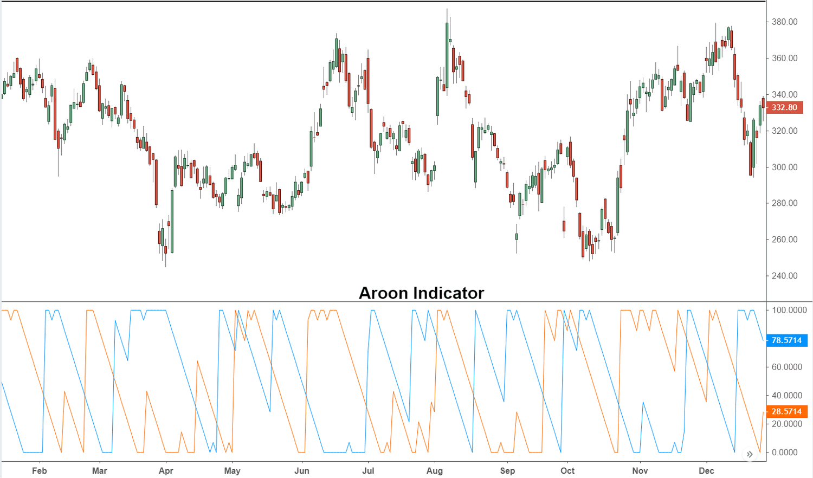

The Aroon Oscillator is a significant tool within technical analysis, enabling traders to gain insights into market trends. Developed by Tushar Chande, this trend-following indicator assesses the strength of a trend and its potential for continuation. Its primary objective is to identify new and emerging trends, which is essential for making informed trading decisions. 

In this article, we will examine the formulation and calculation of the Aroon Oscillator, describe how it generates trade signals, and consider its application within algorithmic trading strategies. Understanding the dynamics of the indicator is crucial for transforming these signals into actionable trading strategies. Its ability to highlight potential trend reversals aids traders immensely, providing a foundation for entry and exit decisions.



However, no tool is without its limitations. The Aroon Oscillator can occasionally fall short, particularly in choppy or sideways markets, where it might produce false signals. Recognizing these limitations is essential for traders aiming to leverage it effectively. Awareness and careful evaluation, paired with complementary analytical methods, can optimize trading strategies that incorporate the Aroon Oscillator.

Ultimately, mastering the application of the Aroon Oscillator can significantly enhance your market analysis and refine your trading approach, potentially leading to improved performance and outcomes.

## Table of Contents

## What is the Aroon Oscillator?

The Aroon Oscillator is an integral instrument in technical analysis, designed to assess the strength of current market trends by using measurements sourced from the Aroon Up and Aroon Down indicators. This oscillator distinguishes itself by calculating the time elapsed since new highs and lows over a specific period, most commonly set at 25 periods. This method of calculation assists traders in determining whether an asset is trending upwards or downwards.

The Aroon Up and Aroon Down calculations are based on the last 25-period high and low, respectively. For instance, the Aroon Up is computed using the formula:

$$
\text{Aroon Up} = \frac{100 \times (25 - \text{Number of periods since last 25-period high})}{25}
$$

Similarly, the Aroon Down follows:

$$
\text{Aroon Down} = \frac{100 \times (25 - \text{Number of periods since last 25-period low})}{25}
$$

The Aroon Oscillator is then derived by subtracting Aroon Down from Aroon Up, offering a value that oscillates between -100 and 100. A reading above zero typically suggests that the market is experiencing a strong uptrend, while a negative value indicates a prevailing downtrend. The zero line is particularly significant as it potentially indicates points of trend reversal.

The name 'Aroon' is derived from Sanskrit, meaning 'dawn's early light', metaphorically symbolizing the identification of emerging trends within the market. This capability of foreseeing such changes makes the Aroon Oscillator a valuable tool for traders focused on anticipating and benefitting from market shifts.

## Understanding the Aroon Oscillator

The Aroon Oscillator is a valuable tool for traders, oscillating between -100 and 100 to provide insights into market trends. This indicator is designed to measure the strength and direction of a trend, offering signals that can indicate potential shifts in the market. The Aroon Oscillator demonstrates three critical insights through its readings:

1. **Trend Identification**: When the Aroon Oscillator yields readings above zero, it suggests the presence of an uptrend. Conversely, readings below zero indicate a downtrend. This straightforward mechanism enables traders to quickly grasp the current market direction and make informed decisions based on prevailing trends. 

2. **Quantifying Trend Strength and Duration**: The oscillator not only helps identify the direction of a trend but also measures its strength and duration. A value above 50 implies a strong uptrend, indicating that the price has consistently reached new highs. Similarly, a value below -50 suggests a strong downtrend, with the price frequently making new lows. These strong trend indicators are crucial for traders looking to ride a trend to its fullest potential.

3. **Anticipating Market Shifts**: A significant feature of the Aroon Oscillator is its ability to signal potential trend reversals through zero line crossovers. When the oscillator crosses above the zero line, it may suggest the inception of an uptrend. Conversely, crossing below the zero line could be an early warning sign of a downward shift. By attentively monitoring for these crossovers, traders can anticipate market changes ahead of time, adjusting their strategies accordingly.

Given these capabilities, the Aroon Oscillator is a vital component in technical analysis, assisting traders in identifying and capitalizing on market trends. It is essential, however, to corroborate the signals from the Aroon Oscillator with other indicators or market conditions to enhance its reliability in diverse trading environments.

## Calculation Formula

The Aroon Oscillator is a widely-utilized technical indicator in trading, designed to measure the strength and direction of a trend. Its calculation hinges on the relationship between Aroon Up and Aroon Down values. The Aroon Oscillator formula is represented as:

$$
\text{Aroon Oscillator} = \text{Aroon Up} - \text{Aroon Down}
$$

### Calculation of Aroon Up and Aroon Down

1. **Aroon Up Calculation**:
   - This indicator assesses the number of periods since the last 25-period high within a given timeframe. The formula is expressed as:

   \[ \text{Aroon Up} = 100 \times \left(\frac{25 - \text{Periods Since Last 25-Period High}}{25}\right)
$$

2. **Aroon Down Calculation**:
   - Aroon Down mirrors the Aroon Up calculation, but it tracks the periods since the last 25-period low:

   \[ \text{Aroon Down} = 100 \times \left(\frac{25 - \text{Periods Since Last 25-Period Low}}{25}\right)
$$

### Implementation in Python

The following Python code snippet demonstrates how to compute the Aroon Oscillator using data from a price series:

```python
def calculate_aroon_oscillator(prices, period=25):
    aroon_up = []
    aroon_down = []

    for i in range(len(prices) - period + 1):
        period_data = prices[i:i+period]
        max_index = period_data.index(max(period_data))
        min_index = period_data.index(min(period_data))

        aroon_up_value = 100 * (period - max_index) / period
        aroon_down_value = 100 * (period - min_index) / period

        aroon_up.append(aroon_up_value)
        aroon_down.append(aroon_down_value)

    aroon_oscillator = [up - down for up, down in zip(aroon_up, aroon_down)]
    return aroon_up, aroon_down, aroon_oscillator

# Example usage with a hypothetical price list
prices = [125, 136, 130, 138, 132, 129, 135, 140, 137, 142, 144, 139, 141, 147, 143, 145, 146, 147, 146, 144, 143, 145, 142, 141, 138]
aroon_up, aroon_down, aroon_oscillator = calculate_aroon_oscillator(prices)
```

Traders apply this formula at the end of each time period, drawing on current market data to adjust their calculations. By doing so, they can react to market fluctuations more effectively, utilizing the insights garnered from the Aroon Oscillator to inform trading strategies.

## Trade Signals

The Aroon Oscillator provides critical trade signals by analyzing the crossover behavior of its Aroon Up and Aroon Down components. When the Aroon Up crosses above the Aroon Down, it indicates a potential uptrend. Conversely, when the Aroon Down crosses above the Aroon Up, it suggests a potential downtrend.

A move above the zero line is significant because it signals a possible continuation of the uptrend and can serve as a trigger for traders to consider entering long positions. Conversely, a move below the zero line signals a potential downtrend, which could prompt traders to consider entering short positions.

To implement this strategy, traders often watch for decisive crossovers around the zero line, marking these points as potential signals for market entry or [exit](/wiki/exit-strategy). However, it is crucial to corroborate these signals with additional analysis and confirmatory indicators. For instance, combining the Aroon Oscillator signals with other technical indicators like the Relative Strength Index (RSI) or Moving Averages can provide a more comprehensive market outlook.

While using the Aroon Oscillator for trade signal generation, traders might employ the following Python snippet to automate part of their decision-making process:

```python
def calculate_aroon_oscillator(aroon_up, aroon_down):
    return aroon_up - aroon_down

def generate_trade_signal(aroon_oscillator):
    if aroon_oscillator > 0:
        return "uptrend signal"
    elif aroon_oscillator < 0:
        return "downtrend signal"
    else:
        return "neutral"

# Example usage
aroon_up = 70
aroon_down = 30
aroon_oscillator = calculate_aroon_oscillator(aroon_up, aroon_down)
signal = generate_trade_signal(aroon_oscillator)

print(f"Aroon Oscillator Value: {aroon_oscillator}, Signal: {signal}")
```

This code evaluates whether the current market trend is likely to rise or fall and generates a corresponding trading signal. By integrating such a method into a broader trading strategy that includes thorough market analysis, traders can enhance the reliability of their trading decisions.

## Integrating Aroon in Algorithmic Trading

Integrating the Aroon Oscillator into [algorithmic trading](/wiki/algorithmic-trading) strategies enhances the automation and precision of trade decisions. This oscillator is particularly useful when combined with other technical indicators like the Relative Strength Index (RSI) and Moving Averages. This multi-indicator strategy increases the reliability of trade signals, as each indicator can confirm the others, reducing the likelihood of false signals.

Algorithmic trading utilizing the Aroon Oscillator is advantageous in volatile markets, where quick adjustments to trading positions are essential. The oscillator's ability to detect emerging trends and potential reversals allows for timely execution of buy or sell orders. This timeliness can help capitalize on rapid market movements, ensuring that trading strategies remain effective despite fluctuating market conditions.

For a robust integration of the Aroon Oscillator into an algorithmic trading system, [backtesting](/wiki/backtesting) is paramount. Backtesting involves running the algorithm on historical data to evaluate its performance and optimize the parameters for actual trading scenarios. This process helps ensure that the trading strategies are not only efficient but also profitable in various market conditions.

An example of a simple algorithm integrating the Aroon Oscillator with other indicators in Python might look like this:

```python
import pandas as pd
import talib

# Assuming 'data' is a DataFrame with columns 'High', 'Low', and 'Close'
def compute_indicators(data):
    # Calculate Aroon Oscillator
    aroon_up, aroon_down = talib.AROON(data['High'], data['Low'], timeperiod=25)
    aroon_osc = aroon_up - aroon_down

    # Calculate RSI
    rsi = talib.RSI(data['Close'], timeperiod=14)

    # Calculate Moving Average
    moving_avg = data['Close'].rolling(window=20).mean()

    return aroon_osc, rsi, moving_avg

def generate_signals(data):
    aroon_osc, rsi, moving_avg = compute_indicators(data)
    signals = []

    for i in range(len(data)):
        if aroon_osc[i] > 0 and rsi[i] < 70 and data['Close'][i] > moving_avg[i]:
            signals.append('Buy')
        elif aroon_osc[i] < 0 and rsi[i] > 30 and data['Close'][i] < moving_avg[i]:
            signals.append('Sell')
        else:
            signals.append('Hold')

    return signals
```

This code calculates the Aroon Oscillator, RSI, and Moving Averages, and uses these to generate simple trade signals based on predefined conditions. The strategy here serves as a foundation and should be fine-tuned via thorough backtesting to align with specific market behavioral patterns.

## Limitations of the Aroon Oscillator

The Aroon Oscillator, while a valuable trend-following indicator, is not without its limitations, particularly in certain market environments. One of the primary challenges it faces is in choppy or sideways markets. In these conditions, the Aroon Oscillator may generate false signals or exhibit delayed responses, which can lead to trading errors. This is because the indicator relies on the timing of new highs and lows to gauge trend strength; in a sideways market, these signals can become erratic and unreliable.

The default period used in the calculation of the Aroon Oscillator is typically set at 25 periods. While this period can work well for certain assets and market conditions, it may not be optimal in all circumstances. The choice of a fixed 25-period calculation can appear arbitrary, and traders may need to customize this parameter to better fit the specific [volatility](/wiki/volatility-trading-strategies) and behavior of the asset they are analyzing. Adjusting the period can sometimes lead to more accurate readings, although this depends heavily on the dynamics of the market being traded.

Furthermore, when relying solely on the Aroon Oscillator, traders might miss out on critical context that other analysis methods provide. To mitigate its limitations, traders should consider using the Aroon Oscillator alongside other indicators and analytical approaches. For example, integrating price action analysis or combining it with other technical indicators such as Moving Averages or the Relative Strength Index (RSI) can enhance the reliability of the generated signals. This multifaceted approach allows traders to cross-verify signals and gain a more comprehensive understanding of market conditions.

Ultimately, adapting the use of the Aroon Oscillator to account for specific market conditions can improve its effectiveness. Traders should remain vigilant and adjust their strategies as necessary to ensure they are leveraging the full potential of this trend-following tool while being cognizant of its inherent limitations.

## Conclusion

The Aroon Oscillator is a crucial tool in a trader’s arsenal, offering substantial benefits for analyzing market trends. Its ability to pinpoint nascent trends and anticipate potential reversals makes it a valuable resource in technical analysis. By observing the oscillator's movements, traders gain a clearer understanding of market dynamics, enabling them to make more informed decisions.

Nevertheless, the Aroon Oscillator is not without its limitations. In markets characterized by low volatility or sideways movement, it might generate misleading signals or lag in revealing functional insights. Thus, it's imperative to use the Aroon Oscillator in conjunction with other analytical tools to boost accuracy. Supplementing its insights with additional indicators like Relative Strength Index (RSI) or Moving Averages can provide a more holistic view of market conditions and validate trade decision-making.

For traders, mastering this instrument involves practice and adaptation, tailoring its application to specific market situations. Continuous evaluation and refinement of how the Aroon Oscillator is integrated into trading strategies can significantly enhance overall trading performance. With diligent application, the Aroon Oscillator can become a means to optimize entry and exit points, improving the overall efficiency of trading strategies.

## References & Further Reading

[1]: Chande, T. (1997). ["Beyond Technical Analysis: How to Develop and Implement a Winning Trading System"](https://archive.org/details/beyondtechnicala0000chan). Wiley.

[2]: Pring, M. J. (2002). ["Technical Analysis Explained: The Successful Investor's Guide to Spotting Investment Trends and Turning Points"](https://www.amazon.com/Technical-Analysis-Explained-Fifth-Successful/dp/0071825177). McGraw-Hill Education.

[3]: Aronson, D. R. (2006). ["Evidence-Based Technical Analysis: Applying the Scientific Method and Statistical Inference to Trading Signals"](https://www.amazon.com/Evidence-Based-Technical-Analysis-Scientific-Statistical/dp/0470008741). Wiley.

[4]: Lopez de Prado, M. (2018). ["Advances in Financial Machine Learning"](https://www.amazon.com/Advances-Financial-Machine-Learning-Marcos/dp/1119482089). Wiley.

[5]: Chan, E. P. (2013). ["Algorithmic Trading: Winning Strategies and Their Rationale"](https://github.com/ftvision/quant_trading_echan_book). Wiley.