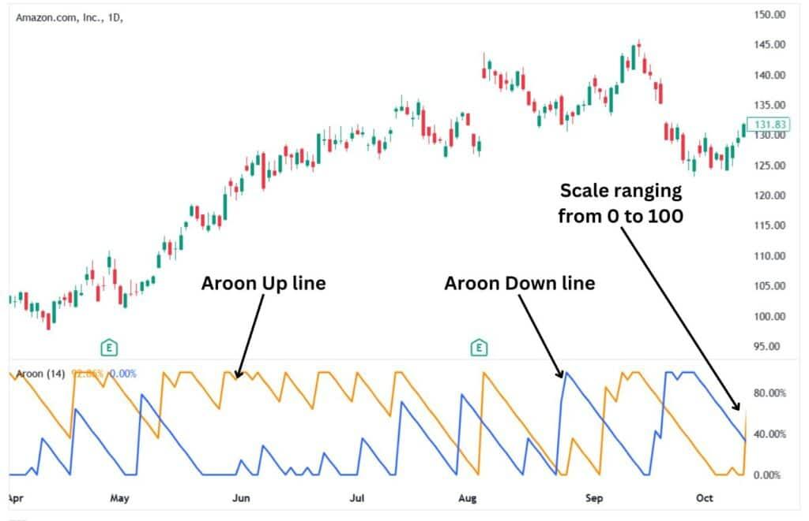

## Table of Contents

## What is the Aroon Oscillator and what does it measure?

The Aroon Oscillator is a technical indicator used in trading to help predict price trends and identify when a trend might be starting or ending. It is based on the Aroon Indicator, which consists of two lines: the Aroon Up line and the Aroon Down line. The Aroon Up line measures how many periods have passed since the highest price within a given time frame, while the Aroon Down line measures how many periods have passed since the lowest price. The Aroon Oscillator is simply the difference between these two lines.

The Aroon Oscillator measures the strength of a trend and can help traders understand whether a market is trending or not. When the oscillator value is high, it suggests that the market is experiencing a strong trend, either up or down. Conversely, when the value is low or close to zero, it indicates that the market might be in a consolidation phase, with no clear trend. Traders often use this information to make decisions about entering or exiting trades, as it can signal potential changes in market direction.

## How is the Aroon Up calculated?

The Aroon Up is calculated by looking at how many periods have passed since the highest price in a certain time frame. For example, if you are using a 25-period setting, you would count back 25 periods from the current period. You find the highest price within those 25 periods and then see how many periods ago that high price occurred. If the highest price was 10 periods ago, you would use the number 10.

Once you have that number, you use a simple formula to calculate the Aroon Up. The formula is: Aroon Up = ((25 - 10) / 25) * 100. In this example, it would be ((25 - 10) / 25) * 100 = 60. So, the Aroon Up value would be 60. This number tells you how strong the upward trend is within the chosen time frame. A higher number means a stronger upward trend.

## How is the Aroon Down calculated?

The Aroon Down is calculated by looking at how many periods have passed since the lowest price within a certain time frame. For example, if you are using a 25-period setting, you would count back 25 periods from the current period. You find the lowest price within those 25 periods and then see how many periods ago that low price occurred. If the lowest price was 15 periods ago, you would use the number 15.

Once you have that number, you use a simple formula to calculate the Aroon Down. The formula is: Aroon Down = ((25 - 15) / 25) * 100. In this example, it would be ((25 - 15) / 25) * 100 = 40. So, the Aroon Down value would be 40. This number tells you how strong the downward trend is within the chosen time frame. A higher number means a stronger downward trend.

## What is the formula for the Aroon Oscillator?

The Aroon Oscillator is calculated by taking the difference between the Aroon Up and the Aroon Down. The Aroon Up measures how many periods have passed since the highest price in a given time frame, while the Aroon Down measures how many periods have passed since the lowest price. If you are using a 25-period setting, you would find the highest price in the last 25 periods and see how many periods ago it occurred. You do the same for the lowest price. Then, you use these numbers to calculate the Aroon Up and Aroon Down values.

To find the Aroon Oscillator, you subtract the Aroon Down value from the Aroon Up value. For example, if the Aroon Up is 60 and the Aroon Down is 40, the Aroon Oscillator would be 60 - 40 = 20. This number tells you the strength of the trend. A positive number means the upward trend is stronger, while a negative number means the downward trend is stronger. The Aroon Oscillator helps traders see if the market is trending or not.

## How do you interpret the values of the Aroon Oscillator?

The Aroon Oscillator helps traders understand if the market is trending or not. It gives a number that shows how strong the trend is. If the number is positive, it means the upward trend is stronger than the downward trend. If the number is negative, it means the downward trend is stronger. The bigger the number, the stronger the trend. So, if the Aroon Oscillator is a big positive number, it means there is a strong upward trend. If it's a big negative number, it means there is a strong downward trend.

When the Aroon Oscillator is close to zero, it means the market is not trending much. It might be moving sideways, which means the prices are not going up or down a lot. Traders look at this to decide when to buy or sell. If the oscillator starts to move away from zero, it might be a sign that a new trend is starting. So, if it goes from zero to a big positive number, it could be a good time to buy. If it goes from zero to a big negative number, it might be a good time to sell.

## What are common settings for the Aroon Oscillator?

The most common setting for the Aroon Oscillator is a 25-period setting. This means it looks back 25 periods to find the highest and lowest prices. Traders like this setting because it gives a good balance between being sensitive to price changes and not giving too many false signals.

Some traders might use a shorter period, like 14 or 20, if they want the oscillator to react faster to price changes. Others might use a longer period, like 50 or 100, if they want to see longer-term trends. The choice of setting depends on what the trader is trying to achieve and how quickly they want to react to market changes.

## How can the Aroon Oscillator be used to identify trends?

The Aroon Oscillator helps traders see if the market is going up or down by looking at the difference between the Aroon Up and Aroon Down lines. If the Aroon Oscillator shows a big positive number, it means the market is in a strong upward trend. This happens when the highest price in the last 25 periods (or whatever period you're using) happened recently. On the other hand, if the Aroon Oscillator shows a big negative number, it means there's a strong downward trend. This is when the lowest price in the last 25 periods happened recently.

When the Aroon Oscillator is close to zero, it tells traders that the market isn't really trending much. The prices might be moving sideways, not going up or down a lot. Traders watch the Aroon Oscillator to see if it starts moving away from zero. If it goes from zero to a big positive number, it could be a sign that an upward trend is starting, and it might be a good time to buy. If it goes from zero to a big negative number, it might mean a downward trend is starting, and it could be a good time to sell.

## What are the buy signals generated by the Aroon Oscillator?

A buy signal from the Aroon Oscillator happens when it starts moving from zero to a big positive number. This means the market is starting to go up more than it's going down. Traders look for this because it might be a good time to buy. When the Aroon Oscillator goes above zero, it shows that the upward trend is getting stronger. If it keeps going up and gets to a big number, like 50 or more, it's a strong sign that the market is in an upward trend.

Another buy signal can happen when the Aroon Oscillator crosses above a certain level, like 50. This crossing means the upward trend is very strong. Traders might use this as a signal to buy because it shows that the market is likely to keep going up. It's important to watch how the Aroon Oscillator moves over time to make sure the upward trend is real and not just a short-term change.

## What are the sell signals generated by the Aroon Oscillator?

A sell signal from the Aroon Oscillator happens when it starts moving from zero to a big negative number. This means the market is starting to go down more than it's going up. Traders look for this because it might be a good time to sell. When the Aroon Oscillator goes below zero, it shows that the downward trend is getting stronger. If it keeps going down and gets to a big negative number, like -50 or more, it's a strong sign that the market is in a downward trend.

Another sell signal can happen when the Aroon Oscillator crosses below a certain level, like -50. This crossing means the downward trend is very strong. Traders might use this as a signal to sell because it shows that the market is likely to keep going down. It's important to watch how the Aroon Oscillator moves over time to make sure the downward trend is real and not just a short-term change.

## How does the Aroon Oscillator compare to other momentum indicators?

The Aroon Oscillator is different from other [momentum](/wiki/momentum) indicators like the Relative Strength Index (RSI) or the Moving Average Convergence Divergence (MACD) because it focuses on the time since the highest and lowest prices happened, not just how much the price has changed. The RSI looks at how fast the price is going up or down and tells you if a stock is overbought or oversold. The MACD looks at the difference between two moving averages to show if the trend is getting stronger or weaker. The Aroon Oscillator, on the other hand, helps you see if the market is trending or not by looking at how recent the highest and lowest prices were.

While the Aroon Oscillator can be good for spotting new trends, other momentum indicators might be better for different things. For example, the RSI is great for figuring out if a stock is ready to reverse its direction because it's too high or too low. The MACD can help you see if a trend is losing steam or getting stronger. The Aroon Oscillator is more about telling you if the market is moving in a clear direction or just staying the same. So, traders might use the Aroon Oscillator along with other indicators to get a full picture of what the market is doing.

## What are the limitations and potential pitfalls of using the Aroon Oscillator?

The Aroon Oscillator has some limitations that traders should know about. It can give false signals, especially in markets that are moving sideways. This happens because the Aroon Oscillator looks at how recent the highest and lowest prices were, and in a sideways market, these highs and lows can happen often but not mean much. Also, the Aroon Oscillator might not work well in all market conditions. For example, it might not be as useful in markets that are very choppy or where trends are hard to see.

Another potential pitfall is that the Aroon Oscillator can be slow to react to big changes in the market. This means that by the time the oscillator shows a new trend, the market might have already moved a lot. Traders need to be careful about relying too much on the Aroon Oscillator alone. It's better to use it with other indicators, like the RSI or MACD, to get a better understanding of what's happening in the market. This way, traders can make more informed decisions and avoid some of the pitfalls of using the Aroon Oscillator by itself.

## Can the Aroon Oscillator be combined with other indicators for better trade signals, and if so, how?

Yes, the Aroon Oscillator can be combined with other indicators to get better trade signals. One way to do this is to use it with the Relative Strength Index (RSI). The RSI helps you see if a stock is overbought or oversold. If the Aroon Oscillator shows a strong upward trend and the RSI is not overbought, it might be a good time to buy. On the other hand, if the Aroon Oscillator shows a strong downward trend and the RSI is not oversold, it could be a good time to sell. By using both indicators, you can get a clearer picture of the market and make better trading decisions.

Another useful combination is the Aroon Oscillator with the Moving Average Convergence Divergence (MACD). The MACD shows if a trend is getting stronger or weaker. If the Aroon Oscillator shows a new upward trend and the MACD confirms it by moving up, it's a strong signal to buy. If the Aroon Oscillator shows a new downward trend and the MACD is also moving down, it's a good signal to sell. Using these two indicators together helps you avoid false signals and gives you more confidence in your trades.

## What is the Aroon Oscillator?

The Aroon Oscillator is an integral instrument in technical analysis, designed to assess the strength of current market trends by using measurements sourced from the Aroon Up and Aroon Down indicators. This oscillator distinguishes itself by calculating the time elapsed since new highs and lows over a specific period, most commonly set at 25 periods. This method of calculation assists traders in determining whether an asset is trending upwards or downwards.

The Aroon Up and Aroon Down calculations are based on the last 25-period high and low, respectively. For instance, the Aroon Up is computed using the formula:

$$
\text{Aroon Up} = \frac{100 \times (25 - \text{Number of periods since last 25-period high})}{25}
$$

Similarly, the Aroon Down follows:

$$
\text{Aroon Down} = \frac{100 \times (25 - \text{Number of periods since last 25-period low})}{25}
$$

The Aroon Oscillator is then derived by subtracting Aroon Down from Aroon Up, offering a value that oscillates between -100 and 100. A reading above zero typically suggests that the market is experiencing a strong uptrend, while a negative value indicates a prevailing downtrend. The zero line is particularly significant as it potentially indicates points of trend reversal.

The name 'Aroon' is derived from Sanskrit, meaning 'dawn's early light', metaphorically symbolizing the identification of emerging trends within the market. This capability of foreseeing such changes makes the Aroon Oscillator a valuable tool for traders focused on anticipating and benefitting from market shifts.

## What is the Calculation Formula?

The Aroon Oscillator is a widely-utilized technical indicator in trading, designed to measure the strength and direction of a trend. Its calculation hinges on the relationship between Aroon Up and Aroon Down values. The Aroon Oscillator formula is represented as:

$$
\text{Aroon Oscillator} = \text{Aroon Up} - \text{Aroon Down}
$$

### Calculation of Aroon Up and Aroon Down

1. **Aroon Up Calculation**:
   - This indicator assesses the number of periods since the last 25-period high within a given timeframe. The formula is expressed as:

   \[ \text{Aroon Up} = 100 \times \left(\frac{25 - \text{Periods Since Last 25-Period High}}{25}\right)
$$

2. **Aroon Down Calculation**:
   - Aroon Down mirrors the Aroon Up calculation, but it tracks the periods since the last 25-period low:

   \[ \text{Aroon Down} = 100 \times \left(\frac{25 - \text{Periods Since Last 25-Period Low}}{25}\right)
$$

### Implementation in Python

The following Python code snippet demonstrates how to compute the Aroon Oscillator using data from a price series:

```python
def calculate_aroon_oscillator(prices, period=25):
    aroon_up = []
    aroon_down = []

    for i in range(len(prices) - period + 1):
        period_data = prices[i:i+period]
        max_index = period_data.index(max(period_data))
        min_index = period_data.index(min(period_data))

        aroon_up_value = 100 * (period - max_index) / period
        aroon_down_value = 100 * (period - min_index) / period

        aroon_up.append(aroon_up_value)
        aroon_down.append(aroon_down_value)

    aroon_oscillator = [up - down for up, down in zip(aroon_up, aroon_down)]
    return aroon_up, aroon_down, aroon_oscillator

# Example usage with a hypothetical price list
prices = [125, 136, 130, 138, 132, 129, 135, 140, 137, 142, 144, 139, 141, 147, 143, 145, 146, 147, 146, 144, 143, 145, 142, 141, 138]
aroon_up, aroon_down, aroon_oscillator = calculate_aroon_oscillator(prices)
```

Traders apply this formula at the end of each time period, drawing on current market data to adjust their calculations. By doing so, they can react to market fluctuations more effectively, utilizing the insights garnered from the Aroon Oscillator to inform trading strategies.

## References & Further Reading

[1]: Chande, T. (1997). ["Beyond Technical Analysis: How to Develop and Implement a Winning Trading System"](https://archive.org/details/beyondtechnicala0000chan). Wiley.

[2]: Pring, M. J. (2002). ["Technical Analysis Explained: The Successful Investor's Guide to Spotting Investment Trends and Turning Points"](https://www.amazon.com/Technical-Analysis-Explained-Fifth-Successful/dp/0071825177). McGraw-Hill Education.

[3]: Aronson, D. R. (2006). ["Evidence-Based Technical Analysis: Applying the Scientific Method and Statistical Inference to Trading Signals"](https://www.amazon.com/Evidence-Based-Technical-Analysis-Scientific-Statistical/dp/0470008741). Wiley.

[4]: Lopez de Prado, M. (2018). ["Advances in Financial Machine Learning"](https://www.amazon.com/Advances-Financial-Machine-Learning-Marcos/dp/1119482089). Wiley.

[5]: Chan, E. P. (2013). ["Algorithmic Trading: Winning Strategies and Their Rationale"](https://github.com/ftvision/quant_trading_echan_book). Wiley.