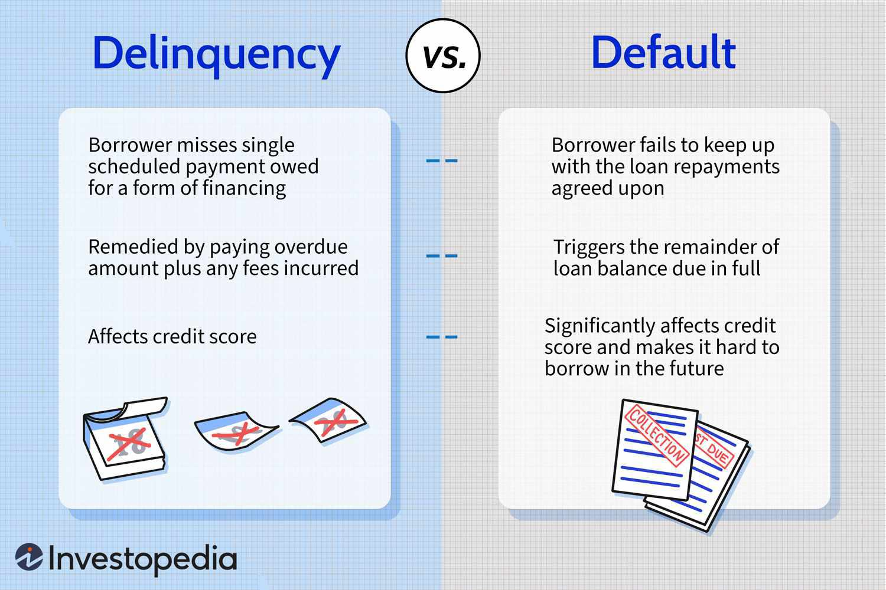

In the dynamic landscape of financial markets, financial derivatives have emerged as essential tools for managing risk and improving investment efficiency. These sophisticated instruments derive their value from underlying assets, making them versatile solutions in both risk management and speculative strategies. Among the various categories of derivatives, interest rate swaps and arrears swaps play a pivotal role in financial planning and risk mitigation. 

Interest rate swaps facilitate the exchange of cash flows between fixed and floating interest rate structures, allowing participants to manage exposure to interest rate fluctuations effectively. This is particularly beneficial in an environment where interest rates are volatile, offering companies a way to streamline cash flows and hedge against potential financial risks. Arrears swaps, a specialized form of interest rate swaps, determine the floating rate payments at the end of each reset period. This feature makes them attractive for speculators aiming to capitalize on shifting yield curves. 



In recent years, the integration of derivatives like interest rate swaps into algorithmic trading has transformed how these instruments are utilized. Algorithmic trading automates the process, optimizing trade execution and strategic decision-making. By embedding these swaps into algorithms, traders can swiftly react to market dynamics, managing interest rate risks with enhanced precision. 

This article will focus on understanding these financial derivatives, illustrating their practical applications with examples from corporations such as PepsiCo, which strategically use interest rate swaps to achieve financial stability. The synergy between traditional financial derivatives and modern technology exemplifies how these instruments continue to evolve, playing an indispensable role in today's financial markets.

## Table of Contents

## Understanding Financial Derivatives

Financial derivatives are complex financial instruments whose values are contingent upon the performance of underlying assets, indices, or interest rates. Derivatives are pivotal in enhancing the efficiency of financial markets by providing avenues for risk management, price discovery, and arbitrage opportunities. 

The derivative market is categorized into several distinct types, each serving specialized purposes:

1. **Futures**: These are standardized contracts traded on exchanges, obligating the holder to buy or sell an asset at a predetermined price and date. Futures are widely used for hedging against price fluctuations in commodities, currencies, and indices. For instance, a wheat farmer might use futures to lock in a selling price, protecting against the risk of price drops at harvest time.

2. **Options**: Options provide the holder the right, but not the obligation, to buy or sell an asset at a specified price before a certain date. They come in two forms: call options, which allow buying, and put options, which enable selling. These instruments are vital for hedging strategies and speculative purposes. They enable investors to hedge potential losses in exchange-traded stocks, currencies, or commodities.

3. **Swaps**: Swaps are customized contracts typically used to exchange cash flows between two parties and are traded over-the-counter (OTC). The most common form of swap is the interest rate swap, where parties exchange fixed-rate and floating-rate interest payments. Swaps are fundamental in managing exposure to fluctuations in interest rates and currencies, offering firms a mechanism to tailor their financial strategies.

4. **Forwards**: Similar to futures but non-standardized and traded OTC, forwards allow the purchase or sale of an asset at a future date for a price agreed upon today. These contracts are predominantly used by entities aiming to hedge against currency or price risks outside the formal exchange structures.

Each type of derivative serves a unique role, from facilitating speculative trading and [arbitrage](/wiki/arbitrage) to providing essential risk management tools for institutional investors and corporations alike. As complex as derivatives can be, they offer strategic advantages when used judiciously in aligning financial exposures with risk appetites and investment horizons, thereby underpinning the stability and growth of global financial systems.

## Interest Rate Swaps: An Overview

Interest rate swaps are fundamental financial derivatives that facilitate the exchange of cash flows based on different [interest rate](/wiki/interest-rate-trading-strategies) structures, specifically between fixed and floating rates. These instruments are a vital component in financial markets, providing participants with mechanisms to effectively manage exposure to fluctuations in interest rates. Essentially, an interest rate swap involves two parties agreeing to exchange interest rate payments over a specified period. One party pays a fixed interest rate, while the other pays a floating rate, typically linked to a benchmark like the London Interbank Offered Rate (LIBOR) or the Secured Overnight Financing Rate (SOFR).

The primary motivation for utilizing interest rate swaps is risk management. By converting a floating-rate obligation to a fixed-rate one, or vice versa, financial institutions and corporations can stabilize their financial outlays. This stabilization is particularly valuable in volatile interest rate environments, where unpredictable changes can significantly impact cash flows and valuations. For instance, a company with a floating-rate loan might enter into a swap to pay a fixed rate instead, ensuring consistent interest payments and safeguarding against potential rate increases.

Moreover, interest rate swaps are instrumental in hedging financial risks. They allow entities to align their debt profiles with expectations of future interest movements or their strategic financial goals. Swaps can also be employed to adjust the interest rate exposure in an institution's portfolio, balancing the composition of fixed and floating-rate instruments in alignment with anticipated economic conditions.

From a cash flow perspective, interest rate swaps streamline obligations. By swapping cash flows, entities can match their income streams with their debt servicing requirements more efficiently. This matching can enhance financial predictability and facilitate more accurate financial planning.

The market for interest rate swaps is vast, reflecting their importance in global finance. Participants range from banks and hedge funds to corporations and government entities, all leveraging swaps for diverse strategic purposes. The sheer scale and [liquidity](/wiki/liquidity-risk-premium) of the interest rate swap market highlight their critical role in modern financial systems. 

In summary, interest rate swaps are indispensable to managing interest rate risk and optimizing cash flow structures. They provide a robust framework for entities to navigate the complexities of interest rate exposure, hedging strategies, and financial planning in an ever-evolving market landscape.

## The Mechanics of Arrears Swaps

Arrears swaps are a unique variation of interest rate swaps, structured to determine floating payments based on the prevailing interest rate at the end of each reset period, rather than at the beginning. This distinctive characteristic positions arrears swaps as an advanced financial instrument, offering potential advantages and risks distinct from conventional swaps.

The fundamental operation of arrears swaps lies in their calculation mechanism. Typically, in a standard interest rate swap, one party pays a fixed rate while the other pays a floating rate, with the floating rate determined at the start of each period. However, in arrears swaps, the floating rate is set at the end of the period. This means that the payment amount reflects much more current market conditions, particularly relevant in environments of rapidly changing interest rates.

Given this structure, arrears swaps are primarily tailored for strategic speculators who aim to exploit the dynamics of volatile yield curves. Speculators may anticipate shifts in interest rates and use arrears swaps to benefit from the end-of-period rate determination, which can potentially yield higher profits if their rate predictions are correct. The risk, however, is equally significant, as misjudgments in interest rate movements can lead to substantial financial losses.

Mathematically, the floating payment in an arrears swap can be expressed as:

$$
\text{Floating Payment} = \text{Notional Principal} \times \left(\frac{\text{LIBOR}_{t+1} \cdot \Delta t}{1 + \text{LIBOR}_{t+1} \cdot \Delta t} \right)
$$

Here, $\text{LIBOR}_{t+1}$ represents the LIBOR rate set at the end of the period $t+1$, and $\Delta t$ is the time fraction of the year corresponding to the reset period. This formula underscores the swap's reliance on end-of-period interest rates, differentiating it from its upfront-rate counterparts.

The use of arrears swaps is not without complexities. They require sophisticated risk management and predictive analytics to effectively gauge interest rate changes. Financial institutions and investors deploying these instruments typically harness advanced analytics and financial models to optimize their positions.

In conclusion, the strategic use of arrears swaps necessitates a deep understanding of interest rate trends and an adeptness at managing associated risks. These swaps offer potential opportunities for enhanced returns but demand a comprehensive strategy to navigate their inherent risks effectively.

## Algorithmic Trading and Interest Rate Swaps

Algorithmic trading, or algo trading, has revolutionized the way financial markets operate by automating the trading process. This automation seeks to optimize the execution of trades, improve strategy implementation, and reduce transaction costs. Traders deploy sophisticated algorithms that are capable of executing orders at a pace and frequency that would be impossible for a human trader to match.

The integration of interest rate swaps into these algorithms presents a significant advantage for managing interest rate risks. Interest rate swaps are derivatives that enable the exchange of cash flows based on fixed and floating interest rates. By incorporating these swaps into [algorithmic trading](/wiki/algorithmic-trading) systems, traders can effectively navigate interest rate fluctuations and align their trades with prevailing market conditions.

One of the key benefits of using algorithms in managing interest rate swaps is the ability to react swiftly to market changes. Algorithms can continuously monitor market data, interest rate movements, and trading volumes to make informed decisions on swap positions. This real-time analysis allows traders to identify opportunities for arbitrage, hedging, or speculation that arise from shifts in interest rate curves and other economic indicators.

Moreover, algorithmic trading can handle complex swap strategies that require the simultaneous management of multiple swap positions across different maturities and currencies. For instance, a trader might construct an algorithm to optimize a swap portfolio by adjusting its composition based on interest rate forecasts and yield curve dynamics. This requires the processing of large datasets and the execution of complex mathematical models that calculate the optimal trade-off between risk and reward.

Here is a simplistic example of how Python code might be used to automate the trade execution of an interest rate swap:

```python
import numpy as np

# Hypothetical market data
interest_rates = np.array([0.02, 0.025, 0.03])  # Example fixed interest rates
floating_rates = np.array([0.021, 0.026, 0.031])  # Corresponding floating rates

# Decision making algorithm
def determine_swap_action(fixed_rate, floating_rate):
    if floating_rate > fixed_rate:
        return "Enter swap: pay fixed, receive floating"
    else:
        return "Hold position"

# Simulate the trading decision process
for fixed, floating in zip(interest_rates, floating_rates):
    action = determine_swap_action(fixed, floating)
    print(f"Fixed rate: {fixed}, Floating rate: {floating} => Action: {action}")
```

In this basic example, the algorithm decides whether to enter a swap based on a simple comparison of fixed and floating rates, suggesting a profitable strategy of paying fixed and receiving floating rates when the floating rate is higher.

Additionally, implementing interest rate swaps into algorithmic trading strategies enables traders to assess risk exposures more accurately. Algorithms can calculate the potential impact of interest rate changes on swap portfolios and adjust positions to hedge against adverse movements, thus safeguarding profits.

In summary, the integration of interest rate swaps into algorithmic trading systems allows for more efficient management of interest rate risks. By leveraging the speed and precision of algorithms, traders can capitalize on favorable market conditions and mitigate potential losses from interest rate [volatility](/wiki/volatility-trading-strategies).

## Real-world Applications and Examples

Corporations regularly employ interest rate swaps as part of their financial risk management strategies to stabilize cash flows and guard against interest rate volatility. For instance, a multinational corporation like PepsiCo might enter into an interest rate swap agreement to convert a floating-rate loan into a fixed-rate obligation. This move helps the company manage its interest expenses more predictably, ensuring stable budgeting and protecting against unforeseen interest rate increases.

Interest rate swaps function by allowing two parties to exchange cash flows based on different interest rate structures. For example, a corporation with a floating-rate debt might agree to make periodic fixed payments to a counterparty, while receiving variable payments based on a benchmark interest rate, such as the London Interbank Offered Rate (LIBOR). By doing so, the corporation effectively locks in an interest rate for the term of the swap, providing certainty over interest expenses.

These swaps serve as powerful risk management tools by enabling companies to align their debt profiles with their financial strategies. Consider a corporation anticipating rising interest rates; converting its liability to a fixed rate using a swap mitigates the risk of increasing interest costs, thus preserving financial stability. Additionally, by hedging against volatility, corporations can allocate resources more efficiently, enhancing strategic planning and investment decisions.

The real-world application of interest rate swaps extends beyond debt management. Companies also utilize them in concert with other financial instruments to optimize their capital structure, reap tax benefits, or adjust the duration of existing liabilities. This flexibility underscores their critical role in comprehensive risk management frameworks.

Overall, interest rate swaps not only aid in maintaining cash flow stability but also enable firms to hedge against future financial uncertainties. By integrating such derivatives into financial strategies, corporations can effectively navigate the complexities of modern financial markets, safeguarding their economic interests while ensuring operational continuity.

## Conclusion

Interest rate swaps and arrears swaps are fundamental components of modern financial markets, serving as essential tools for risk management and financial strategy optimization. By facilitating the exchange of cash flows between fixed and floating interest rate structures, these derivatives enable market participants to hedge against fluctuations in interest rates, thus providing a mechanism to stabilize financial operations. The ability to manage such risks is crucial for entities ranging from small businesses to large multinational corporations, allowing them to maintain predictable expenditure and revenue streams amidst volatile market conditions.

The integration of interest rate swaps into algorithmic trading platforms signifies an important advancement in financial technology. By leveraging automated systems to execute trades based on pre-defined criteria, traders can effectively manage interest rate exposures and exploit market inefficiencies, thus enhancing investment returns. Algorithmic trading enables enhanced speed and precision in executing complex trading strategies, allowing for dynamic repositioning as market conditions evolve.

This fusion of traditional financial instruments with cutting-edge technology underscores a broader trend in finance - the convergence of traditional risk management practices with innovative technological solutions. It illustrates a significant shift towards increased efficiency, transparency, and analytical sophistication in financial markets. As the landscape of financial technologies continues to evolve, the role of derivatives like interest rate swaps and arrears swaps will undoubtedly expand, offering even greater strategic opportunities for managing financial risks in an increasingly complex global economy.

## References & Further Reading

Explore foundational texts such as "Principles of Financial Engineering" by Salih N. Neftci. This comprehensive work provides a detailed examination of financial engineering, focusing on the principles and practical applications of derivatives, including interest rate swaps. Neftci's book is renowned for its clear explanations of complex topics, making it an essential resource for understanding the instruments and strategies used in managing financial risk.

Additionally, gain insights from industry publications like "Interest Rate Swaps and Other Derivatives" by Howard Corb. Corb's book is a focused exploration of interest rate derivatives, offering an in-depth look at how these financial tools are structured, priced, and utilized in the market. It provides practical examples and case studies, illustrating the real-world applications and nuances of these instruments.

For those interested in the mathematical modeling of derivatives, "Options, Futures, and Other Derivatives" by John Hull is a crucial text. Hull's work is often praised for its rigorous analytical approach, covering key concepts with detailed mathematical explanations and models, suitable for both academic study and professional application.

Readers can also consider engaging with academic journals and articles that discuss the latest developments and research in financial derivatives and algorithmic trading. Journals such as the "Journal of Derivatives" or the "Journal of Financial Economics" often publish research articles and case studies that provide further insights into the evolving nature of these financial instruments and their applications in trading strategies.

Lastly, for professionals actively engaging in algorithmic trading and interested in the integration of financial derivatives, online resources and courses on platforms like Coursera, edX, and Khan Academy offer up-to-date content on quantitative finance, algorithmic strategies, and the role of derivatives in modern financial markets. These resources often include lectures, interactive tools, and community discussions that can enhance one's understanding and practical skills in these areas.