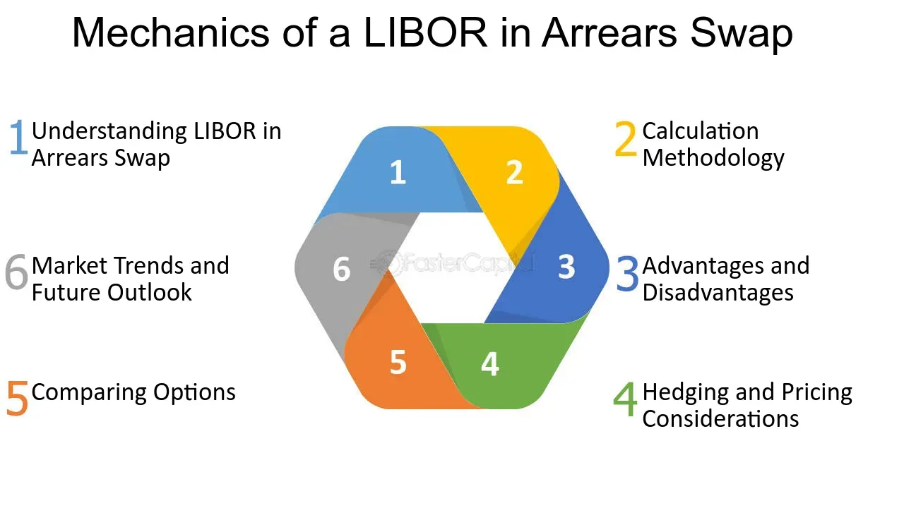

## Table of Contents

## What is an arrears swap?

An arrears swap is a type of interest rate swap where the interest payments are based on the interest rate at the end of the payment period, rather than at the beginning. In a regular interest rate swap, the interest rate is set at the start of the period, and that rate is used to calculate the payment due at the end. But in an arrears swap, the rate is only known at the end of the period, which makes it a bit more unpredictable.

This type of swap can be useful for certain financial strategies. For example, if someone thinks interest rates are going to go up, they might choose an arrears swap because they could end up paying less interest than they would with a regular swap. However, because the rate is set at the end of the period, it can be riskier and harder to predict the payments. This makes arrears swaps more complex and less common than regular swaps.

## How does an arrears swap differ from a standard interest rate swap?

An arrears swap and a standard interest rate swap are similar because they both involve exchanging interest payments between two parties. But they work a bit differently. In a standard interest rate swap, the interest rate is set at the beginning of each period. For example, if you have a swap that pays every three months, the rate for those three months is known at the start. This makes it easier to plan because you know what you'll be paying or receiving.

In an arrears swap, things are different. Here, the [interest rate](/wiki/interest-rate-trading-strategies) is only set at the end of the payment period. So, if you're looking at the same three-month period, you won't know the rate until the end of those three months. This can make arrears swaps riskier because the payments can be harder to predict. People might choose an arrears swap if they think interest rates will go up, hoping to pay less interest than they would with a standard swap.

## What are the key components of an arrears swap?

An arrears swap is a special kind of interest rate swap. The main part of it is the interest rate, but unlike a regular swap, this rate is set at the end of each period, not the start. This means you don't know what the rate will be until the period is over. The other key part is the payment schedule, which tells you when the payments will happen. In an arrears swap, these payments are based on the rate that was just figured out at the end of the period.

Another important piece is the notional principal, which is the amount of money the interest rate is applied to. Even though this money isn't actually exchanged, it's used to calculate the interest payments. Finally, there are the two parties involved in the swap. One party usually pays a fixed rate, while the other pays a floating rate that's set in arrears. This makes the swap more unpredictable but can be useful if someone thinks interest rates will change in their favor.

## Who typically uses arrears swaps and why?

Arrears swaps are used by people and companies who are good at predicting how interest rates will change. They might use these swaps if they think rates will go up. In an arrears swap, the interest rate is set at the end of the period, not the start. So, if rates go up, the person paying the floating rate might end up paying less than they would with a regular swap. This can be a good deal for them if their guess about rates going up is right.

Banks and big investors also use arrears swaps sometimes. They might use them to manage risk or to make money from changes in interest rates. Because the rate is set at the end of the period, it can be riskier, but it can also lead to bigger rewards if the rates move the right way. These users are usually very experienced and understand the risks and rewards of using such complex financial tools.

## How is the interest rate determined in an arrears swap?

In an arrears swap, the interest rate is set at the end of the payment period, not at the beginning like in a regular swap. This means you don't know the rate until the period is over. For example, if you have a three-month period, you won't know the rate until the end of those three months. This rate is usually based on a common benchmark, like the LIBOR or the SOFR, but it's the value of that benchmark at the end of the period that matters.

This way of setting the rate can be good if you think interest rates will go up. If rates do go up, you'll end up paying or receiving interest based on the higher rate at the end of the period. But it can also be riskier because you can't predict the payments as easily. This makes arrears swaps a bit more complex and they are used by people who are good at guessing how rates will change.

## What are the advantages of using an arrears swap?

One big advantage of using an arrears swap is that it can save you money if interest rates go up. In an arrears swap, the interest rate is set at the end of the period, not at the start. So, if rates go up during that time, you'll pay or get interest based on the higher rate at the end. This can be good if you think rates will go up because you might end up paying less than you would with a regular swap.

Another advantage is that arrears swaps can help manage risk in a different way. Because the rate is set at the end, it's harder to predict what you'll pay or get. This can be a good thing if you're good at guessing how rates will change. It lets you take advantage of changes in rates that you might not be able to with a regular swap. But remember, it's more complex and can be riskier, so it's usually used by people who really understand how these things work.

## What are the potential risks associated with arrears swaps?

One big risk with arrears swaps is that they can be hard to predict. Because the interest rate is set at the end of the period, you don't know what you'll pay or get until then. This can make it tough to plan and budget. If interest rates go down instead of up, you might end up paying more than you thought. This unpredictability can be a big problem if you're not good at guessing how rates will change.

Another risk is that arrears swaps are more complex than regular swaps. This complexity can make them harder to understand and use correctly. If you make a mistake or don't fully understand how they work, it could cost you a lot of money. Also, because they are less common, it might be harder to find someone to trade with, which can limit your options and make the swap less useful.

## How do you calculate the payments in an arrears swap?

In an arrears swap, the payment calculation is a bit different because the interest rate is set at the end of the period, not at the start. Let's say you have a three-month period. You won't know the interest rate until the end of those three months. Once you know the rate, you use it to figure out the payment. The payment is calculated by multiplying the notional principal (the amount of money the interest rate is applied to) by the interest rate, and then by the length of the period. For example, if the notional principal is $1 million, the interest rate at the end of the period is 2%, and the period is three months (or 0.25 years), the payment would be $1,000,000 * 0.02 * 0.25 = $5,000.

The tricky part is that you don't know the exact payment until the end of the period. This makes planning harder because the rate can change. If you're the one paying the floating rate and the rate goes up, you'll pay more than if it had stayed the same or gone down. But if you're good at guessing how rates will change, you might end up paying less than you would with a regular swap. That's why people who use arrears swaps are usually experienced and understand the risks involved.

## Can you explain the pricing model for arrears swaps?

Pricing an arrears swap can be a bit tricky because the interest rate is set at the end of the period, not at the start. To price an arrears swap, you need to guess what the interest rate will be at the end of each period. This involves looking at things like the current interest rate, how much it might change, and other market conditions. You also need to think about how much risk there is in not knowing the rate until the end. Because of this, pricing models for arrears swaps often use something called a "convexity adjustment." This adjustment tries to account for the fact that the rate might go up or down and how that affects the swap's value.

Once you have an idea of what the rate might be, you can figure out the payments. The payment for each period is calculated by multiplying the notional principal by the guessed interest rate and the length of the period. But because the rate is only known at the end, you have to use a model that can handle this uncertainty. This makes the pricing more complex than for a regular swap, where the rate is known at the start. People who price arrears swaps need to be good at understanding and predicting how interest rates will change, and they use special models to help them do this.

## What are the regulatory considerations for arrears swaps?

Arrears swaps, like other financial products, have to follow certain rules set by financial regulators. These rules are made to protect people who use these swaps and to keep the financial markets fair and safe. For example, in the United States, the Dodd-Frank Act has rules about how swaps should be reported and traded. This means that if you use an arrears swap, you have to tell a special place called a swap data repository about it. This helps regulators keep an eye on what's happening in the market.

Another thing to think about is that because arrears swaps are more complex and less common, they might be seen as riskier. Regulators might have extra rules or checks for these kinds of swaps to make sure they are used safely. For example, they might need more information about who is using them and why. Also, the people who use arrears swaps might need to show that they understand the risks and can handle them. This is all part of making sure the financial system stays stable and that people aren't taking on too much risk without knowing it.

## How do market conditions affect the performance of arrears swaps?

Market conditions can really change how well an arrears swap works. If interest rates are going up, people who use arrears swaps might do better than with a regular swap. This is because the rate for the arrears swap is set at the end of the period, so if rates go up, they'll pay or get interest based on the higher rate. But if rates go down, they might end up paying more than they thought. So, guessing how rates will change is a big part of using arrears swaps well.

Also, the overall mood of the market can affect arrears swaps. If people think the economy is going to do well, they might expect rates to go up, which could make arrears swaps more popular. But if there's a lot of uncertainty or if people think the economy might get worse, they might be more careful about using these swaps because they're riskier. So, keeping an eye on what's happening in the market and how people feel about it is important for anyone using arrears swaps.

## What advanced strategies can be employed with arrears swaps?

One advanced strategy with arrears swaps is to use them as part of a bigger plan to guess how interest rates will change. If you think rates are going to go up, you might use an arrears swap to pay less interest than you would with a regular swap. You could also use arrears swaps to balance out other investments that might lose money if rates go up. By mixing arrears swaps with other financial tools, you can make a plan that protects you from changes in rates and might even make you some extra money if your guesses are right.

Another strategy is to use arrears swaps to take advantage of the difference between the rates set at the start and the end of a period. This is called a "convexity trade." If you think the difference between these rates will be big, you can use an arrears swap to make money from that difference. This can be tricky and needs a good understanding of how rates move, but it can be a smart way to use arrears swaps if you know what you're doing.

## What are the mechanics of arrears swaps?

Arrears swaps are a unique variation of interest rate swaps, structured to determine floating payments based on the prevailing interest rate at the end of each reset period, rather than at the beginning. This distinctive characteristic positions arrears swaps as an advanced financial instrument, offering potential advantages and risks distinct from conventional swaps.

The fundamental operation of arrears swaps lies in their calculation mechanism. Typically, in a standard interest rate swap, one party pays a fixed rate while the other pays a floating rate, with the floating rate determined at the start of each period. However, in arrears swaps, the floating rate is set at the end of the period. This means that the payment amount reflects much more current market conditions, particularly relevant in environments of rapidly changing interest rates.

Given this structure, arrears swaps are primarily tailored for strategic speculators who aim to exploit the dynamics of volatile yield curves. Speculators may anticipate shifts in interest rates and use arrears swaps to benefit from the end-of-period rate determination, which can potentially yield higher profits if their rate predictions are correct. The risk, however, is equally significant, as misjudgments in interest rate movements can lead to substantial financial losses.

Mathematically, the floating payment in an arrears swap can be expressed as:

$$
\text{Floating Payment} = \text{Notional Principal} \times \left(\frac{\text{LIBOR}_{t+1} \cdot \Delta t}{1 + \text{LIBOR}_{t+1} \cdot \Delta t} \right)
$$

Here, $\text{LIBOR}_{t+1}$ represents the LIBOR rate set at the end of the period $t+1$, and $\Delta t$ is the time fraction of the year corresponding to the reset period. This formula underscores the swap's reliance on end-of-period interest rates, differentiating it from its upfront-rate counterparts.

The use of arrears swaps is not without complexities. They require sophisticated risk management and predictive analytics to effectively gauge interest rate changes. Financial institutions and investors deploying these instruments typically harness advanced analytics and financial models to optimize their positions.

In conclusion, the strategic use of arrears swaps necessitates a deep understanding of interest rate trends and an adeptness at managing associated risks. These swaps offer potential opportunities for enhanced returns but demand a comprehensive strategy to navigate their inherent risks effectively.

## References & Further Reading

Explore foundational texts such as "Principles of Financial Engineering" by Salih N. Neftci. This comprehensive work provides a detailed examination of financial engineering, focusing on the principles and practical applications of derivatives, including interest rate swaps. Neftci's book is renowned for its clear explanations of complex topics, making it an essential resource for understanding the instruments and strategies used in managing financial risk.

Additionally, gain insights from industry publications like "Interest Rate Swaps and Other Derivatives" by Howard Corb. Corb's book is a focused exploration of interest rate derivatives, offering an in-depth look at how these financial tools are structured, priced, and utilized in the market. It provides practical examples and case studies, illustrating the real-world applications and nuances of these instruments.

For those interested in the mathematical modeling of derivatives, "Options, Futures, and Other Derivatives" by John Hull is a crucial text. Hull's work is often praised for its rigorous analytical approach, covering key concepts with detailed mathematical explanations and models, suitable for both academic study and professional application.

Readers can also consider engaging with academic journals and articles that discuss the latest developments and research in financial derivatives and [algorithmic trading](/wiki/algorithmic-trading). Journals such as the "Journal of Derivatives" or the "Journal of Financial Economics" often publish research articles and case studies that provide further insights into the evolving nature of these financial instruments and their applications in trading strategies.

Lastly, for professionals actively engaging in algorithmic trading and interested in the integration of financial derivatives, online resources and courses on platforms like Coursera, edX, and Khan Academy offer up-to-date content on quantitative finance, algorithmic strategies, and the role of derivatives in modern financial markets. These resources often include lectures, interactive tools, and community discussions that can enhance one's understanding and practical skills in these areas.

