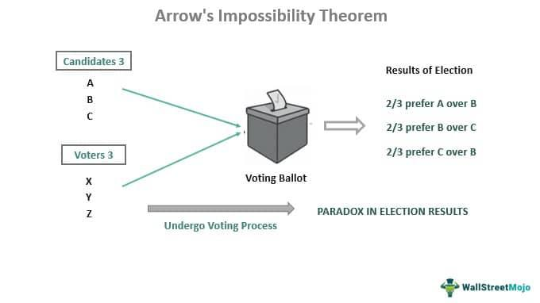

Arrow's Impossibility Theorem, formulated by the economist Kenneth J. Arrow, represents a pivotal insight in social choice theory, highlighting significant challenges in the design of ideal voting systems. The theorem asserts that when voters have three or more distinct options, no ranked voting system can successfully translate individual preferences into a community-wide ranking while satisfying a specific set of fairness criteria concurrently. Thus, it underscores a fundamental incompatibility, indicating that every voting system must compromise at least one of these criteria: nondictatorship, Pareto efficiency, independence of irrelevant alternatives, unrestricted domain, and social ordering. This revelation points to the inherent contradictions present in ranked voting systems, contributing to a broader understanding that the pursuit of a flawless voting process is inherently constrained.

Arrow's Theorem holds substantial implications beyond political science, permeating both economic and financial disciplines. In welfare economics, it complicates attempts to aggregate individual preferences into a single societal preference without infringing on fairness or efficiency. Similarly, in financial domains like algorithmic trading, the theorem's implications influence decision-making protocols that attempt to harmonize diverse and often conflicting market signals.



This article is structured to explore the multifaceted impacts of Arrow's theorem. It examines the challenges it poses to voting systems, assesses its role within social choice theory, and evaluates its influence on algorithmic trading practices. By investigating these areas, the article aims to provide a comprehensive understanding of Arrow's work and its continuing relevance in contemporary discussions on societal decision-making processes.

## Table of Contents

## What is Arrow's Impossibility Theorem?

Arrow's Impossibility Theorem, articulated by economist Kenneth J. Arrow, is a cornerstone result in social choice theory. It originates from Arrow's doctoral dissertation and was further elaborated upon in his seminal work, "Social Choice and Individual Values," published in 1951. The theorem addresses the fundamental problem of aggregating individual preferences into a coherent collective decision.

The theorem posits that no ranked voting system can perfectly translate the individual preferences of voters into a collective decision while satisfying a specific set of fairness criteria. Arrow outlined five key conditions for a fair voting system:

1. **Nondictatorship**: No single voter should possess the power to always determine the group's preferences.

2. **Pareto Efficiency**: If every individual prefers option X over option Y, then the group preference should reflect a preference for X over Y.

3. **Independence of Irrelevant Alternatives (IIA)**: The group preference between any two alternatives should depend only on the individual preferences between those two alternatives, uninfluenced by changes or the presence of other alternatives.

4. **Unrestricted Domain (Universal Admissibility)**: The voting system should accommodate any set of individual preferences.

5. **Social Ordering (Transitivity and Completeness)**: The collective preference should be both transitive and complete, ensuring a consistent ordering of preferences.

Arrow demonstrated that satisfying all these criteria simultaneously is theoretically impossible when there are three or more options to choose from. This leads to a paradox where any attempt to design a voting system that fulfills all the criteria will inevitably fail on at least one count. For example, a system that adheres to nondictatorship, Pareto efficiency, and IIA might fail to ensure social ordering due to cyclical preferences, where collective choices can loop in a non-transitive manner (i.e., A is preferred to B, B is preferred to C, but C is preferred to A).

The theorem raises profound implications about the limitations of collective decision-making processes. It suggests that any system hoping to convert individual preferences into a collective decision must compromise on at least one fairness criterion. This insight has profound implications not only for voting systems but also for various decision-making processes in economics and politics. The social paradox exposed by Arrow's Theorem emphasizes the complexities and potential conflicts present when attempting to aggregate diverse individual preferences into a collective outcome.

## Understanding the Theorem in Practice

Arrow's Impossibility Theorem is often exemplified through practical voting scenarios that highlight the inherent contradictions it identifies. A classic example involves three voters with cyclic preferences over three options, A, B, and C. Let's consider a scenario where voter 1 prefers A over B and B over C (A > B > C), voter 2 prefers B over C and C over A (B > C > A), and voter 3 prefers C over A and A over B (C > A > B). When attempting to aggregate these preferences into a collective decision, the group preference becomes cyclic: A is preferred over B, B over C, and C over A. This cycle demonstrates the paradox Arrow's theorem addresses, where no clear winner exists under ranked voting rules.

Arrow outlined four core criteria a fair voting system should meet:

1. **Nondictatorship**: No single voter should dictate the group's preference, ensuring a collective decision represents input from multiple members. If one person's preferences always prevail regardless of others, this criterion is violated.

2. **Pareto Efficiency**: If every voter prefers one option (e.g., A) over another (e.g., B), then the group's preference should reflect the same. Violation occurs if a less desirable option is chosen despite a unanimous preference.

3. **Independence of Irrelevant Alternatives (IIA)**: The group's preference between any two options should depend solely on individual rankings of those options, unaffected by third options. This criterion means the introduction or removal of irrelevant alternatives shouldn't change the outcome between A and B, for instance.

4. **Unrestricted Domain**: Any set of individual preference orders should be allowed, with the system capable of generating a collective preference order for all possible configurations.

Real-world voting systems often struggle to satisfy these criteria simultaneously. For instance, many democratic systems utilize ranked choice voting (RCV) or single transferable vote (STV) methods, which, while mitigating some issues, cannot entirely circumvent the impossibility outlined by Arrow. RCV can inadvertently violate IIA, as seen when a non-winning option is introduced that alters the preferred outcome despite not winning itself.

Practically, these apparent contradictions necessitate design compromises in electoral systems. Designers may prioritize some criteria over others based on the context. For example, preferential voting systems might sacrifice IIA to secure nondictatorship and Pareto efficiency.

Consideration of Arrow's criteria uncovers limitations inherent in collective decision-making mechanisms. No system can perfectly reflect individual preferences without occasionally contravening one of these fairness measures. Understanding these failures highlights the complex nature of developing universally fair voting processes and invites ongoing exploration of system refinements to better reconcile individual desires with collective choices.

## Social Choice Theory and Applications

Social choice theory provides a structured framework for analyzing collective decision-making processes by aggregating individual preferences into a coherent group decision. Arrow's Impossibility Theorem is a cornerstone of this theory, illustrating the inherent difficulties in designing voting systems that reflect individual preferences fairly and collectively. The relevance of social choice theory extends beyond theoretical concerns, influencing economic decision-making, policy formation, and the design of algorithms in various fields.

In economic decision-making, social choice theory helps address issues like resource allocation and public goods provision by analyzing how individual preferences can be combined to reflect communal welfare. The theory is used to evaluate different economic policies and their impact on society, considering equity and efficiency. For example, it helps in determining social welfare functions that aim to maximize collective good, a fundamental aspect of welfare economics.

Policy formation benefits from social choice theory by facilitating decision-making processes that require balancing conflicting interests. This is particularly evident in voting and election systems, where the theory guides the design of mechanisms that aim to fairly represent the populace's preferences. Although Arrow's theorem highlights the impossibility of perfect fairness, social choice theory informs the selection of the best possible voting system, often requiring trade-offs between fairness criteria.

In algorithmic development, principles from social choice theory are increasingly applied in computational settings. Algorithms designed for collective intelligence, crowd-sourcing, or recommendation systems often integrate social choice mechanisms to process diverse inputs and generate outputs that approximate collective preferences. For example, companies may use algorithms based on social choice to aggregate consumer preferences and deliver tailored recommendations.

Arrow's Impossibility Theorem has significant implications for social systems and welfare economics. It challenges the notion of designing a flawless voting system, prompting researchers and policymakers to focus on mitigating the limitations it exposes. In welfare economics, the theorem underscores the complexity of reconciling individual welfare with collective social welfare, informing debates on equity, policy design, and the distribution of resources.

Despite the constraints identified by Arrow, social choice theory remains a vital tool for understanding and improving decision-making processes in diverse fields. By highlighting the inevitable trade-offs, it promotes an awareness of the limitations of collective decision-making systems, encouraging the development of innovative solutions that better meet societal goals.

## Arrow's Theorem and Algorithmic Trading

Arrow's theorem, a central tenet in social choice theory, posits formidable challenges for [algorithmic trading](/wiki/algorithmic-trading) systems that aspire to synthesize disparate market signals or participant preferences into coherent trading strategies. Arrow's delineation that no voting system can simultaneously satisfy criteria such as nondictatorship, Pareto efficiency, and independence of irrelevant alternatives is mirrored in the complexities faced in algorithmic trading systems. These systems must process diverse and often conflicting market data, which can be conceptualized as a myriad of individual 'votes' or preferences on market conditions.

Algorithmic trading strategies that aim to aggregate a multitude of market signals must navigate Arrow's constraints. For instance, in attempting to maintain nondictatorship, no single market signal should dominate the decision process, a requirement that may lead to difficulties in constructing a reliable and balanced trading algorithm. This necessitates the implementation of robust methods to ensure that market signals are weighted appropriately, preventing any single input from monopolizing the trading strategy's decision-making process.

The principle of Pareto efficiency demands that any change in the trading strategy should make at least one market signal 'better off' without making another 'worse off'. This is particularly challenging in volatile markets where signals may be sporadically aligned or in direct conflict. Designing algorithms that can adapt to these dynamic scenarios requires sophisticated models capable of evaluating the potential Pareto improvements of various trading actions in real-time.

Independence of irrelevant alternatives further complicates algorithmic trading, as the entry or removal of certain market signals should not affect the relative standing of other signals and their influence on the trading decisions. Violations of this condition can lead to suboptimal trading outcomes, as extraneous data may inadvertently sway critical investment decisions.

A potential solution in addressing these challenges might involve employing machine-learning techniques, particularly those capable of executing multi-criteria decision-making tasks. For example, ensemble methods or neural networks could be used to aggregate signals in a manner that strives towards the ideal balance of Arrow's criteria. 

Python code exemplifying a simplistic approach to signal aggregation might take the following form:

```python
import numpy as np
from sklearn.ensemble import RandomForestClassifier

# Sample market signals data
market_data = np.array([[1.0, 0.8, 0.6],
                        [0.9, 0.7, 0.5],
                        [0.8, 0.6, 0.4]])

# Sample corresponding trading decisions
trading_decisions = np.array([1, 0, 1])  # 1 for buy, 0 for sell

# Random Forest model for aggregating signals
model = RandomForestClassifier(n_estimators=100)

# Train model
model.fit(market_data, trading_decisions)

# Predict based on new market signals
new_signals = np.array([[1.0, 0.7, 0.5]])
prediction = model.predict(new_signals)

print("Buy" if prediction[0] == 1 else "Sell")
```

This code uses a Random Forest model to attempt the aggregation of multiple market signals, reflecting a practical approach to addressing the complexities posed by Arrow's theorem. Such strategies, while not definitive solutions to Arrow's conditions, illustrate how algorithmic design can aim to find a tractable balance among conflicting inputs and strive for optimal decision-making in the trading context. 

In essence, Arrow's theorem underscores the intrinsic difficulties faced in algorithmic trading, pushing advancements in model complexity, real-time data processing, and adaptive learning methodologies to effectively harness and reconcile multitudinous market inputs.

## Examples in Economics and Politics

Arrow's Impossibility Theorem has profound implications for both economics and politics by highlighting the inherent challenges present in collective decision-making processes. One key area where the theorem is applied is in electoral systems, where ranked voting is utilized. In such systems, voters rank candidates in order of preference, and these rankings are used to determine the overall winner. However, Arrow's theorem demonstrates that no ranked voting system can consistently convert individual preferences into a collective decision without violating at least one of the conditions of nondictatorship, Pareto efficiency, the independence of irrelevant alternatives, unrestricted domain, and social ordering.

A well-documented example in politics is the "Paradox of Voting" or Condorcet Paradox. Consider an election where there are three candidates, A, B, and C, and three voters with the following preference orders:

- Voter 1: A > B > C
- Voter 2: B > C > A
- Voter 3: C > A > B

In this scenario, candidate A is preferred over candidate B by two voters (Voter 1 and Voter 3), candidate B is preferred over candidate C by two voters (Voter 1 and Voter 2), and candidate C is preferred over candidate A by two voters (Voter 2 and Voter 3). This results in a cycle with no clear winner: A > B, B > C, and C > A. Therefore, there is no candidate who can be considered the collective choice of all voters, showcasing the impossibility of meeting Arrow's criteria.

In economics, Arrow's theorem can be applied to market allocative strategies where different [agents](/wiki/agents) have varying preferences that need to be aggregated to make collective economic decisions. For example, in social welfare functions, the goal is to formulate a collective ranking of social states based on individual utility. Arrow's theorem suggests that achieving a fair aggregation of these utility functions into a single social welfare function is fraught with challenges, often leading to outcomes that are not Pareto efficient or are influenced by irrelevant alternatives.

Certain voting rules or economic discourses have been developed to navigate these constraints. The Borda count method, for instance, where each rank is assigned points, attempts to reduce the impact of cycles observed in the Condorcet Paradox but does not eliminate the issues entirely. Similarly, in economics, the Nash Bargaining Solution provides a framework for achieving collective decision-making under specific conditions, although it also makes some concessions on fairness criteria described by Arrow.

Despite the limitations identified by Arrow, these voting systems and economic strategies remain indispensable, necessitating ongoing research and adaptation. The continued exploration of alternative approaches and hybrid models is essential to addressing the paradoxes and ensuring fair and effective collective decision-making in both political and economic spheres.

## Conclusion

Arrow's Impossibility Theorem stands as a fundamental principle in social choice theory, indicating that no ranked voting system can convert individual preferences into a collective decision without violating essential fairness criteria. These criteria—nondictatorship, Pareto efficiency, independence of irrelevant alternatives, unrestricted domain, and social ordering—form a backbone for understanding the inherent complexities in designing fair voting systems and have profound implications across various disciplines.

The theorem's significance in economics, political science, and finance lies in its illustration of the limitations faced when attempting to aggregate individual preferences. For students and professionals, mastering its concepts is crucial for discerning how individual choices are translated into collective outcomes and understanding the underlying challenges. In economics, it affects welfare economics by highlighting the difficulties in achieving a societal welfare function that aligns with individual utilities. In political science, it reveals the imperfections in electoral systems and informs debates on voting reforms. In finance, particularly algorithmic trading, the theorem's principles challenge professionals to devise strategies that aggregate diverse market signals effectively while acknowledging the constraints of unbiased aggregation.

Looking forward, Arrow's work continues to inspire research in social choice theory and related fields. Future possibilities include the exploration of alternative voting systems that may better accommodate the fairness criteria, despite the theorem's constraints. Additionally, interdisciplinary approaches could provide new insights into how collective decision-making processes can be optimized in the context of modern technology. As the dialogue in social sciences and computational fields advances, Arrow's Theorem will undeniably remain a pivotal reference point for ongoing research and development, challenging scholars to refine and innovate mechanisms to approach collective decision-making problems.

## References & Further Reading

[1]: Arrow, K. J. (1951). ["Social Choice and Individual Values."](https://www.jstor.org/stable/j.ctt1nqb90) Yale University Press.

[2]: Sen, A. (1970). ["Collective Choice and Social Welfare."](https://www.hup.harvard.edu/books/9780674919211) Holden-Day.

[3]: Saari, D. G. (2001). ["Decisions and Elections: Explaining the Unexpected."](https://psycnet.apa.org/record/2002-00950-000) Cambridge University Press.

[4]: Maskin, E., & Sen, A. (2014). ["The Arrow Impossibility Theorem."](https://www.jstor.org/stable/10.7312/mask15328) Columbia University Press.

[5]: Rubinstein, A. (1998). ["Modeling Bounded Rationality."](https://arielrubinstein.tau.ac.il/br/br.pdf) MIT Press.