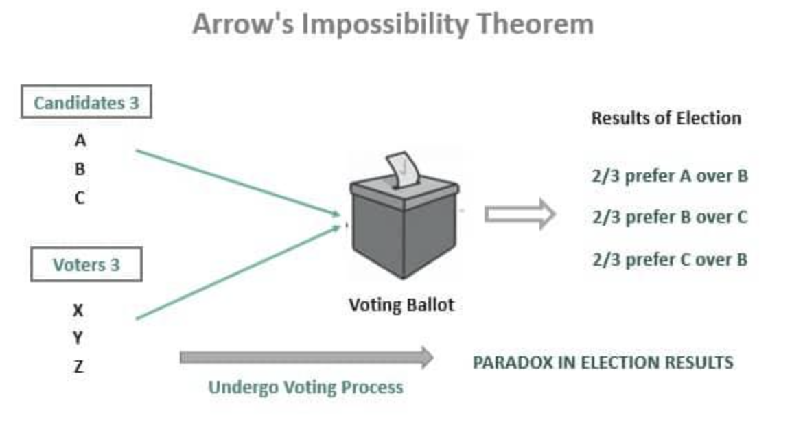

## Table of Contents

## What is Arrow's Impossibility Theorem?

Arrow's Impossibility Theorem is a concept in economics and social choice theory that says it's impossible to create a perfect voting system. It was developed by economist Kenneth Arrow in the 1950s. The theorem states that no voting system can meet all of these criteria at the same time: it must reflect the true preferences of voters, it must be fair and not favor any individual, and the result should not be affected by irrelevant choices.

In simple terms, if you have a group of people trying to choose between different options, you can't design a voting system that will always give a fair and accurate result. For example, if three friends are trying to pick a movie to watch, and each has a different favorite, the voting system might not pick the movie that most people actually prefer. This theorem shows the challenges of making decisions in a group and why it's hard to find a voting system that everyone agrees is fair.

## Who is Kenneth Arrow and why is he important in this context?

Kenneth Arrow was an American economist who won the Nobel Prize in Economics in 1972. He is famous for coming up with Arrow's Impossibility Theorem. This theorem is a big deal because it shows that it's really hard to make a voting system that is totally fair and works well for everyone. Arrow's work made people think a lot about how we make choices and vote in groups, like in elections or when a group of friends are trying to decide on something.

Arrow's theorem is important because it changed how economists and other people think about voting and decision-making. Before Arrow, many people thought that if you just set up the right voting rules, you could always get a fair result. But Arrow showed that no matter what rules you use, you can't avoid some problems. This idea has made people more aware of the challenges in creating fair voting systems and has influenced many other areas of study, like political science and social choice theory.

## What are the basic assumptions or axioms of Arrow's Impossibility Theorem?

Arrow's Impossibility Theorem rests on a few key assumptions or axioms that help explain why a perfect voting system is impossible. The first assumption is called "unrestricted domain." This means that voters should be able to rank all the options in any order they want. If people can't rank their choices freely, the voting system isn't fair. The second assumption is "non-dictatorship." This means that no single person should be able to decide the outcome for everyone else. A fair voting system shouldn't let one person have all the power.

The third assumption is "Pareto efficiency," which means if everyone prefers option A over option B, then the voting system should pick A over B. This seems like a simple and fair rule, but it's hard to follow without causing other problems. The last assumption is "independence of irrelevant alternatives." This means that adding or removing an option that nobody picks shouldn't change the result of the vote. For example, if people are voting on their favorite color and adding "purple" to the list shouldn't change whether "red" or "blue" wins if nobody picks purple. These assumptions together show that it's really tough to make a voting system that is fair and works well for everyone.

## Can you explain the concept of social welfare functions in relation to Arrow's theorem?

Social welfare functions are a way to combine everyone's preferences into one overall choice that represents what the whole group wants. They're like a recipe that takes in what each person likes and spits out a decision that's supposed to be good for everyone. In the context of Arrow's Impossibility Theorem, social welfare functions are important because they're what Arrow was trying to study and improve. He wanted to see if there was a way to make these functions work perfectly, so that the final choice would be fair and reflect what people really wanted.

But Arrow found out that it's impossible to create a social welfare function that meets all the important rules at the same time. These rules include making sure everyone can rank their choices freely, no one person can control the outcome, if everyone prefers one option over another then that should be the result, and adding or removing an option that nobody picks shouldn't change the result. Because of these findings, Arrow's theorem shows that no matter how you set up a social welfare function, you can't avoid some unfairness or problems. This has made people think a lot about how we make group decisions and vote.

## What does Arrow's theorem say about the possibility of a perfect voting system?

Arrow's theorem tells us that there's no such thing as a perfect voting system. It says that if you want a system where everyone can rank their choices freely, no one person can control the outcome, if everyone prefers one option over another then that should be the result, and adding or removing an option that nobody picks shouldn't change the result, you're out of luck. You can't have all these things at the same time.

This means that when groups of people, like in elections or just friends deciding what movie to watch, try to make a choice, the system they use will always have some problems. It might not pick the option that most people really want, or it might seem unfair to some people. Arrow's theorem helps us understand why making group decisions is so hard and why no voting system is perfect.

## How does Arrow's theorem impact real-world voting systems?

Arrow's theorem shows us that real-world voting systems will always have some problems. It tells us that no matter what kind of voting rules we use, like in elections or when a group of friends is deciding on something, we can't make everyone happy. The system might not pick the option that most people really want, or it might seem unfair to some people. This is because a perfect voting system that is totally fair and works well for everyone is impossible to create.

Because of Arrow's theorem, people who make voting systems have to think about what's most important to them. They might choose a system that tries to be as fair as possible, even if it's not perfect. For example, some countries use different voting methods, like first-past-the-post or ranked-choice voting, to try and make things work better. But no matter what they do, they can't avoid all the problems that Arrow's theorem points out. This helps us understand why voting can be complicated and why people sometimes argue about which system is best.

## What are some common examples used to illustrate Arrow's Impossibility Theorem?

One common example used to illustrate Arrow's Impossibility Theorem is the "voting paradox" or "Condorcet paradox." Imagine three friends, Alice, Bob, and Charlie, trying to choose a movie to watch. Alice prefers movie A over B and B over C. Bob prefers B over C and C over A. Charlie prefers C over A and A over B. If they vote on which movie is best, the result can change depending on how they vote. If they vote A vs. B, A wins. If they vote B vs. C, B wins. But if they vote C vs. A, C wins. This shows that even though everyone has clear preferences, the voting system can't pick a winner that everyone agrees on.

Another example is the "Borda count" method, which tries to solve the voting problem by giving points to each choice based on where it ranks in people's preferences. Imagine four friends voting on three ice cream flavors: chocolate, vanilla, and strawberry. The Borda count gives 2 points for first place, 1 point for second place, and 0 points for third place. If the friends rank the flavors differently, the Borda count might pick a winner, but it can still be unfair. For instance, if most people rank chocolate last but it still wins because of the points system, it shows that even a system that tries to be fair can end up with results that don't reflect what most people want. These examples help show why Arrow's theorem says a perfect voting system is impossible.

## How was Arrow's Impossibility Theorem received when it was first published?

When Kenneth Arrow first published his Impossibility Theorem in 1951, it shook up the world of economics and social choice theory. Many people were surprised because they thought that with the right rules, you could always make a fair voting system. Arrow's theorem showed that this wasn't true, and it made people rethink how they looked at voting and making group decisions. Some economists and scholars were skeptical at first, but over time, more and more people saw that Arrow was right.

The theorem started important conversations about what makes a voting system fair and how hard it is to create one. It led to a lot of new research and ideas about how to make better voting systems, even if they couldn't be perfect. Arrow's work became really important in fields like political science and social choice theory. It helped people understand the challenges of group decision-making and why different voting methods might work better in some situations than others.

## What are some criticisms or limitations of Arrow's Impossibility Theorem?

Some people think Arrow's Impossibility Theorem is too strict because it says a perfect voting system is impossible. They argue that the rules Arrow used, like making sure no one person can control the outcome and that adding or removing an option that nobody picks shouldn't change the result, might be too hard to follow in real life. These critics say that while Arrow's theorem is interesting, it might not be very useful for making real voting systems because it focuses on a perfect system that we can't have.

Another criticism is that Arrow's theorem doesn't consider how people might change their minds or learn new things during a vote. In real life, people might talk to each other and change their preferences. Arrow's theorem assumes that everyone's preferences stay the same, which isn't always true. Some people think that if we allow for this kind of change, we might be able to make better voting systems than Arrow's theorem suggests.

Despite these criticisms, Arrow's theorem is still really important. It helps us understand the challenges of making group decisions and why no voting system is perfect. Even though it has limitations, it has led to a lot of new ideas and research about how to make voting fairer and better.

## Are there any proposed solutions or alternatives to the issues raised by Arrow's theorem?

Some people have come up with different ideas to try and solve the problems that Arrow's theorem points out. One idea is to use a system called "approval voting," where people can vote for as many options as they want instead of ranking them. This can help make sure that the winner is the one most people like, even if they're not everyone's first choice. Another idea is "range voting," where people give scores to each option. This can show more about what people think and might lead to a fairer result.

Other people think that instead of trying to make a perfect voting system, we should focus on making systems that work well enough for different situations. For example, some countries use "ranked-choice voting," where people rank their choices and the least popular option gets dropped until a winner is found. This can help make sure that the winner has support from a lot of people. While these ideas can't solve all the problems Arrow's theorem talks about, they can make voting fairer and help us pick better options in real life.

## How has Arrow's theorem influenced economic theory and political science?

Arrow's theorem has had a big impact on economic theory because it made economists think differently about how groups make choices. Before Arrow, many economists thought that if you set up the right rules, you could always get a fair result. But Arrow showed that no matter what rules you use, you can't avoid some problems. This led to a lot of new research in economics, especially in the field called social choice theory. Economists started looking for ways to make better voting systems, even if they couldn't be perfect. Arrow's work also helped economists understand why markets and other ways of making decisions might not always work as well as we want them to.

In political science, Arrow's theorem has changed how people think about voting and elections. It showed that no voting system is perfect, which made political scientists more aware of the problems in different voting methods. This led to more studies on how to make elections fairer and how to pick leaders in a way that reflects what people really want. Arrow's theorem also made people think about how hard it is to make decisions in big groups, like countries or governments. It has influenced ideas about democracy and how to make sure everyone's voice is heard, even if it's not possible to make everyone happy.

## What advanced mathematical concepts are used in the proof of Arrow's Impossibility Theorem?

Arrow's Impossibility Theorem uses some fancy math ideas to show that a perfect voting system can't exist. One important concept is something called "ordinal preferences," which just means that people rank their choices in order from best to worst. Arrow's theorem looks at how these rankings can be put together to make a group decision. Another big idea is "social welfare functions," which are like recipes that take in everyone's rankings and spit out a final choice for the whole group. The proof uses these ideas to show that no matter what kind of social welfare function you use, you can't meet all the important rules at the same time.

The proof also uses something called "combinatorial mathematics" to look at all the possible ways people can rank their choices. This helps show that no matter how you set up the voting rules, you'll run into problems. Arrow's theorem also uses the idea of "logical deduction" to show that if you assume certain things about voting, like everyone being able to rank their choices freely and no one person controlling the outcome, you'll end up with a contradiction. This contradiction means that a perfect voting system is impossible. These math concepts help explain why making group decisions is so hard and why no voting system can be totally fair.

## References & Further Reading

[1]: Arrow, K. J. (1951). ["Social Choice and Individual Values."](https://www.jstor.org/stable/j.ctt1nqb90) Yale University Press.

[2]: Sen, A. (1970). ["Collective Choice and Social Welfare."](https://www.hup.harvard.edu/books/9780674919211) Holden-Day.

[3]: Saari, D. G. (2001). ["Decisions and Elections: Explaining the Unexpected."](https://psycnet.apa.org/record/2002-00950-000) Cambridge University Press.

[4]: Maskin, E., & Sen, A. (2014). ["The Arrow Impossibility Theorem."](https://www.jstor.org/stable/10.7312/mask15328) Columbia University Press.

[5]: Rubinstein, A. (1998). ["Modeling Bounded Rationality."](https://arielrubinstein.tau.ac.il/br/br.pdf) MIT Press.