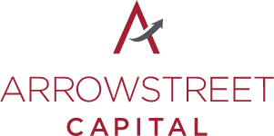

## Table of Contents

## What is Arrowstreet Capital?

Arrowstreet Capital is a big investment company based in Boston, Massachusetts. They manage a lot of money for other people and organizations, helping them invest in stocks, bonds, and other financial things. The company was started in 1999 by two people named Peter Rathjens and Bruce Clarke. They use computers and math to make decisions about where to invest money, which is called quantitative investing.

Arrowstreet Capital is known for being really good at what they do. They have grown a lot since they started and now manage over $100 billion. They work with clients all over the world, including big pension funds and other large investors. Their goal is to help these clients make more money by investing wisely.

## When was Arrowstreet Capital founded?

Arrowstreet Capital was founded in 1999. It was started by two people, Peter Rathjens and Bruce Clarke. They wanted to create a company that uses computers and math to help people invest their money better.

The company is based in Boston, Massachusetts. They manage a lot of money for big clients like pension funds. Arrowstreet Capital is known for being good at what they do and has grown to manage over $100 billion.

## Who are the founders of Arrowstreet Capital?

Arrowstreet Capital was started by Peter Rathjens and Bruce Clarke. They founded the company in 1999. Both founders wanted to use computers and math to help people invest their money in a smart way.

Peter Rathjens and Bruce Clarke set up the company in Boston, Massachusetts. They focused on managing money for big clients like pension funds. Their hard work paid off, and Arrowstreet Capital grew to manage over $100 billion, becoming well-known for being good at what they do.

## What is the primary focus of Arrowstreet Capital's investment strategy?

Arrowstreet Capital's main focus is on quantitative investing. This means they use computers and math to make choices about where to put money. They look at a lot of numbers and data to find the best places to invest. This helps them make smart decisions without being swayed by feelings or guesses.

The company works with big clients like pension funds to help them grow their money. They manage over $100 billion and are known for doing a good job. Arrowstreet Capital uses their special way of investing to try and make more money for their clients, focusing on stocks, bonds, and other financial things.

## How does Arrowstreet Capital use quantitative analysis in its investment approach?

Arrowstreet Capital uses quantitative analysis by looking at a lot of numbers and data to decide where to invest money. They use computers to help them find patterns and make smart choices. This way, they don't let feelings or guesses get in the way of their decisions. Instead, they rely on math and data to pick the best places to put money, like stocks and bonds.

This approach helps Arrowstreet Capital manage over $100 billion for big clients like pension funds. By using computers and math, they can look at a lot of information quickly and find good investment opportunities. Their goal is to help their clients make more money by investing wisely and without the risk of human error or emotion affecting their choices.

## What are the typical asset classes that Arrowstreet Capital invests in?

Arrowstreet Capital mainly invests in stocks and bonds. Stocks are pieces of ownership in companies, and bonds are like loans to companies or governments. They look at a lot of data to decide which stocks and bonds to buy. This helps them find the best places to put their clients' money.

They also invest in other types of assets, like real estate and commodities. Real estate can be things like buildings or land, and commodities can be things like gold or oil. By spreading their investments across different types of assets, Arrowstreet Capital tries to lower the risk and help their clients make more money.

## How has Arrowstreet Capital performed compared to market benchmarks?

Arrowstreet Capital has done really well compared to market benchmarks. They use computers and math to pick where to invest money, and this has helped them beat the market a lot of the time. For example, their main fund has often done better than the S&P 500, which is a big list of stocks that people use to see how the market is doing.

Their success comes from looking at a lot of data and finding patterns that other people might miss. This means they can make smart choices about which stocks and bonds to buy. Even though the market can go up and down, Arrowstreet Capital has been able to do better than many other investors by sticking to their special way of investing.

## What is the size of Arrowstreet Capital's assets under management?

Arrowstreet Capital manages over $100 billion in assets. This means they take care of a lot of money for their clients, like pension funds and other big investors. They use computers and math to decide where to put this money, which helps them make smart choices about investments.

Their focus on using numbers and data has helped them grow a lot since they started in 1999. By looking at a lot of information, Arrowstreet Capital finds good places to invest, like stocks and bonds. This has made them successful and trusted by many clients around the world.

## Can you describe a notable investment success story of Arrowstreet Capital?

One of Arrowstreet Capital's notable success stories is how they did really well during the 2008 financial crisis. While many investors lost a lot of money, Arrowstreet Capital managed to protect their clients' money and even make some gains. They did this by using their computers and math to find good investments even when the market was going down. Their focus on data and numbers helped them make smart choices and avoid big losses.

Another success story is how Arrowstreet Capital has consistently beaten the S&P 500 over the years. The S&P 500 is a big list of stocks that people use to see how the market is doing. Arrowstreet Capital's main fund has often done better than this list, which means they've made more money for their clients. By looking at a lot of data and finding patterns, they've been able to pick the best stocks and bonds to invest in, helping their clients grow their money even when the market is tough.

## How does Arrowstreet Capital manage risk in its portfolio?

Arrowstreet Capital manages risk in its portfolio by using a lot of data and computers to make smart choices. They look at many different numbers and patterns to understand what might happen in the future. This helps them decide where to put money in a way that lowers the chance of losing a lot. They also spread their investments across many different types of assets, like stocks, bonds, real estate, and commodities. By doing this, they make sure that if one type of investment goes down, the others might still do well, which helps protect their clients' money.

Another way Arrowstreet Capital manages risk is by always checking and changing their investments. They keep an eye on how their investments are doing and use their computers to see if they need to make any changes. If they see something that might be risky, they can quickly move their money to safer places. This careful watching and quick action help them keep their clients' money safe and growing, even when the market is up and down.

## What are the technological tools and platforms used by Arrowstreet Capital for trading and analysis?

Arrowstreet Capital uses a lot of computer programs and special software to help them trade and analyze data. They have big computers that can look at a lot of numbers very quickly. These computers help them find patterns and make smart choices about where to invest money. They also use special software that can keep track of what's happening in the market all the time. This helps them make quick decisions and buy or sell things at the right time.

Another important tool they use is something called a trading platform. This is like a computer program that lets them buy and sell stocks, bonds, and other things easily. The trading platform connects to the big computers and the special software, so everything works together smoothly. By using these tools, Arrowstreet Capital can manage a lot of money and make sure they are always making the best choices for their clients.

## What are the future growth strategies and market expansion plans of Arrowstreet Capital?

Arrowstreet Capital is always looking for ways to grow and reach more people. They want to keep using their computers and math to make smart choices about where to invest money. This means they might start working with even more big clients like pension funds from different countries. They also want to look at new types of investments, like new technology or green energy, to help their clients make more money.

To expand their market, Arrowstreet Capital plans to open new offices in other parts of the world. This will help them be closer to their clients and understand different markets better. They also want to keep improving their computer programs and software to make their investments even smarter. By doing these things, Arrowstreet Capital hopes to keep growing and helping more people around the world invest their money wisely.

## References & Further Reading

[1]: ["Advances in Financial Machine Learning"](https://www.amazon.com/Advances-Financial-Machine-Learning-Marcos/dp/1119482089) by Marcos Lopez de Prado

[2]: ["Evidence-Based Technical Analysis: Applying the Scientific Method and Statistical Inference to Trading Signals"](https://www.wiley.com/en-gb/Evidence+Based+Technical+Analysis:+Applying+the+Scientific+Method+and+Statistical+Inference+to+Trading+Signals-p-9780470008744) by David Aronson

[3]: ["Machine Learning for Algorithmic Trading"](https://www.amazon.com/Machine-Learning-Algorithmic-Trading-intelligence/dp/9918608013) by Stefan Jansen

[4]: ["Quantitative Trading: How to Build Your Own Algorithmic Trading Business"](https://www.amazon.com/Quantitative-Trading-Build-Algorithmic-Business/dp/0470284889) by Ernest P. Chan

[5]: Athey, S., & Imbens, G. (2019). ["Machine Learning Methods Economists Should Know About."](https://www.annualreviews.org/doi/10.1146/annurev-economics-080217-053433) Annual Review of Economics, 11(1), 685-725.

[6]: Campello, M., Graham, J. R., & Harvey, C. R. (2010). ["The Real Effects of Financial Constraints: Evidence from a Financial Crisis."](https://www.sciencedirect.com/science/article/abs/pii/S0304405X10000413) Journal of Financial Economics, 97(3), 470-487.