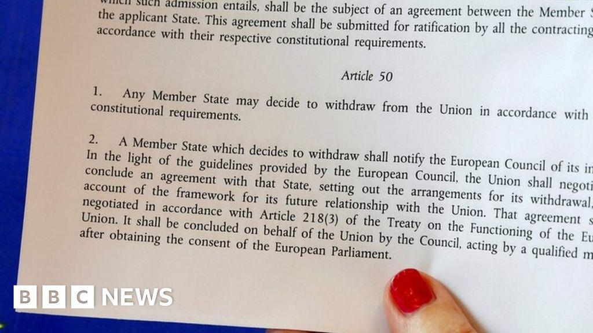

The UK's decision to leave the European Union, a move commonly referred to as Brexit, represents a transformative moment in European history. This decision was predicated on the invocation of Article 50 of the EU's Lisbon Treaty, a formal mechanism by which any member state can initiate its withdrawal from the European Union. Article 50 not only set the legal foundation for such a withdrawal but also established the framework within which the UK and the EU would negotiate new terms over a two-year period.

Amid these political and economic changes, the financial markets have witnessed significant fluctuations and uncertainty. This volatility is further compounded by the rising influence of algorithmic trading, a sophisticated form of automated trading that relies on complex algorithms to execute trades based on predetermined criteria. The intersection of Brexit and algorithmic trading poses substantial implications for financial markets, as traders and financial institutions navigate shifting landscapes and seek to manage risks associated with unforeseen geopolitical developments.



This article aims to shed light on this intersection, exploring the intricacies of Article 50 and its role in the Brexit process, while examining how algorithmic trading has emerged as a vital tool in managing market uncertainties. Understanding these elements offers insights into the broader dynamics at play in the global financial ecosystem during times of significant geopolitical change.

## Table of Contents

## Understanding Article 50

Article 50 of the Treaty on European Union, introduced by the Lisbon Treaty in 2009, is the legal procedure that allows a member state to withdraw from the European Union (EU). This provision comprises five short clauses outlining the exit mechanism to ensure an orderly departure, reflecting the EU's objective to maintain stability and unity even as a member state exits.

The activation of Article 50 occurs when a member state notifies the European Council of its intention to leave the Union. This notification sets off a maximum two-year negotiation period to arrange the departure terms, including future relations between the exiting state and the EU. If no agreement is reached within the two years, the departing state exits unilaterally unless the European Council, in unanimity with the member state in question, unanimously agrees to extend the period.

The United Kingdom (UK) became the first country to invoke Article 50 on March 29, 2017, marking a historical moment following a 2016 referendum where 51.9% of voters opted for Brexit. This decision initiated complex negotiations covering various critical aspects such as trade agreements, citizens’ rights, border controls, and financial settlements, aiming for a comprehensive exit deal that would minimize disruption.

Negotiations following the UK's invocation of Article 50 involved significant discussions around trade relations, particularly regarding access to the single market and customs union. Another critical area involved the rights of EU citizens residing in the UK and UK citizens living in EU countries, striving to maintain their legal status post-Brexit. Financial obligations were a further considerable challenge, including how much the UK was required to contribute to existing EU budgets—a figure often referred to as the "divorce bill."

Understanding Article 50's function provides insight into the strategic planning required for navigating a country's withdrawal from the EU. The process is inherently complex, balancing national interests with the EU's economic and political frameworks to achieve an orderly transition.

## Impacts of Brexit on the Financial Markets

Brexit has exerted profound effects on financial markets, primarily through heightened [volatility](/wiki/volatility-trading-strategies) and uncertainty. Following the 2016 referendum, financial markets have experienced considerable fluctuations, reflecting investor sentiment and the uncertainty surrounding the future economic relationship between the United Kingdom and the European Union. The pound sterling, for example, witnessed significant depreciation against major currencies immediately post-referendum, which underscored the market's response to geopolitical changes.

One of the primary concerns associated with Brexit is its impact on trade relations and investment flows. The UK's [exit](/wiki/exit-strategy) from the EU, traditionally its largest trading partner, necessitated the renegotiation of trade agreements. The potential imposition of tariffs and non-tariff barriers introduced uncertainties in cross-border trade, affecting supply chains and profit margins for companies involved in UK-EU trade. This uncertainty has prompted companies to reassess their investment strategies, often leading to a reallocation of resources to more stable trading environments.

Additionally, Brexit has prompted numerous financial institutions to reevaluate their operational strategies, given the potential for regulatory divergence between the UK and EU. The location of financial hubs is particularly impacted, with institutions considering relocating to retain access to the EU single market. Such potential shifts in investment hubs could lead to a realignment within the European financial landscape, affecting employment, capital allocation, and competitiveness of financial centers.

The regulatory framework is another critical area undergoing scrutiny due to Brexit. The divergence between UK and EU financial regulations can create compliance challenges and potential barriers to market entry. For instance, the UK’s autonomy over financial regulation post-Brexit might lead to deviations from previously harmonized standards, requiring businesses to adapt to a dual regulatory regime if they operate on both sides.

In summary, Brexit has introduced complexities to the financial markets by affecting trade dynamics, investment decisions, and regulatory considerations. These changes necessitate that market participants remain vigilant and adaptable to the evolving political and economic landscape.

## Algorithmic Trading: Concept and Influence

Algorithmic trading is a sophisticated method of executing trades that utilizes complex algorithms, which can rapidly process a vast array of market data to execute trades at speeds and frequencies beyond human capability. This technique is integral to modern financial markets, where timing and precision are paramount. The core principle of [algorithmic trading](/wiki/algorithmic-trading) is to leverage mathematical models and data analytics to identify optimal trading strategies, significantly minimizing the need for human intervention.

At the heart of algorithmic trading are intricate algorithmic models designed to assess various market parameters such as price, timing, and [volume](/wiki/volume-trading-strategy). These models siphon through historical and real-time data to discern patterns and make projections about price movements, enabling the execution of trades with minimal latency. For example, simple moving averages (SMA) and exponential moving averages (EMA) are commonly used in algorithms to analyze trends over certain time frames. The SMA is calculated using the formula:

$$
\text{SMA} = \frac{1}{n} \sum_{i=1}^{n} P_i
$$

where $n$ is the period over which the average is calculated, and $P_i$ is the price of the asset at each time interval.

Algorithmic trading also encompasses more advanced strategies, such as [arbitrage](/wiki/arbitrage)—a technique that exploits price differentials of the same asset across different markets. High-frequency trading ([HFT](/wiki/high-frequency-trading-strategies)), a subset of algorithmic trading, further amplifies these techniques by executing a large number of orders at extremely high speeds.

The use of algorithmic trading becomes particularly advantageous during volatile market conditions, such as those induced by significant geopolitical events like Brexit. Such events tend to introduce substantial uncertainty and [liquidity](/wiki/liquidity-risk-premium) challenges, yet algorithmic trading can manage these risks effectively by providing liquidity through consistent trading activity and enabling large volumes of transactions to be executed seamlessly. Algorithms can be fine-tuned to react to short-term price discrepancies and execute predictive analytics to anticipate market movements, ensuring that traders can both capitalize on opportunities and safeguard against potential losses.

Algorithmic trading systems are typically developed in programming languages like Python, known for its extensive libraries for data analysis and [machine learning](/wiki/machine-learning), such as NumPy and pandas. Here is a basic example of a Python script implementing a simple moving average crossover strategy:

```python
import pandas as pd

# Load market data
data = pd.read_csv('market_data.csv')

# Calculate moving averages
data['SMA_10'] = data['Close'].rolling(window=10).mean()
data['SMA_50'] = data['Close'].rolling(window=50).mean()

# Generate trading signals
data['Signal'] = 0
data['Signal'][10:] = np.where(data['SMA_10'][10:] > data['SMA_50'][10:], 1, 0)

# Identify buy/sell actions
data['Position'] = data['Signal'].diff()

# Print the resulting actions
print(data[['Date', 'Close', 'SMA_10', 'SMA_50', 'Position']])
```

In times of high volatility, algorithms driven by such models can make split-second decisions, processing vast amounts of data to maintain market equilibrium and manage the ensuing risks. Thus, the continuous evolution and refinement of algorithmic trading stand as a testament to its crucial role in contemporary finance, particularly during periods marked by economic transition and market instability.

## The Role of Algorithmic Trading During Brexit

Algorithmic trading was a crucial component in managing the tumultuous market conditions triggered by the Brexit process. The rapid reaction capabilities of algorithmic systems allowed traders to address the pervasive uncertainties and seize opportunities presented by fluctuating market prices. These algorithms, engineered to execute trades in milliseconds, are adept at handling high volumes of transactions with minimal latency, an advantage pivotal during periods of significant economic disruption.

During Brexit, markets experienced pronounced volatility due to political and economic uncertainties. This volatility was characterized by rapid price movements and shifts in investor sentiment, creating an environment that traditional, manual trading strategies could find challenging to navigate. Algorithmic trading systems, specifically designed to operate at high speeds with precision, could quickly analyze market data, identify emerging patterns, and execute trades based on pre-defined criteria. This automated process allowed traders to capitalize on short-term price discrepancies and optimize their risk exposure continuously.

The Brexit vote and subsequent Article 50 negotiations underscored the importance of algorithmic trading in maintaining market stability. Financial institutions leaned on these advanced trading systems to handle the surge in transaction volumes that marked the immediate aftermath of the vote, as well as the ongoing negotiations. Algorithms employed a variety of strategies, including [trend following](/wiki/trend-following), [statistical arbitrage](/wiki/statistical-arbitrage), and [market making](/wiki/market-making), each tailored to different market conditions and objectives.

For example, trend-following algorithms monitored market data for indication patterns that implied a consistent upward or downward trajectory, allowing traders to align with the prevailing market sentiment. Statistical arbitrage leveraged the historical correlation between assets, identifying discrepancies to generate profit. Market-making algorithms operated by providing liquidity, posting continuous buy and sell quotes to exploit the bid-ask spread, thus contributing to market depth and stability.

Furthermore, the high adaptability of algorithms meant that traders could quickly recalibrate their strategies in response to new information regarding Brexit proceedings or shifting market fundamentals. This flexibility is essential when geopolitical developments can introduce unexpected variables into the financial ecosystem. Consequently, algorithmic trading not only facilitated efficient and effective trading processes but also played a vital role in buffering the markets against the potential for destabilization during one of the most significant geopolitical events of the 21st century. 

Overall, the Brexit process illustrated the indispensable role of algorithmic trading in managing economic uncertainties and preserving market integrity, highlighting these systems' transformational impact on global financial markets.

## Case Studies of Algorithmic Trading in Post-Brexit Markets

Following the United Kingdom's decision to leave the European Union, financial institutions faced transformed economic conditions that necessitated strategic adaptations. Algorithmic trading, with its capability for rapid response and data-driven strategy, became a pivotal tool in responding to the challenges of the post-Brexit financial landscape.

Several case studies illustrate how large trading firms and hedge funds employed algorithmic trading strategies to adjust their portfolios and mitigate risks. For instance, a renowned [hedge fund](/wiki/hedge-fund-trading-strategies) utilized machine learning algorithms to analyze extensive datasets, allowing it to identify emerging trends and adjust its investment positions accordingly. This strategic use of data not only helped the fund to minimize exposure during volatile periods but also enabled it to exploit new investment opportunities that arose as market dynamics shifted in response to Brexit.

Another case study involves a major investment bank that integrated sentiment analysis algorithms to gauge market sentiment from news articles and social media posts. By quantifying market sentiment, the bank could enhance its risk management strategies, determining the optimal entry and exit points for trades. This approach provided a competitive edge, allowing the bank to better anticipate sharp market moves that often follow geopolitical announcements related to Brexit.

These examples highlight both the potential of algorithmic trading to manage volatility and the challenges of implementing such strategies. While the speed and efficiency of algorithms offer substantial advantages, the unpredictable nature of geopolitical changes poses risks that require ongoing monitoring and adjustments to algorithmic models. Market conditions that deviate from historical patterns can disrupt models based on prior data, emphasizing the need for constant refinement and validation.

Overall, the adaptation of algorithmic trading post-Brexit underscores its critical role in navigating complex geopolitical climates. As traders leverage technology to keep pace with rapid changes, they not only safeguard their investments but also uncover avenues for growth in an unpredictably evolving market.

## Conclusion

The Brexit process, initiated through Article 50 of the Lisbon Treaty, has significantly reshaped both the European and global financial landscapes. This transformative event has highlighted the critical role of innovative trading strategies, particularly algorithmic trading, in addressing the subsequent market volatility and economic realignments. As the UK's departure from the European Union introduced unprecedented levels of uncertainty, algorithmic trading emerged as a vital tool for navigating these complexities, allowing traders to respond swiftly and efficiently to fluctuating market conditions.

During periods of heightened market volatility and economic shifts, algorithmic trading provides a structured and reliable approach for managing uncertainties. By leveraging complex algorithms and data-driven models, traders can optimize decision-making processes and maintain liquidity even amidst rapidly evolving geopolitical scenarios. This capability becomes particularly crucial as financial institutions seek to adapt to the changing regulatory and economic landscapes influenced by Brexit.

Looking forward, the ongoing evolution of Brexit negotiations and advancements in trading technologies are poised to further influence the global financial environment. As markets continue to adjust to new realities, the reliance on algorithmic trading is expected to grow, underscoring the importance of adaptability and investment in advanced technological solutions. The interplay between shifting geopolitical dynamics and innovative trading methodologies will likely be pivotal in shaping future financial strategies, emphasizing the need for continuous development in algorithmic trading capabilities to sustain and enhance market stability.

## References & Further Reading

[1]: Barnard, C. (2017). ["Legal aspects of Brexit: Article 50 and the withdrawal agreement."](https://www.academia.edu/75333607/Brexit_and_Citizens_Rights) International & Comparative Law Quarterly, 66(4), 763–784.

[2]: Lopez de Prado, M. (2018). ["Advances in Financial Machine Learning."](https://www.amazon.com/Advances-Financial-Machine-Learning-Marcos/dp/1119482089) John Wiley & Sons.

[3]: Woolley, P., Vayanos, D., & Buffa, A. (2016). ["A Model of the Safe Asset Mechanism (SAM)."](https://www.fmg.ac.uk/sites/default/files/2020-08/DP747CurseoftheBenchmarks.pdf) National Bureau of Economic Research.

[4]: Hendershott, T., Jones, C. M., & Menkveld, A. J. (2011). ["Does Algorithmic Trading Improve Liquidity?"](https://onlinelibrary.wiley.com/doi/full/10.1111/j.1540-6261.2010.01624.x) The Review of Financial Studies, 24(2), 765-799.

[5]: Jansen, S. (2018). ["Machine Learning for Algorithmic Trading - Second Edition."](https://github.com/stefan-jansen/machine-learning-for-trading) Packt Publishing.

[6]: Chaboud, A. P., Chiquoine, B., Hjalmarsson, E., & Vega, C. (2014). ["Rise of the Machines: Algorithmic Trading in the Foreign Exchange Market."](https://www.jstor.org/stable/43612951) Journal of Finance, 69(5), 2045-2084.

[7]: Narang, R. K. (2009). ["Inside the Black Box: A Simple Guide to Quantitative and High Frequency Trading."](https://onlinelibrary.wiley.com/doi/book/10.1002/9781118267738) John Wiley & Sons.