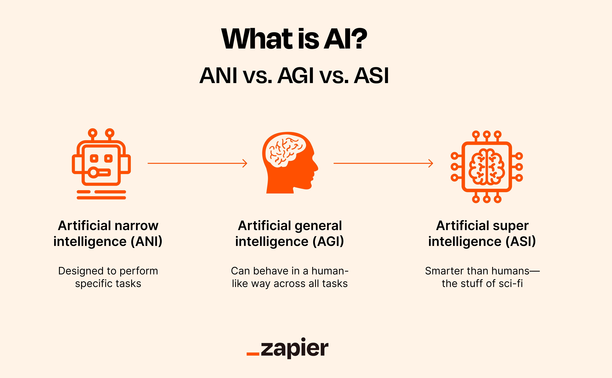

## Table of Contents

## What is Artificial General Intelligence (AGI)?

Artificial General Intelligence (AGI) is a type of artificial intelligence that can understand, learn, and apply knowledge across a wide range of tasks at a level similar to a human. Unlike current AI systems, which are good at specific tasks like playing chess or recognizing faces, AGI can handle new situations and learn from them just like a human would. This means AGI could potentially do any job that a human can do, from writing stories to driving cars, and even discovering new scientific theories.

The idea of AGI is exciting because it could lead to machines that can think and solve problems in a more flexible and creative way than today's AI. However, creating AGI is very challenging. Scientists and engineers are still trying to figure out how to make machines that can truly think and learn like humans. There are many debates about when, or if, AGI will be achieved, but many experts believe it could happen in the future, possibly within the next few decades.

## How does AGI differ from narrow or specialized AI?

AGI, or Artificial General Intelligence, is like a smart computer that can do many different things just like a human. It can learn new stuff, solve problems it hasn't seen before, and even come up with new ideas. On the other hand, narrow or specialized AI is good at just one thing. For example, a narrow AI might be really good at playing chess but can't do anything else, like cooking or writing a story.

The main difference between AGI and narrow AI is how they handle tasks. Narrow AI is trained to do a specific job and can't do much outside of that. It's like a tool with one purpose. AGI, however, can think and learn in a way that's more like a human. It can use what it knows to solve new problems and learn from new experiences. This makes AGI much more flexible and powerful, but also much harder to build.

## What are the key components of machine learning in AGI?

Machine learning is a big part of how AGI works. It helps AGI learn from data and get better at doing things over time. The key parts of [machine learning](/wiki/machine-learning) in AGI include algorithms that can learn from examples, like how a kid learns from seeing and doing things. These algorithms use lots of data to find patterns and make predictions or decisions. For example, an AGI might use machine learning to understand language by reading lots of [books](/wiki/algo-trading-books) and figuring out how words fit together.

Another important part is [reinforcement learning](/wiki/reinforcement-learning), which is like learning by trial and error. In this method, the AGI tries different things and gets feedback on what works well and what doesn't. Over time, it learns to do things better by choosing actions that lead to good results. This is similar to how people learn to ride a bike by falling off a few times before getting it right. Together, these machine learning techniques help AGI become smart and adaptable, able to handle new situations and learn from them just like a human would.

## Can you explain the role of neural networks in achieving AGI?

Neural networks play a big role in trying to achieve AGI because they are designed to work a bit like the human brain. They are made up of many connected units called neurons, which can learn from data by changing how they connect with each other. This ability to learn and adapt makes neural networks a key tool in building AGI. They can process lots of different types of information, like images, sounds, and text, and figure out how to recognize patterns and make decisions based on that information.

In the journey towards AGI, neural networks are used to create systems that can learn from experience and improve over time. For example, a [neural network](/wiki/neural-network) might start by recognizing simple shapes and then, with more training, learn to recognize complex objects like faces or animals. This learning process is similar to how humans learn, and it's what makes neural networks so important for AGI. By using many layers of neurons, called deep neural networks, these systems can handle very complex tasks and come closer to the kind of general intelligence that humans have.

## What are some current approaches to developing AGI through machine learning?

One current approach to developing AGI through machine learning is through reinforcement learning. This method involves an AI learning by trying different actions and getting feedback on what works well. It's like a kid learning to walk by taking steps and falling down a few times before figuring it out. In this approach, the AI tries to maximize a reward signal, which helps it learn what actions to take in different situations. Over time, the AI gets better at choosing the right actions and can handle more complex tasks. This approach has been successful in training AI to play games like Go and chess, but it's also being used to help AI learn more general skills that could lead to AGI.

Another approach is using [deep learning](/wiki/deep-learning), which involves neural networks with many layers. These deep neural networks can learn from huge amounts of data to recognize patterns and make decisions. For example, they can learn to recognize objects in pictures or understand human speech. Researchers are trying to make these networks more flexible and able to learn from fewer examples, which is more like how humans learn. By improving deep learning techniques, scientists hope to create AI that can understand and learn from the world in a more general way, which is a key step towards AGI.

A third approach is combining different AI techniques to create more powerful and flexible systems. This is called hybrid AI. For example, researchers might combine symbolic AI, which is good at reasoning and logic, with neural networks, which are good at learning from data. By using the strengths of different methods together, scientists hope to create AI that can think and learn in a more human-like way. This approach is still in the early stages, but it shows promise for building the kind of general intelligence needed for AGI.

## How does reinforcement learning contribute to AGI?

Reinforcement learning helps in building AGI by teaching AI to learn from its actions and improve over time. Imagine a kid learning to ride a bike. They might fall off a few times, but each time they learn a bit more about how to balance and pedal. In reinforcement learning, the AI tries different actions and gets a reward or a penalty based on how well it does. The goal is to maximize the reward, which helps the AI figure out the best way to do things. This method allows AI to learn complex tasks, like playing games or navigating a maze, by trial and error, just like humans do.

This approach is important for AGI because it allows the AI to handle new situations and learn from them. For example, an AI trained with reinforcement learning might start by learning to play a simple game and then move on to more complex games or even real-world tasks. By constantly trying new things and getting feedback, the AI can develop a broad set of skills and knowledge, much like how a human learns from experience. This ability to learn and adapt is a key part of what makes AGI different from narrow AI, and reinforcement learning is a powerful tool in making that happen.

## What challenges are faced in creating AGI using machine learning techniques?

Creating AGI using machine learning techniques faces several big challenges. One major problem is that current AI systems are good at specific tasks but struggle to handle new situations or learn from them like humans do. For example, an AI that's great at playing chess might not know how to drive a car or cook a meal. This is because these systems are trained on large amounts of data for one specific task, and they don't have the flexibility to apply what they've learned to new problems. To achieve AGI, we need AI that can learn and adapt in a more general way, which is much harder to do.

Another challenge is understanding how humans think and learn. Even though we use neural networks that are inspired by the human brain, we still don't fully understand how the brain works. This makes it difficult to build AI that can truly think and learn like a human. Scientists are working on better algorithms and ways to train AI, but there's still a lot we don't know. It's like trying to build a car without knowing how the engine works. We can make parts of it, but putting it all together into a working AGI is a huge challenge.

## Can you discuss any significant milestones or achievements in AGI research?

One big milestone in AGI research was when DeepMind's AlphaGo beat the world champion at the game Go in 2016. Go is a very complex game, and beating a human champion showed that AI could learn and think in ways that were getting closer to human intelligence. AlphaGo used reinforcement learning to get better at the game by playing against itself millions of times. This showed that AI could learn from experience and improve, which is a key part of AGI.

Another important achievement was the development of large language models like GPT-3 by OpenAI. These models can understand and generate human-like text, which is a step towards more general intelligence. They learn from huge amounts of text data and can answer questions, write stories, and even translate languages. While they are not AGI yet, they show how machine learning can help AI understand and use language in a more human-like way. These milestones are exciting because they show that we are making progress towards AGI, even if we are not there yet.

## What ethical considerations should be taken into account when developing AGI?

When developing AGI, it's important to think about the ethical issues that might come up. One big concern is how AGI could affect jobs. If AGI can do many things that people do now, lots of people might lose their jobs. This could cause big problems for society, so we need to think about how to help people find new jobs or learn new skills. Another ethical issue is fairness. AGI systems need to treat everyone the same and not be biased against certain groups of people. If the data used to train AGI is biased, the AGI might make unfair decisions. So, it's important to use fair and diverse data when building AGI.

Another important ethical consideration is safety. AGI that is very smart could be dangerous if it's not controlled properly. We need to make sure that AGI follows rules and doesn't harm people or the environment. This means building safety features into AGI from the start. Also, we need to think about who gets to use AGI and who makes the decisions about how it's used. If only a few people or companies control AGI, it could lead to more inequality. So, we need to make sure that the benefits of AGI are shared fairly with everyone.

## How might AGI impact society and various industries?

AGI could change many parts of our lives and work. In healthcare, AGI might help doctors by quickly looking at medical data to find the best treatments for patients. In schools, AGI could be like a smart tutor that helps students learn at their own pace. For businesses, AGI could do tasks like managing money or making plans, which could save time and money. But, AGI might also take away jobs from people who do these tasks now. This could be hard for society, as many people might need to learn new skills or find different jobs.

In other areas, AGI could make big changes too. In transportation, AGI could drive cars and trucks, making travel safer and more efficient. In science, AGI could help with research, like finding new ways to make energy or cure diseases. But, there are worries about how AGI might be used. If only a few people or companies have AGI, it could make inequality worse. Also, if AGI becomes very smart, it's important to make sure it follows rules and doesn't harm people or the environment. So, while AGI has the potential to do a lot of good, we need to think carefully about how to use it in a way that helps everyone.

## What are the predictions for the timeline of achieving true AGI?

Experts have different ideas about when we might see true AGI. Some think it could happen in the next few decades, maybe by the 2030s or 2040s. They believe that as we keep improving machine learning and other AI technologies, we'll get closer to building machines that can think and learn like humans. Others are more cautious and think it might take longer, maybe even a century or more. They say that AGI is a really hard problem and we still have a lot to figure out about how the human brain works and how to make machines that can do the same things.

The truth is, no one knows for sure when or if we'll achieve AGI. It depends on how fast technology improves and how well we can solve the big challenges in AI research. But one thing is clear: if we do reach AGI, it will change the world in big ways. So, it's important for scientists, engineers, and everyone else to keep working together to make sure that AGI, if it happens, is used in a way that helps everyone.

## What are some leading theories or models proposed for AGI development?

One leading theory for AGI development is the idea of building a cognitive architecture. This is like a blueprint for how an AI system should think and learn. Scientists think that by copying how the human mind works, we can create AI that can handle many different tasks. A famous example of this is the SOAR architecture, which tries to model human problem-solving and learning. The idea is to make AI that can learn from experience, remember what it has learned, and use that knowledge to solve new problems. This approach aims to make AI more flexible and human-like in its thinking.

Another model is the concept of neurosymbolic AI. This combines the strengths of neural networks, which are good at learning from data, with symbolic AI, which is good at reasoning and logic. The idea is to create AI that can both learn from examples and think logically about what it has learned. By putting these two methods together, scientists hope to build AI that can understand the world in a more complete way. This could help AGI understand and solve complex problems that need both learning and reasoning, like understanding language or making plans.

A third approach is the use of hierarchical reinforcement learning. This method teaches AI to break down complex tasks into smaller, simpler steps. Imagine learning to cook a big meal. You might first learn how to chop vegetables, then how to cook them, and finally how to put everything together. In hierarchical reinforcement learning, the AI learns these smaller steps and then figures out how to combine them to do bigger tasks. This could help AGI learn to handle a wide range of tasks by building up from simple skills to more complex ones.