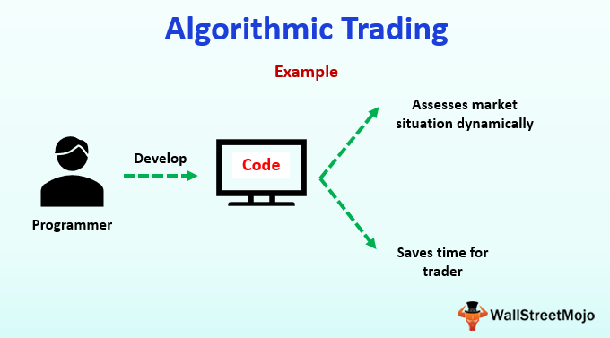

## Table of Contents

## What is artificial intelligence in the context of trading?

Artificial intelligence (AI) in trading refers to using computers and smart programs to help make decisions about buying and selling stocks, currencies, or other financial products. These AI systems can look at huge amounts of data very quickly, much faster than a human could. They use this data to find patterns and make predictions about what might happen in the market next. This can help traders make better choices and possibly make more money.

AI in trading is not just about speed and data analysis. It also involves machine learning, which means the computer programs can learn from past trades and improve over time. For example, if an AI system notices that certain events often lead to a drop in stock prices, it can start to predict these drops more accurately in the future. This learning ability makes AI a powerful tool for traders, as it can adapt to new information and changing market conditions.

## How do AI trading strategies differ from traditional trading methods?

AI trading strategies and traditional trading methods differ in how they process information and make decisions. Traditional trading often relies on human analysis, where traders look at charts, news, and other data to decide when to buy or sell. This can be time-consuming and limited by how much data a person can handle at once. On the other hand, AI trading uses computers to analyze vast amounts of data quickly. AI can spot patterns and trends that might be too complex or subtle for a human to see, leading to potentially more informed trading decisions.

Another key difference is how AI can learn and adapt over time. Traditional methods depend a lot on the trader's experience and gut feelings, which don't change much over short periods. AI, however, can use machine learning to get better at predicting market movements. As it processes more data and sees more market conditions, it can adjust its strategies to become more accurate. This ability to evolve makes AI trading more dynamic compared to the more static nature of traditional methods, which might not adapt as quickly to new market trends or data.

## What are the basic components of an AI trading system?

The basic components of an AI trading system include data collection, data processing, and decision-making algorithms. Data collection involves gathering information from various sources like stock prices, economic reports, and news articles. This data is then fed into the system where it's processed and analyzed to find patterns and trends. The AI uses machine learning to look at this data and learn from it, getting better at predicting what the market might do next.

The decision-making part of an AI trading system uses the insights gained from the data to decide when to buy or sell. This is done by algorithms that can execute trades automatically based on the predictions made by the AI. These algorithms need to be carefully designed to make sure they follow the trading strategy and can adjust to new market conditions. Together, these components help the AI trading system work efficiently and effectively in the fast-paced world of trading.

## Can you explain the concept of machine learning in AI trading?

Machine learning in AI trading is about using computers to learn from past trades and market data. Instead of being told exactly what to do, the computer looks at lots of information and figures out patterns on its own. For example, if certain news usually makes stock prices go up, the machine can start to predict that this might happen again. This learning helps the AI get better at making decisions over time without needing people to change its rules.

The key part of machine learning in trading is that it can adapt to new situations. Markets change all the time, and what worked yesterday might not work today. With machine learning, the AI can see these changes and adjust its strategies. It's like the computer is always studying and getting smarter, which can help traders make better choices and possibly earn more money.

## What types of AI trading strategies are most commonly used by beginners?

Beginners in AI trading often start with simple trend-following strategies. These strategies use AI to look at past price movements and predict if a stock or other asset will keep going up or down. For example, if a stock has been going up for a while, the AI might suggest buying it, hoping the trend will continue. This type of strategy is easy to understand and can be a good way for beginners to get used to how AI works in trading.

Another common strategy for beginners is using AI for basic sentiment analysis. This involves the AI looking at news articles, social media posts, and other sources to see if people feel good or bad about a certain stock. If the AI sees a lot of positive comments, it might suggest buying the stock, thinking that positive sentiment could push the price up. This strategy helps beginners understand how public opinion can affect the market, and it's relatively simple to follow.

Some beginners also try out AI-based momentum strategies. These strategies focus on stocks that are moving a lot, either up or down. The AI looks for stocks that have strong recent performance and suggests buying them, hoping the momentum will keep going. This can be exciting for beginners because it involves quick decisions and can lead to fast gains, though it also comes with more risk.

## What are the benefits of using AI technology in algorithmic trading?

AI technology has notably transformed algorithmic trading by offering several significant benefits that enhance trading operations. 

**Increased Efficiency:** The utilization of AI in algorithmic trading has vastly improved how data is processed and decisions are made. AI algorithms are designed to parse large volumes of complex data at high speeds, enabling swift trade executions that were not possible manually. These algorithms evaluate market conditions and execute trades instantaneously, thereby increasing the overall efficiency of trading operations.

**Accuracy:** One of the most compelling advantages of AI is its ability to minimize human error. Traditional trading strategies can be influenced by emotional and psychological factors, but AI algorithms rely purely on data-driven insights. This reliance on factual information helps in developing unbiased trading strategies with enhanced accuracy. Machine learning models, for example, can predict market trends by analyzing historical data, thus guiding traders with precise trading signals.

**Scalability:** AI algorithms provide unparalleled scalability in managing and analyzing data from multiple markets simultaneously. The sophisticated architecture of AI systems supports the processing and interpretation of vast datasets across different markets, optimizing trades efficiently. This scalability ensures that traders are better equipped with comprehensive market insights and can adequately adjust their trading strategies based on a broader data spectrum.

**Real-Time Adaptation:** AI technologies excel in adapting to new data dynamically, sharpening their predictive capabilities continually. Continuous learning mechanisms in AI allow algorithms to adjust their models based on the latest market information. As market conditions evolve, AI systems refine their predictions and strategies without needing manual intervention. This adaptability ensures that the trading strategies remain relevant and robust in fluctuating market scenarios.

## How does data analysis contribute to AI trading strategies?

Data analysis is a big part of AI trading strategies. It helps the computer understand what's happening in the market by looking at lots of information. This information can be things like stock prices, news articles, and even what people are saying on social media. The AI uses this data to find patterns and trends that might be hard for a person to see. By figuring out these patterns, the AI can make better guesses about what might happen next in the market.

The more data the AI can look at, the better it can do its job. It's like the AI is always studying and learning from the past. For example, if the AI sees that certain news often makes stock prices go up, it can start to predict that this might happen again. This helps the AI decide when to buy or sell stocks. By using data analysis, the AI can make smarter choices and help traders make more money.

## What are the risks associated with using AI in trading?

Using AI in trading can be risky because the computer might make wrong predictions. Even though AI can look at a lot of data very fast, it can still miss important things or get confused by sudden changes in the market. If the AI makes a bad guess, it could lead to losing money. Also, AI systems need a lot of data to work well, and if the data is not good or is missing important information, the AI might make bad decisions.

Another risk is that AI can sometimes make the market move in unexpected ways. If a lot of people are using the same AI strategies, they might all decide to buy or sell at the same time, which can cause big swings in prices. This can be hard to predict and can lead to losses. Plus, AI systems can be expensive to set up and keep running, so there's a risk that the costs might be more than the money made from trading.

## How can AI improve the accuracy of trading predictions?

AI can make trading predictions more accurate by looking at a lot of data very quickly. It can find patterns and trends that people might miss. For example, AI can look at past stock prices, news, and even what people are saying on social media to see if there are signs that a stock might go up or down. By understanding these patterns, AI can make better guesses about what might happen next in the market.

Another way AI improves prediction accuracy is by learning from past trades. As it sees more data and more market conditions, AI gets better at figuring out what works and what doesn't. This means that over time, the AI can adjust its strategies to be more accurate. It's like the AI is always studying and getting smarter, which helps it make better predictions and help traders make more money.

## What advanced AI techniques are used in expert trading strategies?

Expert traders use advanced AI techniques like deep learning and reinforcement learning to make their trading strategies better. Deep learning is a way for the computer to look at lots of data and find very complex patterns. It's like the AI is trying to understand the market in a deep way, not just looking at simple trends. By using deep learning, the AI can see things that might be too hard for a person to notice, which can help make more accurate predictions about what the market will do next.

Another advanced technique is reinforcement learning, where the AI learns by trying different things and seeing what works best. It's like the AI is playing a game where it gets points for making good trades and loses points for bad ones. Over time, the AI figures out the best ways to trade by learning from its successes and failures. This helps the AI adapt to new market conditions and keep improving its strategies, which can lead to better trading results for experts.

## How do regulatory frameworks impact AI trading?

Regulatory frameworks can have a big impact on AI trading. They set rules that traders and AI systems have to follow. For example, some rules might say how much risk you can take or what kind of data you can use. If an AI system doesn't follow these rules, it could get in trouble or be stopped from trading. This means that people who make AI trading systems need to make sure they understand and follow all the rules in the places where they trade.

These rules can also change how AI trading works. For instance, some countries might have strict rules about using certain kinds of data, like personal information from social media. This can limit what data the AI can use to make predictions. Also, if the rules change, the AI system might need to be updated to follow the new rules. This can be a lot of work and might slow down how fast the AI can improve and adapt to the market.

## What are the ethical considerations when using AI for trading?

Using AI for trading brings up some important ethical questions. One big issue is fairness. AI systems can look at a lot of data very quickly, which can give some traders an advantage over others. This might not seem fair, especially if smaller traders can't afford the same kind of technology. Also, if a lot of people use the same AI strategies, it could make the market move in ways that hurt some people more than others.

Another ethical concern is about privacy and data use. AI systems need a lot of data to work well, and some of this data might be about people's personal lives. Using this data without permission can be wrong. It's important for AI traders to think about where their data comes from and make sure they are not breaking any rules or hurting anyone's privacy. This helps keep trading honest and fair for everyone involved.

## How can one evaluate the performance of an AI trading strategy?

Evaluating the performance of an AI trading strategy involves looking at how well it makes money and how it handles risk. You can start by checking the returns, which is how much money the strategy makes over time. It's important to compare these returns to what you might get from simpler investments, like a savings account or a basic stock index. Also, look at the risk, which is how much the strategy's value can go up and down. A good AI trading strategy should make more money than it loses, and it should do this without taking too much risk.

Another way to evaluate an AI trading strategy is by using backtesting. This means running the strategy on past market data to see how it would have done if it was used back then. Backtesting can show you if the strategy works well over different market conditions. But remember, past results don't always mean the strategy will do the same in the future. So, it's also good to keep an eye on the strategy as it trades in real time, making sure it still works well and adjusting it if needed.

## References & Further Reading

[1]: Bergstra, J., Bardenet, R., Bengio, Y., & Kégl, B. (2011). ["Algorithms for Hyper-Parameter Optimization."](https://papers.nips.cc/paper/4443-algorithms-for-hyper-parameter-optimization) Advances in Neural Information Processing Systems 24.

[2]: Lopez de Prado, M. (2018). ["Advances in Financial Machine Learning."](https://www.amazon.com/Advances-Financial-Machine-Learning-Marcos/dp/1119482089) Wiley.

[3]: Aronson, D. (2011). ["Evidence-Based Technical Analysis: Applying the Scientific Method and Statistical Inference to Trading Signals."](https://www.wiley.com/en-us/Evidence+Based+Technical+Analysis%3A+Applying+the+Scientific+Method+and+Statistical+Inference+to+Trading+Signals-p-9780470008744) Wiley.

[4]: Jansen, S. (2020). ["Machine Learning for Algorithmic Trading."](https://github.com/stefan-jansen/machine-learning-for-trading) Packt Publishing.

[5]: Chan, E. P. (2008). ["Quantitative Trading: How to Build Your Own Algorithmic Trading Business."](https://github.com/ftvision/quant_trading_echan_book) Wiley.