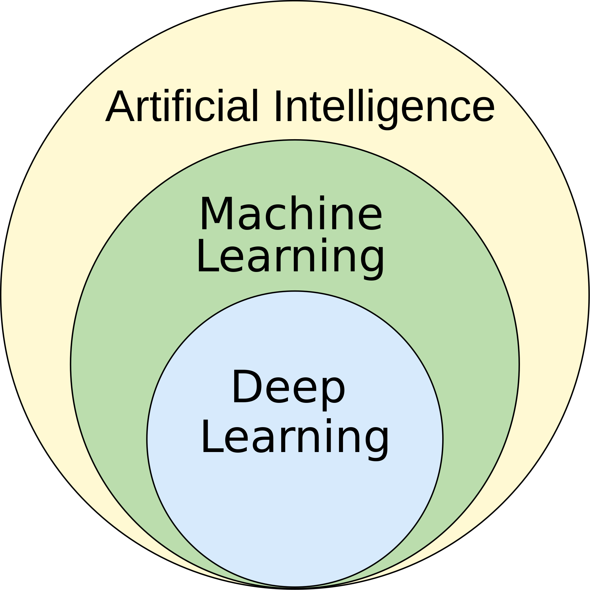
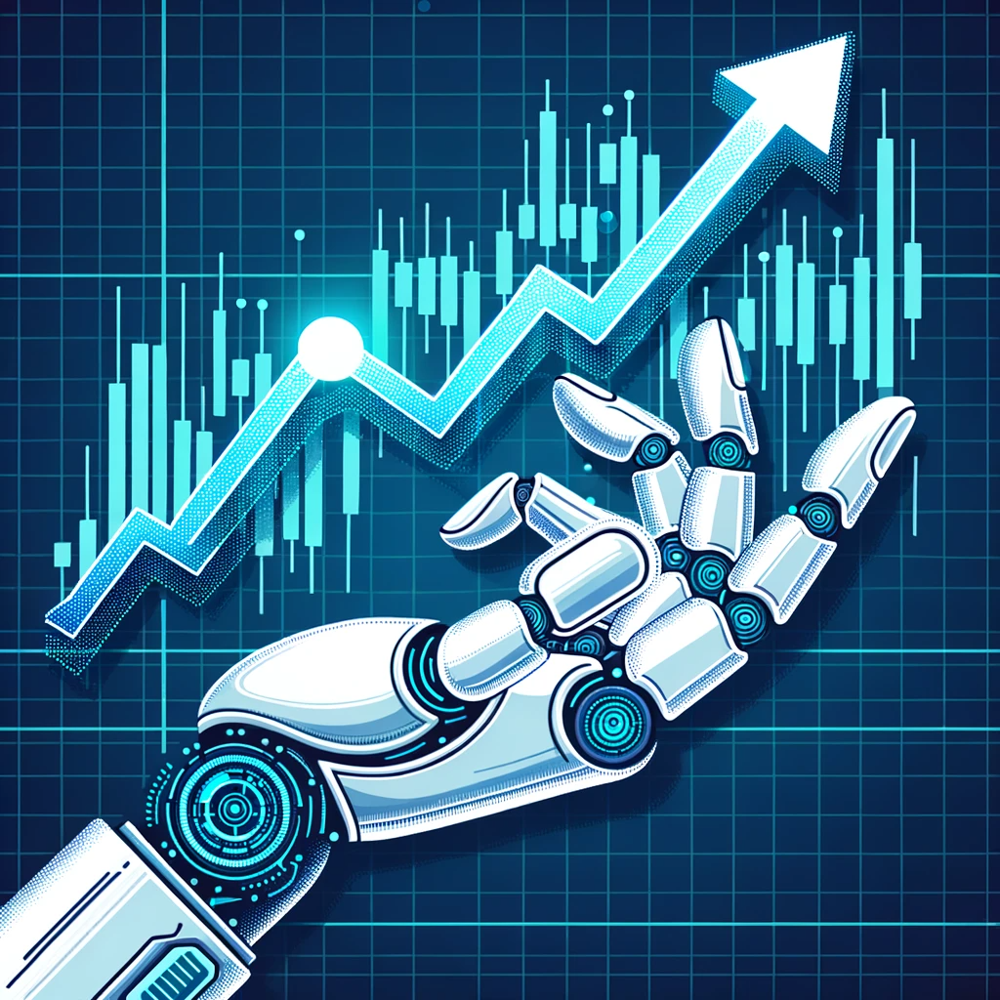
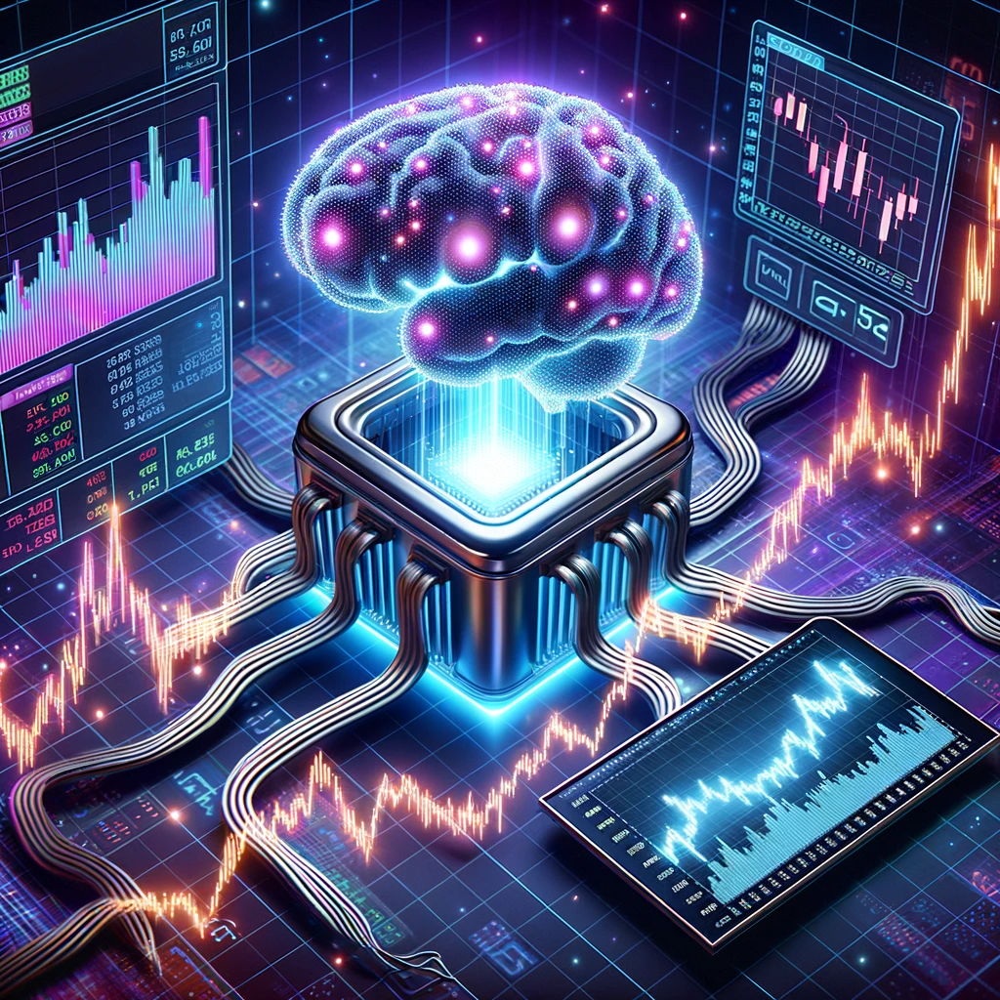

Trading, once the domain of humans shouting orders across bustling exchange floors, has evolved considerably in the face of technological advancements. Since the onset of electronic trading in the 1970s, we have witnessed a gradual shift from human-driven to increasingly automated trading systems. In recent decades, Artificial Intelligence (AI) has embedded itself within the trading landscape, offering advancements that seemed unimaginable just a few years ago. From enabling high-frequency trading (HFT) to deciphering market sentiments through advanced analytics, AI has reshaped trading practices by introducing mechanisms that can learn from data and make informed decisions autonomously.

While AI has amplified trading strategies with capabilities such as recognizing patterns and making split-second trading decisions, it also brings along a spectrum of risks and ethical considerations. Algorithm-driven trades have sparked debates around fairness and systemic risks, and instances like the Flash Crash of 2010 serve as a stark reminder of the perils associated with relying heavily on automated systems. Moreover, the AI models, shrouded in their complexity, often operate as "black boxes," making it crucial for stakeholders to comprehend the limitations and capabilities of AI in a trading context.

Within this guide, we shall navigate through the multifaceted world of AI in trading, exploring its mechanics, applications, and intricacies. From dissecting algorithms that power trading strategies to exploring the ethical implications of AI-driven trading decisions, the article aims to provide a comprehensive view of AI’s role and future in the trading arena.

## Table of Contents

## Demystifying AI in Trading

### Defining AI Trading

AI trading, often referred to as algorithmic or automated trading, is the process where computer programs are leveraged to make trading decisions based on a set of criteria derived from historical data. These criteria can range from simple moving average crossovers to intricate neural networks and deep learning models. It's not about replacing the human trader but enhancing their capabilities, offering real-time data analysis at a scale and speed beyond human potential.

At the heart of AI trading is the ability of machines to process vast amounts of data, recognize patterns, and execute trades based on predictions derived from this data. To visualize the operational framework:

1. **Data Collection:** AI systems ingest massive datasets from diverse sources - stock prices, news, social media, and even meteorological data, to name a few.
2. **Data Processing and Analysis:** Algorithms dissect this data to identify historical patterns or trends. Machine learning models, especially, adapt and refine their strategies based on the continuous influx of new data.
3. **Strategy Formulation:** Based on the analyzed data, AI determines the most probable market movement and devises trading strategies. For example, if a specific stock price pattern has been identified 90% of the time before a significant rise, the AI might prepare to buy that stock when it recognizes that pattern again.
4. **Trade Execution:** Once a specific set of conditions are met, the AI system autonomously executes trades, be it buying or selling, without human intervention. This execution can happen in milliseconds, advantageous especially in high-frequency trading where speed is paramount.
5. **Feedback Loop:** Post-trade, the AI evaluates the outcome. If the trade was profitable based on the strategy, the model reinforces those patterns. If not, the model adjusts, learning from the misjudgment.

However, it's crucial to understand that AI trading doesn't guarantee success. It thrives on probability and historical data. Market anomalies or unprecedented events (e.g., sudden geopolitical disturbances) can disrupt even the most sophisticated AI model. Moreover, the underlying algorithms are developed by humans, introducing potential biases or errors that can inadvertently affect trading decisions[1].

### Operational Mechanism of AI Trading

AI trading leverages cutting-edge technologies and sophisticated algorithms to analyze data and execute trades, offering a faster and more efficient alternative to traditional human-based trading. To truly appreciate the depth of its capabilities, we must examine the technologies and algorithms that stand as its backbone.

1. **Data Ingestion and Processing:** Before any analysis can occur, AI systems need to ingest vast amounts of data. These can range from traditional financial datasets like stock prices and company financial reports to unstructured data like news articles, tweets, or even satellite imagery. Modern big data technologies, such as Apache Kafka or Apache Hadoop[2], play pivotal roles in efficiently managing this massive influx of information.
2. **Machine Learning (ML) Models:** Once data is collected, AI employs ML algorithms to detect patterns and derive insights. For instance, a regression algorithm might predict a stock's future price, while classification algorithms can predict whether a stock price will go up or down. Deep learning, a subset of ML, can further refine these predictions by processing data through artificial neural networks, which can capture intricate patterns and relationships[3].
3. **Natural Language Processing (NLP):** In today's digital age, real-time events, news, and social media can dramatically impact markets. NLP algorithms analyze textual data, extracting sentiment and relevant financial indicators. For example, an NLP system might scan financial news to detect positive or negative sentiments concerning a company, using this sentiment as a factor in trading decisions[4].
4. **Reinforcement Learning (RL):** Unlike traditional ML models, RL models learn by interacting with their environment and receiving feedback. In trading, an RL agent can learn optimal trading strategies by placing trades and receiving rewards (or penalties) based on the financial outcome[5].
5. **Time Series Analysis:** Given that trading revolves around historical data, time series analysis is paramount. Techniques like ARIMA or Prophet enable AI models to predict future data points based on past sequences, crucial for forecasting stock prices[6].
6. **High-Frequency Trading (HFT) Algorithms:** These are specialized algorithms designed to make a large number of trades in milliseconds. By leveraging AI's speed and decision-making capabilities, HFT strategies capitalize on minute price differences that might exist in different exchanges or between different assets.
7. **Evolutionary Algorithms:** These algorithms, inspired by the process of natural selection, are used to optimize trading strategies. They start with a diverse set of trading strategies, test them in the market, and iterate by merging the most successful ones, gradually evolving towards an optimal solution[7].

The operational mechanism of AI in trading is a fusion of technological prowess and advanced mathematical algorithms. By harnessing the power of data, AI not only brings speed and scalability to the trading floor but also a precision level previously thought unreachable by human traders alone.

### Evolution and Impact of AI on Trading

The transformative journey of AI in the trading sphere begins in the late 20th century, subtly altering the industry's mechanisms with technological advancements and strategic nuances. The late 1970s and early 1980s witnessed the inception of algorithmic trading, setting a fundamental baseline for future developments in AI trading[8].

Subsequently, the late 1980s brought the application of more advanced mathematical models to predict price changes and trade automatically in response to market changes. Machine learning, particularly reinforcement learning, began to be applied to trading decisions during the 1990s, allowing algorithms to learn from data without being explicitly programmed[9].

The 2000s heralded a new era, marking the robust entry of Artificial Neural Networks (ANNs) and Deep Learning into financial trading systems. These technologies facilitated the process of analyzing vast amounts of data and predicting market trends with heightened accuracy. During this era, high-frequency trading (HFT), utilizing complex algorithms to execute thousands of trades at lightning speeds, became a prominent strategy among hedge funds and institutional traders.

In 2010, the infamous Flash Crash, where the Dow Jones dropped over 1000 points within minutes and recovered shortly after, brought HFT and algorithmic trading under scrutiny, spotlighting the potential risks and regulatory gaps in unchecked automated trading systems[10].

The mid-2010s marked a pronounced emphasis on the inclusion of unstructured data, such as news, tweets, and financial reports, into trading algorithms. Here, Natural Language Processing (NLP) played a pivotal role, enabling algorithms to decipher textual data, further enhancing the predictive capabilities and decision-making prowess of AI systems in trading[11].

By the 2020s, Reinforcement Learning and Generative Adversarial Networks began shaping novel trading strategies, where algorithms could continuously learn and adapt to changing market conditions, thereby optimizing trading operations in a dynamically evolving financial landscape.

The adoption of AI in trading continues to surge, with aspects like decentralized finance and blockchain technology introducing newer paradigms and challenges in algorithmic trading. The interplay between regulatory frameworks, technological advancements, and ethical considerations will undeniably play a crucial role in shaping the future narrative and impact of AI in the trading world.

### Case Study: AI Trading Success and Failure Stories

The deployment of AI has scripted both illustrious gains and notorious failures, serving as emblematic beacons of its potential and pitfalls. One glittering instance of AI success emerged from **Renaissance Technologies**, a hedge fund renowned for its medley of statistical and machine learning models to predict price movements. The Medallion Fund, famously guarded and operated primarily by AI and algorithms, has delivered an approximate 66% annualized return before fees from 1988 to 2018, dwarfing benchmarks and establishing itself as a paragon of algorithmic trading prowess[12].

Conversely, the 2012 debacle of Knight Capital stands as a testament to the potential perils inherent in AI trading. A rogue algorithm, deployed inadvertently, purchased stocks worth $7 billion within 45 minutes, resulting in a devastating loss of $440 million and nearly bankrupting the firm[13]. The incident underscored not only the financial but also the reputational risks tethered to automated trading, eliciting dialogues about the imperativeness of robust risk management mechanisms in algorithmic operations.

Differently, IBM’s Watson, post its triumphant victory in Jeopardy!, ventured into the financial domain with its predictive analytics, exploring unstructured data to yield insights ostensibly unattainable by human analysts[14]. Utilizing NLP and machine learning, Watson offered predictions and recommendations in financial markets, with varied successes, illustrating the capacities of AI in amalgamating diverse data forms to inform trading strategies.

Contrastingly, during the 2020 pandemic-induced market volatility, numerous AI-driven funds, including the likes of Bridgewater Associates, experienced substantial losses[15]. These setbacks underscored AI's occasional struggles to navigate unprecedented market dynamics, highlighting the conundrum of aligning historical data and unexpected real-world events in algorithmic forecasting.

Such stories herald the duality of AI trading - an arena capable of astonishing success yet equally susceptible to calamitous failures.

## The Mechanics of AI in Enhancing Trading Strategies

### Application of AI in Algorithmic Trading

Algorithmic trading, characterized by executing high-volume trades at speeds unattainable by humans, intrinsically melds with AI to augment decision-making processes, discern patterns, and actualize strategic trades with precision and scale.

One of the seminal instances where AI amalgamates with algorithmic trading is through the deployment of **Machine Learning (ML)** models. These models, such as Neural Networks, Random Forests, and Gradient Boosting algorithms, have the propensity to analyze historical and real-time data, decode latent patterns, and predict future price movements. For instance, Neural Networks, particularly convolutional neural networks (CNNs), have demonstrated a remarkable acumen in identifying patterns and trends within time-series financial data, thereby formulating predictive insights to fuel trade decisions[16].

Moreover, AI also imbues algorithmic trading with **Natural Language Processing (NLP)**. Essentially, NLP fortifies trading algorithms with the capability to analyze textual data, such as financial reports, news, or social media, thereby deciphering market sentiments and potentially preempting market movements based on news events. An exemplar of this is demonstrated by the utilization of news-sensitive algorithms that decipher information releases and automatically execute trades in a matter of milliseconds, often capitalizing on news-induced volatility before the broader market can respond[17].

**Reinforcement Learning (RL)** also prominently features within the AI-trading matrix, where algorithms learn optimal trading strategies by navigating through the market, executing trades, and iteratively adapting strategies to maximize cumulative rewards. For example, JPMorgan’s LOXM has been lauded for its deployment of RL in executing client trades, where the AI system navigates the vast, intricate financial markets, making split-second decisions that optimize trade executions, while minimizing market impact and transaction costs[18].

### AI in Sentiment Analysis

At its core, sentiment analysis leverages Natural Language Processing (NLP), Machine Learning (ML), and lexical libraries to discern and quantify the emotional subtext within textual information – be it news articles, social media posts, financial reports, or investor forums.

In the financial domain, sentiment analysis navigates through a sea of textual information, often immense and rife with colloquial expressions, to discern prevalent market sentiments and thereby anticipate potential impacts on trading scenarios. For instance, applications that utilize NLP and ML sift through Twitter feeds, extrapolating investor sentiments from the cacophony of tweets and using this synthesized emotional gauge to predict stock price movements. Models like the Bag of Words or more advanced techniques like Long Short-Term Memory networks (LSTM) and Large Laguage Models (LLM) can evaluate textual data over time, discerning temporal patterns in sentiment and its correlated impact on market movements[19].

Moreover, AI-driven sentiment analysis has been instrumental in evaluating news articles and financial reports, with algorithms deciphering not only the explicit textual content but also understanding the implicit emotional undertones and potential implications for associated securities. Using sentiment analysis, hedge funds and trading firms gauge the emotional temperature of market news and respond with trading strategies that align with projected market reactions to these news events. In instances, AI models that processed earnings calls’ textual data were able to correlate executives' sentiments with subsequent stock price movements, often providing a lead-time before the broader market response[20].

Notwithstanding its potential, AI in sentiment analysis is not without challenges, predominantly in understanding the nuanced language, sarcasm, or industry jargon, which often requires a depth of contextual understanding.

### Harnessing AI for Portfolio Management

Portfolio management has been significantly transformed by the integration of Artificial Intelligence (AI).

One of the salient features of AI-driven portfolio management is the ability to process and learn from multiple data streams in real-time. With advancements in big data analytics and cloud computing, AI algorithms can instantly process terabytes of financial news, corporate earnings reports, social media feeds, and economic data, identifying patterns or correlations that might be obscure to human analysts[21].

Robo-advisors, an offspring of this AI evolution, have democratized access to sophisticated portfolio management strategies. Platforms like Betterment and Wealthfront harness algorithms to assess risk tolerance, set investment objectives, and automatically rebalance portfolios in line with changing market dynamics and client objectives[22]. Their automated processes are not only efficient but also aim to mitigate human emotional biases that sometimes cloud investment decisions.

Beyond automation, AI fosters innovation in portfolio diversification. Traditional diversification methods based on asset classes or geographies can be supplemented with AI-driven factor diversification, where algorithms discern multiple risk factors and dynamically adjust portfolio weights.

While AI ushers a transformative era in portfolio management, it is crucial for investors to be discerning. AI models, as sophisticated as they are, operate on past data and patterns. Unprecedented market events or black swan phenomena can still challenge these algorithms. Continuous oversight, refinement of models, and a judicious mix of AI insights with human intuition remain the keystones of effective portfolio management in the AI age.

### AI in Risk Management and Fraud Detection

The agility of AI in deciphering data patterns allows it to identify anomalous activities and fortify systems against potential threats, ensuring market integrity and trader confidence.

A salient utility of AI in risk management is its capability to leverage machine learning algorithms to predict potential market downturns and adjust trading strategies accordingly. AI analyses historical data, recognizes patterns, and employs predictive analytics to gauge market directions, assisting traders and algorithms in making informed decisions under volatile conditions. Techniques like regression analysis and time series forecasting enable AI to anticipate price movements and modify trading strategies to mitigate losses[23].

AI is also paramount in the detection and prevention of fraud in trading platforms. Traditional fraud detection systems can be overwhelmed by the vastness and complexity of financial data, providing a fertile ground for malicious activities to proliferate. AI models, utilizing anomaly detection, swiftly identify irregularities in trading patterns, such as pump-and-dump schemes or layering, by continuously learning from incoming data and detecting deviations from established patterns[24]. This proactiveness ensures that suspicious activities are promptly identified, scrutinized, and curtailed.

Through the deployment of Natural Language Processing (NLP) in risk management, AI scrutinizes financial news, social media chatter, and economic reports to forecast market sentiments. The analysis of textual data, such as news regarding political instability or a sudden change in economic policies, provides actionable insights that could influence trading strategies, ensuring a proactive approach to managing unforeseen risks[25].

## AI in Analyzing and Predicting Stock Market Trends

### Deep Learning and Prediction Models

The utilization of deep neural networks, especially recurrent neural networks (RNNs) and long short-term memory networks (LSTMs), facilitates the forecasting of financial markets by recognizing patterns in time-series data, which is crucial given the temporal dependencies in stock prices[26].

Notably, LSTMs, with their capacity to remember patterns over time, are widely adopted to predict stock prices. They enable the model to retain essential information from the past and ignore non-contributing data, thereby improving predictive accuracy. The model is trained using historical stock prices to predict future ones, providing traders and algorithms with data that facilitates informed decision-making in investments and trading[27].

Convolutional Neural Networks (CNNs), despite being widely recognized for image recognition tasks, have been explored in the domain of stock price prediction as well. The ability of CNNs to discern patterns in multi-dimensional spaces makes them apt for deciphering volatilities and fluctuations in the financial markets. CNN models, when employed in analyzing historical stock data, have demonstrated significant proficiency in identifying latent features relevant for accurate predictions[28].

An exemplary application of deep learning in stock trading is algorithmic trading, where predictive models based on deep learning are utilized to forecast price changes in the short-term and execute trades autonomously. Such algorithms take myriad factors into account, such as price, timing, and volume, trading in a way that maximizes profit while minimizing risk.

Deep learning has also found relevance in options pricing, where neural networks are employed to calculate the option prices that are otherwise determined using the Black-Scholes model. This exemplifies the capability of deep learning to predict not just underlying asset prices but also derive the prices of complex financial instruments accurately[29].

Despite the promising capabilities of deep learning in predicting stock market trends, the challenges, like overfitting due to the complexity of models and the need for extensive data for training, are non-trivial. However, with the incessant advancement of technology and continual research in the domain, deep learning models are becoming increasingly efficient and reliable, providing a valuable toolkit in navigating the uncertain terrains of financial markets.

### Real-world Data Forecasting

The adoption of AI in forecasting stock prices isn't confined solely to historical stock prices.

Social media platforms, especially Twitter, have become crucial data sources. Algorithms can detect and analyze the sentiment of tweets in real-time, allowing for prompt responses to market-moving news or trends[30].

Economic indicators, such as GDP growth rates, unemployment figures, or geopolitical events, also play a pivotal role. AI models can factor in this macroeconomic data to forecast how broader markets or specific sectors might react. For instance, an unfavorable geopolitical event could lead to a slump in energy stocks, and AI can be trained to anticipate such moves.

Furthermore, satellite imagery data is now being harnessed to track and predict economic activity. For example, monitoring the number of cars in a retail chain's parking lot via satellites can give insights into consumer activity and potentially forecast the retailer's stock movement[31].

While the advantages of using real-world data for forecasting are undeniable, challenges persist. The sheer volume of data demands powerful computational capabilities. Data reliability, especially from social media, can be dubious. Filtering out noise and focusing on pertinent information is also a challenge. Moreover, while AI can predict reactions to certain news or events, the actual human reaction on the stock market can sometimes defy logic and predictions.

## In-depth Analysis of AI Stock Trading Companies

Artificial Intelligence has steadfastly permeated the realm of stock trading, with numerous companies leveraging its capabilities to enhance and optimize trading practices.

- **Algoriz** lets traders devise algorithms with zero coding. Through succinct language, traders create strategies that Algoriz transforms into a viable algorithm, tailoring automated trading to individual needs without demanding technological expertise.
- **Kensho** is known for its event recognition and forecasting technology, deploying real-time statistical analytics to evaluate the potential financial market impact of various events, ranging from geopolitical unrest to natural disasters, providing traders with actionable insights.
- **Upstox**, an India-based platform, amalgamates machine learning (ML) and artificial intelligence (AI) to enable predictive analytics, enabling traders to envisage potential market movements and adapt their strategies accordingly.
- **Numerai** operates uniquely by encrypting financial data and then crowdsourcing it to data scientists who create models to analyze it. The top models are then synthesized into a meta-model for hedge fund operations.
- **IBKR (Interactive Brokers)** utilizes AI to facilitate trading, particularly through their robo-advisor which crafts automated portfolios for investors, combining the best of technology and human oversight.
- **Alpaca** capitalizes on its potent API, allowing developers and traders to manage capital, stocks, and algorithms in one integrated system, streamlining the trading process through machine learning models and a simplified, consolidated platform.
- **Binatix** stands out as a deep learning trading firm. By harnessing deep learning algorithms, it sifts through vast and varied data at incredible speeds, discerning patterns, and making trading decisions in a way that far outpaces human traders.
- **Sentient Technologies** expands AI trading through distributed artificial intelligence. This involves utilizing massive data sets to facilitate and improve trade executions, optimize trading strategies, and predict price changes in the short-term.
- **Wealthfront**, a robo-advisor, offers a software-based financial advice engine that serves to automate the allocation of assets into diversified portfolios, tuned to the risk preference of each investor.
- **Kavout** employs Kai, its AI-driven investment platform that provides various stock-related services and equips investors and traders with a potent tool to navigate, analyze, and predict stock market dynamics and opportunities.
- **Auquan**, meanwhile, provides data science tools to traders, financial analysts, and fund managers alike, democratizing algorithm creation and facilitating a platform where professionals can craft high-frequency trading algorithms without requiring deep coding expertise.

## The Interplay of AI and Human Traders

### Will AI Overpower Human Decision-making in Trading?

The convergence of artificial intelligence and human traders in the financial sector is one of the most debated topics, often characterized by the question: "Will AI overpower human decision-making in trading?"

At first glance, the vast computational power and speed of AI seem unmatched. AI algorithms can process vast datasets in milliseconds, identifying patterns and making trade decisions far more quickly than any human could[32]. By leveraging neural networks and deep learning, AI can analyze years of market data, derive insights from it, and execute trades in real-time. The ability to do high-frequency trading, where thousands of trades are made in a second, is exclusively the domain of machines, beyond human capability.

Moreover, AI's data-driven approach eliminates the emotional biases inherent to human traders, such as the tendency to hold onto losing positions for too long or selling winning positions too early. Emotion-driven decisions can adversely affect trading outcomes, and by sidestepping these biases, AI can potentially lead to more rational and profitable trade decisions[33].

Yet, there are areas where human traders currently hold the edge. First, while AI excels in quantitative analysis, it struggles with qualitative factors, such as geopolitical nuances, regulatory shifts, and company management changes. A human trader, equipped with contextual understanding, can interpret news and adjust strategies based on factors that may not be immediately evident in raw data.

Furthermore, the stock market isn't just about crunching numbers; it's about understanding narratives and stories. The hype around a startup, the charisma of a CEO, or the societal impact of a company's product often play crucial roles in stock valuations. These subjective aspects, difficult to quantify, are where human intuition and expertise shine.

Moreover, the adaptability and creativity of human traders are unparalleled. When unexpected black swan events occur, such as the 2008 financial crisis or the COVID-19 pandemic, AI models that have been trained on historical data may falter, while human traders can quickly adapt to unprecedented market scenarios, formulating novel strategies and approaches.

In the foreseeable future, the most likely scenario is a symbiotic relationship between AI and human traders. The paradigm might lean towards a model where AI takes on more of the quantitative analysis and routine trades, while human traders focus on strategy, qualitative analysis, and handling exceptional market conditions. This collaborative model promises the best of both worlds: the computational prowess of AI and the nuanced understanding and adaptability of humans.

However, as AI continues to advance, especially with the evolution of more sophisticated neural networks and the potential of quantum computing, the balance may tip. The challenge lies in ensuring that, as AI's role grows, it complements rather than competes with human expertise, resulting in an enhanced, rather than replaced, role for human traders in the financial ecosystem[34].

### Ethical Considerations in AI Trading

As with many technological advancements, AI brings forward ethical questions that the industry and society must grapple with.

Firstly, transparency, or the lack thereof, is a primary concern. Traditional trading decisions made by humans can be explained, justified, and understood. In contrast, AI models, especially deep learning ones, are often seen as "black boxes." The opacity of these models can lead to mistrust and skepticism, particularly when unexpected market behaviors occur.

Secondly, there's the issue of fairness. AIs are trained on historical data. If this data contains biases – which many historical datasets do – the AI could perpetuate or even exacerbate these biases[35]. For instance, if an AI algorithm is used in credit trading and it's trained on data with inherent biases against a particular demographic, it might unfairly deny credit opportunities to members of that group.

Next is the matter of accountability. When an AI makes a trading decision that leads to significant financial losses or regulatory breaches, who is held responsible? Is it the developers of the AI, the traders who use it, or the institutions that adopt it? Clear lines of responsibility can become blurred when machines make the decisions[36].

Furthermore, AI's capacity for high-frequency trading can lead to market distortions. Machines can execute thousands of trades in a fraction of a second, potentially causing flash crashes or other disruptive market behaviors. These rapid trades, driven by algorithms, can result in significant market volatility that isn't based on genuine human investor sentiment[37].

Lastly, the potential for AI-driven market manipulation is real. Sophisticated AI tools could be designed to produce misleading market signals, tricking other algorithms or human traders into making unfavorable trades.

While the above concerns paint a cautionary picture, they don't signal that AI in trading is inherently unethical. Instead, they highlight the need for robust ethical frameworks and regulations. As AI becomes a mainstay in trading, industry leaders, regulators, and AI developers must collaborate, ensuring that AI's benefits aren't overshadowed by its ethical challenges.

### Human-AI Collaborative Model in Trading

In the context of a collaborative model, humans and AI work in a complementary fashion. AI, with its ability to process vast datasets at speeds unattainable by humans, identifies patterns, trends, and potential investment opportunities based on historical and real-time data[38]. This ability allows it to quickly analyze and optimize high-frequency trading where transaction times are incredibly short.

However, humans hold the capability to make sense of anomalies and outliers in data, as well as to provide a strategic overview, based on intuition and experience, which an algorithm might not detect.

A harmonious blend of both these entities has been exemplified in numerous trading firms. For instance, Bridgewater Associates, one of the world's largest hedge funds, utilizes a well-blended model where algorithms propose trades that are then reviewed and approved by human traders[39]. Here, the algorithm acts as a tool that provides informed suggestions, while humans make the ultimate decision, ensuring that ethical, logical, and strategic perspectives are considered.

Citadel Securities, one of the leading market makers, utilizes advanced algorithms for making trading decisions but keeps human oversight to manage and implement high-stakes and complex trading strategies[40]. Here, humans and machines work cohesively, ensuring strategies are not only data-driven but also are logically sound and ethically aligned with broader societal impacts.

This symbiotic relationship between AI and human traders can harness the precision and efficiency of technology, while also capitalizing on the ethical, strategic, and creative thinking of humans.

## Investing in AI

### Guiding Investors Through the AI Investment Landscape

With AI's transformative potential in various industries, particularly in trading, there's an unprecedented interest in investing in AI-centric companies, products, and services.

Firstly, understanding the breadth of the AI sector is crucial. AI is not just limited to robot-driven tasks or virtual assistants. It spans a multitude of applications from healthcare diagnostics, automotive advancements, to financial trading models. So, when considering an investment, it's essential to discern whether you're investing in a company that creates AI solutions, one that employs AI to enhance its services, or a firm that's an end user of AI technologies[41].

Venturing into AI requires a two-pronged understanding. On one hand, an investor needs to grasp the fundamental principles of AI and its applicability. On the other, a solid comprehension of market dynamics, industry needs, and company performance remains pivotal.

Before diving deep into AI investments:

1. **Research the Company's AI Prowess**: A firm claiming to use AI doesn't necessarily mean they're at the forefront of technological advancement. Due diligence involves understanding the company's actual AI capabilities, the team behind it, patents (if any), and its real-world applications.
2. **Scalability and Market Demand**: AI solutions that address a broad market problem and have scalability often present a more promising investment opportunity. Look for solutions that aren't just novel but also cater to a pressing market need.
3. **Regulatory Environment**: The regulatory framework for AI is still in its infancy, and it's evolving rapidly. Investing in a company that’s pushing the boundaries of what's ethically acceptable might lead to future challenges when tighter regulations come into play.
4. **Long-term Vision vs. Short-term Hype**: AI, like all tech sectors, can be prone to hype. It's essential to differentiate between companies that have a long-term vision with sustainable growth and those riding the wave of immediate market excitement.
5. **Partnerships and Collaborations**: Companies that have robust collaborations with academia, research institutions, or bigger tech giants often have a competitive edge in terms of knowledge and resource sharing.
6. **Financial Health Check**: Beyond the AI aspect, an investor should not neglect the traditional financial health check of the company. This includes evaluating its earnings, debt structure, growth trajectory, and competitive positioning.

Investing directly in AI stocks like Alphabet (Google's parent company), IBM, or NVIDIA provides a focused investment approach, enabling you to reap the rewards if the selected company performs well. However, individual stock investments carry higher risks if the chosen companies do not perform as anticipated, yielding potential financial losses. AI's transformative nature means that many traditional industries will undergo disruption, potentially leading to short-term market volatility. Moreover, as AI technologies evolve, there's always a risk of obsolescence (see GenAI disruption on the ML market). What's state-of-the-art today might be outdated tomorrow, as newer algorithms and methodologies emerge[42].

### Exploring AI Exchange-Traded Funds

Dipping your investment toe into the artificial intelligence sector doesn't necessarily demand direct stock purchase. Exchange-Traded Funds (ETFs), especially those focusing on AI and technology, offer an attractive alternative by pooling together stocks from various companies, thereby providing diversification and minimizing the risk associated with the failure of a single entity.

AI ETFs, like the Global X Robotics & Artificial Intelligence ETF (BOTZ) or the ROBO Global Robotics & Automation Index ETF (ROBO), pool stocks from various companies involved in the development, integration, or utilization of AI technologies, providing investors with exposure to the burgeoning AI sector without tying their fortunes to the success or failure of a single company[43]. These AI ETFs often have holdings in various sub-sectors of the industry, from manufacturing and healthcare to finance and energy, each leveraging AI in unique and innovative ways.

Investing wisely in AI ETFs involves recognizing both the thematic focus and the underlying index methodology. Some ETFs aim to provide comprehensive exposure to the global AI and robotics sectors, while are more focused, targeting specific regions, or more nuanced aspects of the industry. A discerning investor will explore the ETF’s expense ratio, ensuring the management fees do not excessively erode potential gains. Moreover, observing the historical performance, while not indicative of future results, gives a notion of the ETF’s volatility and its response to market fluctuations[44].

## Educating and Engaging with AI in Trading

### AI and Trading Courses Overview

Diverse online platforms deliver a spectrum of courses, facilitating an informed exploration into the intricate worlds of AI and financial trading.

- **Udacity** provides a well-recognized "Artificial Intelligence for Trading" nanodegree program, emphasizing quantitative trading and equipping learners with the ability to construct a robust trading model using AI. The course unpacks the essentials of trading theory, designing and testing models, and deploying AI in making informed trading decisions, making it one of the most holistic offerings in the digital learning space.
- **Coursera**, in collaboration with various universities and organizations, presents a plethora of courses, from "Machine Learning for Trading" offered by the University of Washington to "AI in Finance" crafted by the New York University. The wide-ranging courses cater to diverse learning objectives - whether it is understanding the foundational principles of AI, delving into machine learning algorithms, or unraveling the applications of AI in financial trading.
- **edX** offers an "Artificial Intelligence (AI)" professional certificate program in collaboration with Columbia University. It explores machine learning, robotics, computer vision, and natural language processing, grounding students with knowledge applicable in trading. Moreover, its courses like "Machine Learning for Trading" by the Georgia Institute of Technology explore topics from predicting future stock prices to identifying potential trading opportunities.
- **Udemy** also hosts an array of courses like "Machine Learning & Python for Financial Analysis and Algorithmic Trading" and "Advanced AI: Deep Reinforcement Learning in Python," offering practical, hands-on experiences. These courses often blend theoretical knowledge with practical case studies, enhancing the real-world application of AI in trading scenarios.

### Joining the AI Trading Community

Engaging in these communities allows for a continuous learning and networking experience, opening avenues for collaborative opportunities, knowledge sharing, and staying updated with the evolving trends in AI trading.

- The **QuantConnect** Community is a prominent space where algorithm designers and traders converge, sharing insights, strategies, and algorithms, whilst also having access to free data for backtesting.
- **Elite Trader** is another vibrant community where traders discuss various topics, including AI and algorithmic trading, providing a stage to share experiences, strategies, and lessons learned in a real-world trading environment.
- On the social media frontier, **Reddit** hosts several subreddits such as `r/algotrading` and `r/machinelearning`, which are brimming with discussions, tutorials, and news on the current developments in AI and trading.
- Furthermore, **Stack Exchange** offers a platform, Quantitative Finance Stack Exchange, where professionals in finance, including those specializing in AI and trading, interact in a Q&A format, thereby becoming a valuable resource for both novices and experts alike.
- **Meetup**, being a hub for offline and online events, hosts numerous AI trading groups globally, offering workshops, talks, and networking events to enhance your knowledge and connect with individuals with similar interests.
- Another avenue worth exploring is **Kaggle**, known for hosting competitions where data scientists and traders apply machine learning to financial data, offering an engaging way to apply your skills practically while learning from a community of experts.
- **LinkedIn** Groups such as *Algorithmic Trading* and *Artificial Intelligence in Financial Markets* are platforms where professionals discuss the latest in AI trading, sharing articles, job postings, and industry insights, acting as a conduit to stay abreast with the industry pulse.

## Future Prospects and Challenges of AI in Trading

### Forecasting the Future: Next in AI Trading

The integration of AI in trading is expected to soar, transforming the financial landscape in unprecedented ways. It is anticipated that we will witness a surge in the number of AI-driven trading platforms, making sophisticated trading strategies accessible to both institutional and retail investors.

Quantum computing, a field that has been making ripples in the tech industry, is poised to elevate the AI trading game. The immense computational power of quantum machines can potentially revolutionize how AI analyzes vast datasets, leading to quicker and more accurate trading predictions.

Moreover, the proliferation of decentralized finance (DeFi) is likely to intersect with AI trading. With the continuous growth of DeFi platforms, AI could play an instrumental role in automating complex financial processes, optimizing yield strategies, and ensuring efficient asset allocations in a decentralized environment.

Lastly, with the acceleration of AI's role in trading, there will be an increased need for an educated workforce that understands both trading and AI intricacies. This presents both a challenge and an opportunity for educational institutions to develop curricula that bridge the gap between finance and technology.

### Unveiling Challenges and Countermeasures

AI in trading, while heralded for its capabilities, is not without its issues.

Overfitting, where AI models become excessively tailored to historical data and fail to generalize to new market conditions, poses substantial risk to trading outcomes[45]. Employing robust validation methodologies and ensuring models retain predictive accuracy across varied scenarios become critical.

The opacity of AI algorithms, often termed as "black box" decision-making, challenges transparency and accountability in trading processes[46]. Approaches like Explainable AI (XAI), which seeks to make AI decision-making processes more interpretable and understandable to human users, gain prominence in addressing these issues.

Cybersecurity remains at the forefront of challenges, as AI-driven trading platforms become attractive targets for cyberattacks, intending to manipulate market conditions or illicitly gain from trading activities[47]. Implementing multi-layered security protocols and continuous monitoring for anomalous activities forms the bedrock of counteracting such threats.

## Conclusion

Artificial Intelligence in trading is a powerful tool that brings efficiency and new capabilities to the table. It offers benefits like enhanced algorithmic trading, sentiment analysis, and fraud detection. However, it's not without challenges and ethical concerns. As AI becomes a dominant force in trading, it's vital to ensure its use is balanced, regulated, and ethically driven. While the future of AI in trading promises more advancements, it's crucial to have frameworks for its ethical use. As you deep dive deeper into AI trading, remember the importance of education and understanding its nuances. Share your thoughts below and let's shape a future where AI and ethical trading coexist seamlessly. Your journey in AI trading is just starting; share this guide and let's navigate this evolving landscape together.

Happy trading and investing!

## References & Further Reading

[1]: [Algorithmic Trading: The Play-at-Home Version](https://www.wsj.com/articles/algorithmic-trading-the-play-at-home-version-1496063400) - Wall Street Journal.

[2]: [Apache Hadoop](https://hadoop.apache.org/)

[3]: [Deep Learning for Trading](https://www.technologyreview.com/2020/10/13/1009490/ai-machine-learning-trading-stock-predictions/)

[4]: [Natural Language Processing in Trading](https://arxiv.org/abs/1911.11041)

[5]: [Reinforcement Learning for Optimized Trade Execution](https://www.researchgate.net/publication/220384978_Reinforcement_Learning_for_Optimized_Trade_Execution)

[6]: [Time Series Analysis for Financial Data](https://www.jstor.org/stable/2336715)

[7]: [Evolutionary Algorithms in Trading](https://www.sciencedirect.com/science/article/pii/S2210650216300717)

[8]: [S. Brown, "A History of Algorithmic Trading," The Enterprisers Project](https://enterprisersproject.com/article/2017/8/history-algorithmic-trading-three-minute-guide)

[9]: [N. K. Chidambaran, "Machine Learning and Stock Market Prediction: A Survey," SSRN, 2018](https://papers.ssrn.com/sol3/papers.cfm?abstract_id=3252113)

[10]: [A. Kirilenko, et al., "The Flash Crash: The Impact of High Frequency Trading on an Electronic Market," SSRN, 2014](https://papers.ssrn.com/sol3/papers.cfm?abstract_id=1686004)

[11]: [P. Malhotra, et al., "Long Short Term Memory Networks for Anomaly Detection in Time Series," Presses universitaires de Louvain, 2015](https://dial.uclouvain.be/pr/boreal/object/boreal%3A160182)

[12]: [Z. Conway, "The Secret World Of Jim Simons," Forbes](https://www.forbes.com/sites/zackconway/2020/08/07/the-secret-world-of-jim-simons/)

[13]: [S. Patterson, "Knight Capital Says Trading Mishap Cost It $440 Million," Wall Street Journal](https://www.wsj.com/articles/SB10000872396390443687504577563250568792998)

[14]: [IBM, "IBM Watson Financial Services"](https://www.ibm.com/watson/financial-services/)

[15]: [S. Halpern, "Why did so many quant strategies fail during the coronavirus crisis?," Financial Times](https://www.ft.com/content/2878b982-6065-11ea-abe5-8e03987b7b20)

[16]: Y. Bengio, A. Courville, and P. Vincent, ["Representation Learning: A Review and New Perspectives,"](https://arxiv.org/pdf/1206.5538.pdf) IEEE Transactions on Pattern Analysis and Machine Intelligence, 2013. [Link](https://arxiv.org/abs/1206.5538)

[17]: P. W. Schultz, ["Stock Splits, Tick Size, and Sponsorship,"](https://www.jstor.org/stable/222561) Journal of Finance, 2000. [Link](https://onlinelibrary.wiley.com/doi/abs/10.1111/0022-1082.00208)

[18]: H. Sender, ["JPMorgan develops robot to execute high-speed trades,"](https://twitter.com/FinancialTimes/status/891968012194074625) Financial Times, 2017. [Link](https://www.ft.com/content/8c6d9dca-8bf2-11e7-9084-d0c17942ba93)

[19]: L. Deng, ["A tutorial survey of architectures, algorithms, and applications for deep learning,"](https://ieeexplore.ieee.org/document/6828524) APSIPA Transactions on Signal and Information Processing, 2014.

[20]: Loughran, T., & McDonald, B., ["When is a liability not a liability? Textual analysis, dictionaries, and 10‐Ks,"](https://onlinelibrary.wiley.com/doi/abs/10.1111/j.1540-6261.2010.01625.x) The Journal of Finance, 2011.

[21]: J.B. Heaton, Nick Polson, and Jan Hendrik Witte, ["Deep Learning in Finance,"](https://arxiv.org/abs/1602.06561) 2016.

[22]: Huang, X., Teixeira, R.M., Moench, E., ["What Can We Learn from Online Recommendations to Investors? Evidence from a Robo-Advising Platform,"](https://www.researchgate.net/publication/350162812) 2021.

[23]: Enke, D., and Thawornwong, S., ["The Use of Data Mining and Neural Networks for Forecasting Stock Market Returns,"](https://www.tandfonline.com/doi/abs/10.1080/00137910500360695) The Engineering Economist, 2005.

[24]: Bauder, R.A., Khoshgoftaar, T.M., and Seliya, N., ["Risk Management with Machine Learning: Identifying and Mitigating Churn in the Brokerage Industry,"](https://ieeexplore.ieee.org/document/6787123) in 12th International Conference on Machine Learning and Applications, 2013.

[25]: Chen, H., De, P., Hu, Y.J., and Hwang, B.H., ["Customers as Advisors: The Role of Social Media in Financial Markets,"](https://www.misqresearchcurations.org/blog/2020/6/18/article-preview-customers-as-advisors-the-role-of-social-media-in-financial-markets) MIS Quarterly, 2020.

[26]: Siami-Namini, S., & Namin, A. S. (2019). [Forecasting Economics and Financial Time Series: ARIMA vs. LSTM](https://arxiv.org/abs/1803.06386).

[27]: Sezer, O. B., & Ozbayoglu, A. M. (2018). [Algorithmic Financial Trading with Deep Convolutional Neural Networks: Time Series to Image Conversion Approach](https://www.sciencedirect.com/science/article/pii/S2405918818300149).

[28]: Fischer, T., & Krauss, C. (2018). [Deep learning with long short-term memory networks for financial market predictions](https://www.econstor.eu/handle/10419/157808).

[29]: Hutchison, J., Loaiza-Lemos, A., & Yampolskiy, R. (2016). [Stock Market Trading Using Genetic Algorithm-Based Technical Analysis of Moving Averages](https://www.researchgate.net/publication/308567930_Stock_Market_Trading_Using_Genetic_Algorithm-Based_Technical_Analysis_of_Moving_Averages).

[30]: Bollen, J., Mao, H., & Zeng, X. (2011). [Twitter mood predicts the stock market](https://www.journalofcomputerscience.com/article/S1877050911001603/fulltext).

[31]: Zhong, Z., & Enke, D. (2017). [Predicting the daily return direction of the stock market using hybrid machine learning algorithms](https://www.sciencedirect.com/science/article/pii/S0957417417300424).

[32]: Sigmoidal. (2017). [Benefits of Machine Learning in Quantitative Finance](https://sigmoidal.io/machine-learning-in-finance/).

[33]: Faggella, D. (2018). [The Impact of Artificial Intelligence - Widespread Job Reductions](https://emerj.com/ai-sector-overviews/impact-of-artificial-intelligence-job-losses/). Retrieved from techemergence.com

[34]: McGowan, M. (2019). [Why Humans Still Have an Edge in an Automated World. Harvard Business Review](https://hbr.org/2019/03/why-humans-still-have-an-edge-in-an-automated-world). Retrieved from hbr.org

[35]: O'Neil, C. (2016). [Weapons of Math Destruction: How Big Data Increases Inequality and Threatens Democracy](https://books.google.fr/books/about/Weapons_of_Math_Destruction.html?id=CxD-DAAAQBAJ&redir_esc=y). Crown.

[36]: Doshi-Velez, F., & Kim, B. (2017). [Towards A Rigorous Science of Interpretable Machine Learning](https://www.semanticscholar.org/paper/Towards-A-Rigorous-Science-of-Interpretable-Machine-Doshi-Velez-Kim/5c39e37022661f81f79e481240ed9b175dec6513). arXiv preprint arXiv:1702.08608.

[37]: Kirilenko, A., & Lo, A. W. (2013). [Moore's Law versus Murphy's Law: Algorithmic Trading and Its Discontents](https://www.aeaweb.org/articles?id=10.1257/jep.27.2.51). Journal of Economic Perspectives, 27(2), 51-72.

[38]: Hendershott, T., Jones, C. M., & Menkveld, A. J. (2011). [Does algorithmic trading improve liquidity?](https://faculty.haas.berkeley.edu/hender/Algo.pdf). The Journal of Finance, 66(1), 1-33.

[39]: Isaacson, B. (2016). [The World’s Largest Hedge Fund Is Building an Algorithmic Model From its Employees’ Brains.](https://www.wsj.com/articles/the-worlds-largest-hedge-fund-is-building-an-algorithmic-model-of-its-founders-brain-1482423694) Wall Street Journal.

[40]: Popper, N. (2017). [The Robots are Coming for Wall Street](https://www.nytimes.com/2016/02/28/magazine/the-robots-are-coming-for-wall-street.html). The New York Times, 25.

[41]: Metz, Cade. ["How Tech Giants Are Devising Real Ethics for Artificial Intelligence."](https://www.nytimes.com/2016/09/02/technology/artificial-intelligence-ethics.html) *The New York Times*, 2016.

[42]: Lee, Kai-Fu. ["AI Superpowers: China, Silicon Valley, and the New World Order."](https://www.amazon.com/AI-Superpowers-China-Silicon-Valley/dp/132854639X) 2018.

[43]: ["Best ETFs: Technology."](https://www.forbes.com/best-etfs/technology/) *Forbes*, 2021.

[44]: ["How to Assess an ETF’s Historical Performance."](https://www.schwab.com/resource-center/insights/content/how-to-assess-etf-historical-performance) *Charles Schwab*, 2022.

[45]: ["Model Overfitting in Trading"](https://www.quantconnect.com/tutorials/strategy-library/model-overfitting-in-trading)

[46]: ["Explainable Artificial Intelligence (XAI): Concepts, Taxonomies, Opportunities and Challenges toward Responsible AI"](https://arxiv.org/abs/1910.10045)

[47]: ["Cybersecurity Issues and Challenges: In Brief"](https://sgp.fas.org/crs/misc/R43831.pdf)