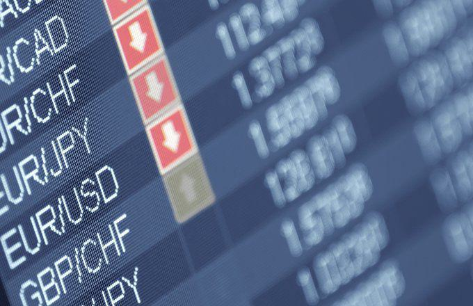

The Aruban Florin (AWG) serves as the official currency of Aruba, a picturesque Caribbean island that thrives on its robust tourism industry. Known for its pristine beaches and vibrant culture, Aruba attracts tourists predominantly from the United States and Venezuela, contributing significantly to its economic vitality. While tourism remains the cornerstone of Aruba's financial health, other sectors such as oil processing, offshore banking, and small manufacturing also play integral roles in its economic structure.

In recent years, algorithmic trading has emerged as a sophisticated approach in the foreign exchange (forex) market, presenting both opportunities and challenges for trading currencies like the AWG. By utilizing computer-based algorithms, traders can execute transactions at high speeds and leverage market inefficiencies, potentially optimizing returns. However, algorithmic trading also introduces risks, particularly in the context of the AWG, which is pegged to the U.S. dollar. This peg offers a degree of stability, but also links the currency to fluctuations in the USD, necessitating careful risk management strategies.



This article aims to shed light on the significance of the Aruban Florin within Aruba's economy, the effects of algorithmic trading on its forex volatility, and the essential techniques required to mitigate associated risks. Understanding these dynamics is crucial for effectively navigating the complexities of the automated forex market involving the AWG.

## Table of Contents

## Understanding the Aruban Florin (AWG)

The Aruban Florin (AWG) maintains a fixed exchange rate with the U.S. dollar, set at 1 USD equivalent to 1.79 AWG. This pegging to the USD is a strategic choice by the Aruban government, aimed at ensuring monetary stability, given the pervasive influence of the U.S. in regional and global markets. The fixed exchange rate system provides Aruba with a stable monetary environment, which is crucial for an economy heavily reliant on tourism and international trade. 

The introduction of the Aruban Florin in 1986 marked a significant economic milestone for Aruba. The currency replaced the Netherlands Antillean guilder as part of Aruba's efforts to carve a distinct economic identity while still being part of the Kingdom of the Netherlands. This move aligned with Aruba gaining "Status Aparte" within the Kingdom, giving it more control over its internal affairs, including monetary policy.

While the fixed exchange rate system reduces currency volatility, it inherently ties the Aruban economy to fluctuations in the USD. Any significant movement in the value of the USD on the global stage can impact the Aruban Florin's perceived stability. For instance, if the USD strengthens significantly, it can lead to an indirect appreciation of the AWG against other currencies, potentially affecting Aruba's trade competitiveness.

Furthermore, the pegged system requires Aruba to maintain sufficient currency reserves to uphold the fixed exchange rate, which can become challenging during periods of economic strain or when the USD experiences [volatility](/wiki/volatility-trading-strategies). Policymakers must therefore carefully balance the benefits of exchange rate stability with the risks associated with an inflexible monetary policy framework, especially during global economic fluctuations.

## Aruban Economy Overview

Aruba, a constituent country of the Kingdom of the Netherlands, boasts a high standard of living compared to other Caribbean nations, largely attributed to its thriving tourism industry. The island's economy is significantly bolstered by an influx of tourists, with a substantial proportion hailing from the United States and Venezuela. This diverse tourist base not only generates substantial revenue but also supports various local businesses and services, thereby contributing to Aruba's economic stability.

Tourism serves as the cornerstone of Aruba's economy, accounting for a major portion of its gross domestic product (GDP). The island's pristine beaches, pleasant climate, and vibrant culture attract millions of visitors annually, driving demand in the hospitality, entertainment, and retail sectors. This demand, in turn, fosters employment opportunities, enhancing the overall standard of living for Aruban residents.

The financial structure of Aruba is characterized by a dual currency system, wherein both the Aruban Florin (AWG) and the U.S. Dollar (USD) are commonly used, particularly within the tourism sector. The florin's peg to the USD at a rate of 1 USD to 1.79 AWG ensures exchange rate stability, simplifying transactions for international visitors and businesses. This stability is critical for maintaining confidence among investors and tourists alike, as fluctuations could potentially deter tourism and investment.

Additionally, while tourism remains the predominant economic driver, Aruba's economy benefits from other sectors such as oil refining, offshore banking, and limited manufacturing activities. These sectors provide a measure of economic diversification, though the island's reliance on tourism underscores the importance of sustainable tourism management practices. 

Overall, the integration of the Aruban Florin alongside the USD facilitates seamless financial operations within the tourism industry, reinforcing Aruba's economic resilience and enabling it to maintain a high standard of living amidst regional economic variabilities.

## Algorithmic Trading in Forex Markets

Algorithmic trading involves deploying computer algorithms to automatically execute trades based on a set of predefined criteria. This approach has gained popularity in the [forex](/wiki/forex-system) markets due to its ability to process large volumes of data at high speeds, leading to enhanced efficiency and reduced transaction costs. By automating decision-making, traders can exploit market inefficiencies more effectively than through manual trading methods.

A significant aspect of [algorithmic trading](/wiki/algorithmic-trading) is high-frequency trading ([HFT](/wiki/high-frequency-trading-strategies)), where algorithms execute numerous trades within seconds. This method capitalizes on minute price discrepancies and [liquidity](/wiki/liquidity-risk-premium) variations, thus optimizing trading outcomes. High-frequency trading requires robust technological infrastructure, including high-speed internet and computational power to manage vast datasets and execute trades promptly.

In forex markets, algorithms can be programmed to analyze currency pairs, identifying patterns and executing trades at optimal times. This process often involves technical analysis, where mathematical indicators such as moving averages, Bollinger Bands, and relative strength index (RSI) are computed to forecast price movements. Python, a popular language for algorithmic trading, is frequently used to develop these indicators:

```python
import pandas as pd
import numpy as np

def moving_average(values, window):
    return pd.Series(values).rolling(window=window).mean()

def bollinger_bands(prices, window, num_sd):
    ma = moving_average(prices, window)
    std_dev = pd.Series(prices).rolling(window=window).std()
    upper_band = ma + (std_dev * num_sd)
    lower_band = ma - (std_dev * num_sd)
    return upper_band, lower_band

# Example usage for RSI
def compute_rsi(data, window=14):
    delta = np.diff(data)
    gain = delta.clip(lower=0)  # positive gains only
    loss = -delta.clip(upper=0)  # negative losses only
    avg_gain = np.mean(gain[-window:])
    avg_loss = np.mean(loss[-window:])
    rs = avg_gain / avg_loss
    rsi = 100 - (100 / (1 + rs))
    return rsi
```

Within the context of the Aruban Florin (AWG), algorithmic trading necessitates particular consideration of currency stability and volatility. The AWG's pegged relationship with the U.S. dollar establishes a stable exchange environment; however, external fluctuations in the USD can still influence AWG trades. Consequently, algorithms must be adept at adapting to shifts in currency values to execute reliable forex transactions.

While the automated nature of algorithmic trading facilitates quick and numerous trades, it also inherently carries risks associated with unpredictable market changes and technological failures. Hence, trading strategies often incorporate risk management mechanisms, like stop-loss orders and portfolio diversification, which can be programmed into the trading algorithms to mitigate potential losses. 

By leveraging algorithmic trading, traders can achieve efficiency and accuracy in the forex markets while optimizing their engagement with currency pairs such as AWG/USD. However, a deep understanding of currency dynamics and market behavior remains crucial to successfully harnessing these technological advantages.

## Impact of Algorithmic Trading on AWG Forex Volatility

Algorithmic trading has fundamentally reshaped the landscape of forex markets by automating decision-making processes and executing trades at speeds impossible for human traders. The Aruban Florin (AWG), due to its pegged exchange rate with the U.S. dollar (USD), is inherently stable. Yet, algorithmic trading introduces new dimensions of volatility risk, particularly when considering external market factors that influence the USD and, by extension, the AWG.

The AWG's stability is primarily a function of its fixed exchange rate of 1 USD to 1.79 AWG. This peg significantly reduces domestic currency volatility, providing a predictable trading environment. However, algorithmic traders focusing on AWG must remain vigilant towards fluctuations in the USD itself. For instance, sudden shifts in U.S. economic policy, [interest rate](/wiki/interest-rate-trading-strategies) changes implemented by the Federal Reserve, or geopolitical events can cause the USD to fluctuate, indirectly affecting the AWG's perceived stability.

During periods of global financial instability, the foreign exchange market experiences heightened volatility. Algorithmic traders need to adapt their strategies to manage this risk effectively. Consider the 2008 financial crisis or the 2020 COVID-19 pandemic; both scenarios led to increased volatility across global currencies, impacting USD pegs like the AWG. Forex algorithms seeking to trade AWG must integrate mechanisms to mitigate risks associated with such scenarios.

Python provides a concise way to model this volatility. For example, calculating potential volatility impacts on AWG through standardized measures like the moving average can help traders adjust their strategies dynamically:

```python
import numpy as np

# Sample data: USD changes over time
usd_changes = np.array([0.01, -0.005, 0.003, -0.004, 0.002])

# Calculate moving average to smooth out fluctuations
moving_avg = np.convolve(usd_changes, np.ones(3)/3, mode='valid')

print("Moving Average Volatility:", moving_avg)
```

This simple calculation highlights how traders can use past volatility trends to inform algorithmic responses. Strategies may include altering the timing of trades, executing trades in smaller lots to manage exposure to fluctuations, or implementing stop-loss orders to limit potential downsides.

Ultimately, algorithmic trading involving the AWG demands sophisticated models that not only optimize trading performance but also embed real-time risk management protocols. Account for USD fluctuations, including through the integration of macroeconomic indicators and sentiment analysis, to bolster algorithmic robustness against forex volatility. By doing so, traders ensure that their automated strategies are equipped to handle both the inherent stability offered by the AWG/USD peg and the volatility risks posed by broader financial markets.

## Risk Management in Algorithmic Forex Trading

Risk management is a fundamental aspect of algorithmic forex trading, aimed at safeguarding against potential losses stemming from the inherent volatility and fluctuations in currency values. A pivotal technique in managing these risks is the use of stop-loss orders. Stop-loss orders automatically trigger a sale when a currency pair reaches a predetermined price, thereby limiting the extent of potential losses. For instance, if an algorithm predicts adverse market conditions, a stop-loss order can prevent trades from being executed beyond a certain loss threshold.

Diversification of portfolios is another cornerstone of risk management. By spreading investments across various currency pairs rather than concentrating on a single currency, traders can mitigate the impact of volatility. This approach ensures that the adverse performance of one currency pair is counterbalanced by the stability or gains in others, enhancing overall portfolio resilience.

Hedging strategies are employed to offset potential losses in one area by gains in another. In the context of forex trading, this often involves taking simultaneously opposing positions in correlated currency pairs. For example, a position in EUR/USD might be hedged with a corresponding position in USD/CHF, given the historical correlation often observed between the euro and the Swiss franc. 

Algorithmic systems, leveraging advanced computational power, can incorporate sophisticated risk parameters to dynamically adjust trading strategies in response to evolving market conditions. This involves continuous monitoring and analysis of market data, enabling algorithms to react in real-time. Python is often used to design these systems due to its extensive libraries and ease of handling complex computations. Below is a basic example of how Python can be utilized to implement a risk management strategy using stop-loss orders:

```python
def execute_trade(entry_price, stop_loss, target_price, current_market_price):
    """
    Executes trade based on stop-loss and target price
    """
    if current_market_price <= stop_loss:
        return "Sell", current_market_price  # Stop-loss triggered

    elif current_market_price >= target_price:
        return "Sell", current_market_price  # Target reached

    else:
        return "Hold", entry_price  # Continue to hold the position

# Example usage
entry_price = 1.2000
stop_loss = 1.1900
target_price = 1.2100
current_market_price = 1.1950

trade_action, trade_price = execute_trade(entry_price, stop_loss, target_price, current_market_price)
print(f"Action: {trade_action}, Price: {trade_price}")
```

This snippet outlines a straightforward function that decides whether to hold securities or sell them based on stop-loss and target thresholds. The ability to automatically handle such decisions enables traders to minimize losses by reacting swiftly to market movements without human intervention. Adapting to changing market conditions can be further enhanced by incorporating [machine learning](/wiki/machine-learning) algorithms or predictive analytics to forecast volatility and adjust parameters accordingly. Such rigorous risk management helps ensure that algorithms perform optimally within predefined risk tolerances, contributing to the sustainability and profitability of forex trading activities.

## Conclusion

The Aruban Florin (AWG) represents a unique balance of stability and risk within the forex trading landscape, chiefly due to its dependency on the U.S. dollar (USD). This pegged relationship provides the AWG with a degree of stability, buffering it against fluctuations that may be more pronounced in other, freely-floating currencies. However, this also means that any volatility in the USD directly impacts the AWG, which traders must account for when engaging in algorithmic trading.

Effective algorithmic trading of the AWG necessitates a comprehensive understanding of both local and global economic conditions. Traders must consider the intricacies of the Aruban economy, heavily driven by tourism, offshore banking, and oil processing, alongside the broader global forex trends. The interdependency between the AWG and the USD further highlights the need for traders to stay informed of U.S. economic conditions, monetary policies, and geopolitical factors that could influence currency stability.

To navigate the challenges of forex trading involving the AWG, ongoing analysis is crucial. This includes monitoring economic indicators, political developments, and market sentiments that might affect the USD and, consequently, the AWG. Advanced analytical tools and real-time data access are essential for maintaining a competitive edge in algorithmic trading strategies.

Robust risk management strategies form the backbone of successful algorithmic forex trading with the AWG. Techniques such as setting stop-loss orders, diversifying portfolios, and implementing hedging strategies are vital. These strategies help mitigate potential losses from fluctuations and provide a measure of control over the risks inherent in currency trading. Traders can leverage algorithmic systems to incorporate risk parameters that automatically adjust trading strategies in response to changing market conditions, thus maintaining operational efficiency and minimizing potential negative impacts on their trading outcomes.

In conclusion, while the AWG offers opportunities within algorithmic trading due to its relative stability, its dependence on the USD necessitates a strategic approach grounded in comprehensive analysis and robust risk management. By marrying their understanding of Aruba's economic nuances with insights into global forex dynamics, traders can effectively manage the risks and harness the benefits of trading the AWG.

## References & Further Reading

[1]: Rutten, L. (2001). ["The Economic Impact of the Tourism Industry in Aruba."](https://www.sciencedirect.com/science/article/pii/S0959652624033961) United Nations Economic Commission for Latin America and the Caribbean (ECLAC).

[2]: Bartram, S. M., & Dufey, G. (2001). ["International Finance and the Pegging of Exchange Rates: The Case of Aruba."](https://papers.ssrn.com/sol3/papers.cfm?abstract_id=270196) Journal of Applied Corporate Finance.

[3]: Lo, A. W. (2017). ["Adaptive Markets: Financial Evolution at the Speed of Thought."](https://www.amazon.com/Adaptive-Markets-Financial-Evolution-Thought/dp/0691135142) Princeton University Press.

[4]: Tsay, R. S. (2010). ["Analysis of Financial Time Series."](https://onlinelibrary.wiley.com/doi/book/10.1002/9780470644560) John Wiley & Sons.

[5]: Aldridge, I. (2013). ["High-Frequency Trading: A Practical Guide to Algorithmic Strategies and Trading Systems."](https://www.amazon.com/High-Frequency-Trading-Practical-Algorithmic-Strategies/dp/1118343506) Wiley Trading.