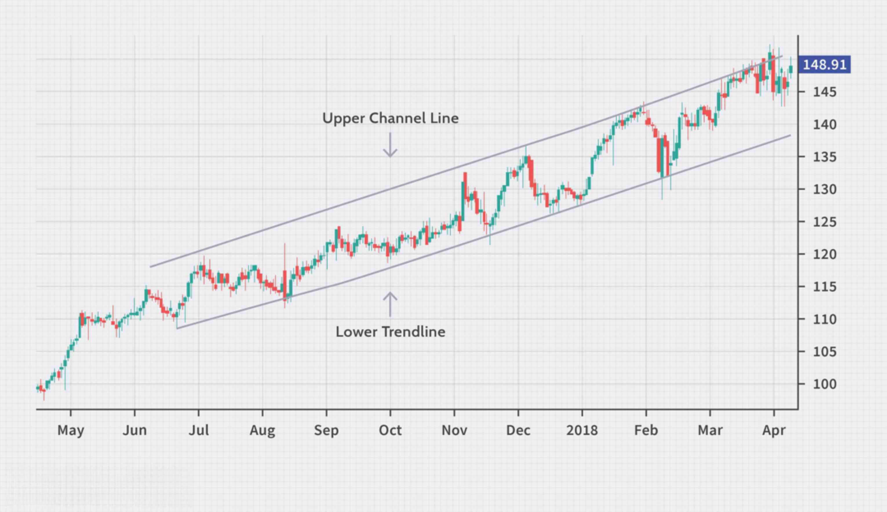

## Table of Contents

## What is an ascending channel in trading?

An ascending channel in trading is a chart pattern that shows a stock or asset moving upwards within two parallel lines. The bottom line connects the lows of the price, and the top line connects the highs. This pattern suggests that the price is trending upwards, but it also shows that there are regular pullbacks or corrections within this upward movement.

Traders often use ascending channels to make decisions about buying and selling. When the price touches the bottom line of the channel, it might be a good time to buy, as the price is likely to bounce back up. Conversely, when the price touches the top line, it might be a good time to sell or take profits, as the price could fall back down to the bottom line. Recognizing these patterns can help traders make more informed choices and potentially increase their chances of making profitable trades.

## How is an ascending channel identified on a price chart?

To identify an ascending channel on a price chart, you need to look for two parallel lines that both slope upwards. The bottom line should connect the lowest points of the price movements over time, while the top line should connect the highest points. These lines should be drawn so that they touch the price at several points, showing that the price is moving up but also going back and forth between these two lines.

Once you see these two upward sloping lines with the price moving between them, you have spotted an ascending channel. This pattern shows that the price is generally going up, but it also has regular times when it goes down a bit before going up again. By watching where the price touches these lines, traders can decide when to buy or sell to make the most of the trend.

## What does an ascending channel indicate about market trends?

An ascending channel tells us that the market is in an uptrend. This means that the price of the stock or asset is generally going up over time. The channel is made up of two lines that go up at the same angle. The bottom line touches the lowest prices, and the top line touches the highest prices. When you see the price moving between these two lines, it shows that even though the price is going up, it is also going through smaller ups and downs.

Traders use this pattern to make decisions about buying and selling. If the price touches the bottom line of the channel, it might be a good time to buy because the price is likely to go back up. If the price touches the top line, it might be a good time to sell or take profits because the price might go back down to the bottom line. So, an ascending channel helps traders understand the market trend and make better choices about when to trade.

## How can traders use ascending channels to make trading decisions?

Traders can use ascending channels to decide when to buy and sell. When they see the price touch the bottom line of the channel, it might be a good time to buy. This is because the price usually bounces back up from this point. So, traders look for this signal to enter the market and hopefully make a profit as the price rises again.

On the other hand, when the price reaches the top line of the channel, it might be a good time to sell or take profits. This is because the price often drops back down to the bottom line after hitting the top. By selling at the top, traders can avoid losing money if the price does fall. This way, using the ascending channel helps traders make smart choices about when to get in and out of the market.

## What are the key entry and exit points within an ascending channel?

The key entry point in an ascending channel is when the price touches the bottom line. This is when traders often decide to buy. They think the price will go back up from here, so it's a good time to get into the market. They hope to make money as the price rises again towards the top line of the channel.

The key [exit](/wiki/exit-strategy) point is when the price reaches the top line of the channel. This is when traders might choose to sell or take their profits. They believe the price could drop back down to the bottom line after hitting the top, so it's a good time to get out of the market. By selling at the top, traders can keep the money they've made and avoid losing it if the price does fall.

## What are the common mistakes traders make when trading within an ascending channel?

One common mistake traders make when trading within an ascending channel is not waiting for the price to actually touch the bottom line before buying. Some traders get too excited and buy before the price hits the bottom, thinking they might miss out on the upward move. But if they buy too early, they might end up losing money if the price keeps going down to the bottom line before going up again.

Another mistake is not selling when the price reaches the top line of the channel. Some traders hope the price will keep going up and up, but often it goes back down to the bottom line. If they don't sell at the top, they might miss out on taking their profits and could lose money if the price drops. It's important to follow the pattern and sell at the right time to make the most of the trend.

## How does volume affect the validity of an ascending channel?

Volume is important when looking at an ascending channel. If the [volume](/wiki/volume-trading-strategy) is high when the price is going up, it means a lot of people are buying, and this can make the channel more valid. High volume shows that many traders agree the price should keep going up, so the trend might be strong. On the other hand, if the volume is low when the price is going up, it might mean fewer people are interested, and the channel might not be as strong or reliable.

When the price touches the bottom line of the channel and the volume is high, it's a good sign. It means a lot of people are buying at the low point, which could push the price back up. But if the volume is low at the bottom, the price might not go up as expected. So, traders should watch the volume to see if the ascending channel is really a good sign of an uptrend or if it might not be as strong as it looks.

## Can ascending channels be used in conjunction with other technical indicators?

Yes, traders often use ascending channels together with other technical indicators to make better trading decisions. One common indicator they use is the Relative Strength Index (RSI). The RSI helps traders see if a stock is overbought or oversold. If the price is at the bottom of the ascending channel and the RSI shows the stock is oversold, it might be a strong signal to buy. On the other hand, if the price is at the top of the channel and the RSI shows the stock is overbought, it might be a good time to sell.

Another useful indicator is the Moving Average Convergence Divergence (MACD). The MACD can help traders see if the trend is strong and likely to continue. If the price is in an ascending channel and the MACD shows a bullish crossover (when the MACD line crosses above the signal line), it can confirm that the uptrend is strong. This can give traders more confidence in their buying decisions. By using ascending channels along with other indicators, traders can get a clearer picture of the market and make smarter trades.

## What are the differences between an ascending channel and other chart patterns?

An ascending channel is different from other chart patterns like the ascending triangle or the head and shoulders pattern. An ascending channel has two parallel lines that slope up. The bottom line connects the lows and the top line connects the highs of the price. This shows that the price is going up but also going back and forth between these lines. On the other hand, an ascending triangle has a flat top line and a rising bottom line, which shows that the price is trying to break out upwards but is being held back at a certain level. The head and shoulders pattern looks like three peaks, with the middle peak being the highest, and it signals that the price might start going down after going up.

Another difference is how traders use these patterns. In an ascending channel, traders buy when the price touches the bottom line and sell when it reaches the top line. This helps them make money from the regular ups and downs within the upward trend. In an ascending triangle, traders often wait for the price to break through the top line before buying, hoping for a big upward move. With the head and shoulders pattern, traders might sell when they see the pattern forming, expecting the price to drop after the third peak. Each pattern gives different signals about what the price might do next, so traders need to understand these differences to use them correctly.

## How do you measure the potential price targets using an ascending channel?

To measure potential price targets using an ascending channel, you can look at how tall the channel is. The height of the channel is the distance between the bottom line and the top line. Once you know this height, you can use it to guess how much higher the price might go if it breaks out of the top line. For example, if the channel is 10 points tall and the price breaks out of the top line, you might expect the price to go up another 10 points from where it broke out.

Another way to measure potential price targets is to see how long the channel lasts. If the price stays in the channel for a long time, it might be a strong trend. When the price finally breaks out of the top line, you can use the height of the channel to guess how much further it might go. But remember, this is just a guess, and the price might not always go up by the exact amount you expect. It's important to keep watching the price and be ready to change your plans if things don't go as expected.

## What are the psychological factors that contribute to the formation of an ascending channel?

The formation of an ascending channel is influenced by the emotions and actions of traders. When traders see a stock's price going up, they often feel hopeful and want to buy more. This hope and buying push the price higher, creating the upward trend of the channel. But traders also feel fear when the price goes too high. They start to sell, which makes the price drop back down to the bottom line of the channel. This back-and-forth between hope and fear creates the regular ups and downs within the channel.

Another psychological [factor](/wiki/factor-investing) is the belief in patterns. When traders see an ascending channel forming, they start to trust it and trade based on it. They buy when the price hits the bottom line because they believe it will go back up, and they sell at the top line because they think it will drop again. This belief in the pattern makes more traders act the same way, which helps keep the channel going. So, the emotions and beliefs of traders play a big role in making and keeping an ascending channel.

## How can algorithmic trading strategies be developed to exploit ascending channels?

Algorithmic trading strategies can be developed to take advantage of ascending channels by setting up rules for buying and selling based on the channel's lines. A simple strategy might be to buy when the price touches the bottom line of the channel and sell when it reaches the top line. The algorithm can be programmed to watch the price and make these trades automatically. It can also use other indicators like the Relative Strength Index (RSI) to make sure the stock is not too overbought or oversold before making a trade. This way, the algorithm can make better decisions and increase the chances of making a profit.

Another way to develop an algorithmic strategy for ascending channels is to use historical data to find out how often the price moves between the channel's lines and how long it stays in the channel. By analyzing this data, the algorithm can predict when the price might break out of the channel and go even higher. The algorithm can then buy more when it sees signs of a [breakout](/wiki/breakout-trading), hoping to make bigger profits. It's important for the algorithm to keep learning and adjusting its rules based on new data so it can stay successful even if the market changes.

## References & Further Reading

[1]: Bergstra, J., Bardenet, R., Bengio, Y., & Kégl, B. (2011). ["Algorithms for Hyper-Parameter Optimization."](https://papers.nips.cc/paper/4443-algorithms-for-hyper-parameter-optimization) Advances in Neural Information Processing Systems 24.

[2]: ["Advances in Financial Machine Learning"](https://www.amazon.com/Advances-Financial-Machine-Learning-Marcos/dp/1119482089) by Marcos Lopez de Prado

[3]: ["Evidence-Based Technical Analysis: Applying the Scientific Method and Statistical Inference to Trading Signals"](https://www.amazon.com/Evidence-Based-Technical-Analysis-Scientific-Statistical/dp/0470008741) by David Aronson

[4]: ["Machine Learning for Algorithmic Trading"](https://github.com/stefan-jansen/machine-learning-for-trading) by Stefan Jansen

[5]: ["Quantitative Trading: How to Build Your Own Algorithmic Trading Business"](https://www.amazon.com/Quantitative-Trading-Build-Algorithmic-Business/dp/1119800064) by Ernest P. Chan