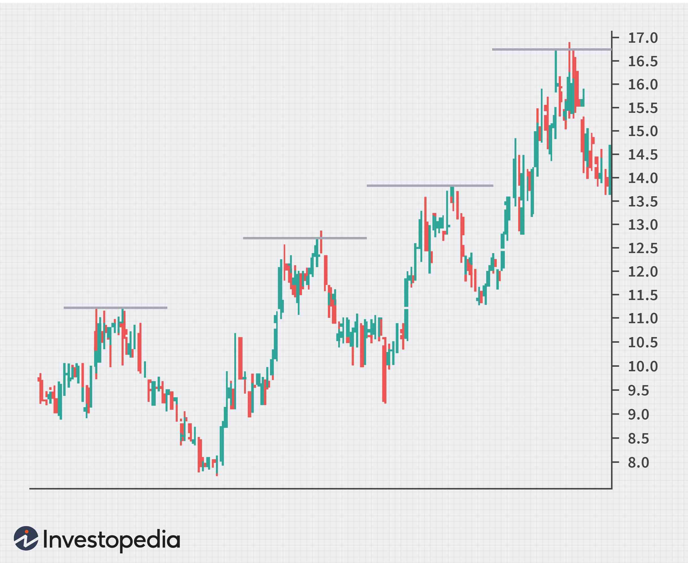

In modern financial markets, traders employ a range of strategies to maximize returns, encompassing both traditional methods and innovative techniques. Technical analysis and algorithmic trading stand out as pivotal tools that utilize well-defined chart patterns to forecast market movements. Among these patterns, the ascending tops pattern is recognized as an indicator of bullish trends in the market. This pattern is characterized by a series of progressively higher peaks in the price of a security, suggesting increasing buying pressure and market confidence.

The significance of ascending tops lies in their utility for traders seeking to identify bullish trajectories. Identifying this pattern involves noting each subsequent peak being higher than the one before it, often over a short time frame. Such patterns can be crucial for traders, particularly those engaging in day trading, as they facilitate quick decision-making to benefit from upward price movements. However, it is important for traders to evaluate ascending tops as part of a broader analytical context to confirm market trends accurately.



The implementation of technology enhances the identification and trading of ascending tops efficiently. Algorithmic trading, in particular, has revolutionized the approach to recognizing and capitalizing on these chart patterns. Algorithms can be designed to automatically detect such trends and execute trades, thereby minimizing human biases and increasing operational efficiency. This technological advantage allows traders to scan multiple securities simultaneously, identifying opportunities that may be overlooked by manual analysis.

By incorporating ascending tops into trading strategies, investors can aim to optimize their entry and exit points, capitalizing on confirmed bullish signals. Despite their utility, traders need to be mindful of the limitations and risks associated with this pattern and integrate comprehensive risk management practices to mitigate potential downsides.

## Table of Contents

## Understanding Ascending Tops

Ascending tops occur when a security's price forms a series of progressively higher peaks over time. This pattern is considered a robust indicator of buying pressure and an increase in market confidence, typically signaling a bullish trend. It is characterized by each subsequent peak being higher than the previous one and is often observed over a relatively short timeframe.

Traders often look for ascending tops because they can indicate a continuation of an upward price trajectory. For day traders, in particular, recognizing these patterns is crucial for making timely decisions to capitalize on potential gains. By identifying ascending tops, traders can strategize for potential entry points to leverage upward momentum effectively.

Despite their usefulness, ascending tops should not be the sole deciding [factor](/wiki/factor-investing) in trading decisions. They provide insights that need to be corroborated with additional analytical context. Factors such as market conditions, the presence of support and resistance levels, and other technical indicators should be evaluated to confirm trends and reinforce trading strategies. Relying solely on ascending tops without considering broader market analytics might lead to ineffective trading outcomes or false assumptions about market directions. It is essential to use ascending tops alongside a comprehensive suite of tools and methodologies to maximize their effectiveness in trading decisions.

## Algorithmic Trading and Ascending Tops

Algorithmic trading has revolutionized the modern financial landscape by automating the recognition and execution of trading strategies, including those based on chart patterns like ascending tops. This form of trading employs mathematical models and computational algorithms to identify patterns and execute orders with minimal human intervention. The implementation of such strategies can significantly enhance trading efficiency by eliminating human emotion and bias, traits often leading to suboptimal decisions.

One key advantage of [algorithmic trading](/wiki/algorithmic-trading) is the ability to programmatically detect technical patterns such as ascending tops. By coding specific criteria into algorithms, traders can automatically identify these patterns across multiple securities, streamlining the process and allowing for quick action. Python, a popular language in the trading community, offers various libraries for technical analysis like Pandas, NumPy, and TA-Lib. These libraries enable traders to build and test strategies based on ascending tops, validating their effectiveness under different market conditions.

Backtesting is an essential component in developing algorithmic trading strategies. It involves applying a trading strategy to historical data to assess its potential performance. This process helps traders fine-tune their algorithms, optimizing parameters such as time intervals for pattern recognition and execution triggers to improve strategy resilience. Adjustments might include altering the confirmation criteria for ascending tops, such as requiring a specific percentage increase over previous highs before initiating trades.

Moreover, automated systems can process vast amounts of data and simultaneously monitor numerous securities. This capability is particularly beneficial in fast-moving markets where opportunities are fleeting. An algorithm can quickly identify and act on ascending tops across different assets, a task that would be nearly impossible for a human trader to replicate at the same speed and accuracy.

Incorporating ascending tops into algorithmic trading strategies necessitates rigorous testing and thoughtful design. Traders must ensure that their systems are not only capable of identifying ascending tops but are also robust enough to function in diverse market environments. This often involves using ensemble methods that combine multiple signals or patterns to reduce the likelihood of false positives and increase the reliability of trade signals.

Despite its advantages, algorithmic trading with ascending tops requires meticulous planning and ongoing refinements. Continuous market evolution means that strategies must adapt to remain effective. Regularly updating algorithms and incorporating real-time data and feedback mechanisms can help maintain their competitive edge.

In summary, the integration of ascending tops into algorithmic trading presents a powerful opportunity for traders seeking to capitalize on bullish trends. By leveraging technology to automate pattern identification and trade execution, traders can enhance their decision-making process and navigate complex markets more efficiently.

## Strategy for Investing With Ascending Tops

Investors looking to employ ascending tops patterns should focus on buying when the pattern signals bullish sentiment, allowing them to capitalize on the upward [momentum](/wiki/momentum). A critical aspect of this strategy is defining clear entry points, typically established when a security forms a new higher high relative to previous peaks. This confirmation of a bullish trend can provide traders with a signal to enter the market.

To effectively manage risk, developing robust [exit](/wiki/exit-strategy) strategies is equally important. One common method involves setting stop-loss orders just below recent low points. This approach safeguards against sudden market reversals by limiting potential losses. The stop-loss level should be strategically placed to avoid premature exits while still providing adequate protection.

In constructing a strategy around ascending tops, it is essential to account for broader market conditions. Market sentiment, macroeconomic factors, and sector trends may all influence the success of trades based on this pattern. Utilizing additional technical indicators, such as moving averages or relative strength index (RSI), can offer confluence and enhance the reliability of the signals provided by ascending tops.

While focusing on ascending tops may present opportunities, investors are advised to diversify their strategies by incorporating various chart patterns. Blending multiple patterns not only enhances trade selection but also mitigates reliance on a single market condition, thereby potentially improving overall trading performance.

By following these guidelines, traders can better position themselves to exploit the potential profits offered by ascending tops while minimizing associated risks.

## Advantages and Disadvantages of Ascending Top Strategy

Advantages of using ascending tops include clear entry points, which are crucial for traders aiming to leverage bullish market conditions. As each subsequent peak in the ascending tops pattern is higher than the last, traders can pinpoint when to enter positions. This pattern aligns well with bullish markets, providing opportunities for substantial profits as prices trend upward.

However, the ascending tops strategy is not without its challenges. A significant risk involves false breakouts, where prices temporarily rise above the previous peak but fail to maintain momentum, leading to potential losses. Additionally, waiting for confirmatory signals to verify a [breakout](/wiki/breakout-trading) can result in an entry lag, causing traders to miss initial gains.

Ascending tops patterns are predominantly effective in strong bullish markets, which restricts their effectiveness in varying market conditions such as sideways or bearish markets. Traders must be adept at adjusting strategy parameters to adapt to these fluctuating dynamics. 

Incorporating additional technical indicators, such as moving averages or the Relative Strength Index (RSI), can help mitigate the occurrence of false signals. For example, a moving average could be used to confirm sustained upward trends, while the RSI might indicate whether the market is overbought, signaling a potential reversal.

To enhance the robustness of ascending top strategies, traders may benefit from using Python to automate their analysis. Libraries such as `pandas` and `TA-Lib` can be utilized to programmatically apply technical indicators and identify ascending tops, thus supporting more informed decision-making. Here is a basic Python example to identify ascending tops using `pandas` and `pandas_ta`:

```python
import pandas as pd
import pandas_ta as ta

# Load data into a DataFrame
data = pd.read_csv("your_data.csv")

# Calculate Simple Moving Average
data['SMA_20'] = ta.sma(data['close'], length=20)

# Identify ascending tops
def identify_ascending_tops(df):
    ascending_tops = []
    for i in range(1, len(df)):
        if df['high'][i] > df['high'][i-1] and df['close'][i] > df['SMA_20'][i]:
            ascending_tops.append(df.iloc[i].to_dict())
    return ascending_tops

tops = identify_ascending_tops(data)

```
This script identifies instances where the 'high' price exceeds previous highs and is confirmed by closing above the 20-period simple moving average. Traders can then use these insights to refine their entry and exit strategies. By continuously calibrating and testing their strategies, traders can optimize their use of ascending tops, maximizing their potential in dynamic market environments.

## Conclusion

Ascending tops are an important pattern for technical traders aiming to identify bullish trends and pinpoint profitable entry points in the financial markets. When incorporated into algorithmic trading systems, ascending tops can facilitate efficient and objective trading strategies. The automation provided by algorithmic trading helps eliminate human biases and allows for quick data processing and execution of trading decisions. However, it is crucial for traders to be aware of the limitations and risks associated with the ascending tops strategy. False breakouts, market noise, and changing market dynamics are factors that can diminish the reliability of this pattern. As such, comprehensive risk management practices, such as stop-loss orders and position sizing, are essential to mitigate potential losses.

Furthermore, continuous innovation and exploration of algorithmic methods and technical patterns will enable traders to stay ahead in dynamic markets. Leveraging [machine learning](/wiki/machine-learning) algorithms for pattern recognition or integrating additional technical indicators might enhance the robustness and accuracy of trading strategies based on ascending tops. Tools such as Python libraries, like Pandas for data manipulation and TA-Lib for technical analysis, provide traders with powerful resources to test and refine their strategies. Here is a simple Python example to detect ascending tops using Pandas:

```python
import pandas as pd

def detect_ascending_tops(prices):
    # Calculate the local peaks
    tops = (prices.shift(1) < prices) & (prices.shift(-1) < prices)
    ascending_tops = prices[tops].diff() > 0
    return ascending_tops

# Example usage
prices = pd.Series([20, 22, 21, 23, 25, 24, 26, 27])
ascending_tops = detect_ascending_tops(prices)
print(ascending_tops)
```

Ultimately, understanding and skillfully using ascending tops can greatly enhance a trader's toolkit, aiding in making informed investment decisions. By integrating these patterns with sound algorithmic strategies and risk management measures, traders can better capture opportunities presented by bullish trends, thereby improving their trading performance.

## References & Further Reading

[1]: Bergstra, J., Bardenet, R., Bengio, Y., & Kégl, B. (2011). ["Algorithms for Hyper-Parameter Optimization."](https://proceedings.neurips.cc/paper/2011/file/86e8f7ab32cfd12577bc2619bc635690-Paper.pdf) Advances in Neural Information Processing Systems 24.

[2]: ["Advances in Financial Machine Learning"](https://www.amazon.com/Advances-Financial-Machine-Learning-Marcos/dp/1119482089) by Marcos Lopez de Prado

[3]: ["Evidence-Based Technical Analysis: Applying the Scientific Method and Statistical Inference to Trading Signals"](https://www.amazon.com/Evidence-Based-Technical-Analysis-Scientific-Statistical/dp/0470008741) by David Aronson

[4]: ["Machine Learning for Algorithmic Trading"](https://github.com/PacktPublishing/Machine-Learning-for-Algorithmic-Trading-Second-Edition) by Stefan Jansen

[5]: ["Quantitative Trading: How to Build Your Own Algorithmic Trading Business"](https://books.google.com/books/about/Quantitative_Trading.html?id=j70yEAAAQBAJ) by Ernest P. Chan