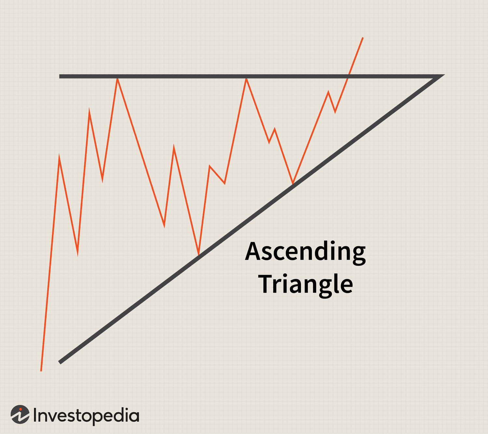

Technical analysis is an essential component of trading, providing traders with statistical insights necessary for understanding financial markets. Among the pivotal tools employed in this kind of analysis are trading patterns, such as the ascending triangle, which offer predictive power regarding market behavior. Recognizable through its geometric pattern, an ascending triangle is considered a bullish continuation pattern that provides valuable cues about potential market movements.

The ascending triangle pattern is not just a static diagram but a dynamic tool that aids traders in forecasting price breakouts by analyzing historical price data. It is characterized by a rising lower trendline that converges with a horizontal resistance line. This alignment typically points to increased buying interest, suggesting that further price escalation may be imminent once the resistance level is breached.



Understanding these patterns is not only fundamental for manual trading but also significantly beneficial in the context of algorithmic trading. Algorithmic trading systems can be programmed to identify these patterns swiftly and accurately, allowing automated trade execution based on predefined criteria. This automation reduces human error and enhances trading efficiency by capitalizing on the real-time volatilities observed in financial securities.

In this article, we examine the details of the ascending triangle pattern and its strategic application in algorithmic trading. By offering a comprehensive guide, we aim to enhance trading strategies through the informed use of these patterns. This includes detailed examination of the pattern's structure, the mechanics behind price movements, and practical implementation in trading systems. As traders endeavor to develop more nuanced approaches to market analysis, the integration of such technical patterns proves invaluable in enriching their predictive capabilities and decision-making frameworks.

## Table of Contents

## Understanding Ascending Triangle Patterns

An ascending triangle is a prominently recognized bullish continuation pattern utilized in technical analysis, commonly identified in financial trading contexts. This pattern is characterized by a series of rising lows converging beneath a horizontal resistance level. As market sentiment turns optimistic, buyers incrementally increase their bid prices, forming a rising lower trendline which illustrates the emergence of demand-side strength. The horizontal resistance, on the other hand, indicates the points where selling pressure mounts, temporarily capping upward momentum.

When observing an ascending triangle, traders anticipate a potential breakout, which occurs once the asset’s price breaches the resistance level. This breakout signifies a pivotal shift where the aggregate buying interest surpasses the existing selling pressure, often leading to a substantial upward movement in the price.

Key elements integral to the formation and analysis of ascending triangles include:

1. **Swing Highs and Lows**: These refer to the alternating peaks and troughs formed during price movements. For ascending triangles, it is crucial that the lows are sequentially higher, while the highs touch the horizontal resistance.

2. **Volume Analysis**: Volume plays a significant role in validating breakouts. Typically, volume tends to contract as the pattern develops, reflecting a phase of consolidation. Once the price breaks the resistance line, a sharp uptick in volume confirms the legitimacy of the breakout, reinforcing the likelihood of a continued upward trend.

3. **Trendline Convergence**: The convergence of the rising trendline toward the horizontal resistance effectively narrows the price action range. This narrowing signals a compression of volatility, often preceding a breakout. Mathematically, this can be expressed as the gradient of the rising trendline approaching that of the horizontal line over time.

In practical terms, traders often monitor these patterns over various time frames to ascertain the potential for sustainable trends. The systematic identification of these elements through software or manual analysis facilitates better-informed trading decisions, utilizing the historical price behavior to forecast future market movements confidently.

## The Mechanics of Ascending Triangle Patterns

An ascending triangle pattern develops when traders incrementally increase their bids, resulting in higher lows while the resistance level remains constant. This formation reflects a bullish sentiment, where buyers progressively become more aggressive in their purchasing behavior. The visual manifestation of this pattern on a price chart is a series of rising swing lows that converge toward a static horizontal resistance level.

The [breakout](/wiki/breakout-trading) event, integral to the ascending triangle, typically occurs when buying pressure eventually overcomes selling pressure, propelling the price through the resistance level. The point at which this breakthrough happens is critical and often results in a substantial price surge. Traders anticipate such breakouts as confirmation of the continued upward trend.

Volume analysis is of paramount importance when assessing the potential strength of a breakout. A significant increase in trading [volume](/wiki/volume-trading-strategy) at the time of the breakout is generally seen as a strong signal that the breakout is sustainable. This is because higher volume suggests robust interest and participation from market players, thereby providing the necessary [momentum](/wiki/momentum) to sustain a new trend direction.

To quantitatively assess volume change, traders can employ indicators such as the On-Balance Volume (OBV) or the Volume Weighted Average Price (VWAP). These indicators help in understanding how volume correlates with market movements. Here is an example of how one might use Python to evaluate volume trends:

```python
import pandas as pd
import matplotlib.pyplot as plt

def calculate_OBV(price, volume):
    obv = [0]
    for i in range(1, len(price)):
        if price[i] > price[i-1]:
            obv.append(obv[-1] + volume[i])
        elif price[i] < price[i-1]:
            obv.append(obv[-1] - volume[i])
        else:
            obv.append(obv[-1])
    return obv

# Sample price and volume data
price_data = pd.Series([10, 10.2, 10.5, 10.7, 10.6, 10.8, 10.9])
volume_data = pd.Series([100, 150, 120, 200, 180, 210, 220])

obv = calculate_OBV(price_data, volume_data)

plt.plot(price_data.index, obv, label='OBV', color='orange')
plt.title('On-Balance Volume')
plt.xlabel('Time')
plt.ylabel('OBV')
plt.legend()
plt.show()
```

In conclusion, the mechanics of ascending triangle patterns combine price action analysis with volume insights. This amalgamation provides traders with a potent tool to anticipate market breakouts, optimize entry points, and manage risk more effectively in their trading endeavors.

## Differences Between Ascending and Descending Triangles

While ascending triangles are considered bullish indicators, signaling a likely upward price movement, descending triangles generally suggest bearish trends. These patterns, essential components of technical analysis, provide traders with insight into market sentiment and potential price trajectories.

An ascending triangle pattern is marked by a rising lower trendline, where each successive low is higher than the last, and a flat upper resistance line. This formation indicates increasing demand and buying pressure, resulting in higher lows as traders are willing to pay higher prices over time. The price movement within an ascending triangle ultimately leads to a breakout above the resistance level, fueled by a rising momentum of buyers overtaking sellers.

Conversely, a descending triangle is characterized by a horizontal support line and a downward-sloping upper trendline. In this pattern, each successive high is lower than the previous one, signaling increased selling pressure and diminishing demand. The horizontal support line in a descending triangle represents a level where buying interest consistently emerges. However, the overall downward movement of the highs points to a weakening support, often resulting in a breakdown below the support level, as sellers overwhelm buyers.

These two patterns signal different sentiment and expected price movements. While ascending triangles generally indicate bullish sentiment with potential upward breakouts, descending triangles often imply bearish sentiment with potential downward breakouts. Recognizing the formation of these patterns and understanding their implications can aid traders in making informed decisions about market entry or [exit](/wiki/exit-strategy) points.

Understanding the dynamics of ascending and descending triangles is crucial for accurately predicting potential market behavior. Traders who can accurately identify these patterns and interpret their signals are better positioned to anticipate price movements and adjust their strategies accordingly.

## Limitations and Risks of Trading Ascending Triangles

False breakouts represent a significant challenge when trading ascending triangles, occurring when a price moves beyond the pattern but does not maintain the trajectory anticipated by traders. This situation can lead to misinterpretations of market conditions, resulting in potential losses. Therefore, traders must employ specific strategies to mitigate these risks effectively.

One effective risk management tactic is the implementation of stop-loss orders. Stop-loss orders act as predetermined exit points set below the entry price for a long position, ensuring that losses are minimized should the market move unfavorably. Placing a stop-loss at a strategic level, often just below the previous low within the triangle pattern, can provide a practical safeguard against unexpected price reversals.

Moreover, the ability to distinguish between genuine and false breakouts is crucial. This assessment often involves analyzing accompanying trading volume; a true breakout is typically supported by a significant increase in volume, indicating robust market interest. Conversely, if a breakout occurs with waning volume, traders should exercise caution, as this may indicate a lack of sufficient market momentum to sustain the trend.

Incorporating additional technical indicators can further assist in confirming breakouts. Moving averages, momentum indicators, or relative strength indices (RSI) can offer insights into the underlying market sentiment, aiding traders in identifying true breakouts. For instance, if an ascending triangle breakout is accompanied by an RSI reading above 70, it could signal an overbought condition, warranting precautious trading actions.

Ultimately, acknowledging the limitations of ascending triangle patterns is vital for any trading strategy. Patterns can fail due to unexpected market news, shifts in trader sentiment, or general market [volatility](/wiki/volatility-trading-strategies), which may not always be accounted for within a purely pattern-based strategy. Therefore, traders should not only focus on technical shapes but should also consider external factors and develop a comprehensive trading plan that incorporates various market elements to adjust swiftly to changing market conditions. Prioritizing continuous learning and staying informed about market dynamics will enhance the ability to recognize and respond to false breakout scenarios effectively.

## Implementing Ascending Triangle Patterns in Algorithmic Trading

Algorithmic trading systems have revolutionized the way financial markets operate by leveraging computational power to detect patterns and execute trades. Implementing ascending triangle patterns in these systems involves the use of historical data analysis and predefined algorithms to identify and act on profitable opportunities.

### Detecting Ascending Triangles

To automate the detection of ascending triangles, traders can employ algorithms that scan financial charts to identify specific pattern characteristics—such as a horizontal resistance line and a rising lower trendline. The algorithm must calculate swing highs and swing lows to determine the formation of the triangle pattern.

### Core Algorithm Components

1. **Trend Identification**: The system must recognize the market trend that forms the basis of the ascending triangle. This involves analyzing historical price data to determine the general direction and identifying a series of higher lows.

2. **Resistance and Support Lines**: The algorithm plots the price points that form the horizontal resistance line and establishes the ascending trendline connecting higher lows.

3. **Breakout Confirmation**: A breakout is confirmed when the price surpasses the resistance level, ideally accompanied by increasing volume. The system should include a mechanism to verify this, possibly using volume indicators.

### Coding an Example in Python

Below is a simplistic outline of how one might set up a Python script to identify ascending triangle patterns using a financial data library such as `pandas`:

```python
import pandas as pd
import numpy as np

def detect_ascending_triangle(price_data):
    # Basic check for dataframe completeness
    if 'High' not in price_data or 'Low' not in price_data:
        raise ValueError("Dataframe must contain 'High' and 'Low' columns.")

    price_data['Higher_Low'] = price_data['Low'].shift(1) < price_data['Low']
    price_data['Horizontal_Resistance'] = price_data['High'].shift(1) == price_data['High']

    # Determine if there's enough consecutive data to suggest a pattern
    triangle_pattern = price_data['Higher_Low'].rolling(window=3).sum() == 3
    resistance_pattern = price_data['Horizontal_Resistance'].rolling(window=3).sum() == 3

    potential_triangles = price_data.loc[triangle_pattern & resistance_pattern]

    return potential_triangles.index.tolist()

# Example usage
price_data = pd.DataFrame({
    'High': [110, 112, 113, 113, 115, 115, 115, 118],
    'Low': [105, 106, 107, 108, 109, 110, 111, 112]
})

ascending_triangles = detect_ascending_triangle(price_data)
print("Ascending Triangle patterns detected at indices:", ascending_triangles)
```

### Automating Trades

Beyond detection, [algorithmic trading](/wiki/algorithmic-trading) systems can execute trades based on detected patterns. Once an ascending triangle is recognized and a breakout is confirmed, the system can initiate buys or sells according to the predefined strategy, integrating stop-loss orders to manage potential risks.

Algorithmic trading thus enhances decision-making efficiency, limits human error, and optimizes trading strategies by systematically incorporating technical patterns like ascending triangles. Properly implemented, these systems provide traders with a significant advantage in predicting market movements.

## Conclusion

The integration of ascending triangle patterns into trading strategies significantly enhances traders' capacity to forecast market movements. These patterns, characterized by a rising lower trendline converging with a horizontal resistance line, offer predictive insights that can inform both manual and algorithmic trading decisions. By identifying potential breakout points above resistance levels, traders can anticipate upward price movements, aligning their strategies accordingly.

Utilizing ascending triangle patterns in trading practices, whether manually executed or through algorithmic systems, improves decision-making processes. Manual traders can visually analyze chart patterns to time their trades effectively, while algorithmic trading systems can be programmed to detect these patterns automatically. Through algorithms, traders can employ predefined rules to execute trades based on historical data and pattern recognition, minimizing human error and maximizing trading efficiency.

Moreover, continued exploration and application of technical patterns, such as ascending triangles, contribute to developing more nuanced and effective trading approaches. As traders become adept at recognizing and interpreting such patterns, they can better adapt to changing market conditions. This adaptability is crucial for refining strategies and maintaining a competitive edge in financial markets. In essence, the strategic application of ascending triangles not only bolsters trading efficacy but also fosters a deeper understanding of market dynamics and potential price movements.

## References & Further Reading

For those interested in further exploring the concepts of technical analysis and specific trading patterns such as the ascending triangle, a wealth of resources is available. These resources are invaluable for traders seeking to deepen their understanding and improve their strategic implementations in the financial markets.

### Books
1. **Technical Analysis of the Financial Markets** by John J. Murphy: This book is a comprehensive guide that covers all aspects of technical analysis, including a chapter dedicated to chart patterns like the ascending triangle. It provides detailed insights into how such patterns can be incorporated into trading strategies.

2. **Encyclopedia of Chart Patterns** by Thomas N. Bulkowski: Known for its thoroughness and extensive coverage, this book offers an in-depth examination of numerous chart patterns. It includes statistical analysis and performance metrics of ascending triangles and other configurations, making it an essential resource.

3. **Trading for a Living** by Dr. Alexander Elder: While focusing broadly on various trading principles, this book also addresses chart patterns and their role in market analysis. It offers practical advice and explanations suitable for both novice and experienced traders.

### Online Resources
1. **Investopedia**: This website includes a range of articles and tutorials on technical analysis and trading patterns. It is an excellent starting point for learning about the intricacies surrounding ascending triangles and their application in trading.

2. **StockCharts**: This platform provides users with chart analysis tools and educational content explaining different chart patterns, including ascending triangles. The site is useful for those who seek interactive and visual guides to understand pattern formations better.

3. **TradingView**: Known for its powerful charting tools, TradingView also offers a community-driven aspect where traders share their ideas and patterns. The discussion on ascending triangle patterns within this forum can provide practical insights and real-world applications.

### Research Papers and Journals
- **Journal of Financial Markets and Trading**: This journal often publishes research articles on technical analysis and algorithmic trading strategies, offering empirical studies and innovative perspectives on the use of patterns like the ascending triangle in automated systems.

- **Quantitative Finance**: Articles in this journal cover a wide range of quantitative trading strategies and the role of technical patterns in formulating those strategies. It is invaluable for traders interested in integrating ascending triangles into algorithm-based systems.

These resources collectively offer a multi-faceted view of technical analysis and its practical applications. They are essential for traders aiming to enhance their market analysis skills and implement effective trading strategies.

