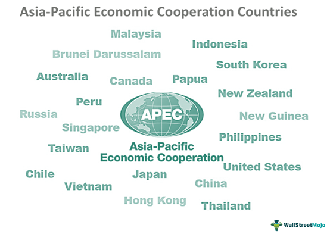

The Asia-Pacific Economic Cooperation (APEC) functions as a pivotal entity in molding the economic policies of countries bordering the Pacific Rim. Established to foster free trade and economic collaboration, APEC's initiatives significantly influence global markets. By promoting tariff reductions and improving customs operations, APEC has successfully bridged economic disparities between developed and developing nations within the region. Its multilateral approach to policy-making not only supports international trade but also plays a crucial role in ensuring sustainable economic development.

In recent years, algorithmic trading has emerged as a key component of the financial landscape within the Asia-Pacific. This sophisticated form of trading, relying on computer algorithms to execute orders based on complex mathematical models, has transformed how financial markets operate. Algorithmic trading enhances market efficiency and liquidity while reducing transaction costs, making it an attractive option for investors and financial institutions alike.

The interaction between APEC's economic policies and the rise of algorithmic trading is an area of growing importance. As APEC continues to champion free trade and technological advancement, understanding this interplay will be essential for grasping future economic cooperation and predicting market trends. This article aims to elucidate the impact of APEC's policies on the advancement of algorithmic trading and explore the broader implications for economic progress in the region. Through a comprehensive analysis, we can better appreciate how these developments will shape the Asia-Pacific's economic landscape in the years to come.

## Table of Contents

## APEC: Promoting Free Trade and Economic Cooperation

The Asia-Pacific Economic Cooperation (APEC) was established in 1989 with the primary goal of enhancing free trade and economic collaboration among the countries situated around the Pacific Rim. As a unique economic forum, APEC comprises 21 member economies, including both developed and developing nations, each contributing to the shared goal of regional prosperity.

A significant focus of APEC is addressing policy issues like tariff reduction and improving customs efficiency. The forum has undertaken several initiatives to promote trade liberalization and economic integration. By encouraging the reduction of trade barriers, APEC aims to facilitate smoother and more efficient trade flows throughout the region. One of the cornerstones of APEC's strategy is its commitment to achieving free and open trade and investment in the Asia-Pacific by promoting more integrated and streamlined market practices among its members.

APEC’s initiatives have played a pivotal role in bridging the economic divide between developed and developing nations within the region. By offering technical assistance, capacity building, and policy advice, APEC helps emerging economies strengthen their market frameworks and participate more actively in global trade. This support is crucial in providing these nations with the tools needed to enhance their economic capabilities and competitiveness.

The multilateral approach adopted by APEC in formulating economic policies not only bolsters individual economies but also fosters a cooperative environment that benefits international trade as a whole. By encouraging economies to work collectively on shared goals, APEC creates a platform for dialogue and cooperation, which is instrumental in addressing cross-border challenges and opportunities.

In addition to trade liberalization, APEC has also made significant efforts in other areas such as digital economy integration and sustainable development, which further strengthen its role as a cornerstone of regional economic cooperation. Through various working groups and special initiatives, APEC addresses emerging economic trends and challenges, ensuring that the region remains adaptable and resilient in the face of global economic shifts.

## The Rise of Algorithmic Trading in Asia-Pacific

Algorithmic trading, an innovative method employing automated buying and selling based on mathematical models, has significantly transformed financial markets in the Asia-Pacific region. This form of trading employs algorithms to execute orders at optimal times and prices, minimizing human error and emotional bias. 

One of the primary advantages of [algorithmic trading](/wiki/algorithmic-trading) in the Asia-Pacific is its ability to enhance market efficiency. By executing orders rapidly and accurately, algorithmic trading reduces the time lag associated with traditional trading methods. This efficiency boosts [liquidity](/wiki/liquidity-risk-premium), which is critical in ensuring that securities can be sold without causing drastic price changes, benefiting both investors and market stability. Enhanced liquidity, in turn, supports more transparent market environments by ensuring consistent and fair pricing.

The Asia-Pacific region hosts some of the world's leading financial centers, such as Tokyo and Hong Kong. These hubs have been instrumental in pioneering the adoption and integration of algorithmic trading technologies. The advanced financial infrastructure in these cities supports complex algorithmic operations, thereby attracting global trading firms and investors. Furthermore, the technological advancements in these cities offer fertile ground for the development and testing of sophisticated trading algorithms.

The rise of algorithmic trading has resulted in a shift in the investment landscape across the Asia-Pacific. Traditional brokerage firms are increasingly investing in technology to enhance their trading capabilities, while new firms specializing in algorithmic trading are gaining market share. This transition necessitates adaptations in regional policies and regulations to accommodate the unique demands of algorithmic trading. Regulatory bodies are tasked with ensuring that these practices do not compromise market integrity or contribute to financial instability. 

Overall, the growth of algorithmic trading in the Asia-Pacific region reflects broader global trends towards automation and digital transformation in financial markets. The region's financial hubs are key players in this evolution, shaping the future of trading through technology-driven strategies. As algorithmic trading continues to expand, its integration with regional policies will play a crucial role in defining the region's economic landscape.

## Impact of APEC Policies on Algorithmic Trading

APEC's policies are pivotal in supporting the growth and integration of algorithmic trading within the Asia-Pacific region. By advocating for standardized regulations and transparent market practices, APEC facilitates a level playing field for trading activities. These efforts are particularly significant as they help mitigate the complexities and inconsistencies that often arise from the varying regulatory landscapes across different member economies.

Policies aimed at harmonizing regulations across APEC member countries significantly reduce barriers to trade and facilitate cross-border transactions. Standardization ensures that algorithmic trading platforms operate under cohesive guidelines, minimizing discrepancies that could hinder market efficiency. This is crucial in enabling a seamless flow of capital and resources, thereby enhancing market liquidity and stability.

APEC's focus on intellectual property protection and digital economy integration further supports technological advancements in trading. The protection of intellectual property rights encourages innovation by ensuring that firms and individuals can invest in new technologies with confidence that their creations will be safeguarded. This is particularly important for algorithmic trading, where proprietary algorithms and models form the cornerstone of competitive advantage. 

Moreover, integration of digital economies across the region aligns with APEC's vision of a connected and efficient market environment, promoting the adoption of algorithmic trading technologies. This digital economy framework supports investments in AI-driven trading systems, facilitating their development and deployment across member economies.

These policies collectively create an enabling environment tailored for algorithmic trading platforms and AI-driven investments. By fostering a climate of cooperation and regulatory alignment, APEC not only supports the refinement of financial trading technologies but also ensures these advancements contribute positively to the region's economic growth and stability. The strategic foresight and collaborative initiatives by APEC thus represent an integral aspect of the evolving financial market landscape in the Asia-Pacific region.

## Challenges and Opportunities

Algorithmic trading, while bringing numerous opportunities, also introduces several challenges that require careful consideration by APEC member economies. A notable concern is the increase in market [volatility](/wiki/volatility-trading-strategies) and the potential for systemic risks. The rapid buying and selling facilitated by algorithms can amplify market movements, leading to volatility that may not reflect the underlying economic fundamentals. This transient volatility can result in losses not only for individual traders but also for exchanges and the overall financial system.

APEC economies must address these challenges through the establishment and enforcement of robust regulatory frameworks. Effective regulations should focus on fostering innovation in trading technologies while ensuring market stability and integrity. For instance, implementing circuit breakers can help manage excessive volatility by pausing trading activity in response to abrupt market fluctuations. Additionally, transparency measures, such as the disclosure of algorithmic trading strategies, can aid in understanding these systems' impacts and mitigating risks associated with their use.

To successfully manage the intersection of algorithmic trading and economic policies, collaboration among APEC member countries is essential. By sharing best practices and aligning regulatory standards, these economies can work together to create a harmonious trading environment. This cooperative approach can help identify emerging threats and establish comprehensive strategies to address them.

The dynamic nature of trading technologies necessitates adaptable policies that can keep pace with rapid advancements. Policymakers should engage in continuous monitoring and assessment of technological developments in trading to craft regulations that facilitate both economic cooperation and technological innovation. Implementing regulatory sandboxes, for example, could provide a controlled environment for testing new trading strategies and technologies, allowing regulators to evaluate potential risks and benefits before widespread adoption.

In conclusion, while algorithmic trading offers significant opportunities for enhancing market efficiency and liquidity, it also presents notable challenges that require proactive and adaptive policy responses from APEC member economies. By prioritizing regulatory frameworks that promote innovation while ensuring market stability, these economies can effectively harness the benefits of algorithmic trading, fostering a sustainable and prosperous economic future.

## Conclusion

APEC's commitment to fostering free trade and robust economic policies significantly influences the development of algorithmic trading within the Asia-Pacific region. By creating a framework that supports innovation, APEC's initiatives mitigate cross-border trading barriers and encourage technological advancement, paving the way for widespread adoption of algorithmic trading methodologies. 

In balancing innovation with regulatory prudence, APEC member economies can effectively harness the opportunities inherent in technological advancements. This balance is crucial, as it ensures that the benefits brought by algorithmic trading—such as increased liquidity, market efficiency, and reduced transaction costs—do not come at the expense of market stability. Achieving this balance involves developing and implementing sound regulatory frameworks, capable of both encouraging innovation and safeguarding against volatility and systemic risks.

The synergy between APEC's policies and algorithmic trading's dynamic nature is poised to offer substantial benefits to the Asia-Pacific region. By harmonizing regulations and promoting cross-border integration of financial markets, APEC enables member economies to take full advantage of technological advancements in trading. This synergy not only boosts economic activity but also positions the region as a leader in the adoption of cutting-edge trading technologies.

As member economies navigate these developments, cooperation and strategic foresight will be essential to securing future economic prosperity. Collaborative efforts among APEC members will ensure that the adoption of algorithmic trading is both sustainable and aligned with broader economic goals. By leveraging collective expertise and shared resources, the Asia-Pacific region can maximize the economic benefits of algorithmic trading while maintaining market resilience and stability.

## References & Further Reading

[1]: Berkam, D. (2015). ["The Role of APEC in Promoting Regional Economic Integration."](https://www.apec.org/Press/Blogs/2012/0417_economic) International Monetary Fund. 

[2]: Woodard, C. (2010). ["Algorithmic Trading in Asia - Pacific: Trends & Barriers."](https://journals.ku.edu/melittology/article/view/22533) Securities Commission Malaysia.

[3]: Chaboud, A. P., Chiquoine, B., Hjalmarsson, E., & Vega, C. (2014). ["Rise of the Machines: Algorithmic Trading in the Foreign Exchange Market."](https://papers.ssrn.com/sol3/papers.cfm?abstract_id=1501135) The Federal Reserve.

[4]: Tapscott, D., & Tapscott, A. (2016). ["Blockchain Revolution: How the Technology Behind Bitcoin is Changing Money, Business, and the World."](https://dl.acm.org/doi/10.5555/3051781) Penguin Random House.

[5]: Hamada, K., & Howitt, P. (2006). ["Monetary Policy with a Dynamical Trading Economy."](https://www.scirp.org/reference/referencespapers?referenceid=3661540) The Economic Journal.