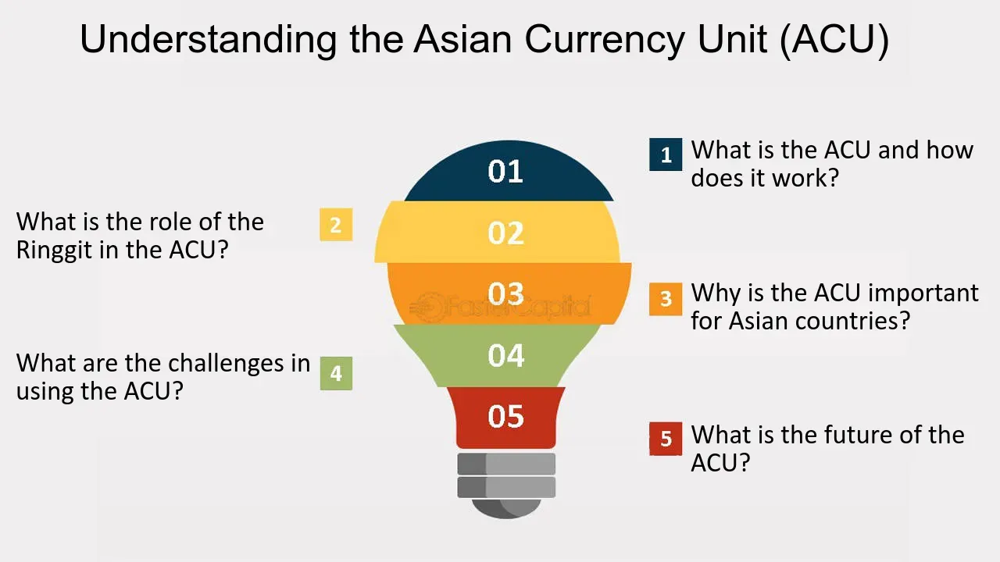

## Table of Contents

## What is the Asian Currency Unit (ACU)?

The Asian Currency Unit (ACU) is a concept similar to the European Currency Unit (ECU) that was used before the Euro. It is a basket of currencies from different Asian countries. The idea behind the ACU is to help Asian countries trade with each other more easily and to make their economies stronger together.

The ACU has not been officially adopted yet, but it is being talked about by some Asian countries. If it is used, it could help reduce the risks of currency changes when trading between Asian countries. It might also make it easier for these countries to work together on economic projects.

## How was the concept of the ACU developed?

The idea of the Asian Currency Unit (ACU) came about because people wanted to make trade between Asian countries easier. Just like how the European countries used the European Currency Unit (ECU) before they had the Euro, some people thought that a similar system could help Asian countries. The ACU would be a mix of different Asian currencies, like the Japanese Yen, Chinese Yuan, and others. This way, when countries trade with each other, they wouldn't have to worry as much about their own currency's value going up and down.

The concept of the ACU started being talked about more seriously in the early 2000s. It was discussed at meetings like the ASEAN+3, which includes countries from the Association of Southeast Asian Nations (ASEAN) plus China, Japan, and South Korea. The idea was to create a currency unit that could help these countries work together better and make their economies stronger. Even though the ACU has not been officially used yet, it is still an important idea that people in Asia keep thinking about.

## Which countries are involved in the ACU?

The Asian Currency Unit (ACU) is an idea that involves many countries in Asia. The main countries that have been talking about the ACU are the members of ASEAN, which stands for the Association of Southeast Asian Nations. ASEAN includes countries like Indonesia, Malaysia, the Philippines, Singapore, Thailand, Brunei, Vietnam, Laos, Myanmar, and Cambodia.

Besides ASEAN, three other big countries in Asia are also part of the discussions about the ACU. These countries are China, Japan, and South Korea. Together, they are called ASEAN+3. These countries have been meeting and talking about how the ACU could help them trade with each other more easily and make their economies stronger.

Even though the ACU is not used yet, these countries keep thinking about it. They believe that having a common currency unit could help them work together better and reduce the risks of their own currencies changing in value too much.

## What is the purpose of the ACU?

The Asian Currency Unit (ACU) is an idea to help Asian countries trade with each other more easily. The ACU would be made up of different Asian currencies, like the Japanese Yen, Chinese Yuan, and others. By using the ACU, countries wouldn't have to worry as much about their own currency's value going up and down when they trade with each other. This could make trading safer and more predictable.

The ACU is talked about by countries in the ASEAN group, which includes Indonesia, Malaysia, the Philippines, Singapore, Thailand, Brunei, Vietnam, Laos, Myanmar, and Cambodia. Also, China, Japan, and South Korea, known as ASEAN+3, are part of these talks. They believe that using the ACU could help their economies work better together and become stronger. Even though the ACU is not used yet, these countries keep thinking about it because they see it as a good way to improve their trade and economic cooperation.

## How does the ACU function as a unit of account?

The Asian Currency Unit (ACU) works as a unit of account by being a mix of different Asian currencies. It's like a basket where you put a little bit of the Japanese Yen, Chinese Yuan, and other Asian currencies. When countries use the ACU, they can measure the value of their trade and financial deals in this common unit. This makes it easier for them to understand how much things are worth when they trade with each other.

Using the ACU as a unit of account helps reduce the risk of currency changes. If a country's own currency goes up or down a lot, it can make trading harder. But with the ACU, countries can use a more stable unit to keep track of their trade. This way, they don't have to worry as much about their own currency's value changing all the time. It makes trading between Asian countries safer and more predictable.

## What are the benefits of using the ACU for regional trade?

Using the Asian Currency Unit (ACU) for regional trade can make trading between Asian countries easier and safer. The ACU is a mix of different Asian currencies, like a basket with a little bit of the Japanese Yen, Chinese Yuan, and others. When countries use the ACU, they can measure the value of their trade in this common unit. This means they don't have to worry as much about their own currency's value going up and down. It makes trading more predictable because the ACU is more stable than just using one country's currency.

Another benefit is that the ACU can help Asian countries work together better. Countries in the ASEAN group, plus China, Japan, and South Korea, talk about using the ACU. If they use it, it could help their economies become stronger together. By trading with the ACU, they can do more business with each other without the risk of big currency changes. This can lead to more trade and more projects between these countries, making the whole region's economy better.

## How is the value of the ACU determined?

The value of the Asian Currency Unit (ACU) is figured out by mixing together different Asian currencies. It's like making a smoothie with a little bit of the Japanese Yen, Chinese Yuan, and other Asian currencies. Each currency in the mix has its own special amount, kind of like a recipe. This recipe decides how much each currency affects the ACU's value. So, if the Yen or Yuan changes in value, it will change the ACU's value too, but not as much as if you were just using one currency.

The exact recipe for the ACU is decided by the countries that want to use it. They talk about it in meetings like ASEAN+3, which includes countries from the Association of Southeast Asian Nations (ASEAN) plus China, Japan, and South Korea. These countries decide how much of each currency should go into the ACU to make it fair and useful for everyone. By using this mix, the ACU becomes a stable way to measure the value of trade between these countries, making it easier and safer for them to do business with each other.

## What challenges does the implementation of the ACU face?

One big challenge for the Asian Currency Unit (ACU) is getting all the countries to agree on how to make it work. Each country has its own currency and its own economy, and they might not all want to use the ACU the same way. It's hard to decide how much of each currency should go into the ACU, and some countries might feel like they're not getting a fair deal. They need to talk a lot and work together to make everyone happy, which can take a long time.

Another challenge is making sure the ACU is strong and trusted by everyone. If people don't believe in the ACU, they won't want to use it for trading. It needs to be stable so that when countries trade with each other, they feel safe. But if one country's currency changes a lot, it can make the ACU less stable. Also, setting up all the rules and systems to use the ACU can be tricky and expensive. It's a big project that needs a lot of planning and money to get right.

## How does the ACU compare to other regional currency units like the Euro?

The Asian Currency Unit (ACU) and the Euro are both ideas to help countries trade more easily, but they are different in some ways. The Euro is a real currency that many European countries use every day. It's not just a way to measure trade; it's the actual money people use in places like France, Germany, and Italy. The ACU, on the other hand, is still just an idea. It's a mix of different Asian currencies, like the Japanese Yen and Chinese Yuan, but it's not used as real money yet. Countries in Asia are still talking about it and trying to figure out if it's a good idea.

Another difference is how they work. The Euro is a single currency that replaced the old currencies of the countries that use it. When you go to a country that uses the Euro, you don't need to change your money if you already have Euros. The ACU, if it's used, would be more like a tool to help measure the value of trade between Asian countries. It wouldn't replace their own currencies, but it would make trading safer and easier by reducing the risk of big changes in currency values. So, while the Euro is a complete currency union, the ACU is more about helping countries work together better without fully giving up their own currencies.

## What role does the ACU play in financial stability within Asia?

The Asian Currency Unit (ACU) could help make financial stability better in Asia. It's like a special mix of different Asian currencies, such as the Japanese Yen and Chinese Yuan. By using the ACU, countries can trade with each other without worrying too much about their own currency's value going up and down. This makes trading safer and more predictable. When trade is stable, it helps the whole region's economy stay strong and steady.

Even though the ACU is not used yet, it's an idea that could bring Asian countries closer together. If they all use the ACU, it could help them work together better on big projects and make their economies stronger. By having a common way to measure trade, countries can trust each other more and do more business together. This could lead to less financial trouble and more growth for everyone in Asia.

## How might the ACU impact global currency markets?

The Asian Currency Unit (ACU) could change how global currency markets work. It's like a mix of different Asian currencies, and if it's used, it might make Asian countries trade more with each other. This could mean less trading with other parts of the world, like Europe or America. When Asian countries use the ACU, it might make their currencies more stable and less likely to go up and down a lot. This could make people in other countries feel more sure about trading with Asia, but it might also make them worry if the ACU becomes too strong and affects their own currencies.

Also, the ACU could make Asia a bigger player in the global economy. Right now, the US dollar and the Euro are very important in the world's money markets. But if Asian countries start using the ACU more, it could become another big currency that people pay attention to. This might make the global money markets more balanced, with more different currencies being important. But it could also make things more complicated because people would have to keep track of another big currency. Overall, the ACU could shake things up in the world's money markets, making them both more stable and more complex.

## What are the future prospects and potential developments for the ACU?

The future of the Asian Currency Unit (ACU) depends on how well Asian countries can work together. Right now, the ACU is just an idea, but if more countries agree to use it, it could become a real tool for trade. The countries in the ASEAN group, plus China, Japan, and South Korea, need to keep talking and planning. If they can make the ACU fair and useful for everyone, it might start being used more. This could help Asian countries trade more easily and make their economies stronger together.

In the future, the ACU could grow and change. It might start as a way to measure trade and then become more important. If it works well, more countries might want to join in. The ACU could also help Asian countries do big projects together, like building roads or sharing technology. But it will take time and a lot of work to make the ACU a success. If Asian countries can keep working together and solving problems, the ACU could become a big part of how they do business in the future.

## What is the Importance of Currency Baskets in Global Finance?

Currency baskets play an essential role in global finance by mitigating exchange rate risks and enhancing financial stability for countries extensively involved in international trade and economic integration. By using a basket of currencies, central banks can stabilize their national currencies against a weighted collection of international currencies rather than relying on a single currency, such as the US dollar. This approach helps to reduce [volatility](/wiki/volatility-trading-strategies) in exchange rates, which is particularly important for countries whose economies are sensitive to external shocks.

A currency basket operates by assigning weights to selected foreign currencies based on predetermined criteria, such as the trading [volume](/wiki/volume-trading-strategy) or economic significance of each currency in relation to the basket user's economy. The weighted average value of these currencies then determines the value of the basket, which can be used as a reference for the domestic currency. This system allows countries to manage their exchange rates more effectively by minimizing the impact of fluctuations in any one currency.

For instance, consider a currency basket composed of the following currencies with their respective weights: 40% USD, 30% EUR, 20% JPY, and 10% GBP. If we denote the exchange rates of these currencies against a base currency as $E_{USD}, E_{EUR}, E_{JPY},$ and $E_{GBP}$, the value of the currency basket, $B$, can be calculated as:

$$
B = 0.4 \times E_{USD} + 0.3 \times E_{EUR} + 0.2 \times E_{JPY} + 0.1 \times E_{GBP}
$$

By utilizing this weighted average, central banks can implement monetary policies that buffer against currency misalignments and reduce exposure to single-market fluctuations.

This mechanism is vital for countries with diverse trade relationships and those pursuing economic integration. In regions like the European Union or ASEAN, currency baskets can act as shock absorbers, allowing member countries to handle asymmetric shocks more efficiently without resorting to distinct monetary policies that could lead to further economic divergence. Additionally, the predictability and stability offered by currency baskets attract foreign direct investments (FDI) by creating a stable financial environment, thus fostering economic growth.

Overall, the strategic implementation of currency baskets in global finance supports countries in navigating complex international economic landscapes by offering a balanced approach to managing exchange rate risks.

## References & Further Reading

[1]: Ogawa, Eiji. (2007). ["AMU Deviation Indicators for Coordinated Exchange Rate Policies in East Asia and Monetary Cooperation."](https://papers.ssrn.com/sol3/papers.cfm?abstract_id=951338) In: "Cooperation or Competition?," 165-186. Springer, Berlin, Heidelberg.

[2]: Kawai, Masahiro, & Takagi, Shinji. (2005). ["Toward a Regional Exchange Rate Regime in East Asia."](https://onlinelibrary.wiley.com/doi/10.1002/ijfe.267) Asian Development Bank. 

[3]: Bhalla, A. S. (2019). ["Asian Economic Integration Report."](https://www.adb.org/publications/asian-economic-integration-report-2019-2020) Asian Development Bank. 

[4]: McKinnon, Ronald I. (2005). ["Exchange Rates under the East Asian Dollar Standard: Living with Conflicted Virtue."](https://archive.org/details/exchangeratesund0000mcki) MIT Press.

[5]: Ito, Takatoshi, & Park, Yung Chul. (2004). ["Developing the Asian Bond Markets: Progress and Challenges."](https://old.pecc.org/publications/639-developing-asian-bond-markets-challenges-and-strategies) Asian Development Bank.

[6]: Cohen, Benjamin J. (2008). ["Monetary Union: Theory, Practice, and Analysis of Asian Currency Units."](https://link.springer.com/article/10.1007/s11558-008-9043-4) Routledge.

[7]: Arnaboldi, Francesca. (2014). ["Financial Innovation in Banking: A Special Issue of European Journal of Finance."](https://www.semanticscholar.org/paper/1-Financial-innovation-in-banking-Arnaboldi-Rossignoli/6819cb83555d96832df24ddd7c4ae8f3d44dc313) Taylor & Francis.