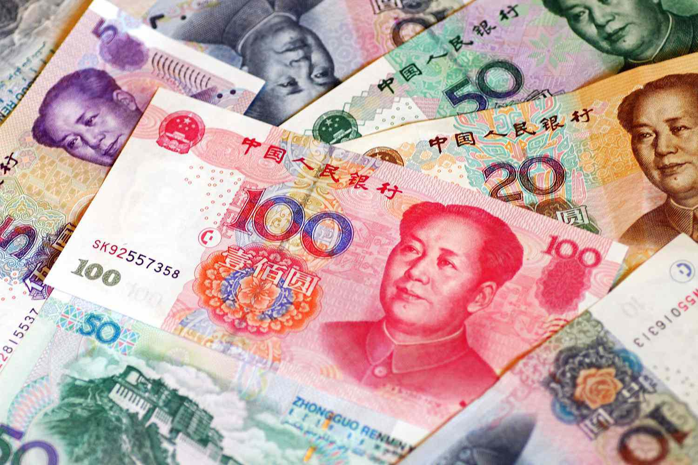

In the evolving global financial landscape, the concept of currency baskets, including the Asian Currency Unit (ACU), has garnered significant attention. Currency baskets are collections of selected currencies grouped together to provide a comprehensive measure of value or to stabilize exchange rates within a region. The ACU is a proposed currency basket for Asia, intended to serve as a stabilizing force against the volatility often observed in individual national currencies. By drawing together the economic strengths of various Asian nations, it aims to foster monetary cooperation and reduce dependence on the US dollar, thereby enhancing regional financial stability.

This article explores the proposed ACU currency basket within the Asian monetary system and its implications for algorithmic trading. It provides insights into the components and significance of currency baskets and examines their impact on modern finance. In particular, the focus is on how currency baskets can influence trading strategies and financial decision-making. Currency baskets like the ACU could be utilized in algorithmic trading to manage risks and improve trading efficiency across foreign exchange markets. By analyzing historical and projected data, traders can leverage such baskets to craft more informed and diversified trading strategies.



The investigation into the ACU and currency baskets also extends to their role in mitigating exchange rate risks, promoting economic integration, and fostering closer economic ties among participating countries. The discussion emphasizes the need for ongoing research and policy development, which will be crucial in determining the feasibility and strategic advantages of currency baskets like the ACU in stabilizing and integrating the Asian monetary system.

## Table of Contents

## Understanding the Asian Currency Unit (ACU)

The Asian Currency Unit (ACU), often referred to as the Asian Monetary Unit, represents a proposed financial instrument comprising a collection of major Asian currencies. The primary objective of the ACU is to stabilize exchange rates within the region and reduce the dependency on the US dollar, thereby fostering greater monetary cooperation among Asian economies. The concept was initially put forward by the Asian Development Bank (ADB), drawing inspiration from the European Currency Unit (ECU), which was the forerunner to the euro.

The ACU is designed as a theoretical currency basket that includes a range of Asian currencies. By creating a unified currency index, the ACU aims to offer a more stable financial environment for Asian countries by mitigating the excessive volatility associated with currency exchange rates. This stability is particularly important for economies with significant trading activities, as abrupt currency fluctuations can severely impact trade balances and economic growth.

The ACU is modeled after the European Currency Unit (ECU), the basket of European currencies that preceded the euro. The ECU facilitated closer monetary cooperation among European nations by serving as a unit of account in the European Monetary System (EMS), providing a benchmark for exchange rate mechanisms. Similarly, the ACU seeks to act as an anchor for Asian monetary systems by encouraging aligned fiscal and monetary policies across the region.

Despite its primarily academic nature, the ACU holds significant potential in the context of international finance. By encouraging greater monetary cooperation, it could play a pivotal role in diminishing Asia's reliance on the US dollar. This shift is essential for enhancing the financial autonomy of Asian countries and could lead to more resilient regional economies.

As a theoretical construct, the ACU remains an intricate proposal rather than a functional currency. Its implementation would require extensive coordination and consensus among Asian nations, each with diverse economic landscapes and priorities. However, the ACU's proposition highlights a crucial step towards integrated financial systems in Asia that can adapt to an increasingly interconnected global economy.

## The ACU Currency Basket

The ACU proposal encompasses currencies from 13 East Asian countries, including major economies such as China, Japan, and South Korea. The central intention behind the ACU is to foster exchange rate stability within the region by potentially linking local currencies to a collective basket. This strategy aims to counterbalance the [volatility](/wiki/volatility-trading-strategies) stemming from fluctuations in a single dominant currency, such as the US dollar, thus providing a more stable economic environment for trade and investment in Asia.

Theoretical models suggest that by pegging currencies to a weighted basket, like the ACU, countries can reduce their susceptibility to external economic shocks. For instance, if the basket is comprised of currencies with varying volatilities and economic strengths, the combined model may exhibit less fluctuation than any single currency in the basket. This multi-currency buffer approach is designed to offer a more balanced and resilient economic framework.

Although the ACU remains a conceptual model, understanding its structure is essential for apprehending its potential economic impact on Asia. The implementation of such a basket would require consideration of the economic weight and trade volumes of each participating country. This can be modeled mathematically by quantifying the contribution of each currency to the basket using their respective GDPs or trade weights. For example, if using Python to model this within an economic framework, one might calculate a weighted index as follows:

```python
import pandas as pd

# Hypothetical data for the purpose of illustration
countries = ['China', 'Japan', 'South Korea', 'Others']
gdp_weights = [0.40, 0.30, 0.15, 0.15]  # Example weights based on GDP contribution
exchange_rates = [1.0, 130.0, 1150.0, 10.0]  # Example exchange rates

# Calculate the weighted basket value
acu_value = sum(w / r for w, r in zip(gdp_weights, exchange_rates))
print(f"The proposed ACU basket value is: {acu_value}")
```

This example encapsulates the principle of a currency basket where each currency's influence is weighted according to its relative economic size. Recognizing that the ACU remains theoretical provides a basis for further exploration of its implications on regional monetary cooperation and potential economic integration.

## Importance of Currency Baskets in Global Finance

Currency baskets play an essential role in global finance by mitigating exchange rate risks and enhancing financial stability for countries extensively involved in international trade and economic integration. By using a basket of currencies, central banks can stabilize their national currencies against a weighted collection of international currencies rather than relying on a single currency, such as the US dollar. This approach helps to reduce volatility in exchange rates, which is particularly important for countries whose economies are sensitive to external shocks.

A currency basket operates by assigning weights to selected foreign currencies based on predetermined criteria, such as the trading [volume](/wiki/volume-trading-strategy) or economic significance of each currency in relation to the basket user's economy. The weighted average value of these currencies then determines the value of the basket, which can be used as a reference for the domestic currency. This system allows countries to manage their exchange rates more effectively by minimizing the impact of fluctuations in any one currency.

For instance, consider a currency basket composed of the following currencies with their respective weights: 40% USD, 30% EUR, 20% JPY, and 10% GBP. If we denote the exchange rates of these currencies against a base currency as $E_{USD}, E_{EUR}, E_{JPY},$ and $E_{GBP}$, the value of the currency basket, $B$, can be calculated as:

$$
B = 0.4 \times E_{USD} + 0.3 \times E_{EUR} + 0.2 \times E_{JPY} + 0.1 \times E_{GBP}
$$

By utilizing this weighted average, central banks can implement monetary policies that buffer against currency misalignments and reduce exposure to single-market fluctuations.

This mechanism is vital for countries with diverse trade relationships and those pursuing economic integration. In regions like the European Union or ASEAN, currency baskets can act as shock absorbers, allowing member countries to handle asymmetric shocks more efficiently without resorting to distinct monetary policies that could lead to further economic divergence. Additionally, the predictability and stability offered by currency baskets attract foreign direct investments (FDI) by creating a stable financial environment, thus fostering economic growth.

Overall, the strategic implementation of currency baskets in global finance supports countries in navigating complex international economic landscapes by offering a balanced approach to managing exchange rate risks.

## Algorithmic Trading and Currency Baskets

Incorporating currency baskets into [algorithmic trading](/wiki/algorithmic-trading) systems can significantly amplify trading efficiency and improve risk management. These baskets, representing a selected group of currencies, provide enhanced market stability due to their diversified nature. By encompassing multiple currencies, they reduce exposure to the volatility of any single currency, enabling traders to leverage this stability in developing robust algorithmic strategies.

Algorithmic trading strategies often rely on quantitative models that analyze historical data to predict future price movements in foreign exchange markets. The intrinsic stability of currency baskets makes them attractive for these models. For instance, a trader using a currency basket can better hedge against specific geopolitical risks affecting individual currencies. By using algorithms that account for weighted currency averages in the basket, traders can make more informed and balanced trading decisions.

Additionally, integrating currency baskets addresses the diversification needs of traders. Diversification is a crucial risk management strategy, allowing investors to spread risk across various assets to mitigate losses. Currency baskets naturally lend themselves to this purpose, offering built-in diversification across multiple countries' economic landscapes. Trading algorithms, in turn, can exploit this diversification, implementing positions that benefit from relative currency strength rather than absolute currency performance. This minimizes risk while enhancing potential returns, offering traders an edge in volatile market conditions.

In practical terms, algorithmic strategies might employ Python libraries such as NumPy or pandas to execute analytical tasks. For example, a simplified version of an algorithmic model using a currency basket may look like the following Python snippet:

```python
import numpy as np

# Assume 'currencies' is an array of exchange rates of the currencies in the basket
currencies = np.array([1.2, 0.9, 130.5, 6.9])  # Example exchange rates to USD for a basket

# Calculate the weighted average of the currency basket
weights = np.array([0.25, 0.25, 0.25, 0.25])  # Equal weights for simplicity
basket_value = np.dot(currencies, weights)

print("Basket value:", basket_value)
```

This code computes the weighted average of the currency exchange rates within the basket, which is a fundamental process in understanding the basket's relative performance. Algorithmic traders build upon these basic computations to design comprehensive models suited for high-frequency trading or long-term investment strategies, maximizing their exposure to stable currency environments.

As the financial world continues to embrace technological advancements, currency baskets continue to be a pivotal element within algorithmic trading frameworks. By leveraging the inherent stability of baskets, traders can navigate the complexities of the foreign exchange market with enhanced precision and reduced risk exposure.

## Pros and Cons of the ACU Initiative

The proposed Asian Currency Unit (ACU) offers a blend of potential advantages and notable challenges that must be carefully considered to assess its feasibility.

One of the primary benefits of the ACU initiative is its potential to reduce exchange rate volatility within Asia. By creating a composite currency unit that reflects the economic stability of multiple countries, the ACU could provide a more stable benchmark for regional exchange rates compared to a solitary currency like the US dollar. This stability can foster greater economic linkages among Asian nations by facilitating smoother trade and investment flows. The harmonization of monetary policies across participating nations could further enhance regional economic cooperation and integration.

Additionally, implementing the ACU could strengthen collective bargaining power and mitigate the dependency on major currencies such as the US dollar or the euro. By reducing reliance on these external currencies, Asian countries might achieve greater monetary sovereignty and insulation from global economic shocks. Such a development could also lead to more synchronized economic policies and objectives among member countries.

However, several significant challenges complicate the development and adoption of the ACU. Regional economic disparities pose one of the most formidable obstacles. The Asian region is characterized by varied levels of economic development, where countries like Japan and South Korea have highly developed economies contrasted with emerging or developing nations such as Laos or Myanmar. These disparities could lead to conflict over the weighting of different currencies in the ACU, with larger economies seeking greater influence over the basket's composition.

Political obstacles are also a critical [factor](/wiki/factor-investing). Countries may be reluctant to cede monetary control to a regional framework, especially if it implies reduced national sovereignty over domestic monetary policy. The political will necessary to move beyond national interests remains a significant barrier to implementing a regional currency basket like the ACU.

In summary, while the ACU holds promise for fostering regional economic stability and collaboration in Asia, its potential success hinges on overcoming significant economic and political challenges. Analyzing both the benefits and drawbacks is crucial for determining the initiative's long-term viability and contribution to the Asian monetary landscape.

## Conclusion

While the Asian Currency Unit (ACU) remains largely theoretical, its exploration offers significant insights into the strategic utilization of currency baskets in the global financial arena. Currency baskets, such as the ACU, have the potential to offer a more stable monetary framework for international trade by reducing dependency on a single currency like the US dollar. This diversification can lessen exchange rate volatility, an advantage for economies heavily involved in global markets. Thus, understanding and potentially implementing such baskets is crucial for investors and financial analysts seeking to navigate the complexities of international trade.

Currency baskets can optimize financial strategies by mitigating risks associated with fluctuating exchange rates. For example, using a combination of multiple currencies weighted appropriately can provide a buffer against the adverse effects of currency devaluation in any single region. Investors can, therefore, make more informed trading decisions, aligning with broader economic trends rather than isolated currency shifts.

Importantly, ongoing research and policy dialogues will significantly influence the practical adoption of the ACU and similar initiatives. Policymakers need to thoroughly examine both the potential benefits and the geopolitical and economic challenges posed by the implementation of a unified currency basket in Asia. Issues such as economic disparity among member countries and political resistance must be addressed for successful regional monetary integration.

Analyzing the dynamics of currency baskets and their implications not only aids in the theoretical understanding but also enriches practical applications in international finance. The future role of such initiatives will depend on careful policy formulation, cooperative effort among nations, and adaptability to evolving economic realities. With sustained research and dialogue, the ACU could contribute to a more stable and integrated Asian monetary system, reinforcing the region's financial resilience and growth.

## References & Further Reading

[1]: Ogawa, Eiji. (2007). ["AMU Deviation Indicators for Coordinated Exchange Rate Policies in East Asia and Monetary Cooperation."](https://papers.ssrn.com/sol3/papers.cfm?abstract_id=951338) In: "Cooperation or Competition?," 165-186. Springer, Berlin, Heidelberg.

[2]: Kawai, Masahiro, & Takagi, Shinji. (2005). ["Toward a Regional Exchange Rate Regime in East Asia."](https://onlinelibrary.wiley.com/doi/10.1002/ijfe.267) Asian Development Bank. 

[3]: Bhalla, A. S. (2019). ["Asian Economic Integration Report."](https://www.adb.org/publications/asian-economic-integration-report-2019-2020) Asian Development Bank. 

[4]: McKinnon, Ronald I. (2005). ["Exchange Rates under the East Asian Dollar Standard: Living with Conflicted Virtue."](https://archive.org/details/exchangeratesund0000mcki) MIT Press.

[5]: Ito, Takatoshi, & Park, Yung Chul. (2004). ["Developing the Asian Bond Markets: Progress and Challenges."](https://old.pecc.org/publications/639-developing-asian-bond-markets-challenges-and-strategies) Asian Development Bank.

[6]: Cohen, Benjamin J. (2008). ["Monetary Union: Theory, Practice, and Analysis of Asian Currency Units."](https://link.springer.com/article/10.1007/s11558-008-9043-4) Routledge.

[7]: Arnaboldi, Francesca. (2014). ["Financial Innovation in Banking: A Special Issue of European Journal of Finance."](https://www.semanticscholar.org/paper/1-Financial-innovation-in-banking-Arnaboldi-Rossignoli/6819cb83555d96832df24ddd7c4ae8f3d44dc313) Taylor & Francis.