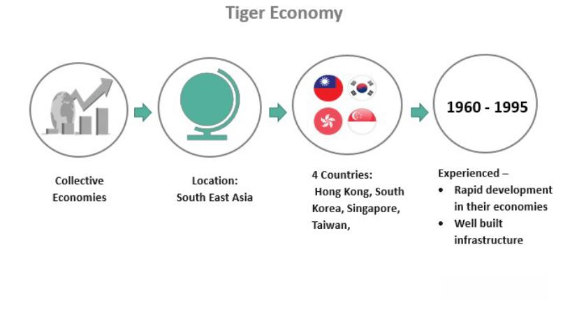

The Asian Development Bank (ADB) plays a significant role in promoting economic growth and development within the Asia-Pacific region. Established in 1966, the ADB functions as a multilateral development bank with a mission to reduce poverty and improve the living conditions of its members. By providing financial and technical assistance, ADB aims to bolster various sectors, including infrastructure, finance, and technological advancements, thereby fostering a conducive environment for sustainable growth.

Algorithmic trading has emerged as a transformative innovation in financial markets. This trading method involves the use of complex algorithms to execute orders at high speeds, enabling the analysis and utilization of vast volumes of financial data efficiently. The prevalence of algorithmic trading has significantly increased in global markets due to its ability to enhance liquidity and market stability.



This article explores the intersection of ADB's operations and the evolution of algorithmic trading across its member countries. By examining how ADB's initiatives in infrastructure and market development contribute to the expanding influence of algorithmic trading, we can better understand the profound implications for market efficiency and economic integration in the Asia-Pacific region.

## Table of Contents

## Understanding the Asian Development Bank's Role

The Asian Development Bank (ADB), established in 1966, is headquartered in Manila, Philippines. It operates as a multilateral development bank with a membership comprising 68 countries, including both regional and non-regional members. Its primary mission is to promote economic and social development across the Asia-Pacific region. This is achieved through various financial and non-financial interventions such as loans, grants, equity investments, and technical assistance.

ADB plays a crucial role in supporting projects that aim to foster economic growth and integration among its member nations. By providing financial resources, the bank aids in the development of essential infrastructure, which is vital for sustainable economic progress. The projects supported by ADB span across various sectors, including transportation, energy, water, and urban development, ensuring that the needs of diverse communities are addressed.

The assistance provided by ADB is instrumental in enhancing economic connectivity and infrastructure within and among member countries. This is essential for facilitating trade and investment, which are critical drivers of economic growth. By focusing on inclusive economic development, the ADB strives to reduce poverty and improve living standards across its member states.

In summary, the ADB's efforts are directed towards building a prosperous, inclusive, resilient, and sustainable Asia and the Pacific. Its multifaceted approach involves not only financial interventions but also knowledge sharing and capacity building, which together contribute to the long-term development objectives of its member countries.

## Algorithmic Trading: Definition and Significance

Algorithmic trading, commonly known as algo-trading, entails the use of automated systems that execute trades in financial markets. These systems are powered by complex algorithms capable of processing vast amounts of data at speeds and frequencies far beyond human capabilities. Algorithmic trading leverages mathematical models and neural networks to analyze market movements and implement strategies that range from simple to highly sophisticated.

This mode of trading has significantly altered the landscape of financial markets by enhancing [liquidity](/wiki/liquidity-risk-premium) and efficiency. Liquidity refers to the ease with which assets can be bought or sold in the market without causing drastic changes in their prices. Algorithmic trading contributes to this by providing a large [volume](/wiki/volume-trading-strategy) of trades rapidly, which helps to stabilize markets and narrow bid-ask spreads. Efficiency, on the other hand, is achieved as these algorithms eliminate human errors and operate on high-frequency strategies that optimize decision-making processes. 

For instance, algorithms can be programmed to execute trades when a stock's price moves beyond a certain threshold or when market conditions align with predefined criteria. Python programming, widely used in developing trading algorithms, might involve code to implement a simple moving average crossover strategy as seen below:

```python
import pandas as pd

def moving_average_strategy(prices, short_window=40, long_window=100):
    signals = pd.DataFrame(index=prices.index)
    signals['signal'] = 0.0

    signals['short_mavg'] = prices['Close'].rolling(window=short_window, min_periods=1, center=False).mean()
    signals['long_mavg'] = prices['Close'].rolling(window=long_window, min_periods=1, center=False).mean()

    signals['signal'][short_window:] = np.where(
        signals['short_mavg'][short_window:] > signals['long_mavg'][short_window:], 1.0, 0.0)

    signals['positions'] = signals['signal'].diff()

    return signals

# Assume 'data' is a pandas DataFrame containing stock price data
signals = moving_average_strategy(data)
```

By deploying strategies such as the one illustrated, traders can identify potential buy and sell signals without manual intervention, thereby streamlining operations and reducing latency. Moreover, [algorithmic trading](/wiki/algorithmic-trading) enhances transparency and accountability within financial markets by maintaining extensive logs of the trades executed.

In conclusion, algorithmic trading stands as a catalyst for innovation within financial markets, optimizing both liquidity and efficiency. This evolution underscores the critical intersection of technology and finance, paving the way for more advanced trading methodologies in the future.

## ADB's Influence on Financial Market Infrastructure

The Asian Development Bank (ADB) has played a pivotal role in shaping the financial market infrastructure of its member countries, fostering an environment that is conducive to the practice of algorithmic trading. Through a variety of projects focused on financial market development and technological improvements, ADB has indirectly supported the nuanced ecosystem in which algorithmic trading flourishes. These interventions typically target key areas such as market infrastructure, risk management systems, and regulatory frameworks, ensuring they are robust enough to complement the demands of modern trading methodologies.

A significant portion of ADB's influence comes from its funding and advisory initiatives aimed at strengthening financial markets' core infrastructures. This involves enhancing the exchanges, transaction settlement systems, and data dissemination channels—foundations crucial for algorithmic trading. Enhanced infrastructure reduces latency, a critical [factor](/wiki/factor-investing) in algorithmic trading, where transactions are conducted in microseconds. By minimizing transactional delays, markets become more efficient, and trading algorithms can operate optimally, exploiting minute price differences that human traders might miss.

Moreover, ADB's focus on improving risk management systems is crucial for fostering a trading environment where algorithmic activities can prosper without disproportionate systemic risks. Advanced risk management frameworks are necessary for monitoring trade activities, assessing the market's overall health, and preempting potential disruptions. This strategy also includes the development of sophisticated simulation tools and stress-testing mechanisms to examine how trading algorithms behave under various market conditions, ultimately ensuring stability and continued market confidence.

The regulatory frameworks supported by ADB also play an essential role. These frameworks need to be adaptable to accommodate rapid technological advancements and the complexity of algorithmic strategies. ADB assists member countries in developing regulations that align with international standards while being flexible enough to foster innovation. Such regulations include establishing guidelines for high-frequency trading, setting parameters for trade surveillance, and promoting transparency in algorithmic programs' design and implementation.

Through these comprehensive initiatives, ADB enhances the necessary conditions for efficient algorithmic trading. This creates not only a direct impact on countries' financial markets but also encourages foreign investment by showcasing a dependable and advanced trading environment. By supporting technological, infrastructural, and regulatory advancements, ADB contributes significantly to crafting an enabling environment where algorithmic trading can thrive, thereby spurring the financial markets' growth and integration in the Asia-Pacific region.

## Case Studies: ADB's Impact on Algorithmic Trading

### Indonesia

The Asian Development Bank (ADB) has played a pivotal role in advancing Indonesia's financial market operations through its 'Financial Market Development and Integration Program.' This initiative focuses on enhancing the country's financial infrastructure, fostering integration, and promoting stability, which collectively create an attractive environment for algorithmic trading activities.

One of the core components of this program is the enhancement of market transparency and efficiency. By implementing advanced technologies and improving trading platforms, the ease and speed of executing trades have been significantly increased. This technological upgradation aligns with the needs of algorithmic trading systems, which rely on high-frequency data and rapid execution speeds to identify trading opportunities and execute trades. Additionally, ADB's emphasis on integrating risk management systems has facilitated a more secure trading environment. This security is crucial for institutional investors who employ algorithmic trading strategies, as it minimizes the risks of financial irregularities and systemic failures.

The program also supports capacity-building initiatives that address regulatory and supervisory frameworks, ensuring that these frameworks are robust enough to manage the complexities introduced by high-frequency trading. With these improvements, foreign and local investors gain confidence in the reliability and integrity of Indonesia's financial markets, making it a conducive environment for algorithmic trading.

### Philippines

The Philippines has seen considerable advancements in its financial markets, significantly attributable to ADB’s support in technological and infrastructure projects. ADB’s continuous investment in these areas has laid the groundwork for a more dynamic and efficient financial market landscape, conducive to algorithmic trading.

ADB’s initiatives have included the modernization of stock exchanges and the implementation of state-of-the-art trading platforms, which are essential for algorithmic trading. These technologies facilitate increased trading volumes and the swift processing of transactions, reducing latency—a critical factor for algorithmic trading success. The integration of electronic trading systems enhances liquidity, allowing algorithmic traders to execute high volumes of trades with minimal market impact.

Moreover, ADB's projects emphasize strengthening regulatory environments, ensuring that they can adapt to the rapid advancements in trading technologies. By providing technical assistance and policy advisories, ADB helps align the Philippines' regulations with international standards, thereby protecting the market from potential algorithmic trading-related risks such as spoofing or market manipulation.

In conclusion, ADB's strategic focus on enhancing Indonesia and the Philippines' financial market infrastructures aids in attracting and nurturing algorithmic trading activities, with positive implications for market depth, liquidity, and overall economic growth.

## Challenges and Opportunities

While algorithmic trading offers substantial opportunities for growth by enhancing trade efficiency and market liquidity, it also brings regulatory risks that require vigilant management. Emerging markets, in particular, face the dual challenge of harnessing these technological advancements while ensuring market stability and integrity. As algorithmic trading operates at high speeds and volumes, it poses the risk of market abuse, such as spoofing—where traders place orders with the intent to cancel before execution to manipulate market prices. 

Furthermore, the complexity of algorithms can result in unforeseen trading patterns that contribute to systemic risks. Such risks become more acute in less-developed markets where regulatory frameworks and technological infrastructures are still evolving. Therefore, implementing comprehensive regulatory standards is crucial to safeguarding against market manipulation and ensuring fair trading practices.

For effective regulation, emerging markets should develop frameworks that balance innovation with risk management. Regulatory approaches may include:

1. **Real-time Monitoring Systems**: Deploy systems capable of analyzing trading data in real-time to detect and prevent manipulative activities. Technologies such as machine learning can be instrumental in this regard, capable of adapting to recognize new patterns indicative of market abuse.

    ```python
    import pandas as pd
    import numpy as np
    from sklearn.ensemble import IsolationForest

    # Example of using Isolation Forest for anomaly detection in trading data
    def detect_anomalies(data):
        model = IsolationForest(contamination=0.01)
        data['anomaly'] = model.fit_predict(data)
        anomalies = data[data['anomaly'] == -1]
        return anomalies

    # Simulated trading data
    trading_data = pd.DataFrame({
        'price': np.random.normal(100, 10, 1000),
        'volume': np.random.normal(1000, 50, 1000)
    })

    anomalies = detect_anomalies(trading_data)
    ```

2. **Robust Regulatory Frameworks**: Enhance existing laws to encompass the specifics of algorithmic trading, ensuring all trading activities are transparent and accountable. Regulations might include mandatory audit trails for algorithms and stricter standards on algorithm testing.

3. **International Collaboration**: Given the global nature of markets, international cooperation in regulatory practices can help harmonize standards across borders, minimizing regulatory arbitrage and ensuring that markets function smoothly.

In conclusion, capitalizing on the potential of algorithmic trading necessitates a proactive stance on regulatory evolution. By prioritizing the development of a robust regulatory environment, emerging markets can mitigate risks and foster a more resilient financial ecosystem that supports sustainable growth in the algorithmic trading sector.

## Conclusion

The symbiotic relationship between the Asian Development Bank (ADB) and the evolution of algorithmic trading underscores the critical importance of robust financial and technological infrastructures. As the ADB continues its mission of fostering economic growth and social development throughout the Asia-Pacific region, significant advancements in market infrastructure and regulatory environments are expected. These improvements create fertile ground for the expansion and optimization of algorithmic trading, which relies on efficient, stable, and transparent financial markets to operate effectively.

Algorithmic trading, characterized by its high-speed, high-frequency transactions driven by complex algorithms, benefits immensely from well-developed market infrastructures. ADB’s investment in enhancing these infrastructures across its member countries—from upgrading technological systems to enhancing regulatory frameworks—facilitates a more conducive environment for algo-trading to thrive. By streamlining transactions and improving market stability, these efforts reduce systemic risks and invite greater market participation, thus perpetuating a cycle of improved liquidity and market efficiency.

Moreover, as ADB implements comprehensive programs to bolster the risk management systems and financial integration of its member nations, it indirectly supports the infrastructure that underlies algorithmic trading. Initiatives such as these help to safeguard financial markets against [volatility](/wiki/volatility-trading-strategies), ensuring a stable trading environment which is crucial for the sustained growth of algorithmic trading. This relationship signals not only heightened opportunities for traders and investors but also contributes to the overall economic vibrancy and resilience of the region.

Thus, the continued development propagated by the ADB signifies more than merely economic growth; it promises a future where algorithmic trading can further innovate and integrate into financial systems, setting the stage for enhanced market operations and economic prosperity within the Asia-Pacific region.

## References & Further Reading

[1]: ["Asian Development Bank Annual Report 2022"](https://www.adb.org/documents/adb-annual-report-2022). Asian Development Bank.

[2]: Chandy, L. (2011). ["Ten Years of the Asian Development Bank Institute: Linking Research to Policy in Asia and the Pacific."](https://onlinelibrary.wiley.com/doi/10.1002/pad.1643) Asian Development Bank Institute.

[3]: Aldridge, I. (2013). ["High-Frequency Trading: A Practical Guide to Algorithmic Strategies and Trading Systems"](https://onlinelibrary.wiley.com/doi/pdf/10.1002/9781119203803.fmatter) - Comprehensive guide on algorithmic trading.

[4]: Hasbrouck, J., & Saar, G. (2013). ["Low Latency Trading"](https://www.sciencedirect.com/science/article/abs/pii/S1386418113000165) The Review of Financial Studies, 26(9), 2092–2121.

[5]: Sussman, N. (Ed.). (2017). ["Handbook of Blockchain, Digital Finance, and Inclusion, Volume 1: Cryptocurrency, FinTech, InsurTech, and Regulation"](https://www.sciencedirect.com/book/9780128104415/handbook-of-blockchain-digital-finance-and-inclusion-volume-1). Academic Press.