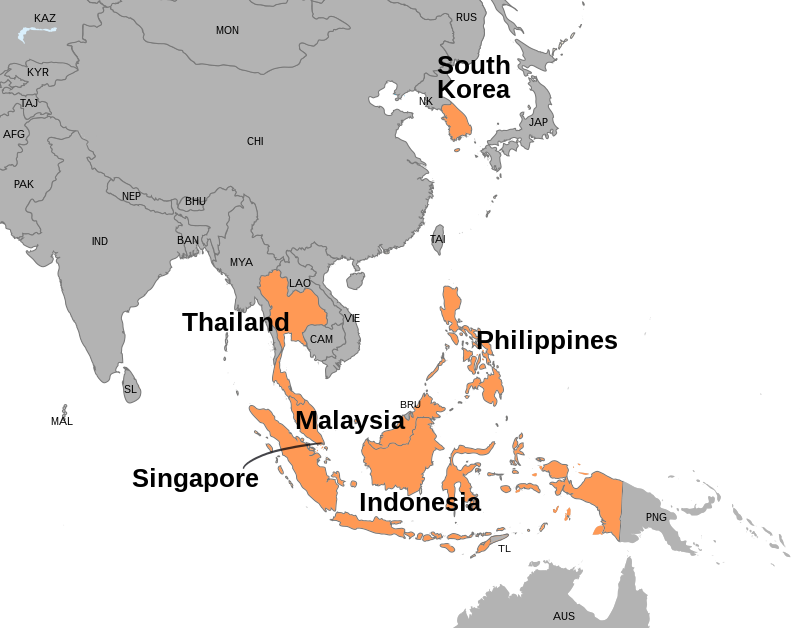

The Asian Financial Crisis marked a significant turning point in global economic history, demonstrating the volatility and interconnectedness of financial markets. Occurring in July 1997, the crisis initially erupted in Thailand with the dramatic collapse of the Thai baht, setting off a chain reaction across Southeast Asia. This period of financial turmoil had profound implications, not only for the affected countries but also for the entire global economy, highlighting the fragility of rapidly expanding markets.

This article provides a comprehensive exploration of the crisis, examining the economic responses that were undertaken to stabilize the affected economies and mitigate further damage. It investigates into the lessons learned from this critical juncture, emphasizing the need for robust economic policies and international collaborations to safeguard against future crises. Additionally, the article navigates through the evolution and impact of algorithmic trading in contemporary financial markets, a sphere that has gained prominence since the crisis.

Understanding the origins and responses to the Asian Financial Crisis is essential for gaining insights into modern economic strategies. The crisis underscored the imperative for transparent and resilient financial systems, capable of withstanding sudden economic shocks. In the context of today's financial markets, which are increasingly driven by technology, the experience also informs the development and regulation of automated trading systems. By dissecting these elements, we aim to elucidate how past experiences can shape effective trading technologies and economic policies in the present and future contexts.

## Table of Contents

## Overview of the Asian Financial Crisis

The Asian Financial Crisis, which erupted in July 1997, significantly affected the economies of Southeast Asia. The crisis was precipitated by the devaluation of the Thai baht, which occurred after the Thai government decided to float the currency, abandoning the fixed exchange rate to the U.S. dollar. This move was necessitated by the depletion of Thailand's foreign currency reserves, which had been used extensively to defend the baht against speculative attacks.

The devaluation of the baht caused a ripple effect across the region. Many Southeast Asian countries, such as Indonesia, South Korea, and Malaysia, faced severe economic downturns characterized by sharp currency devaluations, declining stock markets, and a contraction in growth rates. The crisis led to a massive loss of investor confidence, causing capital flight and exacerbating the region's economic woes.

In response to the crisis, the International Monetary Fund (IMF) stepped in with substantial financial assistance packages aimed at stabilizing the afflicted economies. The IMF provided emergency lending programs to countries like Thailand, Indonesia, and South Korea, totaling approximately $118 billion. In exchange for this financial aid, the recipient countries were required to implement extensive economic reforms, including fiscal austerity measures, restructuring of their financial sectors, and liberalization of trade and investment policies. These interventions were designed to restore economic stability, rebuild investor confidence, and lay the groundwork for recovery in the affected regions.

## Economic Responses to the Crisis

The economic responses to the Asian Financial Crisis were pivotal in stabilizing the affected Southeast Asian economies and establishing mechanisms to prevent similar future occurrences. A central element of the response was the intervention by the International Monetary Fund (IMF), which provided a substantial financial aid package totaling $118 billion. This assistance was aimed at halting the immediate impacts of the crisis by stabilizing national currencies and restoring international confidence in the afflicted economies.

Countries that received IMF assistance were required to implement a series of financial reforms. These reforms typically included measures such as fiscal austerity, which involved reducing government expenditures and implementing policies to increase revenues. Such austerity measures were aimed at reducing budget deficits and stabilizing the economic environment. Additionally, restructuring of the financial sectors in these countries was mandated. This often involved closing insolvent financial institutions, recapitalizing banks, and improving the regulatory framework to ensure more prudent management and oversight of the financial systems.

The recovery from the crisis was also facilitated by the implementation of improved economic policies in the affected countries. Many nations pursued more flexible exchange rate systems, which allowed their currencies to better respond to external economic pressures. These countries also attracted increased foreign direct investment (FDI), as investors regained confidence in the stability and potential of Southeast Asian markets. The reform of economic policies, combined with external assistance, gradually restored economic growth and stability.

Furthermore, the crisis led to the establishment of new financial safeguards designed to avoid similar financial disruptions in the future. One of the key developments was the increased emphasis on transparency in financial reporting and transactions, which aimed to reduce information asymmetries in financial markets. Countries also enhanced their regulatory frameworks by adopting international best practices and standards to ensure more robust and resilient financial systems. These measures were intended to mitigate the risks of future economic shocks and to build more sustainable economic foundations.

Overall, the economic responses to the Asian Financial Crisis were instrumental in stabilizing and revitalizing the affected economies while providing crucial lessons for future economic policy and financial regulation.

## Lessons Learned

The Asian Financial Crisis of 1997-1998 highlighted several critical lessons for maintaining economic resilience through prudent fiscal policies. One fundamental insight was the importance of maintaining strong macroeconomic fundamentals. Governments were reminded of the necessity to implement sound fiscal management practices, promote diversified economic growth, and avoid excessive debt accumulation. Such measures are crucial for building economic resilience against external shocks.

International assistance played an essential role in stabilizing economies during the crisis. The intervention by entities such as the International Monetary Fund (IMF) demonstrated the need for robust global support systems to provide [liquidity](/wiki/liquidity-risk-premium) and restore confidence during periods of financial instability. This external assistance, consisting of financial packages and guidance on economic reforms, was instrumental in preventing a deeper economic collapse.

Another significant lesson was the recognition of underlying economic vulnerabilities that rapid growth could obscure. The crisis revealed that fast-expanding economies might mask structural weaknesses, such as inadequate regulatory frameworks and insufficient financial oversight. To prevent similar occurrences, nations must recognize signs of overheating, such as unsustainable current account deficits and inflated asset bubbles, and take corrective actions promptly.

The necessity for transparency and oversight in the financial sector became glaringly evident. The crisis underscored the importance of enforcing stringent regulations to ensure market transparency and prevent moral hazards, where entities might take reckless risks, anticipating government bailouts. Improved financial sector governance, including better risk management practices and transparent financial reporting, emerged as essential steps for promoting a more stable and sustainable economic environment.

These lessons stressed the interconnectedness of global markets and economies, urging policymakers to adopt comprehensive strategies to mitigate the impacts of such crises in the future. Building on these lessons informs the design and implementation of policies that enhance financial stability and safeguard against potential economic disruptions.

## The Role of Algorithmic Trading

Post-crisis, the financial markets have increasingly relied on technology-driven solutions, prominently featuring [algorithmic trading](/wiki/algorithmic-trading). This innovation in trading involves the use of computer programs to automate the execution of trades, often leveraging complex mathematical models and formulas to make decisions at speeds and frequencies that are impossible for human traders.

Algorithmic trading offers the potential for more efficient markets by increasing liquidity and reducing transaction costs. It can rapidly process vast amounts of data, providing traders with the ability to execute orders more quickly and at optimal prices. The algorithms can detect and leverage short-lived pricing inefficiencies, contributing to a more dynamic and integrated market environment.

However, the introduction of algorithmic trading also poses significant new risks. The speed and autonomy of these systems can amplify market [volatility](/wiki/volatility-trading-strategies), potentially leading to phenomena such as "flash crashes," where rapid price swings occur over very short periods. Moreover, the complexity of algorithms can obscure their workings, making it challenging to predict or understand their behavior in certain market conditions.

Lessons from the Asian Financial Crisis underscore the importance of risk management and regulation in developing algorithmic trading strategies. The crisis highlighted vulnerabilities in economic systems, prompting a focus on resilience and stability in financial practices. These principles are equally applicable to algorithmic trading, where it is crucial to incorporate controls and safeguards. This includes setting appropriate risk limits, ensuring algorithmic transparency, employing stress testing, and creating effective monitoring systems.

Monitoring and regulating automated systems are essential to maintaining market stability. Regulators and market participants must work together to ensure that algorithms do not undermine market integrity. This involves implementing rules to manage the potential for market abuse and systemic risk, as well as establishing mechanisms for the continuous review and adaptation of algorithms in response to evolving market conditions.

In conclusion, while algorithmic trading holds promise for enhancing market efficiency, it is imperative that its development integrates insights from past financial disruptions, like the Asian Financial Crisis, to mitigate its inherent risks. Ensuring that automated trading systems operate safely and transparently remains a key challenge for contemporary financial markets.

## Conclusion

The Asian Financial Crisis serves as a poignant reminder of the intricate interconnectedness of global economies. This crisis demonstrated how disturbances in one region could rapidly propagate across borders, creating widespread economic disruption. Economic responses enacted during and after the crisis have since formed the bedrock for evolving financial policies and strategies worldwide. These measures underscore the importance of coordinated international assistance and structural reforms to stabilize and recover from economic shocks.

Significantly, the integration of insights from the crisis period into the development of algorithmic trading is paramount to preventing similar future occurrences. Algorithmic trading, while offering enhanced market efficiency and liquidity, introduces novel risks such as flash crashes and systemic instability. Therefore, drawing lessons from the past crisis aids in crafting robust algorithms that prioritize stability and predictability. Strategies such as implementing circuit breakers, enhancing transparency, and fostering greater oversight are vital to harnessing the benefits of algorithmic trading while mitigating its potential pitfalls.

Furthermore, sustainable economic practices have become essential in safeguarding against the vulnerabilities exposed by the crisis. This entails implementing prudent fiscal policies, fostering diversified economic structures, and promoting transparency across financial systems. These practices must evolve continually to adapt to the dynamic global financial landscape, thereby ensuring resilience against future economic disturbances and supporting sustainable growth.

In conclusion, the Asian Financial Crisis underscores a perpetual need for resilience, vigilance, and adaptation in economic and financial policy. As global financial systems become more interlinked and technologically driven, integrating past lessons into current frameworks remains a critical component of fostering sustainable and stable economic environments.

## References & Further Reading

[1]: Krugman, P. (1998). ["What happened to Asia?"](https://www.scribd.com/document/59924068/Krugman-p-1998-What-Happened-to-Asia) National Bureau of Economic Research.

[2]: Radelet, S., & Sachs, J. (1998). ["The East Asian financial crisis: Diagnosis, remedies, prospects."](https://www.brookings.edu/wp-content/uploads/1998/01/1998a_bpea_radelet_sachs_cooper_bosworth.pdf) Brookings Papers on Economic Activity.

[3]: Corsetti, G., Pesenti, P., & Roubini, N. (1999). ["What caused the Asian currency and financial crisis?"](https://www.nber.org/papers/w6833) Japan and the World Economy.

[4]: Johnson, S., Boone, P., Breach, A., & Friedman, E. (2000). ["Corporate governance in the Asian financial crisis"](https://www.sciencedirect.com/science/article/pii/S0304405X00000696) Journal of Financial Economics.

[5]: Chui, M. K., & Packer, F. (1997). ["Currency Crises: Characteristics of Vulnerable Countries"](https://papers.ssrn.com/sol3/papers.cfm?abstract_id=392302) Bank for International Settlements.