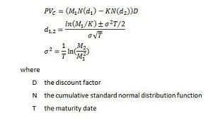

## Table of Contents

## What are Asian options and how do they differ from standard options?

Asian options are a type of exotic option where the payoff depends on the average price of the underlying asset over a certain period of time, rather than its price at expiration like standard options. This average can be calculated in different ways, such as the arithmetic mean or geometric mean of the asset's prices. Because Asian options use an average price, they can be less risky and cheaper than standard options, which makes them attractive to investors who want to reduce the impact of price volatility.

Standard options, also known as vanilla options, have their payoff determined by the price of the underlying asset at a specific time, usually at expiration. There are two main types of standard options: calls, which give the buyer the right to buy the asset at a set price, and puts, which give the buyer the right to sell the asset at a set price. The main difference between Asian and standard options is how the payoff is calculated. Asian options smooth out the effects of short-term price fluctuations, while standard options are more sensitive to the asset's price at the exact moment of expiration.

## What is the primary purpose of using Asian options?

The main reason people use Asian options is to reduce the risk that comes from big price swings in the market. Since Asian options use the average price of an asset over time, they are not as affected by sudden jumps or drops in price as standard options are. This makes them a safer choice for investors who want to protect themselves from the ups and downs of the market.

Another reason to use Asian options is that they can be cheaper than standard options. Because they are less risky, the cost to buy them is often lower. This can be a big advantage for investors who want to save money on their investments while still getting the benefits of options trading.

## How is the payoff calculated for an Asian option?

The payoff for an Asian option is figured out using the average price of the asset over a certain time, not just the price at the end like with regular options. This average can be found in different ways, like adding up all the prices and dividing by the number of prices, which is called the arithmetic mean. Or, you can use the geometric mean, which is a bit more complicated but also used sometimes.

For a call Asian option, if the average price is higher than the price set in the option, called the strike price, then the payoff is the difference between the average price and the strike price. If the average price is lower than the strike price, the payoff is zero because the option isn't worth anything. For a put Asian option, it's the opposite. If the average price is lower than the strike price, the payoff is the difference between the strike price and the average price. If the average price is higher than the strike price, the payoff is zero.

## What are the different types of Asian options (e.g., average price, average strike)?

Asian options come in two main types: average price options and average strike options. With an average price option, the payoff depends on how the average price of the asset over time compares to a fixed strike price. If it's a call option and the average price is higher than the strike price, you get the difference as your payoff. For a put option, you get the payoff if the average price is lower than the strike price.

Average strike options work differently. Here, the payoff is based on the final price of the asset compared to the average price over time, which acts as the strike price. For a call option, if the final price is higher than the average price, you get the difference as your payoff. For a put option, you get the payoff if the final price is lower than the average price. Both types of Asian options help reduce the risk from big price swings, but they do it in different ways.

## Can you explain the pricing models used for Asian options?

Pricing Asian options can be tricky because they depend on the average price of an asset over time, not just the price at the end. One common way to price them is by using a model called the Black-Scholes model, but it needs to be changed a bit to work with Asian options. This changed model uses math tricks to figure out what the average price might be and then uses that to find out how much the option is worth. It's not perfect, but it's a good way to get a rough idea of the price.

Another way to price Asian options is by using a method called Monte Carlo simulation. This method is like playing out lots of different scenarios to see what might happen. You use a computer to pretend the price of the asset moves around in many different ways over time, and then you figure out the average price for each pretend scenario. After doing this many times, you can see what the option might be worth on average. This method can be more accurate than the changed Black-Scholes model, but it takes more time and computer power to do.

## How do Asian options help in reducing the impact of market manipulation?

Asian options help reduce the impact of market manipulation by using the average price of an asset over time instead of the price at a single moment. This means that if someone tries to manipulate the market just before the option expires, it won't affect the option's value as much. The average price smooths out any sudden jumps or drops that could be caused by manipulation, making it harder for manipulators to affect the outcome.

Because Asian options rely on an average, they are less sensitive to short-term price changes that could be caused by manipulative actions. This makes them a safer choice for investors who are worried about market manipulation. By focusing on the overall trend of the asset's price rather than a specific point in time, Asian options provide a more stable and reliable way to trade, reducing the risk that comes from someone trying to unfairly influence the market.

## What are the advantages of Asian options over standard options for investors?

Asian options offer several advantages over standard options for investors. One big advantage is that they help reduce the risk from big price swings in the market. Because Asian options use the average price of an asset over time, they are not as affected by sudden jumps or drops in price. This makes them a safer choice for investors who want to protect themselves from the ups and downs of the market. Another advantage is that Asian options can be cheaper than standard options. Since they are less risky, the cost to buy them is often lower. This can be a big plus for investors who want to save money on their investments while still getting the benefits of options trading.

Another benefit of Asian options is that they can help reduce the impact of market manipulation. Since the payoff depends on the average price over time, it's harder for someone to manipulate the market just before the option expires. This makes Asian options a more reliable choice for investors who are worried about others trying to unfairly influence the market. By focusing on the overall trend of the asset's price rather than a specific point in time, Asian options provide a more stable and trustworthy way to trade.

## In what scenarios are Asian options more beneficial than standard options?

Asian options are more beneficial than standard options when investors want to protect themselves from big price swings in the market. Because Asian options use the average price of an asset over time, they are not as affected by sudden jumps or drops in price. This makes them a safer choice for investors who are worried about the ups and downs of the market. For example, if you are investing in a stock that can be very volatile, an Asian option can help you smooth out those wild price changes and give you a more stable investment.

Another scenario where Asian options are more beneficial is when investors are concerned about market manipulation. Since the payoff of an Asian option depends on the average price over time, it's harder for someone to manipulate the market just before the option expires. This makes Asian options a more reliable choice for investors who want to avoid the risks that come from others trying to unfairly influence the market. By focusing on the overall trend of the asset's price rather than a specific point in time, Asian options provide a more trustworthy way to trade.

## How do the risk profiles of Asian options compare to those of standard options?

Asian options have a different risk profile compared to standard options because they use the average price of an asset over time instead of the price at a single moment. This makes Asian options less risky because they are not as affected by sudden big changes in the price of the asset. If the price jumps up or down a lot right before the option expires, it won't change the value of an Asian option as much as it would for a standard option. This can be a big advantage for investors who want to avoid the risk of big price swings.

Another way Asian options are less risky is that they can help reduce the impact of market manipulation. If someone tries to change the price of an asset just before a standard option expires, it can make a big difference in the option's value. But with Asian options, the average price over time is what matters, so it's harder for manipulators to affect the outcome. This makes Asian options a safer choice for investors who are worried about others trying to unfairly influence the market.

## What are the challenges and complexities involved in trading Asian options?

Trading Asian options can be tricky because they're not as simple as standard options. One big challenge is figuring out how much they're worth. Unlike standard options, where you can use the Black-Scholes model pretty easily, Asian options need special math tricks to change that model or use a computer method called Monte Carlo simulation. These methods take more time and can be hard to get right, which makes trading Asian options more complicated.

Another complexity is that Asian options are not traded as often as standard options. This means there might not be as many people wanting to buy or sell them, which can make it harder to find someone to trade with. Also, because they're less common, the rules and ways to trade them might not be as clear or easy to understand. This can make it tougher for investors to feel confident about using Asian options in their trading plans.

## How do regulatory environments affect the trading of Asian options?

The rules and laws made by governments can change how easy or hard it is to trade Asian options. Some countries have strict rules that make it tough to trade these options. They might need more paperwork or special licenses, which can slow things down and make it cost more to trade. Also, if the rules are different in different places, it can be hard for people who want to trade Asian options across borders. This can make investors think twice before using Asian options because they have to deal with all these extra rules.

On the other hand, some places have rules that help make trading Asian options easier. They might have clear guidelines and good systems for trading, which can make investors feel safer and more confident. When the rules are simple and easy to follow, more people might want to trade Asian options. But even in these places, the rules can change, so traders always have to keep an eye on what's happening and be ready to change their plans if the rules change.

## What advanced strategies can be employed using Asian options in portfolio management?

Asian options can be a smart tool for managing a portfolio because they help smooth out the ups and downs of the market. One strategy is to use Asian options to hedge against price swings in assets you own. For example, if you own a stock that can be very volatile, you can buy an Asian put option on that stock. This way, if the average price of the stock over time goes down, the Asian option will pay you the difference between the average price and the strike price, helping to protect your investment from big losses. Another strategy is to use Asian options to diversify your portfolio. By adding Asian options that are based on different assets or markets, you can spread out your risk and make your portfolio more stable.

Another advanced strategy is to use Asian options for income generation. You can sell Asian call options on stocks you own, which lets you earn money from the option premiums. Since Asian options are less risky than standard options, the premiums might be lower, but they can still add up over time. This strategy works well if you think the average price of your stocks will stay above the strike price of the options you sell. By doing this, you can create a steady stream of income while keeping your portfolio safe from big price swings.

## What are Asian Options?

Asian options are a type of financial derivative that distinguishes itself from standard options primarily through the method used to calculate the payoff. Unlike standard options, which base their payoff on the price of the underlying asset at a specific point in time (such as the expiration date), Asian options derive their payoff from the average price of the underlying asset over a predetermined period. This averaging mechanism can be advantageous in reducing the impact of short-term [volatility](/wiki/volatility-trading-strategies) on the option's payoff, offering a smoother risk profile for investors and traders.

The payoff for an Asian option is determined by calculating the average price of the underlying asset over a defined period. This can be structured in two primary ways: arithmetic averaging and geometric averaging. The arithmetic average takes the sum of all observed prices during the period and divides it by the number of observations, while the geometric average multiplies the prices and then takes the nth root, where n is the number of observations. The mathematical expression for the payoff of an Asian call option based on arithmetic averaging could be represented as:

$$
\text{Payoff} = \max\left(\frac{1}{n} \sum_{i=1}^{n} S(t_i) - K, 0\right)
$$

where $n$ is the number of observation points, $S(t_i)$ is the price of the underlying asset at time $t_i$, and $K$ is the strike price of the option.

Asian options are particularly useful in markets where prices are prone to manipulation or significant volatility, such as commodities markets. In these contexts, the averaging mechanism offers a more stable and predictable outcome compared to standard options. For example, in the oil market, where prices can fluctuate sharply due to geopolitical events or changes in supply and demand dynamics, Asian options allow traders and hedgers to mitigate exposure to these abrupt fluctuations.

Furthermore, Asian options are appealing in volatile markets because they typically command lower premiums than standard options. This cost efficiency is a result of the reduced price volatility due to averaging, which lowers the option's potential payout risk for sellers. Consequently, Asian options provide a cost-effective means for hedging strategies, helping firms and investors protect themselves against adverse price movements while taking advantage of averaging to stabilize potential returns.

In summary, the unique averaging mechanism of Asian options offers distinct advantages in volatile and manipulated markets. Their structure provides a less volatile payoff pattern, making them an attractive choice for market participants seeking to manage risk and cost effectively.

## What are the differences between American and European standard options?

Standard options are financial derivatives that provide investors with the right, but not the obligation, to buy or sell an underlying asset at a specified price before or at a specified date. The two main types of standard options are American options and European options, differentiated primarily by their exercise timings.

**Exercise Timings: Differences Between American and European Options**

American options offer flexibility, allowing the holder to exercise the option at any time before the expiration date. This characteristic makes American options advantageous in volatile markets where the ability to exercise early can capitalize on favorable price movements.

Conversely, European options can only be exercised at their expiration date. This restriction generally results in a simpler pricing model, as the decision to exercise is made at a single point in time rather than continuously.

**Payoff Calculation in Standard Options**

The payoff of an option is determined by the difference between the strike price and the market price of the underlying asset at the time of exercise. For a call option, the payoff is calculated as:

$$
\text{Payoff} = \max(S_t - K, 0)
$$

where $S_t$ is the spot price of the asset at time $t$, and $K$ is the strike price. For a put option, the payoff is:

$$
\text{Payoff} = \max(K - S_t, 0)
$$

In both cases, the intrinsic value can only achieve non-negative returns up to zero, ensuring that the holder never incurs a loss from exercising the option.

**When Each Type of Standard Option Might Be Beneficial**

American options are particularly beneficial when the underlying asset is expected to become volatile after the option is purchased. For instance, an investor holding an American option for a stock on the verge of [earning](/wiki/earning-announcement) announcements stands to gain significantly by exercising the option if the stock price moves favorably.

European options may be more economical and beneficial in less volatile markets since they are generally cheaper than American options, partly due to their limited exercise opportunity. Investors who do not anticipate needing to exercise the option before expiry may prefer European options due to their reduced premium costs.

In conclusion, the choice between American and European options depends largely on the investor's strategy and the expected market conditions. American options provide more flexibility, while European options are generally more cost-effective for straightforward strategies. Understanding these differences enables investors to tailor their trading activities effectively to meet their financial goals.

## How do Asian Options compare with Standard Options?

Financial derivatives are essential components of modern financial markets, offering a diverse range of instruments for hedging, speculation, and risk management. Among these, options play a significant role, with Asian options and standard options being prominent types. This section compares Asian options with standard options, emphasizing their similarities, differences, cost implications, and scenarios where each type might be particularly advantageous.

### Similarities Between Asian and Standard Options

Both Asian options and standard options are derivatives with underlying assets, such as stocks, commodities, or indices. They provide the right, but not the obligation, to buy (call) or sell (put) the underlying asset. These contracts are used for various purposes, including hedging risk, speculating on price movements, and offering investment opportunities with leverage.

### Differences Between Asian and Standard Options

The primary distinction between Asian options and standard options lies in how the payoff is determined. Asian options are characterized by their reliance on the average price of the underlying asset over a specified period, rather than the price at a specific point in time. This averaging can occur for either the entire duration of the option or over a selected time frame within the period.

#### Payoff Formula

The payoff for an Asian call option can be represented as:

$$
\text{Payoff}_{\text{Asian Call}} = \max(0, A - K)
$$

Where:
- $A$ is the average price of the underlying asset during the option period.
- $K$ is the strike price.

For standard European call options, the payoff is given by:

$$
\text{Payoff}_{\text{Standard Call}} = \max(0, S_T - K)
$$

Where:
- $S_T$ is the price of the underlying asset at maturity.

This averaging feature of Asian options makes them less susceptible to manipulation through price spikes at maturity and provides a more stable reference point for valuation compared to standard options.

### Cost Implications and Volatility Differences

Asian options are generally less expensive compared to standard options, primarily due to the averaging effect, which tends to smooth out extreme fluctuations in the underlying asset's price. The reduced volatility associated with the average price typically results in lower premium costs for hedgers and speculators.

The volatility difference arises because standard options are heavily influenced by the price of the underlying asset at maturity. Sudden price changes can lead to significant swings in the option's premium. Asian options, by contrast, benefit from the law of large numbers, as the averaging process mitigates the impact of abnormal price movements, leading to reduced implied volatility and cost advantages.

### Scenarios Favoring Asian Options

Asian options can be particularly appealing in scenarios where the underlying asset is prone to high volatility or susceptibility to price manipulation around expiration dates. Commodities, such as oil and agricultural products, often demonstrate these characteristics, making Asian options suitable for commodity markets. Additionally, in markets where traders are concerned about price stability or wish to hedge against unexpected spikes or drops, Asian options offer strategic benefits due to their averaging mechanism.

In summary, while both Asian and standard options serve as crucial tools in financial markets, the choice between them depends on the specific needs and market conditions faced by investors. Asian options offer cost efficiencies and reduced volatility, making them an attractive choice in volatile environments. Understanding these nuances can aid investors in selecting the best-suited option type for their trading or hedging strategies.

## References & Further Reading

[1]: Geman, H. (1990). "The Importance of Being Convex." In *Mathematical Finance*. Springer. [Link](https://link.springer.com/chapter/10.1007/978-3-642-56634-9_6)

[2]: Hull, J. C. (2017). ["Options, Futures, and Other Derivatives"](https://www.semanticscholar.org/paper/Options%2C-Futures%2C-and-Other-Derivatives-Hull/89bdee500c8623864fc9eb7a471546aa713acc44). Pearson Education.

[3]: Glasserman, P. (2003). ["Monte Carlo Methods in Financial Engineering."](https://link.springer.com/book/10.1007/978-0-387-21617-1) Springer.

[4]: Tsay, R. S. (2010). ["Analysis of Financial Time Series"](https://onlinelibrary.wiley.com/doi/book/10.1002/9780470644560). Wiley.

[5]: Aldridge, I. (2013). ["High-Frequency Trading: A Practical Guide to Algorithmic Strategies and Trading Systems"](https://www.amazon.com/High-Frequency-Trading-Practical-Algorithmic-Strategies/dp/1118343506). Wiley. 

[6]: Wilmott, P. (2006). ["Paul Wilmott on Quantitative Finance"](https://www.amazon.com/Paul-Wilmott-Quantitative-Finance-Set/dp/0470018704). Wiley. 

[7]: Chan, E. (2009). ["Quantitative Trading: How to Build Your Own Algorithmic Trading Business"](https://github.com/ftvision/quant_trading_echan_book). Wiley.