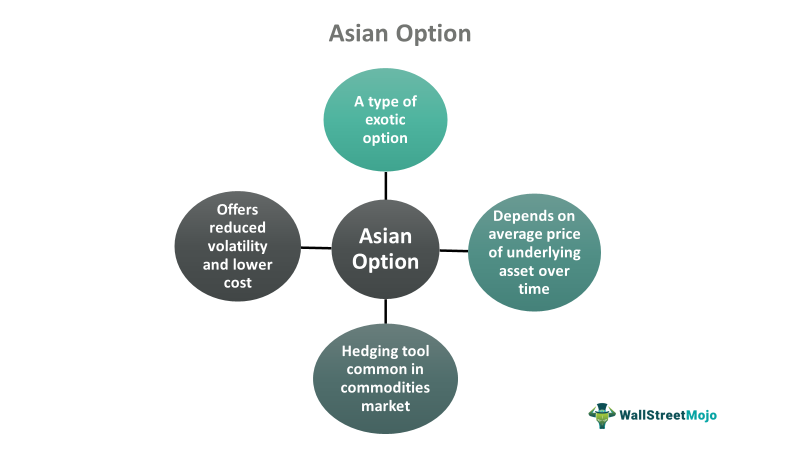

Financial derivatives are financial instruments whose value derives from an underlying asset, index, or security. Among these, options are a crucial category used extensively in global trading markets for various strategic financial purposes. Asian options, a type of contingent claim, are distinguished by their payoff mechanism based on the average price of the underlying asset over a specified period, differing from standard options, which are dependent on the price at a specific point in time. 

The significance of financial derivatives, including Asian and standard options, extends to risk management and speculative strategies within financial markets. These instruments provide traders with the ability to hedge against potential losses or to bet on market movements to achieve financial gain. Asian options are particularly useful in markets with high volatility, such as commodities, where averaging can mitigate extreme price fluctuations. On the other hand, standard options, categorized into American and European options, offer flexibility regarding the timing of their exercise, influencing their strategic employment in investment activities.

Algorithmic trading, employing mathematical models and computer programs, has become increasingly influential in the derivatives markets. This approach allows traders to automate decision-making processes for buying and selling derivatives, enhancing speed and efficiency. The integration of algorithmic trading within these markets underscores the complex, data-driven approaches required to manage and leverage financial derivatives effectively. 

This article will explore the nature and function of financial derivatives, focusing on the definition and application of Asian options and standard options, notably distinguishing between American and European styles. It will highlight the comparative aspects of Asian options vis-à-vis standard options and conclude by examining the role of algorithmic trading in optimizing derivatives trading. The aim is to provide a comprehensive understanding of these financial instruments and their strategic importance in today's trading environments.

## Table of Contents

## Understanding Financial Derivatives

Financial derivatives are complex financial instruments whose value is derived from the performance of underlying assets, indexes, or interest rates. These instruments are a cornerstone in modern financial markets, facilitating a plethora of activities from hedging to speculative trading. The underlying assets could range from commodities and stocks to bonds and currencies.

The fundamental role of derivatives in financial markets is their utility in risk management and value transfer without the need to hold the underlying asset directly. Derivatives provide a vehicle for traders and investors to position themselves according to their expectations about future market movements. For instance, a trader expecting an increase in the price of [crude oil](/wiki/crude-oil) can purchase a suitable derivative instrument instead of storing physical oil.

There are several types of financial derivatives, but they can primarily be categorized into futures, forwards, options, and swaps:

1. **Futures and Forwards**: These contracts are agreements to buy or sell an asset at a predetermined price at a specified time in the future. While futures are standardized and traded on exchanges, forwards are customizable and traded over-the-counter.

2. **Options**: Options provide the buyer the right, but not the obligation, to buy (call option) or sell (put option) an asset at a specified price within a given timeframe. Options are categorized into various types, including American and European options, based on their exercise conditions.

3. **Swaps**: Swaps involve the exchange of one set of cash flows for another. The most common are interest rate swaps, where the parties exchange fixed interest rate payments for floating rate payments, and vice versa.

The relevance of derivatives lies in their ability to serve multiple functions:

- **Hedging**: One of the primary uses of derivatives is to hedge against risks. By taking an offsetting position in derivatives, investors can mitigate the impact of adverse price movements in the underlying asset. For example, an airline company might use futures contracts to lock in fuel prices, thus protecting against future price increases.

- **Speculation**: Traders often utilize derivatives to speculate on the future price movements of assets. Due to the leverage inherent in many derivative contracts, they can amplify both potential gains and losses. Speculators add liquidity to the markets by facilitating trades and providing counterparties for hedgers.

- **Risk Management**: Derivatives are critical tools for managing various financial risks, including but not limited to currency risk, interest rate risk, and credit risk. By using derivatives, financial institutions can isolate and manage specific risks effectively.

In summary, financial derivatives are indispensable in today's trading environment, offering versatile solutions for hedging, speculation, and comprehensive risk management strategies. Their adeptness at providing exposure to various assets, without the need for direct ownership, makes them powerful tools for diverse investment strategies.

## What are Asian Options?

Asian options are a type of financial derivative that distinguishes itself from standard options primarily through the method used to calculate the payoff. Unlike standard options, which base their payoff on the price of the underlying asset at a specific point in time (such as the expiration date), Asian options derive their payoff from the average price of the underlying asset over a predetermined period. This averaging mechanism can be advantageous in reducing the impact of short-term [volatility](/wiki/volatility-trading-strategies) on the option's payoff, offering a smoother risk profile for investors and traders.

The payoff for an Asian option is determined by calculating the average price of the underlying asset over a defined period. This can be structured in two primary ways: arithmetic averaging and geometric averaging. The arithmetic average takes the sum of all observed prices during the period and divides it by the number of observations, while the geometric average multiplies the prices and then takes the nth root, where n is the number of observations. The mathematical expression for the payoff of an Asian call option based on arithmetic averaging could be represented as:

$$
\text{Payoff} = \max\left(\frac{1}{n} \sum_{i=1}^{n} S(t_i) - K, 0\right)
$$

where $n$ is the number of observation points, $S(t_i)$ is the price of the underlying asset at time $t_i$, and $K$ is the strike price of the option.

Asian options are particularly useful in markets where prices are prone to manipulation or significant volatility, such as commodities markets. In these contexts, the averaging mechanism offers a more stable and predictable outcome compared to standard options. For example, in the oil market, where prices can fluctuate sharply due to geopolitical events or changes in supply and demand dynamics, Asian options allow traders and hedgers to mitigate exposure to these abrupt fluctuations.

Furthermore, Asian options are appealing in volatile markets because they typically command lower premiums than standard options. This cost efficiency is a result of the reduced price volatility due to averaging, which lowers the option's potential payout risk for sellers. Consequently, Asian options provide a cost-effective means for hedging strategies, helping firms and investors protect themselves against adverse price movements while taking advantage of averaging to stabilize potential returns.

In summary, the unique averaging mechanism of Asian options offers distinct advantages in volatile and manipulated markets. Their structure provides a less volatile payoff pattern, making them an attractive choice for market participants seeking to manage risk and cost effectively.

## Standard Options: American vs. European

Standard options are financial derivatives that provide investors with the right, but not the obligation, to buy or sell an underlying asset at a specified price before or at a specified date. The two main types of standard options are American options and European options, differentiated primarily by their exercise timings.

**Exercise Timings: Differences Between American and European Options**

American options offer flexibility, allowing the holder to exercise the option at any time before the expiration date. This characteristic makes American options advantageous in volatile markets where the ability to exercise early can capitalize on favorable price movements.

Conversely, European options can only be exercised at their expiration date. This restriction generally results in a simpler pricing model, as the decision to exercise is made at a single point in time rather than continuously.

**Payoff Calculation in Standard Options**

The payoff of an option is determined by the difference between the strike price and the market price of the underlying asset at the time of exercise. For a call option, the payoff is calculated as:

$$
\text{Payoff} = \max(S_t - K, 0)
$$

where $S_t$ is the spot price of the asset at time $t$, and $K$ is the strike price. For a put option, the payoff is:

$$
\text{Payoff} = \max(K - S_t, 0)
$$

In both cases, the intrinsic value can only achieve non-negative returns up to zero, ensuring that the holder never incurs a loss from exercising the option.

**When Each Type of Standard Option Might Be Beneficial**

American options are particularly beneficial when the underlying asset is expected to become volatile after the option is purchased. For instance, an investor holding an American option for a stock on the verge of [earning](/wiki/earning-announcement) announcements stands to gain significantly by exercising the option if the stock price moves favorably.

European options may be more economical and beneficial in less volatile markets since they are generally cheaper than American options, partly due to their limited exercise opportunity. Investors who do not anticipate needing to exercise the option before expiry may prefer European options due to their reduced premium costs.

In conclusion, the choice between American and European options depends largely on the investor's strategy and the expected market conditions. American options provide more flexibility, while European options are generally more cost-effective for straightforward strategies. Understanding these differences enables investors to tailor their trading activities effectively to meet their financial goals.

## Comparing Asian Options with Standard Options

Financial derivatives are essential components of modern financial markets, offering a diverse range of instruments for hedging, speculation, and risk management. Among these, options play a significant role, with Asian options and standard options being prominent types. This section compares Asian options with standard options, emphasizing their similarities, differences, cost implications, and scenarios where each type might be particularly advantageous.

### Similarities Between Asian and Standard Options

Both Asian options and standard options are derivatives with underlying assets, such as stocks, commodities, or indices. They provide the right, but not the obligation, to buy (call) or sell (put) the underlying asset. These contracts are used for various purposes, including hedging risk, speculating on price movements, and offering investment opportunities with leverage.

### Differences Between Asian and Standard Options

The primary distinction between Asian options and standard options lies in how the payoff is determined. Asian options are characterized by their reliance on the average price of the underlying asset over a specified period, rather than the price at a specific point in time. This averaging can occur for either the entire duration of the option or over a selected time frame within the period.

#### Payoff Formula

The payoff for an Asian call option can be represented as:

$$
\text{Payoff}_{\text{Asian Call}} = \max(0, A - K)
$$

Where:
- $A$ is the average price of the underlying asset during the option period.
- $K$ is the strike price.

For standard European call options, the payoff is given by:

$$
\text{Payoff}_{\text{Standard Call}} = \max(0, S_T - K)
$$

Where:
- $S_T$ is the price of the underlying asset at maturity.

This averaging feature of Asian options makes them less susceptible to manipulation through price spikes at maturity and provides a more stable reference point for valuation compared to standard options.

### Cost Implications and Volatility Differences

Asian options are generally less expensive compared to standard options, primarily due to the averaging effect, which tends to smooth out extreme fluctuations in the underlying asset's price. The reduced volatility associated with the average price typically results in lower premium costs for hedgers and speculators.

The volatility difference arises because standard options are heavily influenced by the price of the underlying asset at maturity. Sudden price changes can lead to significant swings in the option's premium. Asian options, by contrast, benefit from the law of large numbers, as the averaging process mitigates the impact of abnormal price movements, leading to reduced implied volatility and cost advantages.

### Scenarios Favoring Asian Options

Asian options can be particularly appealing in scenarios where the underlying asset is prone to high volatility or susceptibility to price manipulation around expiration dates. Commodities, such as oil and agricultural products, often demonstrate these characteristics, making Asian options suitable for commodity markets. Additionally, in markets where traders are concerned about price stability or wish to hedge against unexpected spikes or drops, Asian options offer strategic benefits due to their averaging mechanism.

In summary, while both Asian and standard options serve as crucial tools in financial markets, the choice between them depends on the specific needs and market conditions faced by investors. Asian options offer cost efficiencies and reduced volatility, making them an attractive choice in volatile environments. Understanding these nuances can aid investors in selecting the best-suited option type for their trading or hedging strategies.

## Algorithmic Trading in Derivatives Markets

Algorithmic trading refers to the use of computer algorithms to automate and optimize trading decisions and executions in financial markets. Over the past few decades, it has become increasingly influential in derivatives markets including those for Asian and standard options. The adoption of [algorithmic trading](/wiki/algorithmic-trading) is driven by its ability to process vast amounts of data at high speed, execute trades at precise moments, and minimize human errors.

In derivatives trading, algorithms can analyze market conditions and execute buy or sell orders based on predefined criteria and risk assessments. For instance, algorithms may incorporate complex mathematical models that consider various factors such as price movements, volatility, and market depth. This capability enhances trading strategies and helps in the precise pricing and risk management of derivatives like options.

Trading Asian options or standard options (American and European) effectively requires quick decision-making and the ability to respond to market changes instantaneously. Algorithms are particularly advantageous here. They can continuously monitor the average or final price of the underlying asset in Asian options and determine the optimal time to exercise American options, where early execution might be beneficial.

Furthermore, algorithmic trading enhances speed and efficiency, crucial when handling derivatives. The traditional method of manual trading involves human interpretation and instant decision-making, which can be slower and prone to psychological biases and errors. Algorithms eliminate such delays and biases, executing complex orders in milliseconds, thereby gaining a competitive edge. This speed is particularly beneficial in fast-moving markets where prices can fluctuate significantly within seconds.

Moreover, the efficiency provided by algorithmic trading allows for the execution of strategies such as [arbitrage](/wiki/arbitrage), hedging, and market-making at scales and speeds unattainable by human traders. This is facilitated by algorithms analyzing price discrepancies or executing orders to hedge portfolios against undesirable market movements automatically and instantaneously. 

Overall, the integration of algorithmic trading strategies in derivatives markets has revolutionized how trading is conducted, offering traders precise and efficient tools for managing risks and capitalizing on market opportunities.

## Conclusion

Financial derivatives are crucial instruments in global trading markets, providing essential tools for hedging, speculation, and risk management. Among these, Asian options and standard options stand out due to their unique characteristics and applications. Asian options are distinguished by their payoff mechanism, which depends on the average price of the underlying asset over a specified period. This feature makes them particularly useful in commodities and volatile markets by reducing the impact of market manipulation and short-term volatility.

Standard options, comprising American and European variants, differ primarily in their exercise timing. American options can be exercised at any point before expiration, offering flexibility, while European options can only be exercised at maturity, providing straightforward payoff calculations. Each type caters to different investment strategies and market conditions, affording investors tailored mechanisms to meet their financial objectives.

Understanding these financial instruments is crucial, especially with the rise of algorithmic trading, which has gained prominence in the derivatives markets. Algorithmic trading harnesses sophisticated algorithms to trade derivatives like Asian and standard options, enhancing speed and efficiency. This technological advancement is reshaping how derivatives are traded, offering unprecedented opportunities and challenges.

For anyone interested in trading and risk management, a deep knowledge of financial derivatives, their differences, applications, and the role of technology in trading, is invaluable. Continued study and exploration of these instruments can provide strategic advantages and help navigate the complexities of modern financial markets.

## References & Further Reading

[1]: Geman, H. (1990). "The Importance of Being Convex." In *Mathematical Finance*. Springer. [Link](https://link.springer.com/chapter/10.1007/978-3-642-56634-9_6)

[2]: Hull, J. C. (2017). ["Options, Futures, and Other Derivatives"](https://www.semanticscholar.org/paper/Options%2C-Futures%2C-and-Other-Derivatives-Hull/89bdee500c8623864fc9eb7a471546aa713acc44). Pearson Education.

[3]: Glasserman, P. (2003). ["Monte Carlo Methods in Financial Engineering."](https://link.springer.com/book/10.1007/978-0-387-21617-1) Springer.

[4]: Tsay, R. S. (2010). ["Analysis of Financial Time Series"](https://onlinelibrary.wiley.com/doi/book/10.1002/9780470644560). Wiley.

[5]: Aldridge, I. (2013). ["High-Frequency Trading: A Practical Guide to Algorithmic Strategies and Trading Systems"](https://www.amazon.com/High-Frequency-Trading-Practical-Algorithmic-Strategies/dp/1118343506). Wiley. 

[6]: Wilmott, P. (2006). ["Paul Wilmott on Quantitative Finance"](https://www.amazon.com/Paul-Wilmott-Quantitative-Finance-Set/dp/0470018704). Wiley. 

[7]: Chan, E. (2009). ["Quantitative Trading: How to Build Your Own Algorithmic Trading Business"](https://github.com/ftvision/quant_trading_echan_book). Wiley.