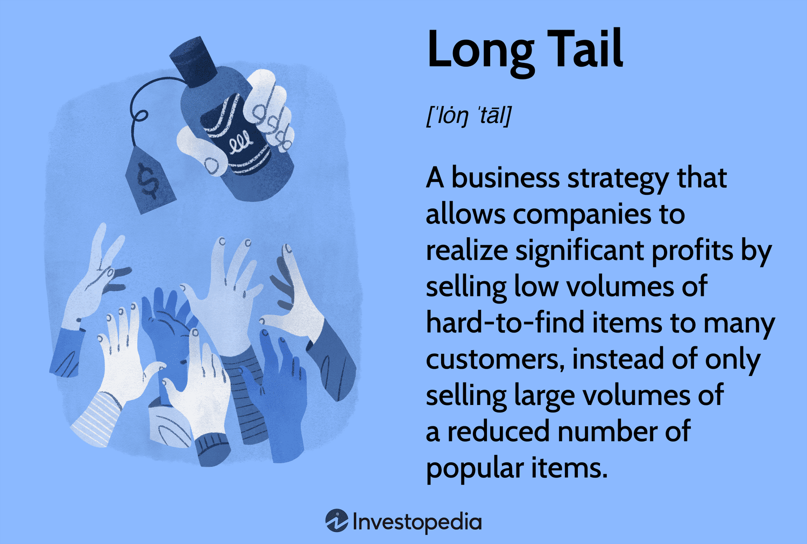

In this article, we examine the intersection of finance, Asian tail probability theory, and algorithmic trading, highlighting how these advanced concepts are shaping modern financial markets. Asian tail probability theory provides a distinctive approach to risk management and the optimization of trading strategies. By focusing on the probabilistic outcomes of price movements, this theory allows traders to better anticipate and mitigate extreme market events, thereby enhancing decision-making processes.

Algorithmic trading, which relies on complex probabilistic models, has become an integral part of trading operations in today’s markets. The ability to process large datasets and execute trades based on advanced algorithms confers a significant advantage. Understanding these models is crucial as it allows traders to not only ensure accurate pricing but also control for volatility and risk in dynamic trading environments.



Our goal is to highlight the importance of integrating these sophisticated financial theories and techniques to create more efficient and robust trading strategies. Through understanding the nuances of Asian tail probability theory and applying these insights to algorithmic trading, market participants can achieve a competitive edge in an ever-evolving financial landscape.

## Table of Contents

## Understanding Asian Tail Probability Theory

Asian tail options belong to the broader category of Asian options, with their payoffs determined by the average price of the underlying asset over a specified period. This average pricing mechanism is particularly valuable for reducing the impact of extreme price fluctuations that can occur as an option approaches its expiration date. By focusing on average prices, Asian tail options offer a more stable form of derivative, making them an effective tool for managing volatility risk.

These options are primarily structured to protect traders from sudden and potentially exploitative price movements that could occur close to expiration. Such movements can be triggered by market manipulation or unforeseen market events. By averaging prices over time, Asian tail options naturally dilute the impact of short-term price manipulations, ensuring that the option's payoff reflects a more accurate assessment of the asset's performance. This averaging can be mathematically expressed as:

$$
A = \frac{1}{N} \sum_{i=1}^{N} S_{t_i}
$$

where $A$ represents the average price over $N$ sampling points, and $S_{t_i}$ is the asset price at the $i$-th sampling point.

Incorporating historical [volatility](/wiki/volatility-trading-strategies) and pricing trends is another critical feature of this model. By evaluating past market behavior, traders can better anticipate potential risks and make informed decisions. This historical data integration enhances the model's robustness, as it aligns the option's pricing and risk management strategies with observable market realities. Option pricing models that take into account such volatility trends are more adept at providing realistic valuations and risk assessments.

A distinction worth noting is between Asian tail options and Asian nose options. While both categories employ averaging techniques, they differ in tactical applications. Whereas tail options focus on mitigating risks associated with significant price changes at or near expiration, nose options are designed to smooth out price impacts at the commencement or through earlier stages of the option's life. This distinction allows for varied strategic deployments, offering traders a diverse set of tools to tailor their risk management approaches according to specific market conditions and temporal objectives.

In summary, Asian tail options are a sophisticated financial instrument designed to enhance risk management and provide stability amidst market volatility. Their unique averaging feature serves as a safeguard against last-minute price swings, making them an essential component in the toolkit of modern traders looking to optimize their strategies in dynamic market environments.

## The Role of Probability Theory in Finance

Probability theory is fundamental in finance, especially in evaluating risk and determining valuation. At its core, probability theory employs statistical techniques to anticipate market behavior and assess uncertainty, which is crucial for making informed investment decisions.

Financial models ingrained with probability theory use statistical tools to make predictions about market trends. These models rely on historical data and statistical estimation methods to generate forecasts about future market movements. For instance, time series analysis, a common statistical method, helps in identifying patterns and trends in financial data, thereby providing a basis for predictions. 

Central to financial modeling are probability distributions, expected value, and risk measures such as Value at Risk (VaR). Probability distributions, such as normal or log-normal distributions, describe how prices or returns behave over time, offering insights into the likelihood of different outcomes. The expected value, calculated as the probability-weighted average of all possible values, provides a measure of the center of a distribution and is instrumental in valuing assets and investments. 

VaR is a widely used risk measure in finance, estimating the maximum potential loss of an investment portfolio over a specified time frame at a certain confidence level. For example, if a portfolio has a one-day VaR of $1 million at a 95% confidence level, it suggests that there is a 5% chance that the portfolio could lose more than $1 million in a single day. 

Understanding these probabilistic elements is crucial for asset valuation and risk management. By quantifying the levels of risk and expected returns, financial professionals can make better-informed decisions, manage portfolio risks effectively, and set appropriate risk limits. This understanding helps in devising hedging strategies using derivatives, calculating the fair value of options and securities, and assessing credit risk.

Algorithmic trading strategies also capitalize on probability theory to bolster trading performance and mitigate risk. Algorithms use probabilistic models to make rapid trading decisions based on real-time market data and pre-established criteria. These models can incorporate stochastic calculus for option pricing or use Monte Carlo simulations for estimating the probability of different market scenarios. By integrating these probability-based strategies, traders and financial institutions can navigate uncertainties, identify profitable trading opportunities, and maintain a competitive edge.

## Application of Probability in Algorithmic Trading

Algorithmic trading leverages automation by utilizing predefined rules and quantitative criteria to execute trades, resulting in enhanced efficiency and accuracy. A central component of these systems is the incorporation of probability models, which play a critical role in formulating trading strategies and predicting market movements. Probability theory aids traders by optimizing decision-making processes and managing uncertainties inherent in financial markets.

The application of probability in [algorithmic trading](/wiki/algorithmic-trading) involves several key aspects. Firstly, these models assist in determining the likelihood of various market scenarios, allowing traders to anticipate and react to potential market moves. This predictive capability is fundamental to developing effective algorithmic strategies that can adapt to changing market conditions. For instance, Bayesian probability methods can be employed to update the likelihood of an event occurring as new data becomes available.

Secondly, advanced probabilistic models empower traders to process and analyze large volumes of data in real-time. Machine learning algorithms, underpinned by probability theory, are particularly useful in extracting patterns and trends from complex datasets. These insights enable the development of sophisticated trading algorithms that can capitalize on fleeting market opportunities.

To illustrate the practical application of probability in algorithmic trading, consider the use of Monte Carlo simulation methods. These techniques are commonly used to model the probability distribution of possible trading outcomes by simulating a vast number of scenarios based on historical data and stochastic processes. Such simulations provide traders with a comprehensive view of potential risks and returns, assisting in the calibration of trading strategies to achieve desired risk-reward profiles.

Moreover, probability calculations can be seen in the implementation of risk management protocols within algorithmic trading systems. Metrics such as the Expected Value (EV), Value at Risk (VaR), and Conditional Value at Risk (CVaR) are used to quantify and limit the risk exposure of trading strategies. By integrating these probabilistic risk measures, algorithmic systems can automatically adjust positions or stop trades based on predefined risk thresholds, ensuring adherence to an overarching risk management strategy.

The utilization of probability models in algorithmic trading not only enhances trading performance but also provides a robust framework for managing uncertainties. By employing these models, traders can optimize their strategies and decision-making processes, leading to more informed and resilient trading operations.

## Case Studies: Asian Tail in Algo Trading Strategies

Prominent trading firms use Asian tail strategies within their algorithmic models to effectively manage expiration volatility. These strategies are particularly advantageous because they provide a systematic approach to mitigating the risks associated with sudden price shifts as options approach their expiration dates. The case studies discussed herein demonstrate how Asian tail options have provided notable advantages, particularly in risk mitigation and enhancing financial outcomes.

A notable example involves firms that integrated Asian tail options to stabilize returns amid market volatility. By averaging the prices of underlying securities over a predetermined period, these options reduce the impact of sharp price movements or market manipulations occurring shortly before expiration. This averaging serves not only as a hedge against volatility but also as a tool to ensure more predictable and stable returns.

Hedge funds, which often operate in high-stakes environments, have found Asian tail strategies exceptionally beneficial during periods of market turbulence. By smoothing out the effects of erratic price swings, these strategies allow hedge funds to execute trading strategies that are less vulnerable to the erratic nature of markets, leading to a more consistent performance. As such, they provide a safeguard against chaotic market scenarios where traditional hedging might fail.

Moreover, these case studies highlight how tailoring option contracts using Asian tail features can offer improved financial outcomes. For instance, an algorithm that incorporates Asian tail probabilities can be programmed to adjust its risk exposure dynamically, depending on market conditions and historical volatility data. This adaptability enables algorithmic trading systems to make informed decisions on asset allocation and timing, ultimately enhancing profitability while controlling risks.

The key insight drawn from these examples is the practical application of tail probability theory. By customizing algorithmic models to integrate Asian tail features, trading firms can achieve a critical competitive advantage. This strategic incorporation not only refines risk management practices but also potentiates more resilient trading frameworks in evolving financial landscapes.

In essence, the utility of Asian tail strategies in algorithmic trading underscores the importance of innovative, probability-based solutions in modern finance. As financial technology continues to advance, further exploration of these strategies could yield even more sophisticated models, thereby reinforcing their significance in maintaining robust financial performance.

## Conclusion

Integrating Asian tail probability theory with algorithmic trading presents significant advantages in modern finance, particularly in enhancing decision-making capabilities and mitigating market risks. By deploying Asian tail methods, traders can achieve a more profound understanding of market dynamics and volatility, equipping them to make more informed and strategic choices. These probabilistic techniques help in the reduction of exposure to sudden market fluctuations, thereby fostering more stable financial outcomes.

The synergistic application of both theoretical and practical aspects of Asian tail models can lead to the development of robust and resilient trading strategies. Incorporating these models into algorithmic trading systems offers quantitative ways to process risk and adapt to changing market conditions effectively. For instance, mathematical formulas that calculate the average pricing and volatility adjustments in Asian tail options can be expressed using Python to streamline calculation processes. This enables traders to continuously assess and refine their strategies based on empirical data and historical trends.

Additionally, the continuous learning and adaptation of these models are crucial for maintaining a competitive edge in constantly evolving markets. As financial landscapes shift, traders who remain agile and open to innovative approaches in applying probabilistic models within their trading frameworks are more likely to succeed. Encouragement is given to further explore and innovate around these models, as their potential to transform trading strategies and financial outcomes is vast. By leveraging the advanced capabilities of algorithmic trading powered by Asian tail probability theory, traders can position themselves advantageously within the scope of modern financial markets.

## References & Further Reading

For further information, exploring academic literature and specialized [books](/wiki/algo-trading-books) on Asian options and algorithmic trading is recommended. Researchers have extensively studied Asian options—financial derivatives whose payoff depends on the average price of the underlying asset over a specific period. These options offer a valuable risk management tool due to their unique features that reduce the impact of market anomalies and extreme price movements. Key resources in this area include "Options, Futures, and Other Derivatives" by John C. Hull, which offers foundational knowledge and mathematical modeling of derivative instruments, including Asian options.

Detailed case studies provide practical insights into the application of Asian tail features in trading strategies. Many hedge funds and financial institutions have successfully integrated these options to stabilize returns during market turbulence. "The Handbook of Asian Options" provides comprehensive coverage of various modeling techniques and real-world applications.

Algorithmic trading literature emphasizes the use of probability theories and statistical models to enhance trading performance. Books such as "Algorithmic Trading: Winning Strategies and Their Rationale" by Ernie Chan provide guidance on implementing algorithmic strategies that leverage probability theory for profitable trading decisions.

Mathematical modeling resources, like "Stochastic Calculus for Finance" by Steven E. Shreve, are invaluable for understanding the stochastic processes and differential equations underpinning many financial models. For a coding approach, Python libraries like NumPy and Pandas are widely used for statistical analysis and developing algorithmic trading models. Practitioners often rely on Python to simulate trading strategies and conduct [backtesting](/wiki/backtesting) using historical data. For example, the following Python code snippet demonstrates a simple moving average strategy:

```python
import pandas as pd

# Load historical price data
prices = pd.read_csv('historical_prices.csv')

# Calculate moving averages
short_window = 40
long_window = 100

prices['short_mavg'] = prices['Close'].rolling(window=short_window, min_periods=1).mean()
prices['long_mavg'] = prices['Close'].rolling(window=long_window, min_periods=1).mean()

# Generate signals
prices['signal'] = 0.0
prices['signal'][short_window:] = np.where(prices['short_mavg'][short_window:] > prices['long_mavg'][short_window:], 1.0, 0.0)

# Create trading orders
prices['position'] = prices['signal'].diff()
```

Engaging with expert works from prominent financial analysts and institutions, such as articles from the Journal of Finance and reports from financial research firms, can deepen understanding and provide access to the latest advancements in trading strategies. Continuous education through these resources allows traders and financial professionals to adapt to the ever-evolving financial markets effectively.

