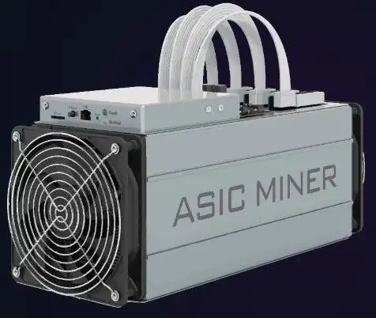

The rise of cryptocurrency has dramatically transformed the financial landscape, presenting novel opportunities and pioneering technologies. At the core of this transformation lies ASIC (Application-Specific Integrated Circuit) cryptocurrency mining, a process crafted to enhance mining efficiency. Unlike traditional CPUs or GPUs, ASICs are designed for a singular task—mining specific cryptocurrencies—thereby achieving superior performance by maximizing hash rates and minimizing power consumption. This specialization is paramount in the context of cryptocurrencies like Bitcoin, where the network's increasing difficulty demands enhanced computational power for profitability.

Parallelly, algorithmic trading, often known as algo trading, has become a cornerstone technology in maximizing profits within cryptocurrency markets. By automating trading strategies through sophisticated algorithms, traders can execute rapid decision-making processes that outpace human capability, reducing the errors and biases that are inherent to manual trading. This technological advancement is particularly beneficial in the volatile crypto markets, where swift adaptation to price fluctuations can result in significant financial gains.



This article investigates the relationship between ASIC mining and algorithmic trading, analyzing how these two advanced technologies can complement each other. We aim to discuss the fundamentals of ASIC mining, tracing technological progress and examining how these changes have sculpted the current mining landscape. Concurrently, we will explore the role and impact of algo trading, underscoring its relevance and utility in navigating the intricacies of cryptocurrency markets.

Together, these domains represent a fusion of speed and efficiency, offering powerful tools to optimize profitability and maintain competitiveness. Understanding these technologies provides market participants with a substantial edge, enabling them to navigate the increasingly complex and dynamic world of digital currencies.

## Table of Contents

## Understanding ASIC Mining

ASIC (Application-Specific Integrated Circuit) mining represents a highly specialized form of hardware designed exclusively for the purpose of cryptocurrency mining. ASICs are crafted for optimal performance on specific cryptographic hash algorithms, crucial for mining various cryptocurrencies. Their efficiency surpasses that of traditional General-Purpose CPUs (Central Processing Units) and GPUs (Graphics Processing Units), enabling them to achieve superior hash rates while consuming less power.

The inception of ASIC mining was a pivotal moment in the evolution of the cryptocurrency mining industry. Initially, Bitcoin and other cryptocurrencies could be mined using standard PCs with CPUs. As cryptocurrencies began to gain popularity, the mining competition intensified, prompting the need for more powerful solutions. GPUs replaced CPUs due to their ability to perform numerous hash calculations in parallel, significantly enhancing mining efficiency. However, the emergence of ASIC miners marked a transformative phase, as they were specifically engineered to execute the SHA-256 algorithm used by Bitcoin, surpassing GPUs in efficiency and speed.

ASIC miners operate by calculating hashes at incredible speeds to solve the cryptographic puzzles that validate [cryptocurrency](/wiki/cryptocurrency) transactions on the blockchain. This validation process is crucial, as miners are rewarded with cryptocurrency for successfully mining a block. The competitive edge of ASICs lies in their ability to compute a vast number of hashes per second, often measured in terahashes per second (TH/s) for Bitcoin mining.

One significant impact of ASIC technology in the cryptocurrency ecosystem is the increased mining difficulty. As more miners enter the network with powerful ASIC machines, the network automatically adjusts the difficulty of mining new blocks to maintain consistent block times. This adjustment ensures that the rewards are distributed over an extended period, preventing the rapid depletion of available coins.

ASICs have become indispensable for mining popular cryptocurrencies like Bitcoin, where mining difficulty and competition are exceptionally high. By concentrating on specific algorithms, ASIC miners have pushed smaller miners, who rely on GPUs or CPUs, out of the market. This has led to concerns about centralization, as the mining landscape becomes dominated by entities that can afford the latest ASIC technology.

The evolution of ASICs has not only spurred advancements in mining hardware but has also prompted discussions about the environmental impact of energy-intensive mining practices. As the demand for mining grows, manufacturers are continually striving to develop more energy-efficient ASIC models. Balancing efficiency with environmental considerations remains a critical focus for the future of ASIC technology in cryptocurrency mining.

## The Evolution of Mining Technology

Mining technology has undergone significant transformations since the inception of cryptocurrency. Initially, cryptocurrencies like Bitcoin could be mined using standard personal computers. These early models utilized the central processing unit (CPU) to solve cryptographic puzzles, validating transactions and adding them to the blockchain. However, as the popularity of cryptocurrencies surged, so did the associated mining difficulty, rendering CPU mining inefficient and unprofitable.

The first major advancement in mining technology was the transition to graphics processing units (GPUs). GPUs offered enhanced processing power and parallelism over CPUs, making them well-suited for the hash computations required in cryptocurrency mining. The architecture of GPUs allowed them to handle multiple operations simultaneously, providing a significant increase in mining efficiency. This shift enabled individual miners to harness the power of high-performance gaming hardware to increase their chances of successfully mining blocks.

Despite the advantages of GPU mining, the demand for even greater efficiency led to the development of highly specialized hardware: Application-Specific Integrated Circuits (ASICs). ASIC miners are designed to perform specific tasks — in this case, mining a particular cryptocurrency — with far greater efficiency than general-purpose GPUs. By focusing on a singular computational process, ASICs can achieve unprecedented hash rates while consuming considerably less power. This efficiency makes ASICs the dominant choice for mining popular and competitive cryptocurrencies like Bitcoin.

The technological evolution from CPU to GPU and ultimately to ASIC mining hardware has been driven by the need to overcome increasing mining difficulty and to maintain profitability. As the blockchain grows and more miners join the network, the complexity of solving cryptographic puzzles increases. This rising difficulty requires more computational power and energy, spurring innovation in mining equipment.

Each phase of mining technology has significantly influenced the mining landscape. CPU mining is now largely obsolete for major cryptocurrencies, chiefly relegated to educational purposes or mining less competitive altcoins. GPU mining, while still viable for some cryptocurrencies, has its dominance challenged by ASICs, especially where ASIC-resistant algorithms are not implemented.

As for the current state of mining hardware, ASIC miners continue to dominate large-scale mining operations due to their cost-efficiency and high performance. Nonetheless, the mining community faces ongoing challenges, including the high energy consumption associated with ASIC mining and the economic and environmental implications. This has led to increased interest in developing more sustainable mining practices and exploring advanced technologies that could improve energy efficiency and reduce the carbon footprint of mining operations.

## The Basics of Algorithmic Trading

Algorithmic trading, commonly referred to as algo trading, involves the use of computer algorithms to automate and execute trading strategies. This approach offers significant advantages in the fast-paced cryptocurrency market, where rapid decision-making is crucial.

The primary benefit of [algorithmic trading](/wiki/algorithmic-trading) is its ability to process vast amounts of data quickly and efficiently. Algorithms can analyze various market indicators and execute trades far faster than human traders, virtually eliminating human error and emotional bias from trading decisions. This capacity for rapid data assessment allows traders to capitalize on even the smallest price movements across crypto exchanges.

Traders employ a variety of algorithms, ranging from simple strategies to complex systems leveraging [artificial intelligence](/wiki/ai-artificial-intelligence) (AI) and [machine learning](/wiki/machine-learning) (ML). Simple strategies might include the use of moving averages, where an algorithm monitors average price trends over a specific period to make buy or sell decisions. For instance, a basic moving average strategy could involve buying a cryptocurrency when its short-term moving average crosses above its long-term moving average and selling when the inverse occurs.

More sophisticated strategies incorporate AI and ML to predict market trends and develop adaptive trading systems. These algorithms can learn from historical data, recognize patterns, and improve their predictive accuracy over time. Machine learning models might be utilized to forecast price movements or identify [arbitrage](/wiki/arbitrage) opportunities—instances where a cryptocurrency can be bought on one exchange at a lower price and sold on another at a higher price.

Algorithmic trading is especially advantageous in the highly volatile cryptocurrency markets. The algorithms can continuously analyze price fluctuations and execute trades at speeds unachievable by human traders, thus taking advantage of quick price swings to maximize gains or minimize losses. This ability to adapt to rapidly changing conditions makes algo trading a powerful tool in managing [volatility](/wiki/volatility-trading-strategies).

In conclusion, algorithmic trading offers a competitive edge in the cryptocurrency market through its speed, data-driven decision-making capabilities, and adaptability. As trading algorithms become increasingly sophisticated through the integration of AI and ML, their role in cryptocurrency markets will continue to expand, offering innovative ways to enhance trading strategies and outcomes.

## Synergies Between ASIC Mining and Algo Trading

Both ASIC mining and algorithmic trading represent significant technological advancements focused on efficiency and speed. They are pivotal in enhancing the profitability and sustainability of operations within the cryptocurrency sector.

ASIC (Application-Specific Integrated Circuit) miners are specially designed hardware systems that optimize the process of mining cryptocurrencies like Bitcoin by providing a continuous generation of digital coins. These coins, acquired at regular intervals, represent potential assets that can be actively managed in the market. Algorithmic trading (algo trading) efficiently automates the management and liquidation of these assets, aiming to maximize profitability through data-driven strategies and rapid execution.

By integrating automated trading systems with ASIC mining, operators can achieve more consistent revenue streams even during periods of market volatility. This integration is particularly beneficial given the cryptocurrency market's innate fluctuations, characterized by rapid price swings and opportunities for arbitrage. Algorithmically driven strategies can ensure that once mined, cryptocurrencies are sold at opportune moments, minimizing risks associated with holding assets through unfavorable market conditions.

Furthermore, this synergy allows operations to optimize processes ranging from the conversion of mined coins to sophisticated hedging strategies that protect against market downturns. A typical strategy might involve using algorithms to identify when to sell mined coins or to execute transactions that hedge against perceived risks in the market.

Case studies underline the success of combining ASIC mining with algo trading. For instance, a company deploying ASIC miners for Bitcoin could utilize a custom-built algorithmic trading platform to manage and trade the coins efficiently across various exchanges. These platforms can be programmed to sell mined coins when market conditions are favorable, reinvest returns promptly into more tokens, or diversify assets in real-time based on predictive insights regarding market trends.

The relationship between ASIC mining and algo trading also fosters operational flexibility. Institutions utilizing both technologies can adjust strategies promptly in response to regulatory changes or shifts in energy costs associated with mining. This adaptability enables quicker responses to the dynamic cryptocurrency environment, potentially translating into improved financial outcomes.

## Challenges and Considerations

ASIC mining and algorithmic trading, while advantageous, present several challenges to enthusiasts and professionals alike. These challenges must be managed effectively to ensure continued profitability and sustainability in the dynamic cryptocurrency landscape.

ASIC mining requires a substantial initial investment in hardware, which can be a barrier for entry for many individuals and small enterprises. ASIC miners are specialized and often come with a hefty price tag, reflecting their advanced capabilities. Additionally, these machines have significant electricity requirements, contributing to ongoing operational costs. The profitability of ASIC mining is heavily influenced by electricity prices, which can vary widely by region. Thus, aligning the location of mining operations with areas of low-cost electricity is a strategic necessity.

Moreover, ASIC miners are subject to the risk of rapid technological obsolescence. As mining algorithms become more complex and new hardware iterations are introduced, older ASIC models may no longer be competitive. Regular updates and upgrades to the hardware are necessary to maintain their effectiveness. Furthermore, regulatory shifts can impact mining operations. Governments may impose restrictions or regulations targeting environmental impacts or financial activities associated with cryptocurrency mining. Navigating these regulatory landscapes requires diligence and often legal counsel to avoid disruptions in operations.

In the sphere of algorithmic trading, the requirements are centered around an in-depth understanding of market dynamics and the development of robust algorithms. The cryptocurrency market is notoriously volatile, with rapid price changes and significant swings that can impact algorithmic strategies. To remain competitive, traders must develop algorithms that can adapt to these conditions and execute trades with speed and precision. This demands continuous research and development, often employing advanced techniques in data analysis, machine learning, and artificial intelligence.

The complexity of designing these algorithms poses another barrier. Algorithmic traders must balance multiple factors, such as speed, latency, and execution risk, which requires sophistication and expertise in both programming and financial markets. Furthermore, maintaining performance demands constant monitoring and updating of these algorithms to respond effectively to market conditions and potential loopholes exploited by competition.

To address these challenges, strategic planning and risk management are crucial. For ASIC mining, strategies might include diversifying operational locations, investing in energy-efficient technologies, and maintaining a legal compliance framework to anticipate regulatory changes. In algorithmic trading, employing a diverse set of algorithms to spread risk, alongside [backtesting](/wiki/backtesting) strategies on historical data to assess performance, can help mitigate potential losses.

Enabling adaptation involves leveraging the latest in software and hardware advancements, capitalizing on emerging technologies, and maintaining an agile response framework for both mining and trading scenarios. This focus on innovation and diligence ensures that those engaged in ASIC mining and algorithmic trading stay at the forefront of their respective fields.

## Future Trends and Developments

The development of ASIC mining is increasingly focusing on creating more energy-efficient models, addressing the environmental concerns associated with cryptocurrency mining. The high energy consumption of current mining practices has led to criticism and regulatory pressure, prompting engineers to innovate more energy-conscious designs. These improvements could involve advancements in chip technology, cooling methods, and the utilization of renewable energy sources, aiming to minimize the carbon footprint of mining operations.

Regulatory developments are expected to play a crucial role in shaping the future of mining technology. As governments recognize the environmental and economic impacts of cryptocurrency mining, they may introduce stringent regulations that could influence hardware choices and operational practices. This could lead to the adoption of more sustainable mining practices or a shift towards jurisdictions with favorable regulations.

In the context of algorithmic trading, future trends point towards an increased use of artificial intelligence (AI) and machine learning (ML) to enhance predictive trading capabilities. AI models can analyze large datasets to detect patterns and trends, allowing traders to anticipate market movements and make informed decisions. This evolution in trading algorithms promises greater accuracy and efficiency, minimizing risks associated with human error and emotions. Python code examples for basic AI trading models could look like this:

```python
import numpy as np
from sklearn.ensemble import RandomForestRegressor
from sklearn.model_selection import train_test_split

# Example data
features = np.array([[2, 3], [5, 8], [6, 9], [9, 11]])
prices = np.array([5, 12, 14, 20])

# Splitting data
X_train, X_test, y_train, y_test = train_test_split(features, prices, test_size=0.2)

# Model
model = RandomForestRegressor()
model.fit(X_train, y_train)
predictions = model.predict(X_test)
```

The integration of blockchain technology into trading systems could promote more transparent and secure operations. Blockchain's inherent transparency and immutability make it an ideal solution for enhancing the security of transactions and reducing fraud in trading processes. Furthermore, smart contracts can automate and enforce the terms of trading agreements, increasing efficiency and trust between parties.

Looking forward, both mining and trading technologies are set to undergo significant transformations. Future advancements might include the development of decentralized mining pools using blockchain technology to further democratize the mining process, or the emergence of fully autonomous trading [agents](/wiki/agents) powered by advanced AI. These innovations will likely redefine market dynamics and drive the next wave of growth in the cryptocurrency industry.

## Conclusion

ASIC cryptocurrency mining and algorithmic trading represent the cutting edge of technological innovation within the digital currency landscape. Both technologies stand as powerful instruments capable of maximizing profitability and maintaining a competitive edge in the rapidly evolving cryptocurrency markets. As digital assets become more mainstream, the ability to harness such advanced technologies offers significant advantages.

ASIC mining has transformed the mining process by delivering unparalleled efficiency and speed. These specialized devices outperform traditional GPUs and CPUs, yielding higher hash rates while consuming less power. This technological leap enables miners to effectively tackle increasing mining difficulty and competition, especially for established cryptocurrencies like Bitcoin.

On the other hand, algorithmic trading leverages complex algorithms to automate trading strategies, thus providing faster and more precise decision-making capabilities. By reducing human error and emotional bias, traders can effectively navigate the volatile cryptocurrency markets. The integration of AI and machine learning further enhances the adaptability and predictive accuracy of these algorithms, allowing traders to seize opportunities presented by price swings and arbitrage.

Understanding and leveraging both ASIC mining and algorithmic trading provide substantial tactical advantages. Combined, they create a cohesive system where the steady output from mining can be strategically liquidated or traded using advanced algo strategies. Such synergy ensures continuous revenue streams and optimized operations in fluctuating market conditions.

As the cryptocurrency industry continues to develop, staying informed about technological and regulatory changes is essential. Emerging trends, such as more energy-efficient ASIC models and enhanced algorithmic trading systems, will drive future advancements. Regulatory shifts might also impact mining practices and trading strategies, making adaptation crucial.

In conclusion, the combination of ASIC mining and algorithmic trading is poised to significantly influence the future trajectory of the crypto economy. These innovations not only enhance current market operations but also lay the groundwork for ongoing evolution, ensuring that participants remain at the forefront of a dynamic and competitive digital currency landscape.

## References & Further Reading

[1]: ["Bitcoin and Cryptocurrency Technologies: A Comprehensive Introduction"](https://press.princeton.edu/books/hardcover/9780691171692/bitcoin-and-cryptocurrency-technologies) by Arvind Narayanan, Joseph Bonneau, Edward Felten, Andrew Miller, and Steven Goldfeder

[2]: ["Cryptocurrency Mining for Dummies: Learn How You Can Mine Bitcoin, Ethereum, Dash, and Litecoin"](https://www.forbes.com/sites/digital-assets/article/how-to-mine-bitcoin/) by Peter Kent and Tyler Bain

[3]: ["Algorithmic and High-Frequency Trading"](https://www.cambridge.org/us/universitypress/subjects/mathematics/mathematical-finance/algorithmic-and-high-frequency-trading) by Alvaro Cartea, Sebastian Jaimungal, and José Penalva

[4]: ["High-Frequency Trading: A Practical Guide to Algorithmic Strategies and Trading Systems"](https://www.ahmetbeyefendi.com/wp-content/uploads/2020/07/High-Frequency-Trading-Irene-Aldridge.pdf) by Irene Aldridge

[5]: Böhme, R., Christin, N., Edelman, B., & Moore, T. (2015). ["Bitcoin: Economics, Technology, and Governance."](https://www.aeaweb.org/articles?id=10.1257/jep.29.2.213) Journal of Economic Perspectives, 29(2), 213-238.