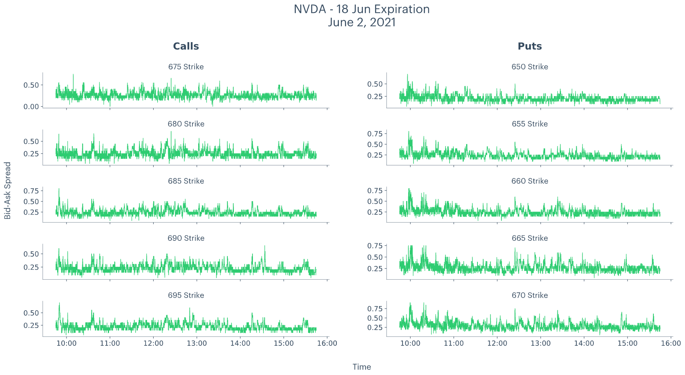

## Table of Contents

## What is the basic concept of the 'Ask' function in trading?

The 'Ask' function in trading refers to the lowest price at which someone is willing to sell a security, like a stock or a currency. It is one part of the two-way price quote that traders see on their screens. The other part is the 'Bid,' which is the highest price someone is willing to pay to buy the same security. The difference between the Ask and the Bid prices is known as the 'Bid-Ask Spread,' and it represents the cost of trading that security.

Understanding the Ask price is important for traders because it helps them decide when and at what price to buy a security. If a trader wants to buy a stock, they will have to pay the Ask price, which is set by the sellers. By watching how the Ask price changes, traders can get a sense of the market's direction and the level of demand for the security. This information can help them make better trading decisions.

## How does the 'Ask' price differ from the 'Bid' price?

The 'Ask' price is the lowest price that someone is willing to sell a security for, like a stock or a currency. On the other hand, the 'Bid' price is the highest price that someone is willing to pay to buy that same security. The main difference between them is that the 'Ask' price is what you look at if you want to buy, because that's what sellers are asking for. The 'Bid' price is what you look at if you want to sell, because that's what buyers are offering.

When you see these prices together, they help you understand the market better. The 'Ask' price is usually higher than the 'Bid' price. The difference between them is called the 'Bid-Ask Spread.' This spread is important because it shows how much it costs to trade that security. If the spread is small, it's cheaper to trade, and if it's big, it's more expensive. So, knowing both the 'Ask' and 'Bid' prices helps traders decide the best time to buy or sell.

## What are the common uses of the 'Ask' price in financial markets?

In financial markets, the 'Ask' price is very important for people who want to buy things like stocks, currencies, or other securities. It tells them the lowest price they have to pay to buy something right now. For example, if you want to buy a stock, you look at the 'Ask' price to see how much money you need. This helps you decide if you want to buy at that price or wait for a better one. Traders use the 'Ask' price to make quick decisions about buying, especially in fast-moving markets where prices can change a lot in a short time.

The 'Ask' price also helps traders understand the market better. By watching how the 'Ask' price moves, they can see if more people want to sell or if the price is going up or down. This information can help them guess where the market might go next. For example, if the 'Ask' price keeps going up, it might mean that more people want to buy, which could push the price higher. Knowing the 'Ask' price helps traders make smart choices about when to buy and sell to make money.

## How does the 'Ask' price impact the decision-making process for traders?

The 'Ask' price is really important for traders because it tells them the lowest price they need to pay to buy a stock or any other security. When traders see the 'Ask' price, they can decide if it's a good time to buy or if they should wait for a better price. For example, if the 'Ask' price is too high, a trader might choose to wait until it goes down a bit. This helps them save money and buy at a better price.

Traders also use the 'Ask' price to understand what's happening in the market. If the 'Ask' price is going up, it might mean that more people want to buy, which could make the price go even higher. On the other hand, if the 'Ask' price is going down, it might mean that fewer people want to buy, and the price could go down too. By watching the 'Ask' price, traders can make smarter choices about when to buy and sell to make more money.

## What factors influence the spread between the 'Ask' and 'Bid' prices?

The spread between the 'Ask' and 'Bid' prices can change because of many things. One big reason is how much people want to buy or sell a security. If lots of people want to buy, the 'Bid' price might go up because buyers are willing to pay more. But if not many people want to buy, the 'Bid' price might stay low. On the other hand, if lots of people want to sell, the 'Ask' price might go down because sellers are trying to get rid of their securities. But if not many people want to sell, the 'Ask' price might stay high. So, the more people want to buy or sell, the smaller the spread can be.

Another thing that can change the spread is how easy it is to trade a security. If a security is easy to trade, like a popular stock, the spread is usually smaller because there are lots of buyers and sellers. But if a security is hard to trade, like a less popular stock, the spread can be bigger because there are fewer people trading it. Also, the spread can be affected by how fast the market is moving. In a fast-moving market, the spread might get bigger because prices can change quickly, and traders need to be careful. So, the spread between the 'Ask' and 'Bid' prices can tell us a lot about what's happening in the market.

## How can understanding the 'Ask' price help in managing trading risks?

Understanding the 'Ask' price can help traders manage their risks by giving them a clear idea of what they need to pay to buy a security. If the 'Ask' price is high, it might mean that the security is in high demand or that sellers are expecting the price to go up. By knowing this, traders can decide if it's too risky to buy at that price or if they should wait for a better opportunity. This helps them avoid buying at a peak price, which could lead to losses if the price drops soon after.

Traders can also use the 'Ask' price to set stop-loss orders, which are like safety nets that automatically sell a security if its price falls to a certain level. By looking at the 'Ask' price, traders can figure out a good place to set their stop-loss orders, which helps them limit how much money they could lose. Watching how the 'Ask' price changes over time can also give traders a sense of the market's direction and volatility, helping them make smarter decisions about when to buy or sell to manage their risks better.

## What are the different types of spread variations and how do they affect trading?

There are different kinds of spread variations in trading, like the fixed spread and the variable spread. A fixed spread stays the same no matter what's happening in the market. This can be good for traders because they know exactly how much it will cost to trade. But, it might be more expensive than a variable spread when the market is calm. A variable spread changes depending on what's happening in the market. It can get smaller when lots of people are trading and bigger when the market is moving fast or not many people are trading. Traders need to watch the variable spread carefully because it can affect how much they pay to trade.

Spread variations can affect trading in big ways. When the spread is small, it's cheaper to buy and sell, so traders might trade more often. This can be good for making money on small price changes. But when the spread is big, it costs more to trade, so traders might trade less often. They might also be more careful because the bigger spread means the market could be moving a lot, which can be riskier. Knowing about spread variations helps traders plan their trades better and manage their risks.

## How do market conditions affect the 'Ask' price and spread?

Market conditions can change the 'Ask' price and the spread a lot. When lots of people want to buy a security, the 'Ask' price might go up because sellers know they can ask for more money. If the market is calm and not many people are trading, the 'Ask' price might stay the same or go down a little because sellers want to sell their securities. The spread, which is the difference between the 'Ask' price and the 'Bid' price, can also change. If lots of people are trading, the spread can get smaller because it's easier to buy and sell. But if the market is moving fast or not many people are trading, the spread can get bigger because it's harder to find someone to trade with.

In fast-moving markets, like when big news comes out, the 'Ask' price can jump up quickly because sellers want to get the best price they can. This can make the spread bigger too, because it's harder for buyers and sellers to agree on a price when things are changing so fast. Traders need to be careful in these times because buying at a high 'Ask' price can be risky if the price goes down soon after. When the market is calm, the 'Ask' price might not change much, and the spread can be smaller, which makes trading cheaper and easier. So, understanding how market conditions affect the 'Ask' price and the spread can help traders make better decisions.

## What advanced strategies can traders use to take advantage of 'Ask' price movements?

Traders can use a strategy called '[scalping](/wiki/gamma-scalping)' to take advantage of small changes in the 'Ask' price. Scalping means buying and selling securities very quickly to make small profits from tiny price movements. Traders who use this strategy watch the 'Ask' price closely and try to buy when it's low and sell when it goes up just a little bit. This works best in markets where the 'Ask' price is moving a lot, but the spread is small. By doing this many times, scalpers can add up small profits to make more money overall.

Another strategy is called '[momentum](/wiki/momentum) trading.' This is when traders look for securities where the 'Ask' price is going up fast and try to buy them before the price goes up even more. They believe that if the 'Ask' price is moving up quickly, it will keep going up for a while. So, they buy at the current 'Ask' price and then sell when the price has gone up enough. This strategy can be risky because if the price suddenly goes down, traders can lose money. But if they time it right, they can make big profits from the fast-moving 'Ask' price.

## How do electronic trading platforms handle 'Ask' price and spread variations?

Electronic trading platforms show the 'Ask' price and the spread in real-time, which helps traders see what's happening in the market right away. These platforms use computer systems to match buyers and sellers quickly. When someone wants to sell a security, they put in their 'Ask' price, and the platform shows this to everyone. The platform also shows the 'Bid' price, which is what buyers are willing to pay. The difference between these two prices is the spread, and it can change based on how many people are trading and how fast the market is moving. Traders can use this information to decide when to buy or sell.

These platforms can handle different types of spread variations, like fixed and variable spreads. A fixed spread stays the same no matter what's happening in the market, which can be good for traders because they know exactly how much it will cost to trade. A variable spread changes depending on market conditions, getting smaller when lots of people are trading and bigger when the market is moving fast or not many people are trading. Electronic trading platforms update these spreads quickly, so traders can see the changes and make smart decisions about their trades. This helps them take advantage of the best prices and manage their risks better.

## What role does liquidity play in determining the 'Ask' price and spread?

Liquidity is really important for deciding the 'Ask' price and the spread. When a security is very liquid, it means lots of people want to buy and sell it. This makes it easier for traders to find someone to trade with. Because of this, the 'Ask' price might not be too high because sellers know they can sell quickly. Also, the spread between the 'Ask' price and the 'Bid' price can be small because there are lots of buyers and sellers, so it's easy to match them up. This makes trading cheaper and easier for everyone.

On the other hand, if a security is not very liquid, it means fewer people want to buy and sell it. This can make the 'Ask' price go up because sellers might ask for more money since it's harder to find buyers. The spread can also get bigger because it's harder to match buyers and sellers. This makes trading more expensive and riskier because traders might have to pay more to buy or sell. So, knowing how liquid a security is can help traders understand the 'Ask' price and the spread better, and make smarter trading choices.

## How can algorithmic trading be optimized based on 'Ask' price and spread analysis?

Algorithmic trading can be optimized by using the 'Ask' price and spread to make smart choices about when to buy and sell. Traders can write computer programs that watch the 'Ask' price and the spread all the time. If the 'Ask' price is going down and the spread is small, the program can buy the security because it's cheaper and easier to trade. If the 'Ask' price starts going up and the spread gets bigger, the program can sell the security to make a profit before the price goes down again. By doing this, the algorithm can take advantage of small price changes and make more money over time.

Another way to optimize [algorithmic trading](/wiki/algorithmic-trading) is by using the 'Ask' price and spread to manage risks. The program can set rules to buy only when the 'Ask' price is low and the spread is small, which helps avoid buying at a high price. It can also use the 'Ask' price and spread to decide when to sell and cut losses if the market starts moving the wrong way. By watching how the 'Ask' price and spread change, the algorithm can make quick decisions to protect the trader's money and make the most out of good trading chances.

## What is the meaning of Ask Price and Ask Spread?

The ask price, also known as the offer price, is the price set by a seller, indicating the amount they are willing to accept to sell a security, asset, or financial instrument. This price is one half of the critical components required in every trade operation, forming the foundation upon which transactions are negotiated. The clarity and efficiency with which these prices are set have a significant impact on market operations and participants' ability to conduct business effectively.

The ask spread refers to the disparity between the ask price and the bid price, the latter being the maximum price a buyer is prepared to pay for the same security. This spread is a crucial [factor](/wiki/factor-investing), affecting an investor's potential profitability since it represents an implicit transaction cost. An entity wishing to buy a security must do so at the ask price and can only sell it at the bid price, resulting in a cost equivalent to the spread.

Mathematically, the spread can be represented as follows:

$$
\text{Ask Spread} = \text{Ask Price} - \text{Bid Price}
$$

Different markets and asset classes exhibit unique spread conventions that reflect transaction costs and [liquidity](/wiki/liquidity-risk-premium) levels. For example, stocks, bonds, foreign exchange, and derivatives markets each have differing spread norms based on their inherent characteristics. Typically, spreads are tighter in markets with high trading volumes and liquidity. Conversely, in less liquid markets where trading activity is sparse, spreads are broader.

Liquidity plays a pivotal role in determining the width of the spread. A narrower spread signifies a highly liquid market where many buyers and sellers are present, facilitating smoother and faster transactions. Such conditions allow for minimal price differences between trading operations. For instance, in the [forex](/wiki/forex-system) market, major currency pairs like EUR/USD or USD/JPY often showcase very tight spreads due to substantial trading [volume](/wiki/volume-trading-strategy) and liquidity.

Conversely, a wider spread may suggest reduced liquidity or heightened [volatility](/wiki/volatility-trading-strategies), where fewer participants engage in trading, causing more considerable price discrepancies. In such contexts, trading may incur higher costs, and executing large transactions might become more challenging without impacting the market price.

In summary, comprehending the nuances of the ask price and ask spread is instrumental in navigating financial markets successfully. These metrics serve as indicators of market health and act as guides for traders aiming to optimize their profitability while mitigating transaction costs.

## What is the Bid-Ask Spread and Why is it Important?

The bid-ask spread, defined as the difference between the bid price—the highest price a buyer is willing to pay—and the ask price—the lowest price a seller is willing to accept—plays a crucial role in financial markets. It reflects both market liquidity and the inherent transaction costs associated with trading activities.

A tight bid-ask spread signifies a market with high liquidity, where a higher volume of transactions occurs seamlessly, allowing for efficient trade executions. This efficiency is particularly advantageous to traders who rely on swift order fulfillment to capitalize on small price movements. Tight spreads are most commonly observed in highly liquid markets such as those for major stocks or widely traded currency pairs, where the abundance of buyers and sellers facilitates more competitive pricing.

Conversely, larger bid-ask spreads are generally found in markets with low liquidity. In such markets, the lack of active participants results in fewer available trades, causing discrepancies between the prices at which investors are willing to buy or sell. This can increase transaction costs, as the wider spread effectively acts as an additional cost that traders must overcome to achieve profitable trades.

To quantitatively understand the bid-ask spread, consider the formula:

$$
\text{Bid-Ask Spread} = \text{Ask Price} - \text{Bid Price}
$$

For instance, if the ask price for a stock is $101 and the bid price is $100, the bid-ask spread equals $1. This spread becomes a critical consideration for traders, as they must decide whether potential profits from a trade outweigh the costs implied by the spread.

In summary, understanding and analyzing bid-ask spreads allow market participants to better gauge liquidity, manage transaction costs, and make informed trading decisions that can enhance their strategies in various financial markets.

## What are Algorithmic Trading Strategies Involving Spreads?

Spread trading strategies are critical in algorithmic trading, with methods such as spread betting and [pair trading](/wiki/pair-trading) offering unique opportunities to profit from market price movements without necessitating ownership of the underlying assets. These strategies exploit the differential in price movements between related securities, aiming to optimize profit potential based on market inefficiencies.

Spread betting allows traders to speculate on the price movement of a financial instrument. The profit or loss is determined by how far the price moves in their favor or against their prediction. While this method does not confer ownership of the asset, it provides considerable leverage, allowing traders to gain from relatively small price movements.

Pair trading, another popular strategy, involves taking two positions: a long position on one asset and a short position on a correlated asset. This strategy is predicated on the historical correlation between the assets. For instance, assuming two stocks typically move together due to market forces, a pair trader might buy one stock while shorting the other if the correlation diverges. The trader profits when the spread between the two converges. This can be mathematically represented as:

$$
\text{Profit} = \Delta P_{\text{long}} - \Delta P_{\text{short}}
$$

Where $\Delta P_{\text{long}}$ and $\Delta P_{\text{short}}$ are the price changes in the long and short positions, respectively.

Algorithmic trading employs advanced programming and analytics to automate these strategies, allowing rapid execution and adjustment. Below is a simple Python code snippet that demonstrates a basic concept of pair trading using historical price data:

```python
import numpy as np
import pandas as pd

def calculate_spread(prices1, prices2):
    return prices1 - prices2

# Sample data
stock_A = np.array([100, 102, 105, 107, 110])
stock_B = np.array([101, 103, 102, 108, 112])

spread = calculate_spread(stock_A, stock_B)
print(spread)
```

Smart algorithms are designed to detect minimal variances in pricing, allowing traders to respond to spread fluctuations swiftly. These systems constantly monitor the market data streams, identifying inefficiencies and executing trades instantaneously. By achieving optimal entry and [exit](/wiki/exit-strategy) points in the trading cycle, these algorithms capitalize on even minuscule discrepancies, thereby maximizing the utility of minor pricing advantages. These functionalities underscore the robustness and adaptability of algorithmic trading strategies in financial markets, providing enhanced efficiency and potential profitability.

## References & Further Reading

[1]: Harris, L. (2003). ["Trading & Exchanges: Market Microstructure for Practitioners."](https://www.amazon.com/Trading-Exchanges-Market-Microstructure-Practitioners/dp/0195144708) Oxford University Press.

[2]: Menkhoff, L., Sarno, L., Schmeling, M., & Schrimpf, A. (2012). ["Currency Momentum Strategies."](https://papers.ssrn.com/sol3/papers.cfm?abstract_id=1809776) The Review of Financial Studies, Volume 25, Issue 2.

[3]: Lopez de Prado, M. (2018). ["Advances in Financial Machine Learning."](https://www.amazon.com/Advances-Financial-Machine-Learning-Marcos/dp/1119482089) Wiley.

[4]: Aldridge, I. (2013). ["High-Frequency Trading: A Practical Guide to Algorithmic Strategies and Trading Systems."](https://www.amazon.com/High-Frequency-Trading-Practical-Algorithmic-Strategies/dp/1118343506) Wiley.

[5]: Chan, E. P. (2009). ["Quantitative Trading: How to Build Your Own Algorithmic Trading Business."](https://github.com/ftvision/quant_trading_echan_book) Wiley.

[6]: Jansen, S. (2020). ["Machine Learning for Algorithmic Trading: Predictive models to extract signals from market and alternative data for systematic trading strategies with Python."](https://github.com/stefan-jansen/machine-learning-for-trading) Packt Publishing.

[7]: Tsay, R. S. (2010). ["Analysis of Financial Time Series."](https://onlinelibrary.wiley.com/doi/book/10.1002/9780470644560) Wiley.