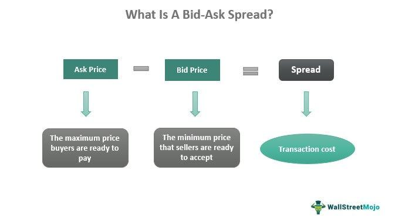

In the fast-paced world of financial trading, mastering key concepts such as ask price, ask spread, and bid-ask spread is fundamental for achieving success. These terms encapsulate essential elements of market dynamics, crucial for traders who seek to navigate the complexities of buying and selling financial instruments. The ask price, for instance, represents the lowest price a seller is willing to accept for a specific security, while the bid price is what a buyer is prepared to pay. The difference between these two prices is known as the bid-ask spread, which serves as a critical indicator of a market's liquidity and transaction cost metrics.

This article investigates into these fundamental terms, detailing their relevance and functions within financial markets. Furthermore, it examines the transformative impact of algorithmic trading, or algo trading, on trade execution. Algo trading employs algorithms to automate and optimize trading processes, capitalizing on innovative technologies to enhance efficiency and exploit market spreads.



Spreads are not uniform across all asset classes; they vary significantly depending on the market, whether it be stocks, forex, bonds, or derivatives. Each market has its own spread conventions and liquidity characteristics, influencing trading strategies and outcomes.

In understanding these terminology and their applications, traders can better leverage tools and strategies to optimize their financial activities. We will explore the types of financial spreads and their implications, offering readers insights into the dynamics of different asset classes and how these can affect trading decisions. Through this exploration, a comprehensive understanding of these concepts will empower traders to more effectively engage with financial markets, ultimately supporting their pursuit of profitability and efficiency.

## Table of Contents

## Understanding Ask Price and Ask Spread

The ask price, also known as the offer price, is the price set by a seller, indicating the amount they are willing to accept to sell a security, asset, or financial instrument. This price is one half of the critical components required in every trade operation, forming the foundation upon which transactions are negotiated. The clarity and efficiency with which these prices are set have a significant impact on market operations and participants' ability to conduct business effectively.

The ask spread refers to the disparity between the ask price and the bid price, the latter being the maximum price a buyer is prepared to pay for the same security. This spread is a crucial [factor](/wiki/factor-investing), affecting an investor's potential profitability since it represents an implicit transaction cost. An entity wishing to buy a security must do so at the ask price and can only sell it at the bid price, resulting in a cost equivalent to the spread.

Mathematically, the spread can be represented as follows:

$$
\text{Ask Spread} = \text{Ask Price} - \text{Bid Price}
$$

Different markets and asset classes exhibit unique spread conventions that reflect transaction costs and [liquidity](/wiki/liquidity-risk-premium) levels. For example, stocks, bonds, foreign exchange, and derivatives markets each have differing spread norms based on their inherent characteristics. Typically, spreads are tighter in markets with high trading volumes and liquidity. Conversely, in less liquid markets where trading activity is sparse, spreads are broader.

Liquidity plays a pivotal role in determining the width of the spread. A narrower spread signifies a highly liquid market where many buyers and sellers are present, facilitating smoother and faster transactions. Such conditions allow for minimal price differences between trading operations. For instance, in the [forex](/wiki/forex-system) market, major currency pairs like EUR/USD or USD/JPY often showcase very tight spreads due to substantial trading [volume](/wiki/volume-trading-strategy) and liquidity.

Conversely, a wider spread may suggest reduced liquidity or heightened [volatility](/wiki/volatility-trading-strategies), where fewer participants engage in trading, causing more considerable price discrepancies. In such contexts, trading may incur higher costs, and executing large transactions might become more challenging without impacting the market price.

In summary, comprehending the nuances of the ask price and ask spread is instrumental in navigating financial markets successfully. These metrics serve as indicators of market health and act as guides for traders aiming to optimize their profitability while mitigating transaction costs.

## Bid-Ask Spread and Its Importance

The bid-ask spread, defined as the difference between the bid price—the highest price a buyer is willing to pay—and the ask price—the lowest price a seller is willing to accept—plays a crucial role in financial markets. It reflects both market liquidity and the inherent transaction costs associated with trading activities.

A tight bid-ask spread signifies a market with high liquidity, where a higher volume of transactions occurs seamlessly, allowing for efficient trade executions. This efficiency is particularly advantageous to traders who rely on swift order fulfillment to capitalize on small price movements. Tight spreads are most commonly observed in highly liquid markets such as those for major stocks or widely traded currency pairs, where the abundance of buyers and sellers facilitates more competitive pricing.

Conversely, larger bid-ask spreads are generally found in markets with low liquidity. In such markets, the lack of active participants results in fewer available trades, causing discrepancies between the prices at which investors are willing to buy or sell. This can increase transaction costs, as the wider spread effectively acts as an additional cost that traders must overcome to achieve profitable trades.

To quantitatively understand the bid-ask spread, consider the formula:

$$
\text{Bid-Ask Spread} = \text{Ask Price} - \text{Bid Price}
$$

For instance, if the ask price for a stock is $101 and the bid price is $100, the bid-ask spread equals $1. This spread becomes a critical consideration for traders, as they must decide whether potential profits from a trade outweigh the costs implied by the spread.

In summary, understanding and analyzing bid-ask spreads allow market participants to better gauge liquidity, manage transaction costs, and make informed trading decisions that can enhance their strategies in various financial markets.

## Financial Spreads Across Markets

Spreads, reflecting the cost of executing trades, exhibit substantial variability across different financial markets including stocks, forex, bonds, and derivatives. This variability is crucial as it affects trading strategies, liquidity, and the overall trading costs faced by investors.

In the stock market, the introduction of decimalization marked a significant transformation in the spread landscape. Prior to this transition in the United States in 2001, stocks were quoted in fractions of a dollar, frequently resulting in wider spreads due to the limited price points between which a security could be traded. Decimalization reduced the minimum price movement to one cent, enhancing liquidity by increasing the precision of pricing and thereby narrowing the spreads. As a result, investors could benefit from lower transaction costs, enhancing market participation and efficiency.

Foreign exchange (forex) spreads, on the other hand, are primarily influenced by currency values and prevailing market conditions. Major currency pairs, such as EUR/USD and USD/JPY, typically exhibit tighter spreads due to their high liquidity and trading volumes. These tight spreads lower transaction costs, making them attractive to traders. Nonetheless, factors such as economic announcements, geopolitical events, or changes in monetary policy can cause spreads to widen due to increased volatility or decreased liquidity.

In the bond market, spreads often reflect credit risk, [interest rate](/wiki/interest-rate-trading-strategies) risk, and liquidity considerations. The difference between the yields of two bonds, often referred to as the credit spread, is a critical indicator of the perceived risk involved in holding them. Bonds with lower credit ratings usually exhibit wider spreads compared to those with higher ratings. Furthermore, less frequently traded bonds typically have broader spreads due to lower liquidity.

Derivatives markets, including options and futures, feature spreads that encapsulate market expectations and risk. The spread can be affected by factors such as volatility, time to expiration, and the underlying asset's liquidity. For example, options closer to expiration or with higher implied volatility might exhibit wider spreads, reflecting the increased uncertainty and risk embraced by market participants.

These differences in spreads among various asset classes underscore the necessity for traders and investors to tailor their strategies according to specific market characteristics. Understanding spread dynamics is pivotal for optimizing trade execution and managing costs effectively.

## Role of Spreads in Algorithmic Trading

Algorithmic trading, a method of executing orders using automated pre-programmed trading instructions, frequently depends on spreads to optimize trade execution and minimize costs. The bid-ask spread, in particular, provides an opportunity for algorithmic strategies to achieve profitability by efficiently processing high volumes of trades with minor price differences. 

High-frequency trading ([HFT](/wiki/high-frequency-trading-strategies)) systems, a subset of [algorithmic trading](/wiki/algorithmic-trading), are engineered to capitalize on small price discrepancies by conducting multiple trades within extremely short time frames. These systems can execute thousands of trades per second, exploiting even fractional differences in the bid-ask spread to generate significant cumulative profits. The mechanics of HFT rely on algorithms that detect minute spread variations across different exchanges or financial instruments and execute trades before the spreads normalize.

Automated trading platforms enhance market liquidity by providing a continuous stream of buy and sell orders, which contributes to reducing bid-ask spreads. These systems are programmed to manage spreads dynamically, buying when the spread narrows and selling when it widens. This activity results in tighter spreads, offering lower transaction costs for all market participants and promoting more efficient market functioning.

Algorithmic trading systems also incorporate sophisticated models to forecast spread behavior under varying market conditions. These models might include statistical analysis, [machine learning](/wiki/machine-learning), or [artificial intelligence](/wiki/ai-artificial-intelligence) techniques to predict movements and adjust strategies accordingly. The combination of spread analysis and algorithmic execution enables traders to react swiftly to market changes, securing minute pricing advantages that accumulate into substantial gains over time.

Python serves as a popular programming language for implementing these strategies due to its extensive libraries and frameworks for data analysis and machine learning. For instance, a simplistic model in Python to evaluate bid-ask spreads might use libraries such as NumPy for numerical calculations or pandas for managing time series data. Here's a basic Python example of how one might manipulate spread data:

```python
import pandas as pd

# Sample bid and ask prices
data = {'Bid': [100.5, 100.7, 100.6, 101.0, 101.5],
        'Ask': [101.0, 101.1, 101.2, 101.3, 101.8]}

# Create a DataFrame
df = pd.DataFrame(data)

# Calculate the Spread
df['Spread'] = df['Ask'] - df['Bid']

# Output the calculated spreads
print(df)
```

This code snippet illustrates how to calculate the spread from bid and ask prices, a fundamental step in preparing data for more complex algorithmic trading strategies.

## Algorithmic Trading Strategies Involving Spreads

Spread trading strategies are critical in algorithmic trading, with methods such as spread betting and [pair trading](/wiki/pair-trading) offering unique opportunities to profit from market price movements without necessitating ownership of the underlying assets. These strategies exploit the differential in price movements between related securities, aiming to optimize profit potential based on market inefficiencies.

Spread betting allows traders to speculate on the price movement of a financial instrument. The profit or loss is determined by how far the price moves in their favor or against their prediction. While this method does not confer ownership of the asset, it provides considerable leverage, allowing traders to gain from relatively small price movements.

Pair trading, another popular strategy, involves taking two positions: a long position on one asset and a short position on a correlated asset. This strategy is predicated on the historical correlation between the assets. For instance, assuming two stocks typically move together due to market forces, a pair trader might buy one stock while shorting the other if the correlation diverges. The trader profits when the spread between the two converges. This can be mathematically represented as:

$$
\text{Profit} = \Delta P_{\text{long}} - \Delta P_{\text{short}}
$$

Where $\Delta P_{\text{long}}$ and $\Delta P_{\text{short}}$ are the price changes in the long and short positions, respectively.

Algorithmic trading employs advanced programming and analytics to automate these strategies, allowing rapid execution and adjustment. Below is a simple Python code snippet that demonstrates a basic concept of pair trading using historical price data:

```python
import numpy as np
import pandas as pd

def calculate_spread(prices1, prices2):
    return prices1 - prices2

# Sample data
stock_A = np.array([100, 102, 105, 107, 110])
stock_B = np.array([101, 103, 102, 108, 112])

spread = calculate_spread(stock_A, stock_B)
print(spread)
```

Smart algorithms are designed to detect minimal variances in pricing, allowing traders to respond to spread fluctuations swiftly. These systems constantly monitor the market data streams, identifying inefficiencies and executing trades instantaneously. By achieving optimal entry and [exit](/wiki/exit-strategy) points in the trading cycle, these algorithms capitalize on even minuscule discrepancies, thereby maximizing the utility of minor pricing advantages. These functionalities underscore the robustness and adaptability of algorithmic trading strategies in financial markets, providing enhanced efficiency and potential profitability.

## Implications of Fintech on Spreads

Fintech innovations have significantly altered the landscape of trading spreads by leveraging technology to provide real-time data insights. This real-time data enables traders to make swift and informed decisions, optimizing their strategies in response to market conditions.

Automated trading platforms have emerged as powerful tools for managing and streamlining complex trading strategies. These platforms analyze market data at high speeds, allowing traders to spot and exploit favorable spreads rapidly. By automating transaction settlements, these platforms enhance efficiency, thereby impacting the bid-ask spread dynamics favorably. A reduction in spreads often results from such efficiencies, as the platforms mitigate delays and minimize errors in transactions.

Moreover, blockchain technology plays a pivotal role in ensuring efficient market transactions. It provides a decentralized and transparent ledger that aids in transaction verification, reducing the time and cost associated with trading. Blockchain can enhance the accuracy of recorded transactions, improving trust among market participants and contributing to narrower bid-ask spreads. For instance, the elimination of intermediary delays and the reduction of counterparty risk can lead to tighter spreads, reflecting higher market liquidity.

The combination of real-time data analytics, automated trading, and blockchain technology is transforming the way traders approach spreads. By providing the tools necessary for rapid response and efficient execution, fintech innovations have not only refined trading methodologies but also positively influenced spread dynamics, making markets more accessible and less costly for participants.

## Conclusion

In financial markets, understanding the concepts of ask price, ask spread, and bid-ask spread is crucial for maximizing profitability. The ask price represents the minimum price a seller is willing to accept for a security, while the bid-ask spread, the difference between the bid and ask prices, serves as an essential indicator of market liquidity and transaction costs. A thorough knowledge of these metrics allows traders to assess market conditions and execute trades more efficiently.

Technological advancements, particularly in algorithmic trading and fintech solutions, continue to reshape how trading spreads are perceived and utilized. Algorithmic trading systems exploit the nuances of bid-ask spreads to enhance trade execution speeds and accuracy. These systems can identify and act upon even the slightest opportunities for profit presented by fluctuations in spreads. For instance, high-frequency trading strategies frequently target minute discrepancies in bid-ask spreads across various asset classes.

Moreover, fintech innovations bring real-time data and analytics capabilities to traders, allowing for informed decision-making processes. Automated trading platforms now allow individuals and institutions to implement complex trading strategies effortlessly, optimizing spread management in real-time. Technologies like blockchain further add to the efficiency of market transactions, potentially resulting in reduced spreads and lowered transaction costs.

Ultimately, a firm grasp of ask price, ask spread, and bid-ask spread can significantly enhance a trader's ability to navigate financial markets. By leveraging technological tools and understanding the nuances of spread dynamics, market participants can position themselves to capitalize on favorable trading conditions, thereby maximizing potential profitability. As technology continues to evolve, so too do the opportunities for traders to optimize their strategies around these fundamental market concepts.

## References & Further Reading

[1]: Harris, L. (2003). ["Trading & Exchanges: Market Microstructure for Practitioners."](https://www.amazon.com/Trading-Exchanges-Market-Microstructure-Practitioners/dp/0195144708) Oxford University Press.

[2]: Menkhoff, L., Sarno, L., Schmeling, M., & Schrimpf, A. (2012). ["Currency Momentum Strategies."](https://papers.ssrn.com/sol3/papers.cfm?abstract_id=1809776) The Review of Financial Studies, Volume 25, Issue 2.

[3]: Lopez de Prado, M. (2018). ["Advances in Financial Machine Learning."](https://www.amazon.com/Advances-Financial-Machine-Learning-Marcos/dp/1119482089) Wiley.

[4]: Aldridge, I. (2013). ["High-Frequency Trading: A Practical Guide to Algorithmic Strategies and Trading Systems."](https://www.amazon.com/High-Frequency-Trading-Practical-Algorithmic-Strategies/dp/1118343506) Wiley.

[5]: Chan, E. P. (2009). ["Quantitative Trading: How to Build Your Own Algorithmic Trading Business."](https://github.com/ftvision/quant_trading_echan_book) Wiley.

[6]: Jansen, S. (2020). ["Machine Learning for Algorithmic Trading: Predictive models to extract signals from market and alternative data for systematic trading strategies with Python."](https://github.com/stefan-jansen/machine-learning-for-trading) Packt Publishing.

[7]: Tsay, R. S. (2010). ["Analysis of Financial Time Series."](https://onlinelibrary.wiley.com/doi/book/10.1002/9780470644560) Wiley.