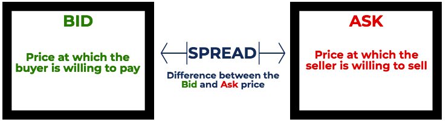

## Table of Contents

## What is the basic definition of an ask price?

The ask price is the lowest price a seller is willing to accept for a stock or other security. It's like when you're selling something and you say, "I want at least this much money for it." In the stock market, the ask price is what you see when you want to buy a stock. It tells you the minimum amount you need to pay to get that stock from someone who is selling it.

The ask price is important because it helps set the current market price of a stock. When you look at a stock's price on a financial website or app, you're usually seeing the last price at which the stock was traded. But if you want to buy it right now, you'll have to pay the ask price. This price can change quickly as sellers adjust what they're willing to accept based on how much people want to buy the stock.

## How does the ask price differ from the bid price?

The ask price and the bid price are two important numbers you see when you're looking at stocks. The ask price is the lowest price someone selling the stock is willing to take. It's like if you have a toy and you say, "I'll sell this for at least $5." That $5 is your ask price. On the other hand, the bid price is the highest price someone who wants to buy the stock is willing to pay. It's like if someone comes along and says, "I'll give you $4 for that toy." That $4 is their bid price.

The difference between the ask price and the bid price is called the bid-ask spread. This spread is important because it shows how much the price might change from one trade to the next. If the ask price is $5 and the bid price is $4, the spread is $1. This means if you want to buy the stock at the ask price and then sell it right away at the bid price, you would lose $1. The smaller the spread, the easier it is to buy and sell the stock without losing much money.

## Why is the ask price important in trading?

The ask price is super important in trading because it tells you the lowest price you need to pay to buy a stock right now. Imagine you're at a store and you want to buy a toy. The price tag on the toy is like the ask price - it's what the store is asking for the toy. If you want to take the toy home, you have to pay that price. In the same way, if you want to buy a stock, you have to pay the ask price set by the seller.

The ask price also helps set the market price of a stock. When you see the price of a stock on a website or app, it's usually the last price someone paid for it. But if you want to buy it right now, you'll have to pay the current ask price. This price can change quickly as sellers decide what they want for their stocks. Knowing the ask price helps you understand how much you'll need to spend and how the stock's price might move in the future.

## Can you explain how the ask price is determined in a stock market?

The ask price in a stock market is set by sellers who want to sell their stocks. Imagine you have a toy and you want to sell it. You decide you want at least $5 for it, so you set your price at $5. In the stock market, sellers do the same thing. They look at what's happening with the stock, like how much people want to buy it and what other sellers are asking, and then they decide on their ask price. If a lot of people want to buy the stock, sellers might ask for more money. If not many people want it, they might ask for less.

The ask price can change all the time because sellers are always looking at what's happening in the market. If someone else is selling the same stock for less, a seller might lower their ask price to get someone to buy from them instead. Or if the stock starts to become more popular, sellers might raise their ask price because they know people will be willing to pay more. This back-and-forth between sellers helps set the ask price, which is important for anyone who wants to buy the stock because it tells them how much they need to pay right now.

## What role does the ask price play in the liquidity of a security?

The ask price is really important for how easy it is to buy or sell a security, which we call liquidity. If the ask price is low and close to the bid price, it means the security is easy to trade. Imagine you're at a store and the toy you want to buy is on sale for a good price. You're more likely to buy it, right? In the same way, if the ask price for a stock is low, more people will want to buy it, making it easier to trade.

On the other hand, if the ask price is high and far away from the bid price, it can make the security less liquid. It's like if the toy at the store is really expensive. You might not want to buy it, and it could sit on the shelf for a long time. When the ask price is high, fewer people might want to buy the stock, making it harder to trade. So, the ask price helps decide how liquid a security is by showing how much people have to pay to buy it.

## How do market makers influence the ask price?

Market makers are like the middlemen in the stock market. They help make sure there are always people ready to buy or sell stocks. When it comes to the ask price, market makers decide what price they want to sell the stocks for. They look at how much people want to buy the stock and what other sellers are asking. If a lot of people want to buy, market makers might set a higher ask price because they know people will pay more. If not many people want to buy, they might set a lower ask price to make it easier to sell the stocks.

By setting the ask price, market makers help keep the market moving smoothly. They make sure there's always an ask price available, which helps people buy stocks when they want to. If the ask price is too high, fewer people might want to buy, and the market could slow down. If it's too low, market makers might not make enough money to keep doing their job. So, they try to find a good balance that keeps the market liquid and helps them earn a profit.

## What are the factors that can cause the ask price to change?

The ask price can change because of what's happening in the market. If a lot of people want to buy a stock, sellers might raise the ask price because they know people will pay more. It's like if everyone wants a toy, the store might put a higher price on it. On the other hand, if not many people want to buy the stock, sellers might lower the ask price to make it easier to sell. It's like if a toy isn't selling, the store might put it on sale.

Another reason the ask price can change is because of what other sellers are doing. If someone else is selling the same stock for less, a seller might lower their ask price to get people to buy from them instead. It's like if another store is selling the same toy cheaper, the first store might lower their price to compete. Also, big news about a company can make the ask price go up or down. If the news is good, like the company making more money, the ask price might go up because more people will want to buy the stock. If the news is bad, like the company losing money, the ask price might go down because fewer people will want to buy.

## How can understanding the ask price help in making better investment decisions?

Understanding the ask price can help you make better investment decisions because it tells you the lowest price you need to pay to buy a stock right now. When you know the ask price, you can compare it to what you think the stock is worth. If the ask price is lower than what you think the stock is worth, it might be a good time to buy. But if the ask price is higher than what you think the stock is worth, you might want to wait for a better price.

The ask price also helps you understand how easy it is to buy or sell a stock, which is called liquidity. If the ask price is close to the bid price, it means the stock is easy to trade. This is good because it means you can buy or sell the stock quickly without losing much money. If the ask price is far away from the bid price, it might be harder to trade the stock, and you might want to think about that before you decide to invest. By looking at the ask price, you can make smarter choices about when and what to buy or sell.

## What is the relationship between the ask price and the volume of trades?

The ask price and the volume of trades are closely related. When the ask price is low, more people might want to buy the stock because it's a good deal. This can lead to a higher volume of trades because more people are buying. On the other hand, if the ask price is high, fewer people might want to buy, which can lead to a lower volume of trades. So, the ask price can affect how many people are trading the stock.

Changes in the volume of trades can also affect the ask price. If a lot of people are buying the stock, sellers might see that and raise the ask price because they know people are willing to pay more. If not many people are buying, sellers might lower the ask price to try to get more people to buy. So, the volume of trades can influence what sellers decide to ask for their stocks.

## How does the ask price impact the spread in financial markets?

The ask price plays a big role in the spread in financial markets. The spread is the difference between the ask price, which is what sellers want for a stock, and the bid price, which is what buyers are willing to pay. If the ask price is high, the spread can be bigger because there's a bigger gap between what sellers want and what buyers are willing to pay. A bigger spread means it's harder to buy and sell the stock without losing money, which can make the stock less liquid.

On the other hand, if the ask price is low and close to the bid price, the spread can be smaller. A smaller spread makes it easier to trade the stock because you don't lose as much money when you buy at the ask price and then sell at the bid price. So, the ask price helps decide how big the spread is, which affects how easy it is to trade the stock.

## Can you discuss the psychological aspects of the ask price in trading?

The ask price can play tricks with your mind when you're trading. It's like when you see a price tag on something you want to buy. If the ask price is high, you might feel like the stock is too expensive and decide not to buy it. This can make you miss out on a good investment if the stock is actually worth more than the ask price. On the other hand, if the ask price is low, you might feel excited and think it's a great deal, which can make you want to buy the stock quickly. But sometimes, a low ask price can make you rush into a decision without thinking it through.

Sellers also use the ask price to play mind games. They might set a high ask price to make people think the stock is really valuable, even if it's not. This can make buyers feel like they need to pay more to get a good stock. Or, sellers might lower the ask price to make it seem like a bargain, which can trick people into buying without looking at the bigger picture. Understanding these psychological tricks can help you make better choices and not get fooled by the ask price alone.

## What advanced strategies involve manipulating or responding to the ask price?

One advanced strategy that traders use is called "sniping the ask." This means waiting until the very last moment before the market closes to buy a stock at the current ask price. Traders do this because they hope the ask price will be lower at the end of the day, letting them buy the stock for less money. It's like waiting until the store is about to close to buy something on sale. This strategy needs good timing and a lot of watching the market, but it can help traders get a better deal.

Another strategy is called "spoofing." This is when traders put in fake orders to buy a stock at a high ask price, making it look like a lot of people want to buy it. They do this to trick other traders into thinking the stock is more valuable than it really is. Once the ask price goes up because of the fake orders, the traders who did the spoofing can sell their own stocks at the higher price. This is a tricky and sometimes illegal strategy, so it's important to be careful and know the rules.

A third strategy is "front running." This happens when traders see a big order coming in to buy a stock and quickly buy the stock themselves at the current ask price. They do this because they know the big order will push the ask price up, so they can sell their stocks at a higher price later. It's like getting in line at a store before a big rush to buy something before the price goes up. This strategy can be controversial and is often against the rules in many markets.

## What is the role of the ask price in mutual funds?

The ask price in mutual funds, often referred to as the public offering price (POP), is a critical component for investors deciding to purchase shares in a fund. It represents the amount an investor pays to buy a mutual fund share, typically calculated by adding any sales charges or loads to the net asset value (NAV).

### Calculating the Ask Price for Mutual Funds

The formula for determining the ask price of a mutual fund can be expressed as:

$$
\text{Ask Price} = \text{NAV} + \text{Sales Charge}
$$

**Net Asset Value (NAV):** The NAV per share is the market value of a fund's total assets minus its liabilities, divided by the number of outstanding shares. It reflects the intrinsic value of the assets held by the fund and fluctuates daily based on market performance.

**Sales Charges (Loads):** These are fees paid to the broker or fund agents that are added to the NAV. They can be front-end loads, which are charged at the time of initial purchase, or back-end loads, which are incurred when selling the shares. For instance, if a mutual fund has an NAV of $100 and a front-end load of 5%, the ask price would be $105.

### Importance for Investors

Understanding the ask price is crucial for mutual fund investors for several reasons:

1. **Cost Clarity:** Investors must be aware of the total cost involved when purchasing shares. A higher sales charge diminishes the value of the initial investment, affecting overall returns.

2. **Investment Comparison:** Knowing the ask price allows investors to compare funds effectively. Two funds may have the same NAV but different sales charges, impacting the overall expense and net gains from the investment.

3. **Decision Making:** Clarity around the ask price aids investors in making more informed decisions about entry and exit strategies in their mutual fund investments. Assessing these costs is pivotal for short-term trade strategies and long-term investment plans.

4. **Transparency and Planning:** Transparency in ask prices equips investors to plan and align their investment goals with their risk tolerance and financial objectives.

By thoroughly understanding ask prices, mutual fund investors can make educated choices, effectively manage their portfolios, and optimize potential returns while considering fund costs and fee structures.

## References & Further Reading

[1]: ["Advances in Financial Machine Learning"](https://www.amazon.com/Advances-Financial-Machine-Learning-Marcos/dp/1119482089) by Marcos Lopez de Prado

[2]: ["Evidence-Based Technical Analysis: Applying the Scientific Method and Statistical Inference to Trading Signals"](https://www.wiley.com/en-gb/Evidence+Based+Technical+Analysis:+Applying+the+Scientific+Method+and+Statistical+Inference+to+Trading+Signals-p-9780470008744) by David Aronson

[3]: ["Machine Learning for Algorithmic Trading"](https://www.amazon.com/Machine-Learning-Algorithmic-Trading-intelligence/dp/9918608013) by Stefan Jansen

[4]: ["Quantitative Trading: How to Build Your Own Algorithmic Trading Business"](https://www.amazon.com/Quantitative-Trading-Build-Algorithmic-Business/dp/0470284889) by Ernest P. Chan

[5]: Mankiw, N. G. (2014). ["Principles of Economics"](https://www.amazon.com/Principles-Economics-N-Gregory-Mankiw/dp/0538453052) (7th Edition). Cengage Learning.

[6]: Fabozzi, F. J., Focardi, S. M., & Kolm, P. N. (2006). ["The Mathematics of Financial Modeling and Investment Management"](https://www.wiley.com/en-us/The+Mathematics+of+Financial+Modeling+and+Investment+Management-p-9780471674238). Wiley.