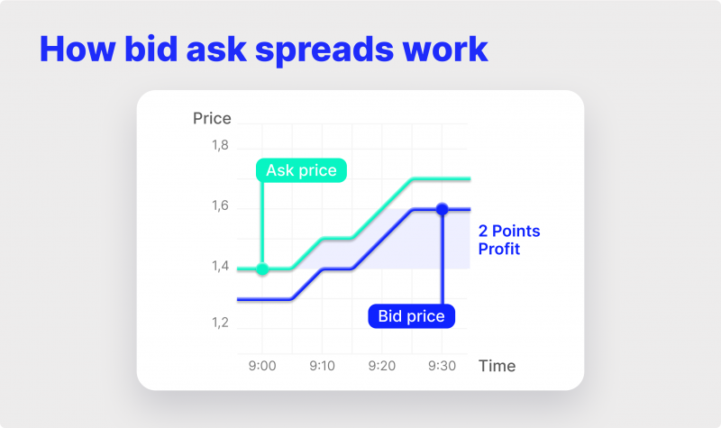

## Table of Contents

## What is 'Ask' and why is it important?

'Ask' is when you want to know something and you ask a question to get an answer. It's a way to learn new things or get help when you need it. When you ask, you might talk to a person, like a friend or a teacher, or you might use a computer or a phone to find out information.

Asking is important because it helps us grow and learn. If we don't ask questions, we might stay confused or not know important things. Asking can also help us solve problems and make good choices. When we ask, we show that we are curious and want to understand the world better.

## How does 'Ask' differ from other similar tools or concepts?

'Ask' is different from other tools or concepts because it's about wanting to know something and directly asking for an answer. When you use 'Ask,' you are usually looking for specific information or help. It's like when you raise your hand in class to ask the teacher a question. Other tools, like 'search,' might give you a lot of information, but you have to look through it to find what you need. With 'Ask,' you can get a quick and direct answer.

Another way 'Ask' is different is that it often involves talking to another person. This can be a friend, a family member, or even someone you don't know, like a customer service person. When you ask someone a question, you can get a personal answer that fits what you need. Other concepts, like 'research,' might involve reading books or articles, but they don't give you the chance to ask follow-up questions or get a response right away. 'Ask' helps you connect with others and learn from them directly.

## What are the basic steps to start using 'Ask' effectively?

To start using 'Ask' effectively, first, think about what you want to know. It could be anything from a simple fact to help with a big problem. Once you know what you want to ask, decide who or what can give you the best answer. This could be a person, like a teacher or a friend, or it could be a tool, like a search engine or a smart device. Make sure your question is clear and easy to understand so that you can get the best answer possible.

Next, when you ask your question, be ready to listen or read the answer carefully. Sometimes, you might need to ask more questions to understand better, and that's okay. If you're asking a person, be polite and say thank you for their help. If you're using a tool, make sure to check if the information is correct. The more you practice asking, the better you'll get at finding the answers you need.

## Can you explain the key features of 'Ask' for beginners?

'Ask' is a simple way to get information or help by asking a question. When you use 'Ask,' you are looking for a specific answer to something you want to know. It can be about anything, like how to do something, why something happens, or what something means. You can ask a person, like a friend or a teacher, or you can use a tool like a computer or a phone. The important thing is to make sure your question is clear so that you can get the best answer.

When you ask a question, be ready to listen or read the answer carefully. Sometimes, the answer might lead to more questions, and that's okay. It's good to keep asking until you understand. If you're asking a person, remember to be polite and say thank you. If you're using a tool, make sure the information you get is correct. The more you practice asking, the better you'll get at finding the answers you need.

## What are some common mistakes to avoid when using 'Ask'?

When you use 'Ask,' one common mistake is not being clear with your question. If your question is hard to understand, the person or tool you are asking might not give you the right answer. Make sure to say what you want to know in a simple way. Another mistake is not listening or reading the answer carefully. Sometimes, you might miss important information because you are not paying attention.

Another mistake is not asking follow-up questions when you need to. If you don't understand something, it's okay to ask more questions to get a better answer. Also, some people might feel shy or scared to ask, but it's important to remember that asking is a good way to learn. Lastly, when asking a person, don't forget to be polite and say thank you. It shows respect and makes people more willing to help you next time.

## How can 'Ask' be integrated into daily workflows or routines?

You can use 'Ask' in your daily life to make things easier and learn more. When you are at school or work, you can ask your teacher or boss if you don't understand something. This helps you do your job better and learn new things. At home, you can ask your family or friends for help with chores or to learn how to do something new, like cooking a meal. Using 'Ask' often can become a part of your routine, making it easier to get the information or help you need.

Another way to use 'Ask' every day is with tools like computers or phones. If you need to know something quickly, you can ask a search engine or a smart device. For example, if you want to know the weather, you can ask your phone, and it will tell you right away. By making 'Ask' a part of your daily life, you can solve problems faster and learn more about the world around you.

## What advanced techniques can enhance the use of 'Ask'?

One advanced technique to enhance the use of 'Ask' is to use it in a smart way by asking better questions. Instead of asking simple yes or no questions, try to ask questions that start with "how," "why," or "what if." This can help you get more detailed answers and understand things better. For example, instead of asking, "Is this right?" you could ask, "How can I make this better?" This kind of question can lead to more helpful answers and deeper learning.

Another technique is to use 'Ask' with different sources to get a full picture. You can ask the same question to different people or use different tools to see if you get the same answer. This can help you check if the information is correct and learn from different points of view. For example, if you're learning about a topic, you could ask your teacher, look it up online, and talk to a friend about it. By doing this, you can understand the topic better and make sure you have the right information.

## How does 'Ask' handle data privacy and security?

When you use 'Ask' to get information from people, it's important to think about privacy. If you're asking a person a question, you should be careful not to ask for private information that they might not want to share. For example, you shouldn't ask someone about their personal secrets or private details like their address or phone number. It's good to respect people's privacy and only ask for information that they are comfortable sharing.

When you use 'Ask' with tools like computers or phones, data privacy and security are handled differently. Many tools have rules about how they use your information and keep it safe. For example, when you ask a question on a search engine, it might use your data to give you better answers, but it should also have ways to protect your privacy. It's a good idea to read about these rules, called privacy policies, to understand how your data is used and kept safe. This way, you can use 'Ask' without worrying about your information being shared in ways you don't want.

## What are the best practices for optimizing 'Ask' for specific industries?

In different industries, using 'Ask' can be made better by understanding what kind of information is most important. For example, in healthcare, it's good to ask clear and specific questions about patient care or medical procedures. This helps doctors and nurses give the right answers quickly. In the tech industry, asking detailed questions about coding or software can help solve problems faster. By knowing the right questions to ask, people in these industries can work more efficiently and get the information they need to do their jobs well.

Another way to optimize 'Ask' for specific industries is by using the right tools. In finance, for example, using 'Ask' with specialized software can help answer questions about investments or market trends. This makes it easier to get accurate and up-to-date information. In education, teachers can use 'Ask' with online platforms to answer students' questions and give feedback. By choosing the right tools for each industry, 'Ask' can be more effective and help people learn and work better.

## How can 'Ask' be customized or extended for expert users?

For expert users, 'Ask' can be customized by setting up specific databases or knowledge bases that contain detailed information relevant to their field. This means that when an expert asks a question, the system can pull answers from these specialized sources, giving them more accurate and in-depth responses. For example, a scientist might customize 'Ask' to connect with scientific journals and databases, allowing them to get the latest research findings quickly. By tailoring the sources of information, experts can make 'Ask' more useful for their specific needs.

Another way to extend 'Ask' for expert users is by integrating it with advanced tools and software. Experts can use 'Ask' with programming languages or data analysis tools to ask complex questions and get detailed answers. For instance, a data analyst might use 'Ask' with a tool like Python to query large datasets and get insights that help with their work. By combining 'Ask' with these powerful tools, experts can solve problems more efficiently and gain deeper understanding in their fields.

## What are the future trends and developments expected for 'Ask'?

In the future, 'Ask' is expected to become even smarter and more helpful. As technology gets better, 'Ask' will be able to understand our questions more easily and give us answers that are just right for what we need. This means that when we ask a question, the computer or phone might not only give us an answer but also suggest more questions we might want to ask or show us things we might be interested in. For example, if you ask about a topic, 'Ask' might also show you videos or articles that can help you learn more about it.

Another big change coming for 'Ask' is that it will work better with other tools and devices. This means that 'Ask' could be part of our everyday life in new ways. For instance, you might be able to ask your car to find the nearest gas station or ask your smart home to turn on the lights just by asking a question. As 'Ask' becomes more connected with everything around us, it will make getting information and help even easier and more natural.

## Can you provide case studies or examples where 'Ask' has significantly impacted outcomes?

In a school in New York, a teacher used 'Ask' to help her students learn better. She encouraged them to ask questions about anything they didn't understand during class. One student was struggling with math and started asking the teacher for help. By asking questions, the student got clear explanations and soon improved his grades. The teacher saw that other students started asking more questions too, and the whole class began to learn more and do better in school. 'Ask' helped create a classroom where everyone felt comfortable asking for help and learning from each other.

In a hospital in California, doctors used 'Ask' to improve patient care. They set up a system where patients could easily ask questions about their treatment and recovery. One patient was unsure about her medication and used 'Ask' to talk to her doctor. The doctor explained everything clearly, and the patient felt more confident about her treatment. This led to better health outcomes because patients were more likely to follow their treatment plans when they understood them. The hospital saw that using 'Ask' helped patients feel more involved in their care and led to faster recovery times.

## References & Further Reading

[1]: Bergstra, J., Bardenet, R., Bengio, Y., & Kégl, B. (2011). ["Algorithms for Hyper-Parameter Optimization."](https://papers.nips.cc/paper/4443-algorithms-for-hyper-parameter-optimization) Advances in Neural Information Processing Systems 24.

[2]: ["Advances in Financial Machine Learning"](https://www.amazon.com/Advances-Financial-Machine-Learning-Marcos/dp/1119482089) by Marcos Lopez de Prado

[3]: ["Evidence-Based Technical Analysis: Applying the Scientific Method and Statistical Inference to Trading Signals"](https://www.wiley.com/en-us/Evidence+Based+Technical+Analysis%3A+Applying+the+Scientific+Method+and+Statistical+Inference+to+Trading+Signals-p-9780470008744) by David Aronson

[4]: ["Machine Learning for Algorithmic Trading"](https://github.com/PacktPublishing/Machine-Learning-for-Algorithmic-Trading-Second-Edition) by Stefan Jansen

[5]: ["Quantitative Trading: How to Build Your Own Algorithmic Trading Business"](https://www.amazon.com/Quantitative-Trading-Build-Algorithmic-Business/dp/1119800064) by Ernest P. Chan