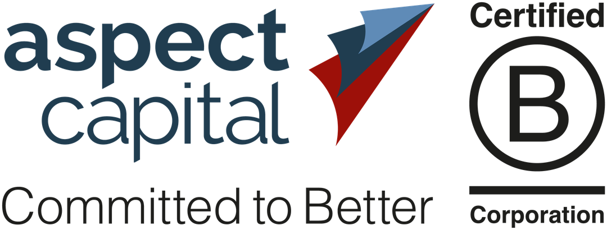

## Table of Contents

## What is Aspect Capital?

Aspect Capital is a company that manages money for people and other organizations. They use computers and math to decide where to invest the money. They were started in 1997 by two people named Anthony Todd and Martin Lueck. Their main office is in London, but they also have offices in other places like Amsterdam and Singapore.

Aspect Capital is known for using a method called systematic trading. This means they use rules and data to make decisions about buying and selling things like stocks and bonds, instead of guessing or following feelings. They try to find patterns in the market that others might not see. This helps them make money for their clients over time.

## Who founded Aspect Capital and when was it established?

Aspect Capital was founded by two people named Anthony Todd and Martin Lueck. They started the company because they wanted to use computers and math to help people make money from investing.

The company was established in 1997. Since then, Aspect Capital has grown and now has offices in different parts of the world, like London, Amsterdam, and Singapore. They use a special way of investing called systematic trading, which means they follow rules and use data to make their decisions.

## What is the primary focus of Aspect Capital's investment strategy?

Aspect Capital's main focus is on using computers and math to make investment decisions. They use a method called systematic trading, which means they follow strict rules and look at lots of data to decide what to buy and sell. This helps them find patterns in the market that others might miss. Instead of guessing or following their feelings, they use numbers and facts to make choices.

Their goal is to make money for their clients over time by being smart and careful with their investments. They invest in things like stocks, bonds, and other financial products. By using technology and data, Aspect Capital tries to do better than other investors who might not use these tools. This approach helps them manage risk and aim for steady profits.

## How does Aspect Capital use technology in its trading strategies?

Aspect Capital uses computers and math to make smart choices about where to invest money. They use something called systematic trading, which means they follow strict rules and look at lots of data to decide what to buy and sell. This helps them find patterns in the market that others might not see. Instead of guessing or following their feelings, they use numbers and facts to make choices. This way, they can manage risk better and aim for steady profits for their clients.

To do this, Aspect Capital uses special computer programs that can analyze huge amounts of information very quickly. These programs look at things like stock prices, economic reports, and other data to spot trends and make predictions. By using technology, they can make decisions faster and more accurately than if they were doing it by hand. This helps them stay ahead in the fast-changing world of investing and make the best choices for their clients' money.

## What are the different types of funds offered by Aspect Capital?

Aspect Capital offers different types of funds to meet the needs of their clients. One type of fund they offer is called the Aspect Diversified Fund. This fund invests in many different things like stocks, bonds, and other financial products to spread out the risk. By doing this, they try to make steady profits over time. Another fund they offer is the Aspect Core Diversified Fund, which is similar but might have a different mix of investments.

They also have funds that focus on specific areas. For example, the Aspect Quantitative Fund uses even more math and computer models to make investment choices. This fund tries to find small patterns in the market that can lead to big gains. Aspect Capital also offers funds that invest in things like currencies and commodities, which can be good for people who want to diversify their investments even more. By offering these different types of funds, Aspect Capital helps their clients find the right investment strategy for their goals.

## Can you explain the concept of systematic trading as used by Aspect Capital?

Systematic trading is a way of making investment decisions that Aspect Capital uses. Instead of guessing or following feelings, they use computers and math to make choices. They look at lots of data and follow strict rules to decide what to buy and sell. This helps them find patterns in the market that others might not see. By using numbers and facts, they try to make smart decisions that will make money for their clients over time.

Aspect Capital uses special computer programs to help with systematic trading. These programs can analyze huge amounts of information very quickly. They look at things like stock prices, economic reports, and other data to spot trends and make predictions. By using technology, Aspect Capital can make decisions faster and more accurately than if they were doing it by hand. This helps them stay ahead in the fast-changing world of investing and make the best choices for their clients' money.

## What role does quantitative analysis play in Aspect Capital's operations?

Quantitative analysis is a big part of what Aspect Capital does. It means using math and numbers to make choices about investing. Instead of guessing, they use computers to look at a lot of data. This helps them find patterns in the market that other people might not see. By using numbers and facts, they can make smart decisions that help their clients make money over time.

Aspect Capital uses special computer programs for quantitative analysis. These programs can look at huge amounts of information very quickly. They check things like stock prices, economic reports, and other data to spot trends and make predictions. By using technology, Aspect Capital can make decisions faster and more accurately than if they were doing it by hand. This helps them stay ahead in the fast-changing world of investing and make the best choices for their clients' money.

## How has Aspect Capital performed historically in terms of returns?

Aspect Capital has done well over the years, but like all investments, their returns can go up and down. They use computers and math to make smart choices about where to invest money. This has helped them make good returns for their clients over time. For example, their Aspect Diversified Fund has had years where it made money and years where it lost money, but overall, it has aimed to grow clients' investments.

Looking at specific numbers, from 2000 to 2020, the Aspect Diversified Fund had an average yearly return of about 7%. This means if you put $100 in the fund at the start of 2000, by the end of 2020, it could have grown to around $320. But, it's important to remember that past performance doesn't guarantee future results. The market can change, and what worked before might not work the same way in the future.

## What are some of the major challenges Aspect Capital has faced in the market?

Aspect Capital has faced some big challenges in the market. One big challenge is that markets can be unpredictable. Even though they use computers and math to make choices, sometimes the market does things no one expects. This can make it hard for them to make money for their clients. Another challenge is competition. There are many other companies trying to do the same thing, and they all want to be the best. This means Aspect Capital has to keep finding new ways to stay ahead.

Another challenge they face is managing risk. When you invest money, there's always a chance you could lose it. Aspect Capital tries to use data and rules to keep risks low, but it's not always easy. They have to be very careful and smart about how they invest to protect their clients' money. Keeping up with new technology is also a challenge. They need to keep their computer programs up to date so they can keep making good choices. If they fall behind, it could hurt their performance.

## How does Aspect Capital manage risk in its investment portfolios?

Aspect Capital uses computers and math to manage risk in their investment portfolios. They look at a lot of data and follow strict rules to decide what to buy and sell. This helps them spread out the risk by investing in many different things like stocks, bonds, and other financial products. By doing this, they try to make sure that if one investment goes down, others might go up, balancing things out. They also use special computer programs to check the market all the time, so they can make quick changes if they need to.

Another way they manage risk is by using something called stop-loss orders. This means they set a limit on how much they are willing to lose on an investment. If the price of an investment goes down to that limit, they will sell it to stop losing more money. They also keep an eye on how much they are investing in different areas, so they don't put all their eggs in one basket. By being careful and using technology, Aspect Capital tries to keep their clients' money safe while still aiming to make good returns.

## What are the future growth strategies of Aspect Capital?

Aspect Capital is always looking for ways to grow and do better for their clients. One of their main strategies is to keep improving their computer programs and math models. They want to make sure they can find new patterns in the market that others might miss. By using the latest technology, they hope to make smarter choices about where to invest money. They also want to reach more people and organizations around the world, so they are thinking about opening more offices in new places.

Another part of their growth plan is to keep learning and adapting. The market changes all the time, so Aspect Capital needs to keep up. They are looking at new types of investments and trying to find ways to manage risk even better. By doing this, they hope to keep making good returns for their clients, even when the market is hard to predict. They also want to work with more partners and experts to get new ideas and insights that can help them grow.

## How does Aspect Capital contribute to the field of financial research and development?

Aspect Capital helps the world of financial research and development by using computers and math to find new ways to invest money. They create special computer programs that can look at a lot of data very quickly. This helps them spot patterns in the market that other people might not see. By sharing what they learn, they help other researchers and investors understand how to use technology to make better choices. They also work with universities and other groups to study new ideas and methods, which can lead to new ways of investing.

Another way Aspect Capital contributes is by always trying to improve their methods. They keep up with the latest technology and research to make sure their computer programs are the best they can be. This not only helps them do well for their clients but also pushes the whole field of financial research forward. By showing how systematic trading can work, they encourage others to try new things and learn from their successes and challenges. This helps the whole industry grow and find better ways to manage money.

## What types of algorithms are used?

Aspect Capital employs a variety of algorithmic strategies optimized for different investment objectives and market conditions. These strategies can be broadly classified into three categories: execution algorithms, profit-seeking algorithms, and proprietary black-box algorithms that incorporate [machine learning](/wiki/machine-learning) techniques.

Execution algorithms like Volume Weighted Average Price (VWAP) and Time Weighted Average Price (TWAP) are pivotal in managing large orders to minimize market impact. VWAP calculates the average price a security has traded at throughout the day, weighted by [volume](/wiki/volume-trading-strategy). By aiming to execute trades close to this calculated price, VWAP helps in reducing the market footprint of large transactions. Mathematically, it can be represented as:

$$
\text{VWAP} = \frac{\sum (P_i \times Q_i)}{\sum Q_i}
$$

where $P_i$ is the price of the trade, and $Q_i$ is the quantity of trade.

TWAP, on the other hand, involves executing orders at evenly distributed intervals over a specified time frame, which aids in reducing the price impact and achieving a price close to the average over the time window. Both VWAP and TWAP are crucial for maintaining confidentiality and reducing slippage in high-volume trades.

Profit-seeking algorithms aim to exploit market inefficiencies and recognizable patterns to enhance portfolio returns. These algorithms are typically built on historical data and statistical models to predict future price movements. By identifying such patterns or temporary inefficiencies, Aspect Capital seeks to make trades that provide a positive expected return. For example, mean reversion strategies, which are based on the belief that asset prices will revert to their historical average, are common in this category.

Proprietary black-box algorithms represent another facet of Aspect Capital's strategy. These algorithms are highly sophisticated and often shrouded in secrecy, leveraging cutting-edge machine learning techniques to dynamically adapt to changing market conditions. Machine learning models, such as neural networks, can identify complex, non-linear relationships within vast datasets, providing a predictive edge that traditional models may not capture. A typical application might involve training a model to forecast short-term price movements based on high-dimensional features extracted from market data:

```python
from sklearn.model_selection import train_test_split
from sklearn.ensemble import RandomForestRegressor

# Example data
X, y = ...  # Feature matrix and target value

# Splitting the data
X_train, X_test, y_train, y_test = train_test_split(X, y, test_size=0.2, random_state=42)

# Initialize and train model
model = RandomForestRegressor(n_estimators=100, random_state=42)
model.fit(X_train, y_train)

# Predicting and evaluating
predictions = model.predict(X_test)
```

By constantly refining these algorithms and incorporating new data and techniques, Aspect Capital maintains a competitive edge, ensuring that their strategies remain effective under varying market conditions.

## References & Further Reading

[1]: ["Advances in Financial Machine Learning"](https://www.amazon.com/Advances-Financial-Machine-Learning-Marcos/dp/1119482089) by Marcos Lopez de Prado

[2]: ["Quantitative Trading: How to Build Your Own Algorithmic Trading Business"](https://www.amazon.com/Quantitative-Trading-Build-Algorithmic-Business/dp/1119800064) by Ernest P. Chan

[3]: ["Algorithmic Trading: Winning Strategies and Their Rationale"](https://books.google.com/books/about/Algorithmic_Trading.html?id=WAlFDwAAQBAJ) by Ernie Chan

[4]: ["Evidence-Based Technical Analysis: Applying the Scientific Method and Statistical Inference to Trading Signals"](https://www.amazon.com/Evidence-Based-Technical-Analysis-Scientific-Statistical/dp/0470008741) by David Aronson

[5]: Aldridge, I. (2013). ["High-Frequency Trading: A Practical Guide to Algorithmic Strategies and Trading Systems."](https://www.amazon.com/High-Frequency-Trading-Practical-Algorithmic-Strategies/dp/1118343506) Wiley.

[6]: Bouchaud, J.-P., & Potters, M. (2003). ["Theory of Financial Risk and Derivative Pricing: From Statistical Physics to Risk Management."](https://www.cambridge.org/core/books/theory-of-financial-risk-and-derivative-pricing/5BBBA04CE72ED9E5E7C1C028D9A94FCB) Cambridge University Press.

[7]: Narang, R. K. (2013). ["Inside the Black Box: A Simple Guide to Quantitative and High-Frequency Trading."](https://www.amazon.com/Inside-Black-Box-Quantitative-Frequency/dp/1118362411) Wiley.