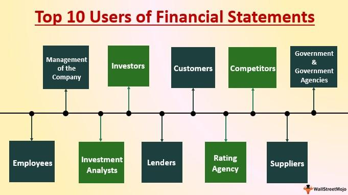

In recent years, the financial landscape has experienced significant transformation due to the advent of algorithmic trading. This innovative approach has provided investors with novel methodologies for analyzing investments and executing trades efficiently. Algorithmic trading, often referred to as algo trading, leverages computer algorithms to automate the trading process, thereby enhancing the precision and speed of market transactions. This article examines the intersection of investment analysis, algo trading, and investor assays, revealing how these components collectively influence modern investment strategies.

Traditional investment analysis employs a comprehensive evaluation of financial statements, market trends, and economic indicators to forecast potential returns on investments. This foundational approach to investment identification and valuation is being transformed by the integration of algorithmic trading technologies. By automating data processing and analysis, algorithms enable investors to refine decision-making, resulting in enhanced accuracy and reduced latency in trading operations.



One of the hallmarks of algorithmic trading is its capacity to process extensive datasets at high speeds, outperforming human traders. This capability allows for the implementation of complex trading strategies that would be otherwise impractical to execute manually. Algorithms can dynamically adjust to market changes, making them invaluable tools for both identifying opportunities and managing risks.

Furthermore, the role of assays in commodities trading is a critical aspect of this technological evolution. Assays, used to ascertain the quality and composition of metals and other commodities, are essential for the validation and valuation of assets. They provide accurate and reliable data that help investors make informed decisions based on tangible evidence rather than speculation. This intersection between quantitative analysis and the precision of algorithmic models is a key driver in today's trading environment.

By exploring how investment analysis and algorithmic methodologies are being integrated, investors can gain a comprehensive understanding of the contemporary trading ecosystem. The adoption of algorithmic trading paired with a solid grasp of traditional investment concepts equips investors with the tools needed to navigate the complexities of modern financial markets. As these practices continue to advance, they promise enhanced opportunities and improved efficiencies in guiding investment strategies.

## Table of Contents

## Understanding Investment Analysis

Investment analysis is essential for making informed financial decisions by evaluating potential investments. This process involves a thorough examination of financial statements, market trends, and economic indicators with the aim of forecasting future performance. At its core, investment analysis relies on traditional methods such as fundamental and technical analysis, which provide data-driven insights critical to formulating investment strategies.

Fundamental analysis focuses on evaluating a company's intrinsic value by examining related economic factors, financial health, management efficiency, and market competitiveness. This approach often involves studying financial statements like balance sheets, income statements, and cash flow statements to assess a company's financial performance and potential growth. Additionally, external economic elements like interest rates, inflation, and overall industry conditions are considered to evaluate how these factors might influence the investment's future value.

Technical analysis, on the other hand, involves the study of statistical trends obtained from trading activity, such as past prices and [volume](/wiki/volume-trading-strategy). This method leverages charts and other tools to identify patterns and make predictions about future price movements. Technical analysts use indicators like moving averages, relative strength indices, and other metrics to understand market sentiment and potential turning points in asset pricing.

With advancements in technology, the integration of algorithms into investment analysis has significantly enhanced the process. Algorithms automate the processing of large datasets, increasing the accuracy and speed of analyses. This automation enables investors to quickly adapt to new data and make informed decisions with reduced human error. Python, a programming language favored for its simplicity and breadth of data analysis libraries, is widely used in developing such algorithms. A simple example using Python for calculating moving averages might look like this:

```python
import pandas as pd

# Assume 'data' is a pandas DataFrame with a 'Close' column for closing prices
data['Moving Average'] = data['Close'].rolling(window=20).mean()
```

Algorithmic trading platforms have been developed to support investment analysis by enabling the simulation and [backtesting](/wiki/backtesting) of strategies in real market conditions. These platforms allow investors to test their strategies against historical data, refining them before actual implementation. This capability not only helps validate the reliability of the strategies but also optimizes their design to handle real-world [volatility](/wiki/volatility-trading-strategies) and market behaviors.

For both novice and experienced investors, understanding and leveraging investment analysis is crucial in navigating the dynamic financial landscape. Mastering these methods enables investors to make well-informed decisions, assess risks accurately, and potentially enhance their portfolio's performance. As the financial sector continues to evolve, the integration of traditional investment analysis methods with advanced algorithmic tools will likely become even more vital.

## The Role of Assays in Investment

Assays are fundamental to understanding the intrinsic value of metals and commodities, serving as a critical component in the investment decision-making process. By determining the quality and composition of these assets, assays provide investors with essential information that can influence market valuation and investment strategies.

Primarily used in mining, assays evaluate the concentration of valuable elements in ores. However, their application extends beyond the mining sector, finding relevance in industries such as jewelry, electronics, and even pharmaceuticals, where precise metal content is crucial for quality control and regulatory compliance. This widespread use emphasizes the role of assays in maintaining standards that directly affect market prices.

In commodity futures trading, the results of assays have a direct impact on pricing. The perceived value of a commodity is often contingent on its purity and composition. For instance, gold with higher purity commands a premium price. The ability of assays to provide verifiable and concrete data on asset quality allows investors to make decisions based on factual evidence rather than relying solely on market speculation. This ensures that investments are grounded in real value, enhancing market transparency and investor confidence.

Understanding the assay process is crucial for investors who seek to engage in commodities trading. The process involves meticulous sampling and analysis to determine the concentration of elements like gold, silver, or platinum within an ore sample. The methodologies employed can range from fire assays, known for their accuracy in measuring precious metal content, to instrumental techniques such as atomic absorption spectroscopy or inductively coupled plasma mass spectrometry. The results from these analyses not only inform investors about the current value of their holdings but can also influence predictions about future market movements.

In summary, assays represent a critical intersection of science and finance, providing robust data that underpin the valuation of commodities. For investors, a comprehensive understanding of assay processes and their implications can yield deeper insights into commodity market dynamics, enabling more informed investment decisions. As such, assays continue to be an indispensable tool in the sophisticated landscape of modern investing.

## Algorithmic Trading: Definition and Basics

Algorithmic trading, commonly known as algo trading, represents a significant advancement in the automation of financial trading. This modern approach utilizes computer algorithms to execute trades automatically, offering increased speed and precision compared to manual trading processes. The essence of [algorithmic trading](/wiki/algorithmic-trading) lies in its ability to process and analyze vast datasets at remarkable speeds, enabling rapid execution of trades and creating opportunities to capitalize on even the slightest market fluctuations.

One of the fundamental advantages of algorithmic trading is its efficiency in executing basic strategies that exploit market inefficiencies. Some of the most common strategies include:

1. **Arbitrage**: This strategy seeks to exploit price discrepancies across different markets or assets. For example, if a security is listed at different prices on two exchanges, an algorithm can simultaneously buy at the lower price and sell at the higher price, profiting from the difference with minimal risk.

2. **Trend-following**: This approach capitalizes on market momentum by identifying and trading on sustained price movements. Algorithms track various indicators to determine the optimal entry and exit points, allowing traders to ride trends until they reverse.

3. **Market-making**: Market makers provide liquidity to markets by placing simultaneous buy and sell limit orders. They profit from the bid-ask spread, and their presence helps maintain orderly markets. Algorithms optimize the placement and adjustment of these orders to maximize profits while minimizing risk. 

The sophistication of algorithmic trading has surged with the integration of [artificial intelligence](/wiki/ai-artificial-intelligence) and [machine learning](/wiki/machine-learning) technologies. These advancements have enabled algorithms to perform predictive analytics, enhancing their ability to forecast market trends and adapt trading strategies in real time. For instance, machine learning models can identify complex patterns and correlations that might be invisible to human traders, providing a competitive edge.

Python, a popular programming language, is frequently used in the development and implementation of algorithmic trading strategies. An example of a simple moving average crossover strategy, which is a common trend-following technique, can be implemented as follows:

```python
import pandas as pd

# Sample dataset
data = {'Price': [100, 101, 102, 103, 104, 105, 106, 107, 108, 109]}
df = pd.DataFrame(data)

# Calculate moving averages
df['SMA_5'] = df['Price'].rolling(window=5).mean()
df['SMA_10'] = df['Price'].rolling(window=10).mean()

# Generate signals
df['Signal'] = 0
df['Signal'][df['SMA_5'] > df['SMA_10']] = 1
df['Signal'][df['SMA_5'] < df['SMA_10']] = -1

# Display signals
print(df[['Price', 'SMA_5', 'SMA_10', 'Signal']])
```

The emergence of more user-friendly trading platforms has remarkably lowered the barrier to entry for retail investors interested in algorithmic trading. Platforms now provide essential tools and resources, such as historical data, backtesting capabilities, and pre-written algorithms, making it feasible for individual traders to adopt these sophisticated trading strategies without requiring deep technical expertise.

In summary, algorithmic trading leverages computational algorithms to enhance trading efficiency and precision. The integration of AI and machine learning further refines these algorithms, while accessible trading platforms democratize the approach, permitting more investors to benefit from technological advancements in trading.

## Common Strategies in Algorithmic Trading

Algorithmic trading, commonly known as algo trading, employs computational models to automate the buying and selling process in the financial markets. Among the most popular strategies employed in this domain are [arbitrage](/wiki/arbitrage), trend-following, and market-making.

Arbitrage strategies exploit price discrepancies between different markets or instruments. These strategies capitalize on the principle of buying low in one market and selling high in another, offering relatively low-risk opportunities. For example, [statistical arbitrage](/wiki/statistical-arbitrage) might involve the simultaneous purchase and sale of mispriced securities based on statistical models to identify mean-reverting spreads.

Trend-following algorithms are designed to identify and act on price trends. These algorithms analyze historical price data to detect sustained movements, either upward or downward, and generate signals to enter or [exit](/wiki/exit-strategy) trades accordingly. By aligning with market [momentum](/wiki/momentum), trend-following strategies aim to profit from confirmed trends rather than predicting reversals. A simple mathematical formulation for trend-following might involve computing moving averages and generating buy/sell signals based on crossovers.

Market-making strategies play a crucial role in providing [liquidity](/wiki/liquidity-risk-premium) to markets. These strategies involve placing buy and sell limit orders around the current market price, profiting from bid-ask spreads. Market makers earn revenue through the differential between the buying and selling prices while maintaining a relatively neutral market position. To succeed, these strategies require robust algorithms capable of swiftly adjusting orders in response to market changes.

Each algorithmic trading strategy necessitates precise coding and thorough backtesting to ensure effectiveness and alignment with investor risk tolerance. Before deployment, these strategies undergo rigorous simulation to verify their performance under various market conditions, thereby minimizing risks associated with unforeseen market behaviors.

The deployment of such strategies varies in complexity, influenced by the resources available and the technological sophistication of the investor. For institutional investors with advanced computing capabilities, the implementation of complex strategies involving high-frequency trading and deep-learning models may be feasible. Conversely, retail investors might opt for simplified versions of these strategies, utilizing platforms accessible even with limited computing resources.

Overall, algorithmic trading strategies offer a diverse array of opportunities for market participants, each with distinct characteristics and requirements. The selection and successful implementation of a strategy depend on a clear understanding of market dynamics and the investor's specific goals and resource constraints, paving the way for informed and profitable trading decisions.

## The Impact of Algorithmic Trading on Markets

Algorithmic trading significantly enhances market efficiency by enabling asset prices to swiftly reflect new information. By utilizing computerized algorithms to process and execute trades, markets benefit from an increased turnover of buy and sell orders. This continuous flow of transactions ensures that market prices are adjusted promptly, thus maintaining alignment with the latest available data and insights.

However, while algorithmic trading improves liquidity by regularly populating markets with orders, it also introduces concerns regarding market stability. The sheer volume and speed at which trades are executed can sometimes overwhelm market systems. For example, during periods of extreme volatility, a flood of automated orders can lead to market imbalances and potential liquidity crises.

High-frequency trading ([HFT](/wiki/high-frequency-trading-strategies)), a specialized form of algorithmic trading, is designed to capitalize on minute price discrepancies. While effective, HFT can exacerbate short-term volatility due to the rapid and repetitive nature of the trades involved. This volatility has caught the attention of regulators, necessitating measures to monitor and manage the potential disturbances HFT might cause.

The automated nature of trading processes through algorithms significantly minimizes human error. Yet, this benefit is counterbalanced by new risks associated with technological failures and system outages. An algorithm malfunction or a system crash can trigger unintended trading behaviors, leading to adverse market impacts.

Overall, algorithmic trading has transformed the trading environment, presenting both opportunities and challenges to current market participants. The speed and precision offered by these systems present unmatched prospects for profit optimization and strategic advantage. However, the dynamic and automated nature of algorithmic trading requires continuous oversight and adaptation to ensure stability and equitable trading practices within financial markets.

## Risks and Future Prospects

Algorithmic trading offers numerous advantages, but it also presents significant risks. One primary concern is the risk of over-reliance on technology. As trading algorithms execute transactions without direct human intervention, there's a potential for systemic failures that can disrupt financial markets. Such dependencies can lead to cascading failures in communication networks or exchanges, causing widespread disruption.

The complexity of these algorithms also makes them vulnerable to misconfiguration. Even minor errors or unforeseen market conditions can lead to significant financial losses. Algorithms are prone to behaving unpredictably if market drifts or sudden shocks occur, which they have not been explicitly programmed to manage. 

Regulatory bodies worldwide are increasingly scrutinizing algorithmic trading practices to address potential manipulative activities. Authorities aim to enhance transparency and fairness in financial markets, ensuring that all participants operate on a level playing field. This scrutiny includes measures to prevent "flash crashes," which are sudden market downturns caused by large sell-offs initiated by algorithmic trades, often exacerbated by high-frequency trading.

Despite these risks, the future of algorithmic trading remains promising. Developments in machine learning and AI technologies are expected to enhance algorithmic strategies, allowing for more sophisticated and adaptive trading models. These advancements can potentially improve market predictability and strategy customization. Investors have the opportunity to exploit these cutting-edge techniques to remain competitive.

To effectively utilize algorithmic trading, investors must continuously adapt to technological advancements and rising regulatory standards. Staying informed not only minimizes potential risks but also maximizes the benefits associated with the automation and efficiency of algorithmic trading. Investors should seek to understand both the technical aspects of algorithm deployment and the evolving legal landscape to leverage these innovations effectively.

## Conclusion

Investment analysis, assays, and algorithmic trading collectively embody the synergy of traditional financial expertise and modern technological advancements. This integration provides investors with powerful tools that enable more precise and swift decision-making processes in an increasingly complex market landscape. By leveraging algorithmic trading, investors can significantly enhance their strategies, utilizing algorithms that process vast amounts of data at high speeds, identifying market opportunities that may be missed through conventional methods.

The foundational principles of investment analysis and assays remain crucial for investors seeking to fully exploit the advantages of algorithmic trading. Investment analysis, grounded in methods such as fundamental and technical analysis, provides a robust framework for evaluating investment potentials and market trends. Assays offer critical insights into the quality and valuation of commodities, ensuring decisions are based on tangible data. Such foundational knowledge ensures that algorithmic strategies are not only technically sound but also aligned with financial reality.

As technology evolves, the intersection of these practices is poised to unlock new opportunities and efficiencies within financial markets. Machine learning and artificial intelligence continue to refine algorithmic models, offering even deeper insights and enhanced predictive capabilities. This ongoing evolution suggests a promising future for investors who adeptly combine analytical rigor with technological prowess. By staying informed about advancements and regulatory developments, investors are empowered to harness the full potential of these integrative approaches, optimizing their market strategies for both current and future financial landscapes.

## References & Further Reading

[1]: Bergstra, J., Bardenet, R., Bengio, Y., & Kégl, B. (2011). ["Algorithms for Hyper-Parameter Optimization."](https://papers.nips.cc/paper/4443-algorithms-for-hyper-parameter-optimization) Advances in Neural Information Processing Systems 24.

[2]: ["Advances in Financial Machine Learning"](https://www.amazon.com/Advances-Financial-Machine-Learning-Marcos/dp/1119482089) by Marcos Lopez de Prado

[3]: ["Evidence-Based Technical Analysis: Applying the Scientific Method and Statistical Inference to Trading Signals"](https://www.amazon.com/Evidence-Based-Technical-Analysis-Scientific-Statistical/dp/0470008741) by David Aronson

[4]: ["Machine Learning for Algorithmic Trading"](https://github.com/PacktPublishing/Machine-Learning-for-Algorithmic-Trading-Second-Edition) by Stefan Jansen

[5]: ["Quantitative Trading: How to Build Your Own Algorithmic Trading Business"](https://books.google.com/books/about/Quantitative_Trading.html?id=j70yEAAAQBAJ) by Ernest P. Chan