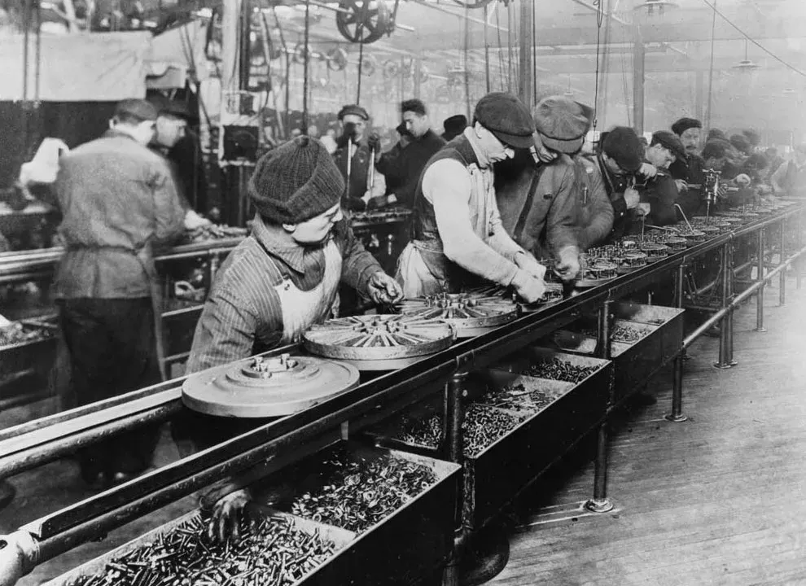

## Table of Contents

## What is an assembly line?

An assembly line is a way to make things in a factory where the product moves along a line and workers add parts to it as it goes. It's like a team effort where each person does a small job, but together they build the whole thing. This method was made famous by Henry Ford when he used it to make cars faster and cheaper.

Using an assembly line can make work easier and quicker because each worker only needs to learn one part of the job. This means they can do it faster and better. It also helps factories make a lot of the same thing without mistakes, which saves time and money.

## How did the concept of the assembly line originate?

The idea of the assembly line started a long time ago, but it became really famous in the early 1900s thanks to Henry Ford. Before Ford, factories made things by having workers build the whole product from start to finish. This was slow and could be hard for the workers. Ford wanted to make cars faster and cheaper, so he thought of a new way. He decided to bring the work to the workers instead of the other way around.

Ford set up a moving line in his factory where the car chassis would move along, and workers would add parts to it as it went by. Each worker did just one small job, like putting on a wheel or tightening a bolt. This made the work simpler and quicker because workers could get really good at their one task. Ford's assembly line helped him make cars much faster and cheaper, and soon, other factories started using the same idea for all sorts of products.

## What are the basic components of an assembly line?

An assembly line has a few main parts that help it work well. First, there's the conveyor system. This is like a moving belt or track that carries the product from one place to another. As the product moves, it goes past different stations where workers or machines add parts to it. The conveyor system keeps everything moving smoothly and helps make sure that each step happens in the right order.

Then, there are the workstations. Each workstation is set up for a specific job, like putting on a part or checking the product. Workers at these stations do their one job over and over as the product comes to them. This makes the work easier because they can get really good at their task. Machines can also be at these stations to do jobs that need to be very exact or fast.

Finally, there's the organization and planning. Someone needs to figure out the best order for the jobs and make sure everything is ready. They also need to keep track of the parts and make sure there are enough. Good planning helps the assembly line run smoothly and makes sure the product is made correctly and on time.

## How does an assembly line contribute to mass production?

An assembly line helps a lot with mass production because it makes it faster and easier to make a lot of the same thing. In an assembly line, the product moves along a conveyor belt and workers or machines add parts to it at different spots. Each worker does just one small job, like putting on a wheel or checking a part. This makes the work simpler because they can get really good at their one task. It also means they can do their job quickly, so the whole product gets made faster.

Because of this, factories can make a lot more products in the same amount of time. It's also easier to keep the quality high because each worker or machine does the same job over and over, so they can do it well. This helps companies make things cheaper because they can make more of them without spending a lot more money. So, the assembly line is a big reason why we can have so many things made quickly and at a lower cost.

## What are the advantages of using an assembly line in manufacturing?

Using an assembly line in manufacturing has a lot of benefits. One big advantage is that it makes things faster. Instead of one worker building the whole product, each worker does just a small part of the job. This means they can get really good at their one task and do it quickly. So, the whole product gets made much faster. Another advantage is that it helps make things cheaper. Because the work is faster and each worker can do their job well, factories can make a lot more products without spending a lot more money. This means they can sell the products for less, which is good for customers.

Another benefit is that assembly lines help keep the quality high. When each worker does the same job over and over, they can do it well and make fewer mistakes. This means the products are more likely to be made right. Assembly lines also make it easier to check the products as they're being made. Workers can spot problems early and fix them before the product moves on. This helps make sure the products are good quality when they reach the customers.

Lastly, assembly lines can make work easier for the workers. Instead of having to learn how to do the whole job, they only need to learn one small part. This can make the work less tiring and stressful. Also, because the work is split up, it's easier to train new workers. They can learn their one job quickly and start helping make products right away. This can be good for the workers and for the factory, because it means they can keep making things even if some workers are away.

## What industries commonly use assembly lines?

Many different kinds of factories use assembly lines to make things. One big industry that uses them a lot is the car industry. Car factories use assembly lines to build cars quickly and cheaply. Each worker does a small job, like putting on a door or checking the engine, as the car moves along the line. This helps them make a lot of cars every day. Another industry that uses assembly lines is the electronics industry. They use them to make things like phones, computers, and TVs. Each part of the product, like the screen or the battery, gets added at different spots on the line.

Assembly lines are also common in the food industry. They use them to make things like snacks, drinks, and packaged meals. The food moves along the line and gets cooked, packed, or put into boxes at different stations. This helps them make a lot of food fast and keep it fresh. The clothing industry also uses assembly lines a lot. They use them to make clothes like shirts, pants, and shoes. Each worker does a small job, like sewing a part or adding a button, as the clothes move along the line. This helps them make a lot of clothes quickly and keep the quality high.

## What are the challenges and limitations of implementing an assembly line?

Setting up an assembly line can be hard because it needs a lot of planning and money. You have to figure out the best way to split up the work and make sure each worker has what they need to do their job. This can take a lot of time and might need special machines or tools. Also, it can be expensive to set up the conveyor system and the workstations. If the factory doesn't have enough money, it might be hard to start using an assembly line.

Another challenge is that assembly lines can be boring for the workers. They do the same small job over and over, which can make the work feel dull. This might make them less happy and less careful, which can lead to mistakes. Also, if one part of the line has a problem, it can slow down or stop the whole line. This means the factory might not be able to make as many products as they want. So, while assembly lines can help make things faster and cheaper, they also have some big challenges that factories need to think about.

## How has technology influenced the evolution of assembly lines?

Technology has changed assembly lines a lot over the years. In the beginning, assembly lines were just people doing their jobs as the product moved along a conveyor belt. But now, machines and computers help a lot. Robots can do jobs that are hard or dangerous for people, like lifting heavy things or working with hot metal. Computers help plan the work and make sure everything is done in the right order. They can also keep track of how many products are made and make sure there are enough parts.

These changes have made assembly lines even better at making things fast and cheap. Robots can work all the time without getting tired, so they can make more products. Computers help find problems quickly and fix them before they get worse. This means the products are more likely to be good quality. But, using all this technology can be expensive, and it might mean fewer jobs for people. So, while technology has made assembly lines better, it also brings new challenges that factories need to think about.

## What is the role of automation in modern assembly lines?

Automation plays a big part in modern assembly lines. It means using machines and computers to do jobs that people used to do. Robots can do things like putting parts together, moving heavy stuff, or checking if the product is made right. They can work all the time without getting tired, so they can help make more products faster. Computers help plan the work and keep track of everything. They can make sure the right parts are in the right place and that the work is done in the best order.

Using automation can make assembly lines better in many ways. It can help make things faster and cheaper because machines can work quickly and don't need breaks. It can also help keep the quality high because robots can do the same job over and over without making mistakes. But, using a lot of automation can be expensive. It might also mean fewer jobs for people, which can be hard for them. So, while automation helps make assembly lines better, it also brings new challenges that factories need to think about.

## How do you measure the efficiency of an assembly line?

To measure how well an assembly line is working, you look at a few important things. One big thing is how fast the line can make products. This is called the production rate. If the line can make a lot of products in a short time, it's working well. Another thing to check is how many products are good quality. If most of the products are made right and don't have mistakes, that's a sign of a good assembly line. You also want to see if the line is using its time well. This means not wasting time waiting for parts or fixing problems.

Another way to measure efficiency is by looking at the cost to make each product. If the assembly line can make things cheaply, that's good. This means the factory can sell the products for less money and still make a profit. It's also important to see how happy the workers are. If they are not too tired and like their jobs, they will work better. So, a good assembly line should make things fast, make them well, keep costs low, and keep the workers happy.

## What are some advanced techniques for optimizing assembly line performance?

One way to make an assembly line work better is by using something called lean manufacturing. This means looking at every part of the work and finding ways to do it with less waste. For example, you might find that workers are waiting a lot for parts to arrive. By fixing this, the line can keep moving without stops. Another part of lean manufacturing is making sure workers can do different jobs, not just one. This way, if someone is away, others can help out and the work keeps going. Using lean manufacturing helps the line make more products faster and with fewer mistakes.

Another advanced technique is using data and computers to help plan the work. This is called digitalization. With computers, you can keep track of everything that's happening on the line in real time. If there's a problem, the computer can spot it quickly and help fix it before it gets worse. Computers can also use data to find the best way to do the work. They can figure out the best order for the jobs and make sure the right parts are ready when they're needed. Using digitalization helps the assembly line run smoothly and make high-quality products.

Lastly, using robots and automation can really help optimize the assembly line. Robots can do jobs that are hard or dangerous for people, like lifting heavy things or working with hot metal. They can work all the time without getting tired, so they can help make more products faster. Automation also means using computers to control the machines and make sure everything is done right. While using robots and automation can be expensive, it can make the assembly line much more efficient and help keep the quality high.

## What future trends are expected in the development of assembly lines?

In the future, assembly lines will likely use even more smart technology. This means more robots and computers will help with the work. These robots will be able to do more complicated jobs and work together with people. They might even be able to fix problems on their own without stopping the line. Computers will use special data to plan the work even better, making sure everything runs smoothly and quickly. This can help factories make more products faster and with fewer mistakes.

Another trend we might see is more focus on being green. This means assembly lines will try to use less energy and make less waste. Factories might use new ways to recycle materials and use clean energy like solar power. This can help the environment and save money at the same time. Also, assembly lines might become more flexible. This means they can easily switch to making different products. This is good because it helps factories keep up with what people want to buy, even if it changes a lot.

## What are the principles of algorithmic trading in manufacturing?

Algorithmic trading, which relies on automated systems and algorithms to execute trading decisions, provides valuable insights and methods that can be applied to manufacturing processes to optimize efficiency. By harnessing the power of data analytics, manufacturers can enhance various aspects of their operations, such as supply chain management, inventory control, and production scheduling.

One of the primary benefits of applying [algorithmic trading](/wiki/algorithmic-trading) principles in manufacturing is the ability to utilize algorithms for data analytics. This capability allows for the optimization of supply chains by analyzing vast amounts of data to identify patterns and trends that may not be visible through traditional means. This data-driven approach enables manufacturers to predict supply chain disruptions and manage risks more effectively, ensuring that production processes remain smooth and uninterrupted.

Predictive analytics, a subset of data analytics, is particularly valuable in forecasting demand. By examining historical sales data, market trends, and external factors, predictive models can forecast future product demand with remarkable accuracy. This forecast allows manufacturers to align their inventory levels with market needs, thereby reducing the risk of overproduction and minimizing storage costs. The formula for simple linear regression, often used in predictive analytics, is:

$$

y = \beta_0 + \beta_1 x + \epsilon 
$$

where $y$ is the dependent variable (demand), $x$ is the independent variable (time or trends), $\beta_0$ is the intercept, $\beta_1$ is the slope coefficient, and $\epsilon$ represents the error term.

Integrating these algorithmic methodologies into existing manufacturing systems requires careful strategic planning. It involves not only the adoption of new technologies but also the adaptation of current processes to leverage these technological advancements. This integration can be thought of as a gradual transformation rather than a wholesale change, ensuring that traditional manufacturing wisdom complements algorithmic efficiency.

By adopting data-driven decision-making strategies, manufacturers can improve their agility and gain a more competitive edge. Agile manufacturing allows for rapid response to market changes and consumer preferences, minimizing lead times and maximizing production efficiency. The application of algorithms can also facilitate real-time monitoring and adjustments in the production line, ensuring consistent product quality and operational efficiency.

In conclusion, the cross-application of algorithmic trading principles in manufacturing provides a robust framework for enhancing production processes. It encourages the use of complex algorithms to process vast datasets, thereby leading to more informed decision-making and strategic agility. As the industrial landscape continues to evolve, manufacturers that effectively integrate these principles will likely be poised for sustained success in a competitive marketplace.

## References & Further Reading

[1]: Schwab, K. (2016). *The Fourth Industrial Revolution*. Crown Business. This book provides an insightful overview of how technological innovations are reshaping industries, highlighting the transformative impact of the Fourth Industrial Revolution on manufacturing processes and socio-economic systems.

[2]: Kagermann, H., Wahlster, W., & Helbig, J. (2013). *Recommendations for Implementing the Industrie 4.0 Strategy*. This publication offers strategic recommendations for industries seeking to implement Industry 4.0, emphasizing the role of advanced technologies and data-driven processes in optimizing manufacturing operations.

[3]: Lee, J., Bagheri, B., & Kao, H. A. (2015). *A Cyber-Physical Systems architecture for Industry 4.0-based manufacturing*. This paper explores the integration of Cyber-Physical Systems within manufacturing frameworks, highlighting how these systems enhance operational efficiency and enable real-time data analytics.

[4]: Martinelli, A., & Filippini, R. (2019). *The Organizational Impacts of Industry 4.0: Interrelationships and Effects on Operations*. This research examines how Industry 4.0 technologies affect organizational structures and operational interactions, offering insights into the complex dynamics introduced by digital transformation in manufacturing.

[5]: Lee, E. A. (2008). *Cyber Physical Systems: Design Challenges*. IEEE Symposium. This paper discusses the challenges in designing Cyber-Physical Systems, focusing on the technical and conceptual hurdles that need to be addressed to facilitate their successful implementation in manufacturing and other sectors.

