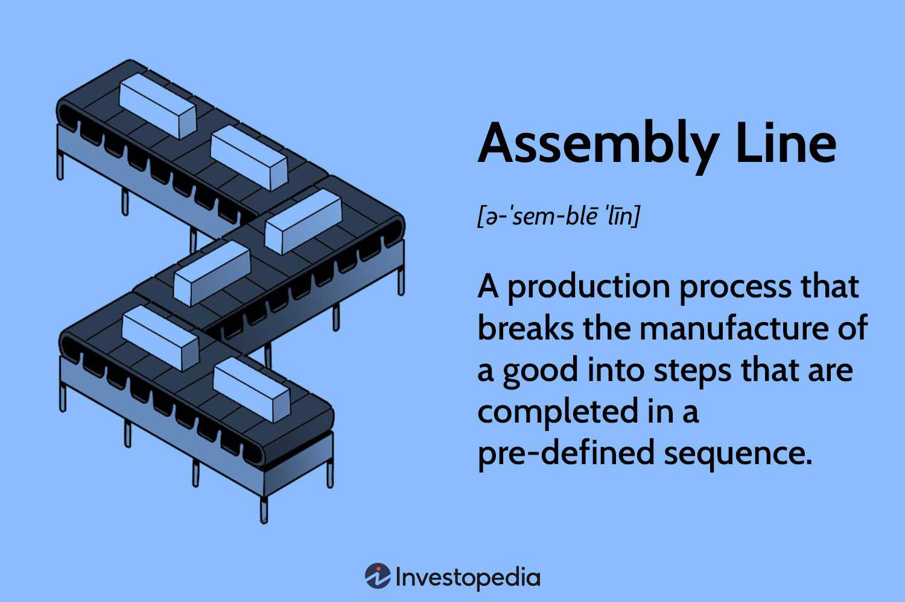

The intersection of manufacturing, mass production, assembly lines, and algorithmic trading signifies a notable progression in industrial methodologies. Traditionally, manufacturing and mass production have operated through mechanized processes and assembly lines, innovations dating back to the Industrial Revolution. This era witnessed a transformation from manual craftsmanship to machines designed for speed and uniformity. Assembly lines, notably advanced by Henry Ford, achieved unprecedented levels of efficiency, altering production systems fundamentally.

In contrast, algorithmic trading, emerging from the financial sector, utilizes mathematical models and computing power to execute high-speed, data-driven trades. This concept involves automating decision-making processes based on complex algorithms, optimizing operations for efficiency and accuracy. The convergence of these principles with traditional manufacturing paradigms introduces a fresh dynamic where data analytics and automated decision-making are integrated into production mechanisms. 



By adopting algorithmic methodologies within manufacturing frameworks, industries can potentially enhance operational efficiencies, moving beyond the capabilities of conventional processes. This harmonious blend represents not just an evolution in production but a targeted strategy to optimize resource use, precision in output, and alignment with market demand. However, this transformation introduces challenges such as the need for robust data security, system integration, and workforce skill enhancement. Addressing these areas is crucial for realizing the full potential of integrating algorithmic strategies into manufacturing landscapes.

Thus, the intersection of these initially disparate fields initiates a transformative trend in industrial evolution, promising strategic advantages and new paradigms of production efficiency. As industries navigate this emerging landscape, the strategic incorporation of algorithms into manufacturing practices could potentially revolutionize how products are conceived, developed, and delivered.

## Table of Contents

## The Evolution of Manufacturing and Mass Production

Mass production has its origins in the transformative period of the Industrial Revolution, marking a departure from traditional manual craftsmanship to mechanized processes that significantly enhanced production capacity and efficiency. This era saw the emergence of new manufacturing techniques, often characterized by the extensive use of machinery and the division of labor, which resulted in increased output and the ability to produce goods on a large scale. The mechanization of textile production, for instance, is a notable example, as it set the stage for subsequent advancements in manufacturing industries.

A pivotal development in mass production was the introduction of the assembly line by Henry Ford in the early 20th century. This innovation streamlined manufacturing processes by organizing the production of complex products, such as automobiles, into a series of simple, repetitive tasks performed by workers stationed along a conveyor belt. This approach not only increased the speed of production but also significantly reduced costs, making products like the Model T accessible to a broader market segment. The assembly line paradigm underscored the principle of efficiency in manufacturing, wherein time and cost savings were paramount.

Subsequent advancements in automation technology have greatly furthered these efficiencies. Automated machinery and robotic systems have progressively reduced the reliance on human labor in tasks that can be mechanized, enhancing precision and consistency in manufacturing outputs. These advancements have led to increased production rates and quality, as automated systems can operate continuously with minimal error.

In contemporary settings, the concept of Industry 4.0 and the emergence of smart factories represent the latest evolution in manufacturing. These modern factories leverage interconnected devices and systems, such as the Internet of Things (IoT) and big data analytics, to create highly adaptive and efficient production environments. IoT devices enable real-time monitoring and data collection from manufacturing processes, allowing for precise adjustments and optimization of production lines based on current conditions and demands. Moreover, big data analytics facilitate the analysis of vast quantities of data to improve decision-making and predict future trends, further enhancing production efficiency.

Each historical phase of manufacturing reflects not only an increase in complexity and capacity but also a shift towards more integrated and responsive production systems. These advancements have set the stage for modern innovations that continue to push the boundaries of what is possible in manufacturing, ultimately leading to more versatile and capable production systems that align closely with market needs and technological capabilities.

## Algorithmic Trading Principles in Manufacturing

Algorithmic trading, which relies on automated systems and algorithms to execute trading decisions, provides valuable insights and methods that can be applied to manufacturing processes to optimize efficiency. By harnessing the power of data analytics, manufacturers can enhance various aspects of their operations, such as supply chain management, inventory control, and production scheduling.

One of the primary benefits of applying [algorithmic trading](/wiki/algorithmic-trading) principles in manufacturing is the ability to utilize algorithms for data analytics. This capability allows for the optimization of supply chains by analyzing vast amounts of data to identify patterns and trends that may not be visible through traditional means. This data-driven approach enables manufacturers to predict supply chain disruptions and manage risks more effectively, ensuring that production processes remain smooth and uninterrupted.

Predictive analytics, a subset of data analytics, is particularly valuable in forecasting demand. By examining historical sales data, market trends, and external factors, predictive models can forecast future product demand with remarkable accuracy. This forecast allows manufacturers to align their inventory levels with market needs, thereby reducing the risk of overproduction and minimizing storage costs. The formula for simple linear regression, often used in predictive analytics, is:

$$

y = \beta_0 + \beta_1 x + \epsilon 
$$

where $y$ is the dependent variable (demand), $x$ is the independent variable (time or trends), $\beta_0$ is the intercept, $\beta_1$ is the slope coefficient, and $\epsilon$ represents the error term.

Integrating these algorithmic methodologies into existing manufacturing systems requires careful strategic planning. It involves not only the adoption of new technologies but also the adaptation of current processes to leverage these technological advancements. This integration can be thought of as a gradual transformation rather than a wholesale change, ensuring that traditional manufacturing wisdom complements algorithmic efficiency.

By adopting data-driven decision-making strategies, manufacturers can improve their agility and gain a more competitive edge. Agile manufacturing allows for rapid response to market changes and consumer preferences, minimizing lead times and maximizing production efficiency. The application of algorithms can also facilitate real-time monitoring and adjustments in the production line, ensuring consistent product quality and operational efficiency.

In conclusion, the cross-application of algorithmic trading principles in manufacturing provides a robust framework for enhancing production processes. It encourages the use of complex algorithms to process vast datasets, thereby leading to more informed decision-making and strategic agility. As the industrial landscape continues to evolve, manufacturers that effectively integrate these principles will likely be poised for sustained success in a competitive marketplace.

## Enabling Technologies

Enabling technologies such as IoT devices, [machine learning](/wiki/machine-learning), and cloud computing democratize and enhance production processes, playing a pivotal role in the optimization of manufacturing workflow. IoT devices are instrumental for real-time data collection, which, when integrated with manufacturing systems, enable precision-driven decisions. Equipped with sensors and communication tools, these devices facilitate seamless data transmission and reception, ensuring that each segment of the production line operates with the most up-to-date information. Moreover, they offer insights into machine performance and environmental conditions, enabling proactive adjustments to maintain optimal operations.

Machine learning algorithms further contribute to production optimization by analyzing trends to predict and enhance manufacturing outcomes. These algorithms are designed to process vast amounts of data generated by IoT devices and other sources, identifying patterns and correlations that may not be apparent to human analysts. Such capabilities allow manufacturers to anticipate demand fluctuations, optimize resource allocation, and refine their production schedules. An example is using supervised learning models to predict equipment failure, thereby aligning maintenance activities to minimize downtime, which can be implemented using Python as follows:

```python
from sklearn.model_selection import train_test_split
from sklearn.ensemble import RandomForestClassifier
from sklearn.metrics import accuracy_score

# Sample dataset containing historical machine performance data
X = ...  # Features: operating conditions, usage metrics, etc.
y = ...  # Target: binary indicator of failure occurrence

# Split data into training and test sets
X_train, X_test, y_train, y_test = train_test_split(X, y, test_size=0.2, random_state=42)

# Train a model to predict failures
model = RandomForestClassifier(n_estimators=100)
model.fit(X_train, y_train)

# Predict and evaluate on test data
predictions = model.predict(X_test)
accuracy = accuracy_score(y_test, predictions)
print(f"Model Accuracy: {accuracy:.2f}")
```

Cloud computing adds another layer of enhancement by supporting scalability and ensuring data accessibility in real-time, crucial for collaborative production efforts. It enables the collective utilization of computing resources, providing manufacturers with the flexibility to scale operations up or down as needed. By hosting applications and storing data in the cloud, organizations can ensure that vital information is accessible from anywhere in the world, facilitating coordinated efforts across different geographical locations.

In addition to the aforementioned technologies, blockchain technology is becoming increasingly important for secure and transparent supply chain management. With its decentralized ledger system, blockchain ensures that every transaction is recorded and immutable, enhancing trust and accountability in supply chain activities. Smart contracts, a feature of blockchain technology, enable automatic execution of contractual obligations, reducing the potential for disputes and delays.

Collectively, these technologies foster a dynamic production environment, able to respond to the nuances of market demands and operational challenges with unprecedented agility and precision.

## Benefits of Algorithmic Integration

Algorithmic integration in manufacturing is revolutionizing the industry by automating processes, enhancing precision, and improving product quality. Automation minimizes the possibility of human error, leading to more consistent outputs. By utilizing algorithms, manufacturing systems can systematically analyze and process large datasets, enabling real-time feedback and adjustments during production. This results in fewer defective products and higher overall quality.

Waste reduction and resource efficiency are major advantages of algorithmic integration. Through real-time data analytics, manufacturers can optimize resource utilization, reducing excessive consumption of materials and energy. This data-driven approach enables decision-makers to fine-tune production schedules and inventory management, ensuring that resources are deployed effectively and unnecessary wastage is curtailed.

Moreover, algorithmic systems enhance the responsiveness of manufacturing operations to market demands. By analyzing market trends and consumer behavior in real-time, manufacturers can adjust their production strategies, aligning output closely with current demand. This adaptability allows for greater production agility, facilitating quicker shifts in production priorities and reducing the risk of overproduction.

Predictive maintenance is another significant benefit of implementing algorithms in manufacturing. Predictive analytics models can forecast equipment failures and maintenance needs based on historical data and operational metrics. This foresight helps in scheduling maintenance activities proactively, thereby minimizing unexpected downtimes and extending the lifespan of machinery. The reliability of production is thus greatly improved, preventing costly disruptions and enhancing overall operational efficiency.

Collectively, these benefits contribute to more sustainable manufacturing practices. By minimizing waste, optimizing resource use, and maintaining high product quality, manufacturers can operate more efficiently while complying with modern standards of sustainability. The strategic integration of algorithms equips industries to meet the contemporary challenges of production, ensuring they remain competitive in an ever-evolving global market.

## Challenges and Considerations

Data security is a critical concern as the integration of algorithmic trading principles into manufacturing processes becomes more prevalent. The interconnected nature of modern manufacturing systems, driven by data-centric technologies, necessitates robust cybersecurity measures to protect sensitive information from potential cyber threats. The implementation of advanced encryption protocols and continuous monitoring systems is essential to defend against unauthorized access and data breaches, ensuring the integrity and confidentiality of production data.

System integration presents significant challenges, particularly when diverse technological environments are involved. The seamless operation of interconnected systems requires interoperability between legacy systems and new technologies. This challenge can be met through standardized communication protocols and middleware solutions that enable different systems to communicate effectively. Ensuring compatibility and minimizing disruption during the integration process are crucial for maintaining production efficiency.

The rapid advancement of technologies in manufacturing demands a workforce equipped with new skills. Upskilling is necessary to handle sophisticated systems effectively, as traditional manufacturing roles evolve to incorporate more technology-driven tasks. Training programs focused on digital literacy, data analytics, and system management are vital for preparing employees to meet the demands of modern manufacturing environments. This investment in human capital not only enhances operational efficiency but also fosters innovation and adaptability within the workforce.

Manufacturers must design flexible systems that can adapt to evolving algorithms and rapidly changing market conditions. Flexibility involves developing modular production systems that can be rapidly reconfigured to accommodate different product requirements and production volumes. Agile manufacturing practices, supported by real-time data analytics, enable quick adjustments to production schedules and processes, aligning operations more closely with market demands.

Ethical and regulatory considerations are paramount as manufacturers integrate advanced technologies. Balancing technological advancement with compliance involves adhering to industry standards and regulations that govern data use, consumer privacy, and product safety. Additionally, ethical considerations include addressing the potential impacts of automation on employment and ensuring that technology implementations do not disproportionately disadvantage any group. Manufacturers must engage in transparent practices and collaborate with regulatory bodies to foster trust and sustainability in their operations.

## Conclusion

The integration of algorithmic trading into the manufacturing sector signifies a substantial advancement in operational efficiency and innovation. By adopting algorithmic strategies, manufacturers can streamline complex operations, improving their competitiveness in a rapidly evolving market. These strategies enable precise data-driven decision-making, allowing for real-time adjustments to production processes, inventory management, and supply chain logistics, among others.

While the transformative potential of these advancements is undeniable, the journey is not without challenges. Implementing such sophisticated systems demands investments in digital infrastructure, upskilling the workforce, and addressing cybersecurity concerns. However, for manufacturers who navigate these challenges effectively, the rewards are significant. They not only gain an edge over competitors through improved operational efficiency but also enhance their ability to respond quickly to market demands, reducing waste and optimizing resource use.

Looking forward, technological advancements promise even greater integration and sophistication of algorithmic systems within manufacturing processes. Developments in [artificial intelligence](/wiki/ai-artificial-intelligence), machine learning, and IoT will likely provide deeper insights and further automation capabilities, refining production methods and increasing efficiency levels. Consequently, manufacturers must remain vigilant and open to innovation, continuously updating their strategies to incorporate emerging technologies.

Proactively embracing these changes will enable manufacturers to shape the future of production, making them not only participants but leaders in the next phase of industrial evolution. As such, staying informed and adapting to these technological shifts is crucial for manufacturers seeking to retain relevance and drive forward success.

## References & Further Reading

[1]: Schwab, K. (2016). *The Fourth Industrial Revolution*. Crown Business. This book provides an insightful overview of how technological innovations are reshaping industries, highlighting the transformative impact of the Fourth Industrial Revolution on manufacturing processes and socio-economic systems.

[2]: Kagermann, H., Wahlster, W., & Helbig, J. (2013). *Recommendations for Implementing the Industrie 4.0 Strategy*. This publication offers strategic recommendations for industries seeking to implement Industry 4.0, emphasizing the role of advanced technologies and data-driven processes in optimizing manufacturing operations.

[3]: Lee, J., Bagheri, B., & Kao, H. A. (2015). *A Cyber-Physical Systems architecture for Industry 4.0-based manufacturing*. This paper explores the integration of Cyber-Physical Systems within manufacturing frameworks, highlighting how these systems enhance operational efficiency and enable real-time data analytics.

[4]: Martinelli, A., & Filippini, R. (2019). *The Organizational Impacts of Industry 4.0: Interrelationships and Effects on Operations*. This research examines how Industry 4.0 technologies affect organizational structures and operational interactions, offering insights into the complex dynamics introduced by digital transformation in manufacturing.

[5]: Lee, E. A. (2008). *Cyber Physical Systems: Design Challenges*. IEEE Symposium. This paper discusses the challenges in designing Cyber-Physical Systems, focusing on the technical and conceptual hurdles that need to be addressed to facilitate their successful implementation in manufacturing and other sectors.