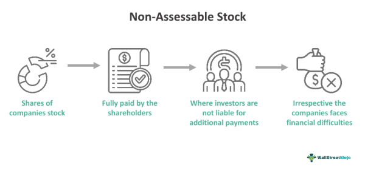

## Table of Contents

## What is an assessable stock?

An assessable stock is a type of stock where the company can ask shareholders to pay more money if needed. This extra money is called an assessment. Companies might do this to raise more funds for their operations or to pay off debts. When someone buys assessable stock, they agree that the company might ask for more money later.

Not all stocks are assessable. Most stocks today are non-assessable, meaning shareholders won't be asked for more money after buying the stock. Assessable stocks are less common now, but they can still be found in certain situations, like with some smaller companies or during specific financial events. It's important for investors to know if a stock is assessable before they buy it, so they understand the potential for additional payments.

## How does assessable stock differ from non-assessable stock?

Assessable stock and non-assessable stock are two types of stocks that differ in one big way: the possibility of being asked for more money. With assessable stock, the company can ask shareholders to pay more money if it needs more funds. This extra payment is called an assessment. So, if you own assessable stock, you might have to pay more money later, even after you've bought the stock.

On the other hand, non-assessable stock means that once you've bought the stock, you won't be asked to pay any more money. The company can't come back and ask for more funds from shareholders. Most stocks today are non-assessable, which makes them more common and popular among investors because they don't [carry](/wiki/carry-trading) the risk of additional payments. Knowing whether a stock is assessable or non-assessable is important for investors to understand their potential financial commitments.

## What are the potential risks of investing in assessable stocks?

Investing in assessable stocks comes with the big risk that the company might ask you for more money later. If you buy an assessable stock, you agree that the company can come back and say, "We need more money, so please pay us more." This extra money is called an assessment. If you can't pay this extra amount, you might have to sell your stocks at a bad time, which could mean losing money.

Another risk is not knowing when or how much more money you might have to pay. The company might need more funds suddenly, and you might not be ready for it. This can mess up your financial plans. Also, if a lot of people can't pay the assessment, the stock's value might go down because fewer people want to buy it. This makes assessable stocks less popular and harder to sell compared to non-assessable stocks.

## Can you explain the historical context of assessable stocks?

In the past, assessable stocks were more common than they are now. Back in the 1800s and early 1900s, many companies used assessable stocks to raise money. This was especially true for companies building big projects like railroads or mining operations. These projects needed a lot of money, and sometimes the companies didn't have enough from selling the first stocks. So, they would ask shareholders for more money through assessments to keep the projects going.

Over time, people started to prefer non-assessable stocks because they didn't want the risk of being asked for more money later. By the mid-20th century, non-assessable stocks became the norm. Today, assessable stocks are rare and usually found in smaller companies or special situations. Investors now like the safety of knowing they won't have to pay more after buying a stock, which is why non-assessable stocks are much more common.

## How are assessments typically calculated for assessable stocks?

When a company decides to ask for more money from shareholders with assessable stocks, they figure out how much each person needs to pay based on how many shares they own. Usually, the company decides on a total amount of money they need, and then they divide that amount by the total number of shares. This gives them a per-share assessment amount. So, if you own 100 shares and the assessment is $1 per share, you would need to pay $100.

Sometimes, the company might set different assessment amounts for different groups of shareholders or for different classes of stock. This can make it a bit more complicated, but the basic idea is still the same: they figure out how much money they need and then spread that cost among the shareholders based on how many shares each person owns. It's important for shareholders to understand how these assessments are calculated so they know what to expect if the company asks for more money.

## What are the legal obligations of a company issuing assessable stock?

When a company issues assessable stock, it has to follow certain rules. The company must clearly tell investors that the stock is assessable. This means they have to say, "If you buy this stock, we might ask you for more money later." The company also has to explain how and when they might ask for this extra money. It's important for the company to be honest and clear about these things so investors know what they're getting into.

The company also has to use the money from assessments the right way. They can't just take the money and do whatever they want with it. The money has to be used for things like paying off debts or keeping the business running. If the company doesn't follow these rules, they could get in trouble with the law. So, it's really important for them to make sure they're doing everything by the book.

## How do assessments affect the value of assessable stocks?

When a company asks for more money from people who own assessable stocks, it can change how much those stocks are worth. If the company says it needs more money, some people might think the company is not doing well. This can make them want to sell their stocks, which can make the price of the stock go down. Also, if a lot of people can't pay the extra money, they might have to sell their stocks quickly, which can also make the price drop.

On the other hand, if the company uses the extra money to fix problems or grow the business, it might make the stock more valuable in the long run. But this depends on how well the company does with the money. People who are thinking about buying assessable stocks need to think about these things. They need to decide if the risk of having to pay more money is worth it, and if the company will use that money in a good way.

## What are some examples of companies that have issued assessable stocks?

In the past, many railroad companies used assessable stocks to help build their tracks. For example, the Union Pacific Railroad in the 1800s issued assessable stocks to raise money for their big project. They needed a lot of money to build the railroad across the country, and sometimes they would ask shareholders for more money to keep the project going.

Another example is mining companies. In the early 1900s, companies like the Anaconda Copper Mining Company issued assessable stocks. They used the extra money from assessments to explore new mines and keep their operations running. These companies often needed more funds to deal with the costs and risks of mining, so they would ask shareholders for more money when they needed it.

## How can an investor mitigate the risks associated with assessable stocks?

Investors can lower the risks of assessable stocks by doing their homework before buying. They should read all the company's information carefully to understand if the stock is assessable and how much more money they might have to pay later. It's important to know how the company plans to use the extra money and if it will help the business grow or just cover debts. By understanding these details, investors can decide if the risk is worth it for them.

Another way to manage the risks is by not putting all their money into one stock. Investors can spread their money across different stocks and types of investments. This way, if one company asks for more money and they can't pay, they won't lose everything. It's also a good idea to have some extra money saved up, just in case they need to pay an assessment. By being prepared and spreading out their investments, investors can handle the risks of assessable stocks better.

## What are the tax implications of owning assessable stocks?

When you own assessable stocks, the tax rules can be a bit different compared to non-assessable stocks. If you pay an assessment, you might be able to take that money off your taxes as a loss. This means you can lower the amount of money you owe in taxes. But, you need to follow the rules set by the tax office to do this right. It's a good idea to talk to a tax expert to make sure you're doing everything correctly.

If the company does well and the value of the stock goes up, you might have to pay taxes on any money you make when you sell the stock. This is called capital gains tax. The tax you pay depends on how long you owned the stock and how much money you made from selling it. Again, it's smart to get advice from a tax expert to understand all the tax rules and how they apply to assessable stocks.

## How do assessable stocks fit into modern investment strategies?

In today's world, assessable stocks are not very common, so they don't fit into most people's investment plans. Most investors like to keep things simple and safe, so they choose non-assessable stocks. These stocks are easier to understand and don't have the risk of having to pay more money later. People like knowing exactly what they're getting into when they buy a stock, and non-assessable stocks give them that peace of mind.

But, some investors might still be interested in assessable stocks if they think the company has a good plan for using the extra money. These investors might be willing to take the risk if they believe the company can grow and make the stock more valuable in the future. They need to do a lot of research and be ready to pay more if the company asks for it. Assessable stocks can be a part of a bigger plan where the investor spreads their money across different types of investments to balance out the risks.

## What future trends might impact the use of assessable stocks?

In the future, assessable stocks might become even less popular. More and more people want to keep things simple and safe with their money. They don't want the surprise of having to pay more money later. So, companies might find it harder to sell assessable stocks. Also, rules about how companies can raise money might change. If the rules make it easier for companies to get money in other ways, they might not need to use assessable stocks as much.

But, there could be times when assessable stocks come back a bit. If the economy goes through a tough time, some companies might need extra money to stay afloat. They might turn to assessable stocks to get that money from their shareholders. Also, if new kinds of businesses start up that need a lot of money to grow, they might use assessable stocks to help them get going. So, even though assessable stocks are rare now, they might still have a place in the future under the right conditions.

## What are the key concepts of stock shares and stock assessment?

A stock share signifies a fractional ownership in a corporation, representing a claim on a portion of the company's assets and profits. Stock shares are instrumental in assessing a company’s market value, as they constitute the basic unit of ownership and are crucial in voting rights at shareholder meetings. Various forms of equity, such as common and preferred shares, offer differing rights and benefits, including dividends and priority in asset distribution in case of liquidation.

Stock assessment is a process that evaluates a stock’s potential for growth and return. It utilizes a combination of financial metrics and company performance data. Assessing a stock typically involves analyzing aspects like earnings per share (EPS), price-to-earnings ratio (P/E ratio), debt-to-equity ratio, and return on equity (ROE). These metrics provide a quantitative basis for determining a stock’s intrinsic value and comparing it with its current market price.

The P/E ratio, for instance, is calculated as follows:

$$
\text{P/E Ratio} = \frac{\text{Market Price per Share}}{\text{Earnings per Share (EPS)}}
$$

Investors and analysts use these assessments to formulate predictions about future stock performance. Fundamental analysis, which focuses on economic factors, industry trends, and the company’s financial health, is often combined with technical analysis to refine long-term investment strategies.

Modern tools and technologies have revolutionized stock assessment, facilitating more accurate and efficient evaluations. Advanced software can process large datasets to identify trends and patterns that might not be readily apparent through manual analysis. Machine learning algorithms and AI platforms are increasingly being used to improve the precision of stock assessments, enabling analyses that incorporate both current market data and historical performance.

By leveraging these technologies, analysts can enhance their ability to make data-driven and informed investment decisions, ensuring that potential stocks align well with strategic financial goals. The integration of fundamental and technical approaches in stock assessment continues to play a crucial role in optimizing investment portfolios in evolving financial markets.

## References & Further Reading

[1]: Bergstra, J., Bardenet, R., Bengio, Y., & Kégl, B. (2011). ["Algorithms for Hyper-Parameter Optimization."](https://dl.acm.org/doi/10.5555/2986459.2986743) Advances in Neural Information Processing Systems 24.

[2]: ["Advances in Financial Machine Learning"](https://www.amazon.com/Advances-Financial-Machine-Learning-Marcos/dp/1119482089) by Marcos Lopez de Prado

[3]: ["Evidence-Based Technical Analysis: Applying the Scientific Method and Statistical Inference to Trading Signals"](https://www.amazon.com/Evidence-Based-Technical-Analysis-Scientific-Statistical/dp/0470008741) by David Aronson

[4]: ["Machine Learning for Algorithmic Trading"](https://github.com/stefan-jansen/machine-learning-for-trading) by Stefan Jansen

[5]: ["Quantitative Trading: How to Build Your Own Algorithmic Trading Business"](https://www.amazon.com/Quantitative-Trading-Build-Algorithmic-Business/dp/1119800064) by Ernest P. Chan