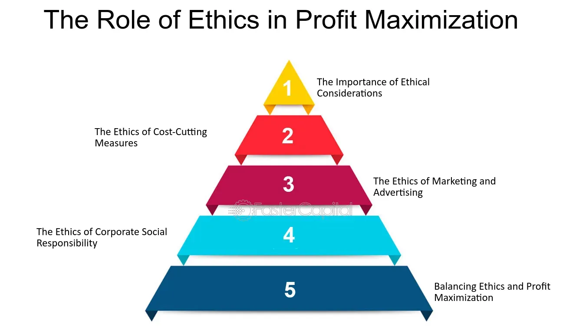

In the modern business landscape, efficiency, profitability, and trading performance are essential components driving corporate success. As companies strive to remain competitive, these elements become increasingly intertwined, reflecting the necessity for integrated strategies that can enhance overall outcomes. This article examines the critical relationships between corporate efficiency, profit maximization, and business performance, with a particular emphasis on algorithmic trading. 

Corporate efficiency is fundamental as it involves the optimal use of resources to maximize outputs and minimize wastage, which in turn supports profit maximization. Effective management of these factors not only improves a company's financial health but also enhances its competitive positioning in the market. Algorithmic trading, a technologically advanced form of trading, leverages mathematical models and algorithms to execute trades at high speeds and volumes, offering a potential edge in trading efficiency and performance.



By exploring these topics, businesses have the opportunity to refine their operations and trading strategies, ultimately achieving superior results. Through the implementation of efficient practices, companies can drive profitability while maintaining robust trading performance, ensuring their continued success in an ever-evolving market environment.

## Table of Contents

## Understanding Corporate Efficiency

Corporate efficiency is a critical factor in determining the success of a business, as it reflects how well a company utilizes its resources to generate maximum output with minimal waste. This concept is significant because efficient companies can reduce costs, improve productivity, and increase profitability, thereby gaining a competitive edge in their respective markets.

One of the primary metrics used to evaluate corporate efficiency is the set of efficiency ratios. Efficiency ratios provide insights into how well resources are being managed. A notable efficiency ratio is the inventory turnover ratio, which measures how many times a company's inventory is sold and replaced over a period. It is calculated as:

$$
\text{Inventory Turnover Ratio} = \frac{\text{Cost of Goods Sold (COGS)}}{\text{Average Inventory}}
$$

A higher inventory turnover ratio indicates effective inventory management, implying that a company is selling goods without overstocking or understocking. For instance, Walmart has demonstrated excellence in managing its inventory efficiently, ensuring that products are readily available to meet customer demand while minimizing holding times. This efficiency has led to improved cash flow, a critical component of financial health and operational success.

Another vital metric is the cash conversion cycle (CCC), which measures the time it takes for a company to convert its investments in inventory and other resources into cash flows from sales. The CCC is composed of three components: Days Inventory Outstanding (DIO), Days Sales Outstanding (DSO), and Days Payable Outstanding (DPO). It is calculated as:

$$
\text{CCC} = \text{DIO} + \text{DSO} - \text{DPO}
$$

A shorter CCC indicates that a company is able to recover its cash investment quickly, which is an indicator of efficiency. Efficient management of these components contributes to reduced capital binding in inventory and receivables and extended payables, which can enhance a company's [liquidity](/wiki/liquidity-risk-premium) position.

Walmart exemplifies the benefits of corporate efficiency by optimizing its supply chain and resource management. By leveraging sophisticated logistics and inventory systems, Walmart reduces excess stock and quickly responds to shifting consumer demands, thereby maintaining low prices and improving profit margins.

In summary, corporate efficiency is a cornerstone of sound business practice. By focusing on key efficiency ratios such as inventory turnover and cash conversion cycles, and implementing strategies to optimize these metrics, companies can significantly improve their operational performance and maintain a strong competitive position in the marketplace.

## Profit Maximization Strategies

Profit maximization is a critical objective for any business aiming to enhance its financial performance and competitiveness. This goal involves increasing revenue streams while simultaneously optimizing cost structures, which collectively boost the company's profit margins.

Efficient inventory management is one of the primary strategies for achieving profit maximization. By ensuring that inventory levels align closely with demand forecasts, companies can minimize holding costs and reduce instances of overstock or stockouts. Technologies such as just-in-time (JIT) inventory systems exemplify how businesses can streamline inventory processes to achieve these objectives. JIT systems focus on reducing inventory levels and storage needs, thereby cutting costs associated with excess stock. A prominent example is Toyota, whose implementation of JIT significantly reduced waste and increased responsiveness to market changes, ultimately leading to higher profitability.

Streamlining operations is another effective approach. By optimizing supply chain processes and reducing unnecessary operational inefficiencies, businesses can lower their variable costs, which directly impacts the bottom line. Lean management techniques, which aim to create more value with fewer resources, are widely utilized to enhance operational efficiency. For instance, by employing lean practices, companies like Dell have managed to minimize production times and reduce operational complexities, facilitating a stronger competitive position and improved profitability.

Optimizing pricing strategies is also essential for profit maximization. Businesses often use data analytics to assess market trends, customer behavior, and competitor prices to set optimal pricing. Dynamic pricing models, which adjust prices based on real-time demand and supply conditions, can enhance revenue. Amazon's use of dynamic pricing algorithms is a case in point, allowing the company to adjust prices rapidly, thereby maximizing sales and profit margins across different market segments.

Real-life examples further illustrate the effectiveness of these strategies. For instance, Walmart, through its strategic emphasis on efficient supply chain management and economies of scale, has consistently maintained low prices while sustaining significant profits. Its focus on cost optimization through technology-driven efficiencies has been pivotal in its profit generation model.

In conclusion, businesses that adeptly implement these strategies can realize substantial improvements in their profit margins. Efficient inventory management, streamlined operations, and optimal pricing are essential components of a profit maximization framework that can yield significant financial benefits. Employing such strategies systematically can provide businesses with a sustainable competitive edge by enhancing profitability and operational resilience.

## Enhancing Business Performance

Business performance is critically assessed through various financial metrics that indicate a company's overall health and competitive viability. These metrics not only offer a snapshot of current status but also guide strategic decision-making and long-term planning for enhanced performance.

**Key Performance Indicators (KPIs):**

1. **Return on Investment (ROI):**
   ROI is a metric used to evaluate the efficiency of an investment or compare the profitability of several investments. It is calculated as:
$$
   \text{ROI} = \left( \frac{\text{Net Profit}}{\text{Cost of Investment}} \right) \times 100

$$
   A higher ROI indicates that the investment gains compare favorably to the cost.

2. **Net Profit Margin:**
   This ratio measures how much of every revenue dollar remains as profit after all expenses are paid. It is vital for assessing operational efficiency and is computed as:
$$
   \text{Net Profit Margin} = \left( \frac{\text{Net Income}}{\text{Revenue}} \right) \times 100

$$
   A strong net profit margin suggests a company is managing its costs well and is financially stable.

3. **Economic Value Added (EVA):**
   EVA quantifies the true economic profit of a company. It’s calculated by subtracting the company’s cost of capital from its net operating profit after taxes (NOPAT). The formula is:
$$
   \text{EVA} = \text{NOPAT} - (\text{Capital Invested} \times \text{WACC})

$$
   Where WACC stands for Weighted Average Cost of Capital. A positive EVA indicates that the company is creating value over and above its cost of capital.

**Continuous Assessment and Strategic Realignment:**

To sustain high performance, it’s crucial for businesses to continuously assess these KPIs and realign their strategies accordingly. Regular evaluation allows companies to identify strengths and weaknesses, enabling them to make informed decisions. For example, if ROI is lower than expected, a company might revisit its investment strategies or operational costs to find areas for improvement.

Moreover, aligning strategies with evolving market conditions and technological advancements can also drive better business performance. Businesses that are agile and responsive to change are more likely to maintain a competitive edge. Implementing data-driven strategies, setting realistic goals, and employing innovative technologies are aspects that play significant roles in achieving sustained business performance.

In conclusion, enhancing business performance is a multifaceted endeavor that requires a comprehensive approach to analyzing financial metrics and a willingness to adapt strategies as necessary. Leveraging the right KPIs to navigate complex business landscapes can lead to improved profitability and long-term success.

## The Role of Algorithmic Trading

Algorithmic trading, also known as algo trading or black-box trading, is a sophisticated method that employs mathematical models and advanced algorithms to [carry](/wiki/carry-trading) out trades at substantial speeds and volumes that far exceed human capabilities. This form of trading seeks to leverage technology to optimize trading efficiency and capitalize on fleeting market opportunities, consequently minimizing risks.

One of the fundamental components of [algorithmic trading](/wiki/algorithmic-trading) is the use of computer algorithms that follow a predetermined set of instructions for placing trades. These algorithms consider timing, price, quantity, and other mathematical models to make decisions with minimal human intervention. The speed of execution in algorithmic trading is typically measured in milliseconds or even microseconds, which provides a significant edge in rapidly moving markets.

The integration of real-time data analysis is crucial in enhancing the efficiency of algorithmic trading systems. Advanced analytics allow for the swift interpretation of large data sets, enabling traders to identify trends and patterns that may affect stock prices. Technologies like [artificial intelligence](/wiki/ai-artificial-intelligence) and [machine learning](/wiki/machine-learning) further augment these systems by enabling continuous learning from market data and adjusting strategies accordingly for improved performance and precision.

Automated trading systems are another advantage provided by algorithmic trading. These systems can operate across various markets and asset classes, executing trades simultaneously in different geographies and time zones without human intervention. This not only maximizes trading opportunities but also reduces the potential for human errors associated with manual trading. 

Additionally, algorithmic trading helps businesses capitalize on market opportunities more effectively. By executing trades based on quantitative analysis and backtested strategies, companies can achieve better execution prices and implement trading strategies that might be too complex for manual trading. This approach enables firms to discover [arbitrage](/wiki/arbitrage) opportunities, manage portfolios, and execute large orders without adversely affecting market prices.

Risk reduction is another critical benefit of algorithmic trading. The absence of manual intervention reduces the emotional biases and errors that human traders might introduce. Moreover, algorithms can be programmed to include risk management strategies, such as stop-loss orders and automatic portfolio rebalancing, to further ensure that trading activities align with predefined risk parameters.

In summary, algorithmic trading revolutionizes the trading landscape by employing complex algorithms and technology-driven strategies to enhance trading efficiency, seize optimal market opportunities, and mitigate associated risks. As markets continue to evolve, the role of algorithmic trading is set to become increasingly pivotal in achieving greater trading precision and financial performance.

## Technological Innovations Enhancing Efficiency

Emerging technologies such as Artificial Intelligence (AI) and the Internet of Things (IoT) are revolutionizing the landscape of modern business operations. AI is enabling companies to automate complex processes, enhance decision-making capabilities, and improve customer service through advanced data analytics and machine learning algorithms. These capabilities allow businesses to forecast demand more accurately, optimize resource allocation, and personalize customer experiences, thereby increasing operational efficiency and driving profitability.

The IoT further extends these efficiencies by allowing businesses to monitor operations in real-time through connected devices and sensors. This continuous flow of data facilitates predictive maintenance, reduces downtime, and improves supply chain management. For instance, predictive analytics powered by IoT can anticipate equipment failures before they occur, reducing maintenance costs and preventing production halts.

Blockchain technology is another pivotal innovation that ensures transparency and security in business transactions. By maintaining an immutable ledger of transactions, blockchain mitigates the risk of fraud and reduces the need for intermediaries, thus decreasing transaction costs. Its use in smart contracts automates contract execution, ensuring compliance and efficiency without manual intervention.

The integration of these technologies holds the potential to significantly elevate a company's operational efficiency and profit margins. For example, AI systems can quickly analyze vast amounts of data to identify patterns and insights that humans might overlook, thus providing a competitive advantage. Similarly, the IoT can optimize logistics networks, ensuring timely deliveries and reducing inventory holding costs, which in turn enhances profitability.

Incorporating these innovations requires businesses to adapt and invest in suitable IT infrastructures while ensuring that their workforce is adequately trained to handle new technologies. As businesses embrace these technological advancements, they are better equipped to sustain competitive advantages in their respective industries through improved efficiencies and enhanced business performance.

## Risk Management in Algo Trading

Efficient risk management is critical in algorithmic trading to prevent potential financial losses inherent in high-frequency trading environments. This necessitates employing strategies that can anticipate and mitigate risks in real time. 

One primary method is the use of stop-loss orders, a tool that automatically sells an asset when it reaches a pre-determined price, thus limiting the trader’s loss on a position. For example, if an asset is purchased at $100, a trader might set a stop-loss order at $95, thereby preventing a higher loss if the asset's price begins to decline. This technique is valuable in high-frequency trading, where rapid price changes can lead to substantial losses.

Automatic trade adjustments form another vital component of risk management. These adjustments involve dynamically altering trade parameters based on real-time market data to avoid potential losses. Trading algorithms can be programmed to identify and react to market fluctuations, adjusting positions or exiting trades when certain risk thresholds are crossed. This is often achieved through the use of conditional logic that responds to patterns or trends within data streams.

Balancing risk and reward is essential to maintaining sustainable trading practices. Traders often utilize metrics such as the Sharpe Ratio, which measures the performance of an investment compared to a risk-free asset, after adjusting for its risk, to evaluate risk-adjusted returns. The formula is given by:

$$
\text{Sharpe Ratio} = \frac{R_p - R_f}{\sigma_p}
$$

where:
- $R_p$ is the return of the portfolio,
- $R_f$ is the risk-free rate of return,
- $\sigma_p$ is the standard deviation of the portfolio's excess return.

By maintaining a balance between risk and expected returns, traders can devise strategies that optimize both performance and safety, ensuring longevity and profitability in algorithmic trading ventures. 

Implementing robust risk management protocols is not just beneficial but necessary for traders seeking to thrive in the highly competitive environment of high-frequency trading.

## Adapting to Market Conditions

Navigating the ever-changing landscape of financial markets requires a flexible approach to trading strategies. Algorithmic trading stands out due to its ability to rapidly adapt to market shifts, leveraging advanced technologies to incorporate real-time data analysis. The necessity for regularly updating and testing algorithms cannot be understated, as these practices ensure that trading strategies remain aligned with current trends and conditions.

Effective adaptation in algorithmic trading involves continuously fine-tuning algorithms to account for varying factors such as market liquidity, [volatility](/wiki/volatility-trading-strategies), and economic indicators. By employing machine learning techniques, trading systems can dynamically adjust to new patterns, thereby optimizing decision-making processes. Here’s a simple example in Python using scikit-learn to update a trading model:

```python
from sklearn.model_selection import train_test_split
from sklearn.linear_model import LinearRegression
import numpy as np

# Sample data: market indicators and corresponding prices
market_indicators = np.array([1.0, 2.0, 3.0, 4.0, 5.0]).reshape(-1, 1)
prices = np.array([110, 130, 150, 170, 190])

# Split the data for training and testing
X_train, X_test, y_train, y_test = train_test_split(market_indicators, prices, test_size=0.2, random_state=42)

# Initialize and train the model
model = LinearRegression()
model.fit(X_train, y_train)

# Update model with new market conditions
new_market_data = np.array([6.0, 7.0]).reshape(-1, 1)
predictions = model.predict(new_market_data)
print("Updated Predictions:", predictions)
```

This example demonstrates how machine learning models can be updated with new data, allowing traders to react promptly to shifting conditions. Moreover, robust [backtesting](/wiki/backtesting) of algorithms is crucial to validate the effectiveness of these updates before live deployment, minimizing risks and maximizing returns.

Successful adaptation is predicated upon an agile infrastructure that can process large datasets efficiently. Technologies such as cloud computing and distributed ledger technology enable traders to handle and analyze substantial volumes of data. By capitalizing on these tools, businesses can streamline operations, improve transaction speeds, and enhance the precision of their trades.

In summary, maintaining a competitive edge in the fast-paced trading environment relies heavily on the ability to adapt swiftly to market conditions. By continually refining algorithms and integrating cutting-edge technologies, traders can achieve sustained efficiency and profitability.

## Conclusion

Corporate efficiency, profit maximization, and business performance are critically interconnected, particularly when algorithmic trading is employed. At the core of these concepts is the notion that efficient resource management can drive profitability and enhance a company's overall performance. By incorporating advanced trading technologies and strategies, businesses can realize substantial gains.

A key [factor](/wiki/factor-investing) in achieving corporate efficiency is the strategic use of technology. Algorithmic trading, which uses sophisticated mathematical models and algorithms, allows companies to execute trades rapidly, taking advantage of fleeting market opportunities that can be critical for maximizing profits. For instance, by implementing real-time data analysis and automated systems, businesses can streamline operations and reduce human error, leading to higher profits and improved performance.

Moreover, the adoption of technologies such as artificial intelligence (AI) and the Internet of Things (IoT) further underscores the importance of modern innovations in optimizing business processes. AI can be used to predict market trends, while IoT can enhance operational efficiencies by enabling better inventory and supply chain management. These technologies not only aid in profit maximization but also support ongoing business performance improvements by providing actionable insights and streamlining complex operations.

To sustain a competitive advantage in today's fast-paced business environment, companies must continually assess and recalibrate their strategies. This includes refining algorithms to align with changing market conditions and adjusting risk management practices to protect against potential losses in high-frequency trading. The ability to adapt quickly to market shifts ensures that businesses remain agile, maintain efficiency, and continue to prosper in the long term.

In conclusion, the convergence of corporate efficiency, profit maximization, and business performance is facilitated by leveraging algorithmic trading and modern technological advancements. These strategies are paramount for businesses aiming to enhance their operations and maintain a robust competitive position. Regular evaluation and adaptation of business practices are imperative for thriving in an ever-evolving marketplace.

## FAQs

### FAQs

**What is corporate efficiency and why is it important?**

Corporate efficiency refers to how well a company utilizes its resources, which include time, materials, and human capital, to produce its goods or services while minimizing waste. A company operating efficiently achieves higher output with the same input or maintains output levels while using fewer resources. This efficiency is crucial because it directly impacts a company’s profitability by reducing operational costs and enabling better resource allocation. For example, through efficient inventory management, a company can reduce holding costs and improve cash flow, which enhances its financial health and market competitiveness.

**How can businesses maximize their profits effectively?**

Businesses can maximize profits by optimizing revenue generation strategies and cost structures. Key strategies include efficient inventory management, utilizing technology to streamline operations, and employing dynamic pricing strategies. Each of these strategies contributes to reducing costs and increasing revenue. Real-life examples of companies that have successfully maximized profits through efficiency improvements offer valuable lessons. For instance, automated inventory systems can help businesses maintain optimal stock levels, thereby reducing holding and shortage costs, and improving the overall profit margin.

**What role does technology play in enhancing trading systems?**

Technology plays a transformative role in enhancing trading systems by providing speed, efficiency, and precision that manual processes cannot match. Advanced technologies such as algorithmic trading systems utilize mathematical models and AI to carry out trades at speeds and frequencies impossible for human traders. Real-time data analysis through technology not only helps in identifying profitable market trends faster but also automates the execution of trades, significantly increasing trading efficiency. This results in better market opportunities being capitalized on with lower transaction costs and reduced risks.

**What are the benefits of algorithmic trading?**

Algorithmic trading offers several benefits that traditional trading methods cannot provide. The primary advantage is the ability to execute large trade orders rapidly and accurately, minimizing market impact and transaction costs. Algorithms can continuously monitor multiple markets simultaneously, providing timely insights and opportunities that human traders might miss. Furthermore, algorithmic trading reduces the emotional and psychological pressures associated with trading decisions, as trades are executed based on predefined criteria and analytical models. This results in more consistent and reliable trading outcomes.

**How can risk be managed in high-frequency trading environments?**

Managing risk in high-frequency trading ([HFT](/wiki/high-frequency-trading-strategies)) is crucial to prevent potential losses from rapid market movements. Implementing automated risk management tools, such as stop-loss orders and circuit breakers, helps mitigate risks by defining loss thresholds that automatically trigger trade adjustments or closures. Additionally, balancing risk and reward is vital; for example, diversifying trading strategies and assets can help spread risk. Constantly updating and testing trading algorithms ensures they remain effective under different market conditions, further safeguarding against unforeseen losses.

## References & Further Reading

[1]: Bergstra, J., Bardenet, R., Bengio, Y., & Kégl, B. (2011). ["Algorithms for Hyper-Parameter Optimization."](https://dl.acm.org/doi/10.5555/2986459.2986743) Advances in Neural Information Processing Systems 24.

[2]: ["Advances in Financial Machine Learning"](https://www.amazon.com/Advances-Financial-Machine-Learning-Marcos/dp/1119482089) by Marcos Lopez de Prado

[3]: ["Evidence-Based Technical Analysis: Applying the Scientific Method and Statistical Inference to Trading Signals"](https://www.amazon.com/Evidence-Based-Technical-Analysis-Scientific-Statistical/dp/0470008741) by David Aronson

[4]: ["Machine Learning for Algorithmic Trading"](https://github.com/stefan-jansen/machine-learning-for-trading) by Stefan Jansen

[5]: ["Quantitative Trading: How to Build Your Own Algorithmic Trading Business"](https://www.amazon.com/Quantitative-Trading-Build-Algorithmic-Business/dp/1119800064) by Ernest P. Chan