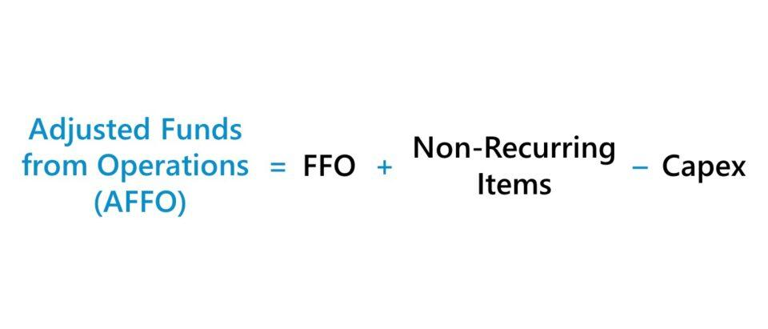

Real Estate Investment Trusts (REITs) are companies that own, operate, or finance income-generating real estate across a range of property sectors. Modeled after mutual funds, REITs provide investors with a way to earn a proportion of income generated through real estate investments without directly owning or managing the properties. They are crucial in investment portfolios due to their potential for providing competitive returns via dividends and capital appreciation, as well as their ability to diversify investment holdings beyond the traditional realms of stocks and bonds.

A critical metric in the evaluation of REITs is Funds from Operations (FFO). Unlike traditional earnings figures, which may include properties' depreciation costs, FFO provides a more accurate reflection of a REIT's operating performance by adding back depreciation and amortization to earnings and excluding gains on property sales. This metric is preferred in assessing a REIT’s financial performance because it aligns more closely with the cash flow generated by the trust’s properties, offering a clearer picture of a REIT’s actual economic activity and profitability.



However, FFO is not without its limitations. It does not account for capital expenditures necessary to maintain property values, nor does it include adjustments for income smoothing from straight-line rent or other non-cash revenue adjustments. This is where Adjusted Funds from Operations (AFFO) comes into play. AFFO refines FFO by subtracting recurring capital expenditures and accounting for straight-lining of rents and other adjustments. By offering a more precise measure of a REIT's ability to sustain its dividend payments, it provides investors with a valuable tool for evaluating long-term financial health and operational efficiency.

The landscape of financial markets has undergone a significant transformation with the rise of algorithmic trading, which has made its way into the REITs market. This method uses computer algorithms to determine the timing, pricing, and quantity of asset trades, enhancing trading efficiency and reducing transaction costs. Algorithmic trading in the REITs sector allows investors to make swift, data-driven decisions, and optimize investment strategies based on real-time market conditions.

Understanding AFFO, FFO, and the role of algorithmic trading is pivotal for making well-informed investment decisions in the REITs market. These components together offer a robust framework for analyzing a REIT's performance, valuing its financial health, and crafting a dynamic and responsive investment strategy. Familiarity with these concepts empowers investors to navigate the complexities of the real estate market with greater precision and insight, ultimately leading to more effective portfolio management and performance outcomes.

## Table of Contents

## Understanding Funds from Operations (FFO)

Funds from Operations (FFO) is a key financial metric used in the analysis of Real Estate Investment Trusts (REITs). It provides investors with insights into the operating performance of a REIT, distinct from the traditional earnings figures typically found in other industries.

### Calculating Funds from Operations (FFO)

The formula for calculating FFO is as follows:

$$

\text{FFO} = \text{Net Income} + \text{Depreciation and Amortization} - \text{Gains on Sales of Property}
$$

This formula starts with the net income, which is adjusted by adding back depreciation and amortization expenses associated with real estate properties. These are non-cash charges that can significantly skew traditional earnings figures, given that real estate assets typically appreciate over time rather than depreciate. Additionally, any gains from the sale of properties, which are not part of the core operations of a REIT, are subtracted from the net income.

### Why FFO is Preferred over Traditional Earnings

FFO is preferred over traditional earnings figures for evaluating REITs due to its focus on operational performance rather than accounting profits. Traditional earnings measures like net income can be misleading in the real estate sector due to the high depreciation charges applied to real estate assets. These charges can significantly reduce reported earnings even when the underlying properties may be increasing in value. FFO adjusts for this by excluding depreciation and amortization, providing a clearer picture of the cash-generating potential of a REIT's operations.

### Limitations of FFO

Despite its advantages, FFO has limitations. One major drawback is its exclusion of capital expenditures necessary to maintain or improve properties. While FFO provides a better operational picture than net income, it doesn't account for expenses that are crucial for sustaining long-term property value and income streams. This lack can pose a risk when assessing the ability of a REIT to maintain its dividend payouts.

### Impact of FFO on Investor Evaluations

FFO impacts investor evaluations by offering a baseline for assessing a REIT's distribution capacity. Since REITs are required by law to pay out a significant portion of their income as dividends, FFO serves as a critical indicator of a REIT's ability to generate consistent and reliable cash flows necessary for sustaining those dividends. Investors often look at FFO per share when analyzing a REIT, as it provides a per-unit measure of financial health, enabling comparisons across REITs.

For instance, if a REIT reports a healthy FFO growth trend, investors might have increased confidence in its future dividend distributions, potentially making the REIT an attractive investment despite any accounting losses reported under traditional earnings metrics. Conversely, a decline in FFO might signal operational difficulties, leading investors to reassess the stability of future dividend payments.

In conclusion, FFO serves as a vital metric in the REIT sector due to its ability to bypass accounting distortions inherent in traditional earnings figures, offering a clearer window into a REIT’s operational capabilities. However, its limitations underscore the need for supplementary metrics like Adjusted Funds from Operations (AFFO) for a more comprehensive financial analysis.

## Breaking Down Adjusted Funds from Operations (AFFO)

Adjusted Funds from Operations (AFFO) is a metric that refines the Funds from Operations (FFO) calculation to provide a more nuanced view of a Real Estate Investment Trust’s (REIT's) profitability. AFFO offers a clearer picture by accounting for recurring capital expenditures and other necessary investments that maintain the income-producing capabilities of a REIT.

The formula for AFFO generally begins with FFO and makes several adjustments. These adjustments include subtracting maintenance costs, also referred to as capital expenditures or CAPEX, which are spending necessary to maintain the asset's value and revenue-generating capacity. Additionally, rental income adjustments are often considered to reflect incentives offered to tenants, such as rent abatements. Other factors that may adjust the FFO to derive AFFO include leasing costs and expense amortizations related to tenant inducements.

In contrast to FFO, which primarily focuses on net income with certain non-cash charges adjusted, AFFO seeks to deliver a more accurate depiction of a REIT’s sustainable income, making it more suitable for long-term investment analysis. FFO can sometimes present an overly optimistic view by excluding costs that are significant over the lifespan of the properties within the trust. In essence, AFFO provides a corrected view by including these expenditures and adjustments, thus offering a less distorted measure of a REIT's real financial health.

AFFO is particularly useful in evaluating dividend sustainability. Since dividends are typically paid out of the cash flow generated by a REIT, understanding AFFO allows investors to gauge whether the dividend payouts exceed the sustainable income that a REIT can generate. A REIT consistently distributing dividends higher than its AFFO may eventually face financial strain, highlighting the critical role of AFFO in assessing long-term investment viability and income distribution strategies.

## The Rise of Algorithmic Trading in the REITs Sector

Algorithmic trading, also known as algo trading, refers to the use of computer algorithms to execute trades in financial markets. These algorithms analyze a wide array of market data, including price quotes, historical data, and other quantitative analyses, to make trading decisions at high speed and frequency. With the rise of sophisticated computing and advanced analytics, algo trading has gained immense prominence, transforming the landscape of financial markets by offering greater efficiency and reduced transaction costs.

In the Real Estate Investment Trusts (REITs) sector, algo trading plays a crucial role in optimizing investment strategies. By leveraging quantitative methods, algorithms can handle large datasets consisting of real-time market information and historical performance metrics, such as Funds from Operations (FFO) and Adjusted Funds from Operations (AFFO). This capability allows investors to identify trends and opportunities that might not be apparent through manual analysis, thus enhancing the overall decision-making process.

The application of algo trading in REITs investment enhances efficiency primarily through automation. Since algorithms can process and respond to data more quickly than humans, they facilitate quicker trade execution, which can be pivotal in fast-moving markets. Furthermore, by minimizing human intervention, algorithms reduce the likelihood of errors caused by emotional or impulsive decisions, thereby optimizing returns. This automation also translates to cost savings by reducing the need for extensive human resources and operational overheads.

Investors can harness algo trading to make data-driven decisions by building models that predict REIT market movements. These models can incorporate inputs like AFFO and FFO, along with macroeconomic indicators, to refine their predictions. For instance, an algorithm might be programmed to purchase REIT shares when the AFFO growth rate exceeds a specific threshold, while selling when the FFO shows a declining trend. Programming such strategies requires a deep understanding of both financial metrics and algorithm design.

Despite its advantages, algo trading comes with inherent risks and challenges. Market [volatility](/wiki/volatility-trading-strategies) can significantly affect algorithm performance, particularly if the data models do not adequately account for sudden shifts in market conditions. In addition, technological errors, such as system failures or programming bugs, can lead to substantial financial losses. As a result, it's crucial for investors to implement robust risk management strategies, regularly update their algorithms, and conduct thorough testing under various market scenarios to minimize these risks.

In conclusion, the integration of [algorithmic trading](/wiki/algorithmic-trading) in the REITs sector offers a powerful tool for enhancing investment strategies through improved efficiency, cost reduction, and data-informed decision making. However, like any technological advancement, it requires careful implementation and ongoing vigilance to navigate the challenges it presents.

## Integrating AFFO and FFO in Algo Trading Models

Integrating Funds from Operations (FFO) and Adjusted Funds from Operations (AFFO) into algorithmic trading models is increasingly becoming a key strategy for investors in the Real Estate Investment Trusts (REITs) sector. These financial metrics are crucial for evaluating the performance and profitability of REITs, and their incorporation into algorithmic models offers significant benefits in terms of precision and insight.

Traders often begin by using historical FFO and AFFO data to build and refine their algorithmic models. By analyzing these figures over time, they can identify trends, patterns, and anomalies in the financial performance of REITs. This historical data serves as the groundwork for [backtesting](/wiki/backtesting), a critical process that evaluates the effectiveness of trading strategies by testing them against past market data. Backtesting helps traders to gauge the potential success of their strategies before deploying them in real-world scenarios, thus minimizing risks.

A typical backtesting workflow might involve inputting historical FFO and AFFO data into an algorithm which simulates trades over a defined period. The algorithm measures performance metrics such as return on investment (ROI), risk-adjusted return, and volatility. For instance, in Python, a basic backtesting setup might involve libraries such as `pandas` for data manipulation and `[backtrader](/wiki/backtrader)` for executing the strategy:

```python
import pandas as pd
import backtrader as bt

# Example historical data load
ffo_data = pd.read_csv('historical_ffo.csv', parse_dates=True, index_col='date')
affo_data = pd.read_csv('historical_affo.csv', parse_dates=True, index_col='date')

class REITStrategy(bt.Strategy):
    def __init__(self):
        self.ffo = self.datas[0].close
        self.affo = self.datas[1].close

    def next(self):
        if self.ffo > self.affo:
            self.buy()
        elif self.ffo < self.affo:
            self.sell()

cerebro = bt.Cerebro()
cerebro.addstrategy(REITStrategy)
data_ffo = bt.feeds.PandasData(dataname=ffo_data)
data_affo = bt.feeds.PandasData(dataname=affo_data)
cerebro.adddata(data_ffo)
cerebro.adddata(data_affo)
cerebro.run()
```

This approach offers investors a method to objectively measure the performance and viability of their trading decisions.

There are numerous case studies highlighting the successful integration of FFO, AFFO, and algorithmic trading. Traders have used these metrics to develop sophisticated models that anticipate changes in dividend sustainability and asset performance, resulting in more informed, data-backed investment decisions. For example, a fund manager might employ these metrics to adjust their portfolio dynamically based on real-time updates in AFFO and FFO figures. 

Looking to the future, innovations in algo trading models specific to REITs are likely to focus on integrating [artificial intelligence](/wiki/ai-artificial-intelligence) (AI) and [machine learning](/wiki/machine-learning) (ML) technologies. These advancements can further enhance the granularity of data analysis, enabling more nuanced decision-making processes. AI algorithms could analyze complex datasets encompassing FFO, AFFO, and other financial and macroeconomic indicators to deliver highly optimized trading strategies that account for numerous variables and potential market conditions.

In conclusion, the advancement of algorithmic trading models incorporating AFFO and FFO data holds considerable promise. As technology continues to evolve, traders will possess unprecedented tools to make informed decisions, potentially leading to superior performance in REIT investments. Continuous refinement of these models, supported by comprehensive backtesting and integration of cutting-edge technologies, will be essential to capitalizing on these opportunities.

## Conclusion and Investment Strategies

Real Estate Investment Trusts (REITs) have emerged as significant components in investment portfolios, largely due to their potential for stable income and diversification. Two crucial metrics for assessing REIT performance are Funds from Operations (FFO) and Adjusted Funds from Operations (AFFO). While both offer insights, they serve distinct roles and, when used together, provide a comprehensive evaluation of a REIT's financial health.

FFO is pivotal in assessing the operating performance of REITs as it adjusts net income for depreciation and gains on sales of properties, offering a snapshot of cash generated from operations. However, it does not account for capital expenditures, which can impact future cash flows. This is where AFFO comes in, refining FFO by including maintenance costs and other capital expenditures, making it a more accurate measure of a REIT's profitability and potential for sustaining dividends.

The integration of algorithmic trading with AFFO and FFO enables investors to capitalize on these metrics in modern investment strategies. By employing complex algorithms, traders can analyze large datasets, including historical AFFO and FFO figures, to identify trends and predict future performance. This integration enhances decision-making, reducing costs and increasing efficiency in managing REIT investments.

For investors aiming to leverage these metrics effectively, a few practical tips are essential. Firstly, understanding the nuances of both FFO and AFFO is crucial. This knowledge facilitates better interpretation of a REIT's operational efficiency and financial sustainability. Secondly, adopting algorithmic trading strategies requires a foundation in coding and data analytics, enabling investors to build and backtest models that incorporate these financial metrics. Lastly, continuous education is pivotal. Staying informed about trends in REIT markets, advances in algo trading, and the evolving definitions of financial metrics like AFFO and FFO ensures that investors can adapt and optimize their strategies effectively.

In conclusion, the synergy between AFFO and FFO provides a nuanced view of REIT performance, and when integrated with algorithmic trading, it offers a powerful toolset for modern investors. Embracing these metrics, coupled with ongoing education, positions investors to make informed and strategic decisions in the ever-evolving landscape of real estate investment.

## References & Further Reading

[1]: NAREIT. ["Funds From Operations (FFO)."](https://www.reit.com/nareit/advocacy/policy/ffo-discussion-paper) National Association of Real Estate Investment Trusts.

[2]: Baum, A., & Hartzell, D. (2021). ["Global Property Investment: Strategies, Structures, Decisions."](https://onlinelibrary.wiley.com/doi/book/10.1002/9781444347289) John Wiley & Sons.

[3]: Damodaran, A. (2021). ["Investment Valuation: Tools and Techniques for Determining the Value of Any Asset."](https://books.google.com/books/about/Investment_Valuation.html?id=5SRHAAAAQBAJ) John Wiley & Sons.

[4]: Geltner, D., Miller, N. G., Clayton, J., & Eichholtz, P. (2013). ["Commercial Real Estate Analysis and Investments."](https://www.researchgate.net/publication/245702364_Commercial_Real_Estate_Analysis_and_Investments) Cengage Learning.

[5]: Arnott, R. D., & Asness, C. S. (2003). ["Surprise! Higher Dividends = Higher Earnings Growth."](https://www.jstor.org/stable/4480452) Financial Analysts Journal, 59(1), 70-87.