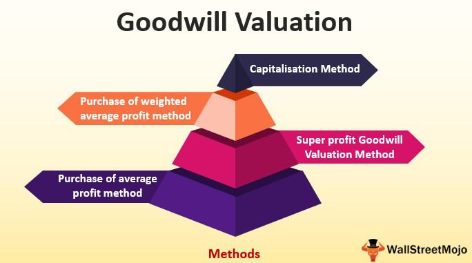

Intangible assets hold a crucial place in modern economies as they significantly influence company valuation and strategic direction. Among these intangible assets, goodwill emerges as a pivotal element derived during corporate acquisitions. It represents the premium over the tangible and identifiable intangible assets, encapsulating synergies and aspects like brand strength, which are not individually recognized. The strategic importance of goodwill lies in its connection to the anticipated economic benefits that transcend the current financial measures of an organization.

In parallel, the advent of algorithmic trading has brought transformative changes to financial markets. This trading method involves using sophisticated algorithms to execute trades based on data-driven strategies. Its capacity to process vast amounts of data quickly and accurately has not only enhanced trading efficiency but also minimized human errors and introduced advanced analytical capabilities.

The convergence of these two domains, goodwill accounting, and algorithmic trading, presents unique opportunities for enhancing financial analysis and strategic market positioning. By integrating data-driven insights from algorithmic trading, businesses can achieve refined valuation approaches for intangible assets like goodwill. Such integration allows for more precise insights into stock valuations, as algorithms can adjust to real-time changes in reported goodwill, economic conditions, and market sentiment.

Exploring the intricacies of intangible assets, such as goodwill, and understanding the impact of algorithmic trading offers promising avenues to enhance the perception and assessment of these assets. Real-world examples and emerging trends highlight the potential synergies between these areas. Advancements in artificial intelligence and machine learning further illuminate the prospects for integrating goodwill assessment within automated trading systems, ultimately leading to an optimized financial management landscape.

## Table of Contents

## Understanding Intangible Assets and Goodwill

Intangible assets are pivotal components of modern businesses, offering them competitive advantages due to their unique, non-physical nature. These assets encompass a variety of intellectual properties, such as patents, trademarks, and copyrights, along with goodwill. Goodwill is distinct among intangible assets as it specifically arises during corporate acquisitions. It represents the premium paid over the fair value of a company's identifiable tangible and intangible assets, capturing elements such as synergies, strong brand reputation, customer relationships, or superior management strength that are not independently recognized as separate assets.

The valuation of goodwill is particularly challenging because it is inherently subjective and is reliant on the projection of future economic benefits derived from these non-separable synergies. This subjectivity introduces complexities in financial analysis and reporting, requiring precise valuation models and considerable judgment. To maintain financial statement accuracy and reflect true asset values, companies perform impairment testing on goodwill. This process involves assessing whether the carrying amount of goodwill has been reduced by changes in the business environment or internal operations, and if so, recognizing an impairment loss.

Operationalizing this, financial professionals implement strategic models to quantify goodwill impairment. A common method is applying a two-step process outlined in accounting standards like IFRS and GAAP. Step one involves comparing the fair value of a reporting unit to its carrying amount. If the fair value is less than the carrying amount, step two quantifies the impairment loss by comparing the implied fair value of goodwill to its carrying amount. Impairment losses directly impact income statements, affecting investor perceptions and company valuations.

Understanding the strategic value of goodwill is crucial for both businesses and investors. It speaks to a company's comprehensive market position and potential for sustained competitive advantage. For businesses, effectively managing and leveraging intangible assets like goodwill can provide substantial economic benefits, from enhancing merger and acquisition strategies to optimizing operational efficiencies. Investors and analysts, in turn, scrutinize these assets to gain insights into company growth prospects and leadership quality, informing investment decisions and risk assessments.

## The Principles of Goodwill Accounting

Goodwill accounting is a critical component of financial reporting, governed by established standards such as Generally Accepted Accounting Principles (GAAP) and International Financial Reporting Standards (IFRS). These frameworks ensure consistency and transparency in how companies report goodwill on their financial statements.

Unlike tangible assets, goodwill is not amortized over a fixed schedule. Instead, it is subject to impairment testing. This approach requires companies to assess, at least annually, whether the carrying value of goodwill exceeds its fair value. If the fair value is less than the carrying amount, an impairment loss is recognized. This process ensures that the financial statements reflect any deterioration in the economic benefits associated with the goodwill, rather than spreading these potential losses evenly over several years.

The way goodwill is accounted for can significantly impact investor perception and company valuation. Historically, companies have had to make substantial write-offs due to goodwill impairments, which can lead to a sharp decline in their stock prices. For instance, notable cases such as mergers and acquisitions gone awry often lead to scrutiny of prior goodwill valuations, stressing the importance of initial accurate assessments. These events highlight that understanding the subtleties of goodwill accounting is essential not only for precise business valuations but also for informed strategic decisions by companies and investors alike.

An accurate evaluation of goodwill through impairment testing aids in presenting the true financial position of an organization. For instance, a company consistently showing goodwill impairments may suggest issues with its acquisition strategies or the performance of acquired entities. By understanding these dynamics, stakeholders can make more informed judgments about a company's health and potential, emphasizing the intertwining of goodwill accounting principles with the broader financial strategy of a corporation. 

Ultimately, adhering to the principles of goodwill accounting enables businesses to maintain credibility in financial reporting, thereby supporting long-term investor confidence and strategic corporate growth.

 to Algorithmic Trading

Algorithmic trading is a method of executing trades using pre-programmed instructions that consider variables such as timing, price, and [volume](/wiki/volume-trading-strategy). This approach has gained immense popularity due to its capacity for automating complex trading strategies, handling large volumes of data, and executing trades at speeds unattainable by human traders.

Technological advancements like high-frequency trading ([HFT](/wiki/high-frequency-trading-strategies)) and [machine learning](/wiki/machine-learning) have significantly propelled the growth of [algorithmic trading](/wiki/algorithmic-trading). High-frequency trading involves executing a large number of orders at extremely fast speeds, often in fractions of a second, which allows traders to capitalize on small price discrepancies. Machine learning, on the other hand, enables the development of sophisticated trading algorithms that can learn from historical data and adapt to changing market conditions.

The benefits of algorithmic trading are numerous. It enhances speed and efficiency by reducing the time it takes to execute trades and allowing for the processing of large datasets in real time. Furthermore, by automating the trading process, algorithmic trading reduces the likelihood of human error, which can be caused by emotional and psychological factors. Another advantage is the ability to backtest trading strategies. By applying historical data, traders can evaluate the potential success of a strategy before deploying it in the market.

Despite these advantages, algorithmic trading carries certain risks. Market [volatility](/wiki/volatility-trading-strategies) can be exacerbated by the rapid execution of trades, sometimes contributing to events like the 2010 Flash Crash. Technical failures, such as system glitches or connectivity issues, can also lead to significant financial losses. As such, robust risk management practices are crucial in mitigating these risks. Such practices often involve implementing system redundancies, regular audits, and real-time monitoring to ensure the stability and security of the trading systems.

Effective data utilization is paramount in successful algorithmic trading. This involves harnessing large datasets to formulate and refine trading strategies. Traders employ various techniques such as data mining, statistical analysis, and machine learning algorithms to extract valuable insights from data. For instance, sentiment analysis can be performed on social media platforms to gauge market sentiment and inform trading decisions.

In summary, algorithmic trading has transformed the landscape of financial markets, offering unprecedented speed and precision in trade execution. While it brings forth several benefits, including efficiency and error reduction, it also poses challenges that necessitate careful consideration of risks and effective data handling techniques.

## The Intersection of Goodwill and Algo Trading

Algorithmic trading has brought about significant advancements in the valuation and strategic utilization of intangible assets such as goodwill. By employing data-driven analysis, algorithmic trading evolves the understanding and assessment of goodwill, offering nuanced insights into how it impacts stock valuations. This is particularly pertinent when changes in reported goodwill affect market perceptions and company valuations.

Integrating goodwill valuation directly into trading strategies allows sophisticated algorithms to reflect real-time adjustments and predictions concerning stock prices influenced by goodwill-related developments. Such integration is critical as goodwill, often derived from acquisitions, reflects future economic benefits that are difficult to quantify using traditional methods. Algorithmic trading uses a plethora of market data to refine this assessment, potentially revealing deeper insights into a company's strategic and financial positioning.

The inclusion of machine learning models and sentiment analysis has further enriched algorithmic trading's responsiveness to goodwill impairments and shifts in market sentiment. Machine learning techniques, such as natural language processing (NLP), can evaluate vast amounts of unstructured data, including financial news and media, to gauge sentiment surrounding a company's goodwill. For instance, when there are public disclosures about goodwill impairments, algorithms equipped with sentiment analysis can anticipate negative market reactions, allowing traders to adjust their strategies accordingly.

Case studies highlight the effectiveness of this integration. Traders who incorporate goodwill metrics and sentiment analysis into their algorithmic models can effectively optimize their portfolio returns. They adjust their asset allocations by dynamically reacting to market signals that indicate changes in goodwill valuations or related corporate events. One example is when a company announces a significant goodwill impairment, potentially leading to a drop in stock price. An algorithm that factors in goodwill data can identify the likelihood of such an event and execute trades to mitigate financial risk.

Looking ahead, advancements in [artificial intelligence](/wiki/ai-artificial-intelligence) and data analytics are projected to further refine the methods by which goodwill assessments are integrated into automated trading systems. These innovations promise to bolster market stability and enhance asset valuation processes. Enhanced modeling techniques, possibly including [deep learning](/wiki/deep-learning) and advanced analytics, will offer traders more accurate predictions on how goodwill fluctuations influence market behavior.

In summary, the fusion of goodwill accounting with algorithmic trading systems represents a forward leap in financial analysis and strategic trading. This synthesis not only fosters a more sophisticated approach to assessing intangible assets but also positions traders and investors to strategically navigate the complexities of modern financial markets.

## The Strategic Value of Combining Goodwill Accounting and Algo Trading

Integrating goodwill accounting and algorithmic trading enhances decision-making processes and optimizes investment strategies by leveraging the synergies between these two fields. Goodwill, an intangible asset arising from acquisitions, represents the premium paid over the fair value of tangible and identifiable intangible assets. Accounting for goodwill involves assessing its valuation and impairment, which directly impacts financial reporting and market perception. Algorithmic trading, on the other hand, utilizes pre-programmed trading instructions to execute trades with speed and precision, often relying on data-driven strategies to maximize market returns.

By aligning goodwill data with trading algorithms, companies can gain an edge in predicting market responses and making informed trades. This integration allows for a more nuanced understanding of how changes in goodwill valuations affect stock prices. Advanced data analytics and machine learning techniques can be employed to analyze trends and patterns associated with goodwill impairments, leading to more accurate valuation models and improved trading strategies.

Successful use cases demonstrate the benefits of adapting algorithms to fluctuations in goodwill valuations. For instance, when a company announces a goodwill impairment, algorithmic trading systems can immediately respond by adjusting trading strategies to reflect the new financial landscape. This responsiveness aids in optimizing portfolio performance and maintaining competitive market positioning.

The role of fintech is crucial in combining these domains. Fintech innovations utilize analytics tools and machine learning to understand and predict the impact of intangible assets like goodwill on market behavior. These technologies enable deeper insights into how intangible asset data can be translated into actionable trading strategies.

To effectively leverage these synergies, companies should invest in advanced data analytics and cultivate cross-functional collaboration between finance and technology teams. Staying updated with fintech advancements ensures that businesses remain at the forefront of integrating goodwill insights with trading algorithms, thereby capitalizing on these innovations for strategic advantage. Investing in robust data infrastructure and fostering partnerships with fintech firms can enable smoother integration and enhance the overall effectiveness of combining goodwill accounting with algorithmic trading.

## Conclusion

The integration of intangible asset management, particularly goodwill, with algorithmic trading offers notable strategic advantages in modern finance. Effective management of goodwill is crucial as it significantly impacts financial statements and market perception. It affects the valuation and attractiveness of a company in capital markets and informs stakeholders about the firm's long-term potential and non-tangible strengths, such as brand value and customer loyalty.

In parallel, algorithmic trading enhances trading efficiency through sophisticated, data-driven strategies. The use of algorithms allows for execution speed, mitigation of human error, and the ability to process large volumes of data to generate trading signals based on precise, statistical analysis. This technological prowess opens new avenues for market participants to access and leverage insights, potentially predicting asset price movements and optimizing trading decisions.

The synergy between these domains promotes strategic benefits, facilitating informed decision-making and improved business outcomes. By incorporating insights from intangible asset management into trading algorithms, financial entities can more accurately predict market responses to changes in asset valuation, including goodwill impairments and acquisitions. This alignment provides businesses with enhanced predictive capabilities and strategic agility in portfolio management and market positioning.

To remain competitive, businesses are encouraged to integrate insights from intangible assets, such as goodwill, with advanced trading technologies. This approach allows companies to capitalize on financial management innovations and maximize their market impact. Investments in analytics, machine learning, and fintech are paramount for harnessing the full potential of these integrations.

As exploration continues in these areas, future advancements in financial analysis and trading technologies are anticipated. These innovations promise sophisticated tools for navigating complex markets, potentially setting a new standard for financial management and market participation. Businesses that adapt and innovate in these fields will likely spearhead the evolution of modern financial strategy, positioning themselves advantageously in a rapidly transforming financial landscape.

## References & Further Reading

Bergstra, J., Bardenet, R., Bengio, Y., & Kégl, B. (2011). "Algorithms for Hyper-Parameter Optimization." Advances in Neural Information Processing Systems 24. This paper explores methods of optimizing hyper-parameters, which are crucial for improving algorithmic trading models. It provides insights that are pertinent when enhancing trading strategies through machine learning.

Lopez de Prado, Marcos. "Advances in Financial Machine Learning." This book offers an in-depth examination of cutting-edge techniques in financial data analysis and algorithmic trading. It emphasizes the application of machine learning techniques in finance, offering tools to develop more adaptive and robust trading strategies.

Aronson, David. "Evidence-Based Technical Analysis: Applying the Scientific Method and Statistical Inference to Trading Signals." Aronson's work emphasizes a scientific approach to the formulation and evaluation of trading signals, encouraging rigorous statistical analysis to eliminate biases and enhance trading performance.

Jansen, Stefan. "Machine Learning for Algorithmic Trading." This book provides practical guidance on implementing machine learning methodologies to develop and enhance algorithmic trading strategies. It covers a range of tools and techniques for analyzing financial data and optimizing trading systems.

Chan, Ernest P. "Quantitative Trading: How to Build Your Own Algorithmic Trading Business." Chan's guide serves as a comprehensive resource for developing an algorithmic trading business, highlighting essential quantitative techniques and practical considerations for successful trading system development and execution.

For further reading on goodwill accounting and its implications on company valuations, consider exploring the International Financial Reporting Standards (IFRS) and Generally Accepted Accounting Principles (GAAP) guidelines. These standards provide foundational knowledge essential for understanding the financial treatment of goodwill and other intangible assets.

