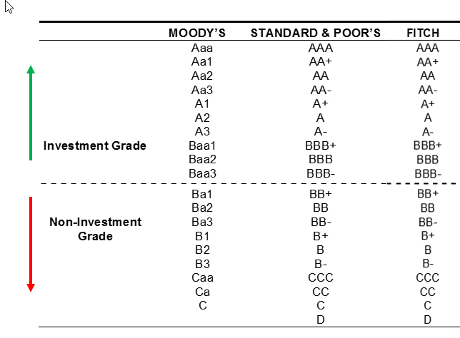

## Table of Contents

## What is a bond rating agency?

A bond rating agency is a company that looks at bonds and decides how safe they are for people to invest in. They give each bond a grade, kind of like how teachers give grades to students. A high grade means the bond is very safe, and a low grade means it's riskier. The three biggest bond rating agencies are Standard & Poor's, Moody's, and Fitch.

These agencies help investors by giving them information about how likely it is that they will get their money back. They look at things like how much money the company or government that issued the bond has, and whether they have paid back bonds on time before. This helps people decide if they want to buy a bond or not. If a bond gets a low rating, it might be harder for the issuer to sell it, and they might have to offer a higher interest rate to attract buyers.

## Why is trust important in bond rating agencies?

Trust is really important for bond rating agencies because people use their ratings to make big decisions about where to put their money. If people don't trust the ratings, they might not believe the grades given to bonds. This could make it hard for the agencies to do their job well. Investors need to feel sure that the ratings are honest and accurate so they can choose safe investments.

When people trust bond rating agencies, it helps the whole money market work better. Companies and governments can sell bonds more easily because investors trust the ratings and feel safe buying them. If trust goes away, it can cause big problems. For example, if a bond rating agency gives a high grade to a bond that turns out to be risky, people might lose money and then stop trusting the agency. This can make it harder for everyone to borrow and lend money.

## How do bond rating agencies assess the creditworthiness of bonds?

Bond rating agencies look at many things to figure out if a bond is safe to invest in. They check how much money the company or government that issued the bond has, and if they have been good at paying back money they borrowed before. They also look at the overall economy and see if it's doing well or not. This helps them understand if the issuer might have trouble paying back the bond in the future. They might also talk to the people who work at the company or government to get more information.

After gathering all this information, the agencies give the bond a grade. A high grade means the bond is very safe, and a low grade means it's riskier. They use letters like AAA, AA, A, BBB, and so on to show the grade. The agencies try to be fair and honest so that investors can trust their ratings. If a bond gets a good grade, more people might want to buy it, but if it gets a bad grade, the issuer might have to offer a higher [interest rate](/wiki/interest-rate-trading-strategies) to attract buyers.

## What are the main bond rating agencies and how do they differ?

The three main bond rating agencies are Standard & Poor's (S&P), Moody's, and Fitch. They all look at bonds and give them grades to show how safe they are for investors. S&P uses letters like AAA, AA, A, BBB, and so on. AAA is the best and means the bond is very safe. Moody's uses a different system with letters and numbers, like Aaa, Aa, A, Baa, and so on. Aaa is the best for Moody's. Fitch's system is similar to S&P's, using letters like AAA, AA, A, BBB, and so on.

Even though they all rate bonds, these agencies can sometimes give different grades to the same bond. This happens because they might look at different things or weigh the information differently. For example, one agency might think a company's future looks bright, while another might be worried about its debts. Investors often look at ratings from more than one agency to get a better idea of a bond's safety.

## What are the common rating scales used by bond rating agencies?

The three main bond rating agencies, Standard & Poor's (S&P), Moody's, and Fitch, use different scales to rate bonds, but they all have similar ideas. S&P and Fitch use letters like AAA, AA, A, BBB, and so on. AAA is the best and means the bond is very safe. As the letters go down, the bond gets riskier. For example, a bond rated BB or lower is considered junk, which means it's very risky. Moody's uses a different system with letters and numbers, like Aaa, Aa, A, Baa, and so on. Aaa is the best for Moody's, and just like with S&P and Fitch, the ratings get riskier as they go down the scale.

Even though the scales are different, they all try to tell investors how safe a bond is. A high rating means the bond is likely to pay back the money on time, while a low rating means it's more likely to have problems. Sometimes, the agencies might give different ratings to the same bond because they look at different things or weigh the information differently. Investors often check ratings from more than one agency to get a better idea of how safe a bond really is.

## How can investors evaluate the accuracy of bond ratings?

Investors can evaluate the accuracy of bond ratings by looking at the history of the ratings given by the agencies. They can check if the bonds that got high ratings in the past actually paid back the money on time, and if the bonds with low ratings had problems. This helps them see if the ratings were good predictions. Investors can also look at how often the ratings change. If a bond's rating goes from high to low quickly, it might mean the agency didn't see the risks clearly at first.

Another way to evaluate the accuracy is by comparing ratings from different agencies. If S&P, Moody's, and Fitch give very different ratings to the same bond, it might mean that the agencies are not agreeing on how safe the bond is. This can make investors think more carefully about which agency's ratings they trust more. Also, investors can read reports and news about the bond issuers to see if there are any new risks or changes that the rating agencies might have missed. By doing all these things, investors can get a better idea of how accurate the bond ratings are.

## What are the potential conflicts of interest for bond rating agencies?

Bond rating agencies can have conflicts of interest because they get paid by the same companies or governments whose bonds they rate. This can make it hard for them to be fair. If they give a low rating to a bond, the issuer might not want to use their services again. This can push the agencies to give higher ratings than they should, just to keep their clients happy and keep getting paid.

Another problem is that bond rating agencies also offer other services to the issuers, like advice on how to make their bonds look better. This can make it even harder for them to be honest in their ratings. If they give a bad rating, it might hurt their other business with that client. So, they might be tempted to give a better rating to keep their other business going strong.

## How have regulatory changes affected the trust in bond rating agencies?

Regulatory changes have tried to make bond rating agencies more trustworthy. After the 2008 financial crisis, people saw that some ratings were not accurate. This made them lose trust in the agencies. So, governments made new rules to fix this. In the United States, the Dodd-Frank Act was passed to make sure the agencies are more honest and clear about how they rate bonds. The rules say the agencies must explain their ratings better and be more open about any conflicts of interest. This helps investors know if they can trust the ratings.

Even with these new rules, some people still worry about bond rating agencies. They think the agencies might still be too close to the companies they rate because they get paid by them. This can make it hard for the agencies to be completely fair. But the new rules have helped a bit. They have made the agencies more careful about how they rate bonds and more open about their work. This has slowly helped to rebuild some trust, though it's still important for investors to be careful and look at ratings from different agencies.

## What methodologies do bond rating agencies use to maintain transparency?

Bond rating agencies use clear methods to make sure people can see how they rate bonds. They write detailed reports that explain why a bond got a certain grade. These reports talk about things like the money the company or government has, how they have paid back money before, and what's happening in the economy. By sharing this information, the agencies help investors understand the reasons behind the ratings. They also have rules that say they need to tell everyone if they change a rating and why they did it. This way, people can keep track of what's going on with the bonds they care about.

Sometimes, bond rating agencies also let people see their rating process. They might put out papers that explain how they look at different things when they rate a bond. This helps investors know that the agencies are being fair and honest. But even with all this, some people still worry that the agencies might not be completely open because they get paid by the companies they rate. So, the agencies keep trying to be more clear and share more information to build trust with investors.

## How do historical rating performance and adjustments impact trust?

When people look at how bond rating agencies have done in the past, it helps them decide if they can trust the ratings now. If an agency gave high ratings to bonds that turned out to be safe, people feel more trust. But if an agency gave high ratings to bonds that later had problems, people might not trust them as much. For example, if a bond was rated AAA but then the company couldn't pay back the money, people would question the agency's judgment. This history of ratings shows investors if the agencies are good at guessing how safe bonds really are.

When bond rating agencies change their ratings a lot, it can also affect trust. If a bond's rating goes from high to low quickly, it might mean the agency didn't see the risks clearly at first. This can make people think the agency isn't doing a good job. On the other hand, if an agency changes its ratings slowly and carefully, people might feel more trust because it shows the agency is taking its time to get things right. So, both the history of ratings and how often they change play a big part in whether people trust bond rating agencies.

## What role do independent audits and reviews play in assessing trust?

Independent audits and reviews help make sure that bond rating agencies are doing their job right. These audits are done by people who don't work for the agencies. They look at how the agencies rate bonds and check if everything is fair and honest. If an audit finds problems, it can help fix them and make the ratings better. This way, investors can feel more sure that the ratings are good and safe to use.

When people see that bond rating agencies are checked by independent auditors, it makes them trust the ratings more. It shows that the agencies are trying to be clear and honest about their work. If an agency gets a good review from an audit, it can help build trust with investors. But if the audit finds big problems, it can make people worry and trust the agency less. So, these audits and reviews are really important for keeping trust in bond rating agencies strong.

## How can advanced statistical models and machine learning enhance the assessment of trust in bond rating agencies?

Advanced statistical models and [machine learning](/wiki/machine-learning) can help make bond rating agencies more trustworthy by looking at a lot of information in a smart way. These tools can find patterns and risks that might be hard for people to see. For example, they can look at many different things about a company or government, like their money, how they've paid back loans before, and what's happening in the economy. By doing this, they can give a more accurate idea of how safe a bond really is. If bond rating agencies use these tools well, they can make better predictions and give ratings that people can trust more.

Also, machine learning can help check if the ratings from bond rating agencies are good. It can look at the history of ratings and see if they were right or not. This helps find out if an agency is good at guessing how safe bonds will be. If machine learning shows that an agency's ratings are usually right, it can make people trust the agency more. On the other hand, if it finds that the ratings are often wrong, it can help people be more careful. So, using these smart tools can make bond rating agencies more honest and clear, which helps build trust with investors.

## References & Further Reading

[1]: Cantor, R., & Packer, F. (1996). ["Determinants and Impact of Sovereign Credit Ratings."](https://www.newyorkfed.org/medialibrary/media/research/epr/96v02n2/9610cant.pdf) Economic Policy Review, Federal Reserve Bank of New York.

[2]: Hull, J. C., Predescu, M., & White, A. (2004). ["The Relationship Between Credit Default Swap Spreads, Bond Yields, and Credit Rating Announcements."](https://www.sciencedirect.com/science/article/pii/S0378426604001098) Journal of Banking & Finance, Elsevier.

[3]: White, L. J. (2010). ["The Credit Rating Agencies."](https://www.aeaweb.org/articles?id=10.1257/jep.24.2.211) Journal of Economic Perspectives.

[4]: Fabozzi, F. J. (2007). ["Fixed Income Analysis."](https://www.amazon.com/Fixed-Income-Analysis-Frank-Fabozzi/dp/047005221X) John Wiley & Sons.

[5]: Treleaven, P., Galas, M., & Vidhi, S. (2013). ["Algorithmic Trading Review."](https://dl.acm.org/doi/10.1145/2500117) Communications of the ACM.