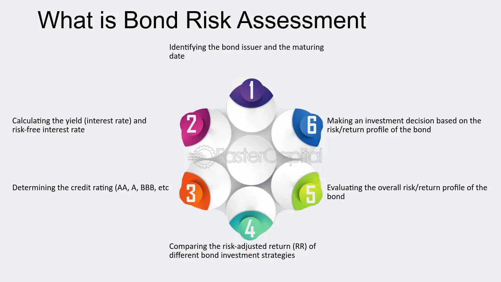

## Table of Contents

## What is a bond fund?

A bond fund is a type of investment fund that pools money from many investors to buy a variety of bonds. Bonds are like loans that investors give to governments or companies, and in return, they receive interest payments over time. By investing in a bond fund, you get to own a small piece of many different bonds, which helps spread out the risk.

Bond funds can be a good choice for people who want a steady income from their investments. They usually pay out interest to investors on a regular basis, like monthly or quarterly. This makes them different from stock funds, which can be more unpredictable. Bond funds can also be less risky than stocks, but they might not grow as much in value over time.

## How do bond funds generate returns for investors?

Bond funds generate returns for investors mainly through interest payments and changes in bond prices. When a bond fund buys bonds, those bonds pay interest regularly, like a coupon. The fund collects this interest and then passes it on to the investors. This is why bond funds are good for people who want a steady income from their investments. The interest payments are usually paid out to investors on a regular schedule, like every month or every three months.

Besides interest, bond funds can also make money if the price of the bonds they own goes up. Bond prices can change based on things like interest rates and how safe people think the bonds are. If the fund sells a bond for more than it paid, that's a profit. But if bond prices go down, the fund might lose money. So, the total return from a bond fund comes from both the interest it earns and any gains or losses from changes in bond prices.

## What are the common types of bond funds?

There are different kinds of bond funds that people can invest in, each with its own special features. One common type is a government bond fund. These funds buy bonds from the government, which are usually seen as very safe because the government is less likely to not pay back the money. Another type is a corporate bond fund, which invests in bonds from companies. These can be riskier than government bonds but might offer higher interest payments.

Another type of bond fund is a municipal bond fund. These funds invest in bonds issued by cities, states, or other local governments. They are popular because the interest they pay is often not taxed by the federal government, and sometimes not by state governments either. There are also high-yield bond funds, sometimes called junk bond funds. These funds buy bonds from companies that might be riskier, so they have to offer higher interest rates to attract investors.

Lastly, there are international bond funds, which invest in bonds from other countries. These can add some variety to an investment portfolio but can also be affected by changes in currency values. Each type of bond fund has its own balance of risk and reward, so investors need to think about what they want and how much risk they're willing to take before choosing one.

## What are the key metrics used to assess bond fund performance?

When people want to know how well a bond fund is doing, they look at a few important numbers. One key metric is the yield, which tells you how much money the fund makes from the interest on its bonds each year. This is important because it shows how much income you might get from the fund. Another metric is the total return, which includes not just the interest but also any changes in the price of the bonds. If the bonds go up in value, the total return will be higher, but if they go down, it will be lower.

Another thing to look at is the duration of the bond fund. Duration measures how sensitive the fund is to changes in interest rates. If interest rates go up, the price of the bonds in the fund might go down, and the longer the duration, the more the price will change. Also, people check the expense ratio, which is how much it costs to run the fund. A lower expense ratio means more of the fund's earnings go to the investors, not to paying for the fund's management.

Lastly, it's good to look at the credit quality of the bonds in the fund. This shows how likely it is that the bonds will be paid back. Bonds with higher credit quality are safer but might offer lower interest rates, while bonds with lower credit quality can be riskier but might pay more interest. By looking at these metrics, investors can get a good idea of how a bond fund is performing and whether it's a good fit for their investment goals.

## How does interest rate risk affect bond fund performance?

Interest rate risk is a big deal for bond funds. When interest rates go up, the prices of the bonds in the fund usually go down. This happens because new bonds that are issued will have higher interest rates, so the older bonds with lower rates become less attractive to buyers. If the bond fund has to sell some of its bonds when prices are low, it could lose money. This means that the value of the bond fund might drop, and investors might see their investments go down in value.

The opposite can also happen. When interest rates go down, the prices of the bonds in the fund usually go up. This is because the older bonds with higher interest rates become more valuable compared to new bonds with lower rates. If the bond fund can sell its bonds at higher prices, it could make a profit. But, the interest payments the fund gets from its bonds might be lower than what new bonds are offering. So, [interest rate](/wiki/interest-rate-trading-strategies) changes can really affect how well a bond fund does, making it important for investors to think about this risk when choosing where to put their money.

## What is credit risk and how does it impact bond funds?

Credit risk is the chance that the people or companies who borrowed money by issuing bonds won't be able to pay it back. For bond funds, this risk is important because if a bond in the fund defaults, it means the fund won't get the money it was expecting. This can make the value of the bond fund go down, and investors might lose money. Bond funds with a lot of high-risk bonds, often called junk bonds, have a higher credit risk but they might offer higher interest payments to make up for it.

The impact of credit risk on bond funds can be big. If a lot of bonds in the fund start having trouble, the fund's performance can suffer a lot. That's why it's important for bond funds to keep an eye on the credit quality of the bonds they own. Funds that focus on safer bonds, like those from the government or big, stable companies, usually have less credit risk. But they might also offer lower interest payments. So, when choosing a bond fund, investors need to think about how much credit risk they're okay with and balance that with the potential rewards.

## How can duration be used to measure the sensitivity of a bond fund to interest rate changes?

Duration is a way to measure how much a bond fund's value might change when interest rates go up or down. It tells you how sensitive the fund is to these changes. If a bond fund has a high duration, it means its value will change a lot if interest rates move. For example, if the duration is 5 years, a 1% increase in interest rates might make the fund's value drop by about 5%. On the other hand, if the duration is low, the fund's value won't change as much when interest rates change.

This is important for investors because it helps them understand how much risk they're taking with their money. If you think interest rates might go up, you might want to pick a bond fund with a shorter duration to protect your investment. But if you think rates will stay the same or go down, a fund with a longer duration could be good because it might give you bigger gains if the bond prices go up. So, looking at the duration can help you make smarter choices about which bond funds to invest in.

## What role does yield to maturity play in evaluating bond fund performance?

Yield to maturity (YTM) is a useful number that helps people understand how much money they might make from a bond fund if they keep it until all the bonds inside it pay back their money. It's like an average of the interest rates of all the bonds in the fund, taking into account how long you have to wait for the money and any changes in the bond prices. If the YTM is high, it means the bond fund could give you more money over time, but it also might be riskier.

When looking at a bond fund, YTM helps you see how it stacks up against other funds or other kinds of investments. It gives you a way to compare them by showing the total return you might get if you hold onto the fund until the end. But remember, YTM is just a guess based on what we know now, so things like changes in interest rates or if a bond doesn't pay back can make the real return different from what YTM says.

## How do you calculate and interpret the Sharpe ratio for bond funds?

The Sharpe ratio is a way to see how well a bond fund is doing compared to how risky it is. To calculate it, you take the fund's average return and subtract the risk-free rate, which is like the return you'd get from a super safe investment like a government bond. Then, you divide that number by the fund's standard deviation, which is a measure of how much the fund's returns go up and down. A higher Sharpe ratio means the fund is doing a good job of giving you more return for the risk you're taking.

When you look at the Sharpe ratio for a bond fund, a number above 1 is usually seen as good. It means the fund is giving you a nice return for the risk you're taking. If the Sharpe ratio is less than 1, it might mean the fund isn't doing as well as it could for the amount of risk involved. But remember, the Sharpe ratio is just one tool, and you should look at other things like the fund's total return and how it fits with your investment goals before deciding if it's right for you.

## What advanced statistical measures can be used to assess the risk-adjusted performance of bond funds?

Besides the Sharpe ratio, there are other advanced statistical measures that can help you understand how well a bond fund is doing when you think about the risk involved. One of these is the Sortino ratio. It's a bit like the Sharpe ratio, but it only looks at the bad risk, or the times when the fund's returns are lower than what you expect. The Sortino ratio helps you see if a fund is good at avoiding big losses, which is important for bond funds because they're often used for steady income.

Another measure is the Treynor ratio. This one looks at how much return a fund gives you for each unit of market risk it takes on. It uses something called beta, which shows how much the fund's returns move with the market. The Treynor ratio is useful if you want to know how well a bond fund is doing compared to the overall market, especially if you're thinking about how it fits into your whole investment plan. Both the Sortino and Treynor ratios give you different ways to see if a bond fund is worth the risk you're taking.

## How do macroeconomic factors influence bond fund performance and risk?

Macroeconomic factors like interest rates, inflation, and economic growth can really change how well a bond fund does and how risky it is. When interest rates go up, the prices of the bonds in the fund usually go down. This is because new bonds will have higher interest rates, making the old bonds less attractive. If the bond fund has to sell its bonds when prices are low, it could lose money. Also, if inflation goes up, the value of the money the bond fund gets from interest payments goes down, which can hurt the fund's performance. Economic growth can also affect bond funds. If the economy is doing well, companies might be able to pay back their bonds easier, but if the economy is struggling, there's a bigger chance that companies won't be able to pay back their loans.

Another important factor is the overall health of the economy. If people think the economy might go into a recession, they might want to buy safer investments like government bonds, which can make the prices of those bonds go up. But if everyone thinks the economy will keep growing, they might move their money to riskier investments like stocks, which can make bond prices go down. Changes in government policies, like new laws about taxes or spending, can also affect bond funds. For example, if the government decides to spend a lot more money, it might need to borrow more by issuing new bonds, which can change the supply and demand for bonds and affect their prices. So, keeping an eye on these big economic factors can help you understand what might happen to your bond fund.

## What are the best practices for constructing a diversified bond fund portfolio to optimize risk and return?

To build a good bond fund portfolio that balances risk and return, you need to spread your money across different types of bonds. This means buying government bonds, which are usually safe, and also corporate bonds, which can be riskier but offer higher interest. You might also want to include municipal bonds for their tax benefits and international bonds to add variety. By mixing these different kinds of bonds, you can lower the chance that all your investments will go down at the same time. It's also smart to look at bonds with different lengths of time until they pay back the money, or maturities. Short-term bonds are less affected by interest rate changes, while long-term bonds might give you higher returns but are riskier.

Another important thing is to check the credit quality of the bonds in your portfolio. You want a mix of high-quality bonds, which are safer, and some lower-quality bonds, which might pay more interest but are riskier. This way, you can get a good balance between safety and the chance to make more money. It's also a good idea to keep an eye on the overall economic situation and adjust your portfolio as things change. For example, if you think interest rates will go up, you might want to have more short-term bonds. And always think about how much risk you're okay with and how much return you need to meet your goals. By doing all these things, you can build a bond fund portfolio that works well for you.

## What are the financial risks associated with bond funds?

Bond funds present a variety of financial risks that investors need to consider for informed decision-making. Understanding these risks is essential for optimizing investment strategies.

Interest rate risk is one of the primary concerns. It arises because bond values inversely react to changes in interest rates; as rates rise, existing bond prices typically fall, and vice versa. This relationship can be mathematically described by the formula:

$$
\Delta P = -D \times \frac{\Delta y}{1+y}
$$

where $\Delta P$ is the change in the bond's price, $D$ is the bond's duration, $\Delta y$ is the change in yield, and $y$ is the current yield. Investors must be aware that long-duration bonds are more sensitive to interest rate changes.

Credit risk involves the possibility that a bond issuer may default on its obligations, leading to a loss in value. An issuer's credit rating is a vital metric for assessing this risk. Higher-risk (lower-rated) bonds usually offer higher yields to compensate investors for taking on additional risk. 

Foreign exchange risk is relevant if bond funds invest in international bonds. It concerns the potential for loss due to currency fluctuations. For instance, if an investor holds a bond denominated in a foreign currency and that currency depreciates against the investor's home currency, the bond's returns in the home currency might decline, affecting overall yields.

Market [liquidity](/wiki/liquidity-risk-premium) is another [factor](/wiki/factor-investing) influencing bond fund [volatility](/wiki/volatility-trading-strategies) and stability. Bonds, particularly those from smaller issuers or with lower credit ratings, may not always have an active market. In times of financial stress, liquidity can diminish, making it difficult for funds to sell bonds without impacting prices adversely.

Investors should conduct comprehensive analyses of these risks and aim for a diversified bond portfolio. Diversification can be achieved by mixing different types of bonds, such as government bonds, corporate bonds, and international bonds, to mitigate the impact of any single risk factor. An effective risk management strategy is crucial for achieving a balanced and resilient investment portfolio.

## How can one evaluate investment performance in bond funds?

Evaluating the performance of bond funds is crucial for investors aiming to maximize returns and minimize risks. This evaluation revolves around understanding both historical results and expected future behavior of the fund.

Yield to maturity (YTM) is a primary metric for evaluating the expected annualized returns of bond funds. YTM accounts for the total return anticipated on a bond if it is held until maturity, basing calculations on the bond's current market price, coupon income, and its time to maturity. This measure provides a more comprehensive insight beyond mere historical return data, as illustrated by the formula:

$$
YTM = \frac{C + \frac{F - P}{n}}{\frac{F + P}{2}}
$$

where:
- $C$ is the annual coupon payment,
- $F$ is the face value of the bond,
- $P$ is the current price of the bond,
- $n$ is the years to maturity. 

Investors should also consider the composition of assets within a bond fund, which typically includes government bonds, corporate bonds, and inflation-protected securities. Each type of bond offers a distinct risk-return profile and sensitivity to economic changes. Government bonds generally offer lower yields but higher security, whereas corporate bonds provide higher yields at greater risk. Inflation-protected securities, like Treasury Inflation-Protected Securities (TIPS), adjust the principal with inflation and thus safeguard purchasing power, which is particularly advantageous in inflationary environments.

The performance of a bond fund is more discernible when compared against established benchmarks such as the Bloomberg U.S. Aggregate Bond Index. This index tracks a broad spectrum of investment-grade U.S. fixed-income securities and acts as a standard for gauging a fund's performance against the market.

Furthermore, an in-depth analysis of associated costs is imperative. These costs, which include management fees and trading expenses, directly diminish net returns. A fund that consistently underperforms its benchmark after costs is less attractive to investors.

In summary, a thorough evaluation of bond fund performance involves the intricate analysis of yield to maturity, methodical asset composition assessment, comparison with benchmark indices, and scrutiny of related costs. Through this multidimensional approach, investors can gain critical insights into the likely future performance of their bond fund investments.

## What is the conclusion?

The synergy between financial risk assessment, bond fund performance evaluation, and [algorithmic trading](/wiki/algorithmic-trading) provides a robust framework for contemporary investment strategies. Investors can enhance their portfolio performance by strategically allocating bonds and leveraging advanced algo-trading techniques. These methods allow investors to confidently navigate complex market environments, optimizing returns while effectively mitigating risks.

As financial markets continue to evolve, the adoption and integration of technologies such as [artificial intelligence](/wiki/ai-artificial-intelligence) (AI) and [machine learning](/wiki/machine-learning) are crucial in shaping future investment strategies. AI and machine learning provide powerful tools for analyzing vast datasets and identifying patterns that human analysts might overlook, leading to more informed decision-making.

For example, AI-driven models can improve credit risk assessment by analyzing historical data, macroeconomic indicators, and company fundamentals to provide a more accurate evaluation of a bond issuer's creditworthiness. This can be represented mathematically as follows:

$$
\text{Credit Risk Score} = f(X_1, X_2, \ldots, X_n)
$$

where $X_1, X_2, \ldots, X_n$ represent various quantifiable factors such as debt ratios, revenue growth, etc.

Moreover, machine learning algorithms can be employed to recognize trading patterns and optimize trading strategies in real-time, adjusting positions dynamically based on market conditions. This adaptability is vital in a rapidly changing economic landscape.

Python code, an example of which follows, can be utilized to implement machine learning strategies:

```python
from sklearn.ensemble import RandomForestClassifier
from sklearn.metrics import accuracy_score

# Sample data for features (X) and target variable (y)
X_train, X_test, y_train, y_test = train_test_split(features, target, test_size=0.2, random_state=42)

# Initialize and train the model
model = RandomForestClassifier(n_estimators=100, random_state=42)
model.fit(X_train, y_train)

# Predict and evaluate the model
predictions = model.predict(X_test)
accuracy = accuracy_score(y_test, predictions)

print(f'Model Accuracy: {accuracy * 100:.2f}%')
```

By remaining informed and adaptable, investors can harness these technological advancements to meet their financial objectives more effectively. The continuous innovations in AI and machine learning suggest that those who integrate these technologies proactively will likely enjoy competitive advantages in portfolio management. Through these concerted efforts, investors can expect to achieve goals aligned with both return maximization and risk reduction.

## References & Further Reading

[1]: ["Advances in Financial Machine Learning"](https://www.amazon.com/Advances-Financial-Machine-Learning-Marcos/dp/1119482089) by Marcos Lopez de Prado

[2]: ["Machine Learning for Algorithmic Trading"](https://github.com/stefan-jansen/machine-learning-for-trading) by Stefan Jansen

[3]: ["Quantitative Trading: How to Build Your Own Algorithmic Trading Business"](https://www.amazon.com/Quantitative-Trading-Build-Algorithmic-Business/dp/1119800064) by Ernest P. Chan

[4]: ["Fixed Income Securities: Tools for Today’s Markets"](https://www.amazon.com/Fixed-Income-Securities-Markets-Finance/dp/1119835550) by Bruce Tuckman and Angel Serrat

[5]: Ehlers, J. F. (2001). ["Rocket Science for Traders"](https://archive.org/details/rocketsciencefor0000ehle). Wiley & Sons.

[6]: ["Bond Markets, Analysis, and Strategies"](https://mitpress.mit.edu/9780262046275/bond-markets-analysis-and-strategies/) by Frank J. Fabozzi

[7]: Chincarini, Ludwig B. and Kim, Daehwan. ["Quantitative Equity Portfolio Management: An Active Approach to Portfolio Construction and Management"](https://www.amazon.com/Quantitative-Equity-Portfolio-Management-Construction/dp/0071459391). McGraw-Hill. 

[8]: ["The Handbook of Fixed Income Securities"](https://www.amazon.com/Handbook-Fixed-Income-Securities-Eighth/dp/0071768467) by Frank J. Fabozzi

[9]: ["Algorithmic and High-Frequency Trading"](https://www.amazon.com/Algorithmic-High-Frequency-Trading-Mathematics-Finance/dp/1107091144) by Álvaro Cartea, Sebastian Jaimungal, and José Penalva

[10]: ["Evidence-Based Technical Analysis: Applying the Scientific Method and Statistical Inference to Trading Signals"](https://www.amazon.com/Evidence-Based-Technical-Analysis-Scientific-Statistical/dp/0470008741) by David Aronson