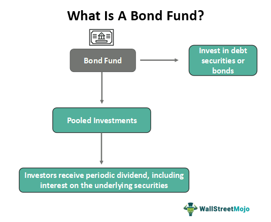

In the field of investments, understanding financial risk, bond funds, and investment performance is essential. Algorithmic trading has become an important tool for optimizing financial portfolios. This article explores the relationship between these elements, looking at their roles and impacts on financial strategies. We will examine the risks associated with bonds, evaluate bond fund performance, and assess how algorithmic trading can improve investment decision-making. The purpose of this discussion is to equip investors with information that will enable them to make strategic decisions aligned with their financial goals. By grasping the complex dynamics between financial risk, bond fund performance, and algorithmic trading, investors can develop more informed and successful investment strategies.

## Table of Contents



## Understanding Financial Risks in Bond Funds

Bond funds present a variety of financial risks that investors need to consider for informed decision-making. Understanding these risks is essential for optimizing investment strategies.

Interest rate risk is one of the primary concerns. It arises because bond values inversely react to changes in interest rates; as rates rise, existing bond prices typically fall, and vice versa. This relationship can be mathematically described by the formula:

$$
\Delta P = -D \times \frac{\Delta y}{1+y}
$$

where $\Delta P$ is the change in the bond's price, $D$ is the bond's duration, $\Delta y$ is the change in yield, and $y$ is the current yield. Investors must be aware that long-duration bonds are more sensitive to interest rate changes.

Credit risk involves the possibility that a bond issuer may default on its obligations, leading to a loss in value. An issuer's credit rating is a vital metric for assessing this risk. Higher-risk (lower-rated) bonds usually offer higher yields to compensate investors for taking on additional risk. 

Foreign exchange risk is relevant if bond funds invest in international bonds. It concerns the potential for loss due to currency fluctuations. For instance, if an investor holds a bond denominated in a foreign currency and that currency depreciates against the investor's home currency, the bond's returns in the home currency might decline, affecting overall yields.

Market [liquidity](/wiki/liquidity-risk-premium) is another [factor](/wiki/factor-investing) influencing bond fund [volatility](/wiki/volatility-trading-strategies) and stability. Bonds, particularly those from smaller issuers or with lower credit ratings, may not always have an active market. In times of financial stress, liquidity can diminish, making it difficult for funds to sell bonds without impacting prices adversely.

Investors should conduct comprehensive analyses of these risks and aim for a diversified bond portfolio. Diversification can be achieved by mixing different types of bonds, such as government bonds, corporate bonds, and international bonds, to mitigate the impact of any single risk factor. An effective risk management strategy is crucial for achieving a balanced and resilient investment portfolio.

## Evaluating Investment Performance in Bond Funds

Evaluating the performance of bond funds is crucial for investors aiming to maximize returns and minimize risks. This evaluation revolves around understanding both historical results and expected future behavior of the fund.

Yield to maturity (YTM) is a primary metric for evaluating the expected annualized returns of bond funds. YTM accounts for the total return anticipated on a bond if it is held until maturity, basing calculations on the bond's current market price, coupon income, and its time to maturity. This measure provides a more comprehensive insight beyond mere historical return data, as illustrated by the formula:

$$
YTM = \frac{C + \frac{F - P}{n}}{\frac{F + P}{2}}
$$

where:
- $C$ is the annual coupon payment,
- $F$ is the face value of the bond,
- $P$ is the current price of the bond,
- $n$ is the years to maturity. 

Investors should also consider the composition of assets within a bond fund, which typically includes government bonds, corporate bonds, and inflation-protected securities. Each type of bond offers a distinct risk-return profile and sensitivity to economic changes. Government bonds generally offer lower yields but higher security, whereas corporate bonds provide higher yields at greater risk. Inflation-protected securities, like Treasury Inflation-Protected Securities (TIPS), adjust the principal with inflation and thus safeguard purchasing power, which is particularly advantageous in inflationary environments.

The performance of a bond fund is more discernible when compared against established benchmarks such as the Bloomberg U.S. Aggregate Bond Index. This index tracks a broad spectrum of investment-grade U.S. fixed-income securities and acts as a standard for gauging a fund's performance against the market.

Furthermore, an in-depth analysis of associated costs is imperative. These costs, which include management fees and trading expenses, directly diminish net returns. A fund that consistently underperforms its benchmark after costs is less attractive to investors.

In summary, a thorough evaluation of bond fund performance involves the intricate analysis of yield to maturity, methodical asset composition assessment, comparison with benchmark indices, and scrutiny of related costs. Through this multidimensional approach, investors can gain critical insights into the likely future performance of their bond fund investments.

## Algorithmic Trading: Optimizing Bond Funds' Investment Strategies

Algorithmic trading employs sophisticated computer algorithms to execute trades based on predetermined strategies. This approach significantly enhances the precision and efficiency of trading in bond markets. The algorithms are adept at analyzing vast datasets and identifying market trends at speeds unattainable by human traders. This capability allows for the optimization of buy and sell decisions, ensuring that trades are executed at the most opportune times.

A key advantage of [algorithmic trading](/wiki/algorithmic-trading) is its ability to minimize human cognitive biases that often influence trading decisions. By relying on data-driven insights, algorithmic trading promotes more rational investment decisions. This is particularly beneficial in bond markets, where slight shifts in interest rates or credit ratings can have substantial impacts on bond values.

An essential component of algorithmic trading is the [backtesting](/wiki/backtesting) of strategies. Backtesting allows investors to test their trading algorithms against historical data. By evaluating how strategies would have performed in the past, traders can refine their algorithms to improve future performance. This iterative process is crucial for developing reliable and effective trading models.

Technological advancements play a pivotal role in the successful implementation of algorithmic trading. High-speed internet and powerful computational tools are fundamental for processing large datasets and executing trades rapidly. Additionally, developments in [machine learning](/wiki/machine-learning) and [artificial intelligence](/wiki/ai-artificial-intelligence) continue to enhance the analytical capabilities of trading algorithms, allowing for the incorporation of increasingly complex data patterns and predictive models.

In this rapidly evolving landscape, the integration of these technologies supports more sophisticated and informed investment strategies in bond markets. The ongoing advancements in computational power and data analytics promise to further refine algorithmic trading, making it an indispensable tool for optimizing bond fund investments.

## Case Studies: Successful Bond Investment Strategies

Real-world applications of bond investment strategies illuminate the practical advantages of incorporating algorithmic trading and proficient market timing. A notable case is the use of economic indicators to predict [interest rate](/wiki/interest-rate-trading-strategies) fluctuations, thereby enabling strategic acquisition of bonds and enhanced investment returns. For instance, when predictive models accurately identify upcoming changes in central bank policies or inflation expectations, traders can preemptively adjust their bond portfolios to mitigate risks or seize potential opportunities.

Consider a scenario where a fund employs a model forecasting a rise in interest rates. Given the inverse relationship between bond prices and interest rates, the fund could strategically offload longer-duration bonds to minimize depreciation in bond value. Conversely, if a model suggests declining rates, increasing holdings of long-term bonds could capitalize on the resulting price increases.

Algorithmic trading has propelled hedge funds and large financial institutions to exploit market inefficiencies and shifts in [momentum](/wiki/momentum). These automated systems, by processing vast datasets at high speeds, can identify [arbitrage](/wiki/arbitrage) opportunities and react to them faster than human traders. For example, during periods of economic instability, bonds from certain sectors may be undervalued due to market irrationality. Algorithms designed to detect such discrepancies can execute swift trades, thus achieving superior returns.

A pertinent example is the implementation of factor-based strategies, which involve trading based on systematic patterns such as value, momentum, or [carry](/wiki/carry-trading). Using Python, a momentum strategy on bond ETFs could be coded as follows:

```python
import yfinance as yf  # For more datasets, visit: https://paperswithbacktest.com/datasets
import numpy as np

def calculate_momentum(ticker):
    data = yf.download(ticker, period="1y", interval="1d")['Close']
    momentum = np.log(data).diff().rolling(window=60).sum()
    return momentum

bond_etfs = ['BND', 'TLT', 'LQD']
for etf in bond_etfs:
    mom = calculate_momentum(etf)
    decision = "Buy" if mom.iloc[-1] > 0 else "Sell"
    print(f"{etf}: {decision}")
```

This Python script calculates the momentum of selected bond ETFs over a 60-day window and makes buy or sell recommendations based on the momentum sign.

The success of these strategies underscores the necessity of robust analytical tools and adaptive strategies to navigate evolving economic environments and regulatory frameworks. For example, backtesting platforms and machine learning models enhance strategy development by simulating various market conditions, refining algorithms for improved performance. These methods, when leveraged effectively, cater to regulatory requirements while capitalizing on market trends.

Such case studies illustrate the transformative power of algorithmic trading in revamping traditional approaches to bond investments, favoring data-driven and agile strategies over conventional methods. As a result, investment firms that prioritize these methodologies exhibit a competitive edge, maintaining resilience and achieving consistent returns in dynamic market landscapes.

## The Future of Bonds Investment with Algo Trading

As technology evolves, the landscape of bond investments is being increasingly shaped by algorithmic trading, which stands at the cutting edge of innovation. Algorithmic trading employs advanced computer systems to execute trades at speeds unattainable by human traders, relying on precise mathematical models and vast amounts of data to drive decision-making processes. This evolution is seeing several key technological trends poised to enhance the transparency and efficiency of bond trading.

One significant trend is the integration of big data analytics. By processing extensive datasets generated during trading, big data analytics enables the extraction of actionable insights, identifying patterns and trends that influence bond market dynamics. This capability provides traders with a comprehensive understanding of market conditions, enhancing strategic decision-making and risk management.

AI integration further revolutionizes bond trading by offering improved accuracy in credit risk assessments and optimizing decision-making in real-time. Machine learning algorithms analyze historical trading data and financial indicators to predict future price movements and assess risk levels. These AI-driven strategies reduce uncertainties associated with bond investments, allowing investors to make more informed choices.

Blockchain technology is another pivotal advancement influencing bond trading. By providing a decentralized ledger, blockchain enhances transparency and security in trading operations. This technology ensures the authenticity and integrity of transactions, reducing the likelihood of fraud and enhancing investor confidence. Moreover, blockchain's immutable nature offers a reliable record of trading activities, facilitating regulatory compliance and audits.

Regulatory changes are expected to reinforce market integrity and transparency within algorithmic trading processes, establishing safeguards for investors. Regulatory bodies worldwide continually address the implications of technology on trading practices. By setting standards for transparency and accountability, these changes aim to protect investors while fostering a fair and efficient trading environment.

Incorporating these technological advances promises exciting prospects for bond investments. The integration of big data, AI, and blockchain technology in bond trading leads to more informed and sophisticated investment strategies. Investors benefit from enhanced transparency, improved risk assessment models, and optimized trading executions. The synergy between these technologies and algorithmic trading creates opportunities for maximizing returns while mitigating potential risks.

The future of bond investment with algorithmic trading represents a frontier of innovation, transforming traditional approaches and offering tools that empower investors to navigate the complexities of the bond market. As these technologies continue to mature and regulatory frameworks develop, investors must remain informed and adaptable, leveraging advancements to achieve their financial objectives more effectively.

## Conclusion

The synergy between financial risk assessment, bond fund performance evaluation, and algorithmic trading provides a robust framework for contemporary investment strategies. Investors can enhance their portfolio performance by strategically allocating bonds and leveraging advanced algo-trading techniques. These methods allow investors to confidently navigate complex market environments, optimizing returns while effectively mitigating risks.

As financial markets continue to evolve, the adoption and integration of technologies such as artificial intelligence (AI) and machine learning are crucial in shaping future investment strategies. AI and machine learning provide powerful tools for analyzing vast datasets and identifying patterns that human analysts might overlook, leading to more informed decision-making.

For example, AI-driven models can improve credit risk assessment by analyzing historical data, macroeconomic indicators, and company fundamentals to provide a more accurate evaluation of a bond issuer's creditworthiness. This can be represented mathematically as follows:

$$
\text{Credit Risk Score} = f(X_1, X_2, \ldots, X_n)
$$

where $X_1, X_2, \ldots, X_n$ represent various quantifiable factors such as debt ratios, revenue growth, etc.

Moreover, machine learning algorithms can be employed to recognize trading patterns and optimize trading strategies in real-time, adjusting positions dynamically based on market conditions. This adaptability is vital in a rapidly changing economic landscape.

Python code, an example of which follows, can be utilized to implement machine learning strategies:

```python
from sklearn.ensemble import RandomForestClassifier
from sklearn.metrics import accuracy_score

# Sample data for features (X) and target variable (y)
X_train, X_test, y_train, y_test = train_test_split(features, target, test_size=0.2, random_state=42)

# Initialize and train the model
model = RandomForestClassifier(n_estimators=100, random_state=42)
model.fit(X_train, y_train)

# Predict and evaluate the model
predictions = model.predict(X_test)
accuracy = accuracy_score(y_test, predictions)

print(f'Model Accuracy: {accuracy * 100:.2f}%')
```

By remaining informed and adaptable, investors can harness these technological advancements to meet their financial objectives more effectively. The continuous innovations in AI and machine learning suggest that those who integrate these technologies proactively will likely enjoy competitive advantages in portfolio management. Through these concerted efforts, investors can expect to achieve goals aligned with both return maximization and risk reduction.

## References & Further Reading

[1]: ["Advances in Financial Machine Learning"](https://www.amazon.com/Advances-Financial-Machine-Learning-Marcos/dp/1119482089) by Marcos Lopez de Prado

[2]: ["Machine Learning for Algorithmic Trading"](https://github.com/stefan-jansen/machine-learning-for-trading) by Stefan Jansen

[3]: ["Quantitative Trading: How to Build Your Own Algorithmic Trading Business"](https://www.amazon.com/Quantitative-Trading-Build-Algorithmic-Business/dp/1119800064) by Ernest P. Chan

[4]: ["Fixed Income Securities: Tools for Today’s Markets"](https://www.amazon.com/Fixed-Income-Securities-Markets-Finance/dp/1119835550) by Bruce Tuckman and Angel Serrat

[5]: Ehlers, J. F. (2001). ["Rocket Science for Traders"](https://archive.org/details/rocketsciencefor0000ehle). Wiley & Sons.

[6]: ["Bond Markets, Analysis, and Strategies"](https://mitpress.mit.edu/9780262046275/bond-markets-analysis-and-strategies/) by Frank J. Fabozzi

[7]: Chincarini, Ludwig B. and Kim, Daehwan. ["Quantitative Equity Portfolio Management: An Active Approach to Portfolio Construction and Management"](https://www.amazon.com/Quantitative-Equity-Portfolio-Management-Construction/dp/0071459391). McGraw-Hill. 

[8]: ["The Handbook of Fixed Income Securities"](https://www.amazon.com/Handbook-Fixed-Income-Securities-Eighth/dp/0071768467) by Frank J. Fabozzi

[9]: ["Algorithmic and High-Frequency Trading"](https://www.amazon.com/Algorithmic-High-Frequency-Trading-Mathematics-Finance/dp/1107091144) by Álvaro Cartea, Sebastian Jaimungal, and José Penalva

[10]: ["Evidence-Based Technical Analysis: Applying the Scientific Method and Statistical Inference to Trading Signals"](https://www.amazon.com/Evidence-Based-Technical-Analysis-Scientific-Statistical/dp/0470008741) by David Aronson