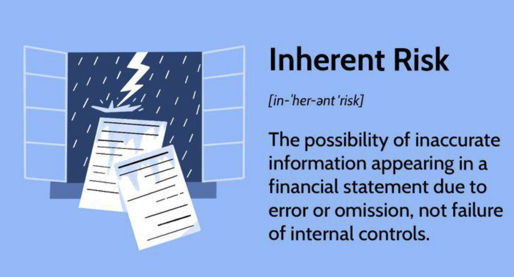

## Table of Contents

## What is inherent risk in the context of auditing?

Inherent risk in auditing refers to the risk that a company's financial statements might have material misstatements or errors before considering any internal controls. This means that even if a company has good checks and balances in place, there could still be mistakes in their financial reports just because of the nature of their business or industry. For example, a tech startup might have a higher inherent risk because their business is new and fast-changing, making it harder to accurately predict and report financial outcomes.

Auditors need to assess this inherent risk to plan their audit effectively. They look at factors like the complexity of the company's transactions, the level of judgment required in financial reporting, and any changes in the industry or economy that could affect the company. By understanding the inherent risk, auditors can focus their efforts on the areas of the financial statements that are most likely to have errors, helping them to provide a more accurate audit opinion.

## How do auditors identify inherent risk during an audit?

Auditors identify inherent risk by looking closely at the company and its business. They start by understanding what the company does, how it makes money, and what kind of industry it's in. For example, if a company deals with a lot of cash or complex financial products, there might be a higher chance of errors in their financial statements. Auditors also consider if the company is new or going through big changes, because these situations can make financial reporting trickier.

Next, auditors think about the specific parts of the financial statements that might be more prone to mistakes. They look at areas where the company has to make guesses or use estimates, like how much their inventory is worth or how long their customers will take to pay their bills. If a company has to make a lot of these guesses, the inherent risk goes up. By putting all this information together, auditors can figure out where they need to focus their attention to make sure the financial statements are correct.

## What are the common factors that contribute to inherent risk?

Inherent risk can come from many places, but some common factors make it more likely. One big [factor](/wiki/factor-investing) is the nature of the company's business. For example, if a company deals with a lot of cash or complex financial products like derivatives, there's a higher chance of errors in their financial statements. Also, if the company is in an industry that changes quickly, like technology, it can be harder to predict and report financial outcomes accurately. Another factor is the company's size and how new it is. Smaller or newer companies might not have the experience or resources to get their financial reporting right every time, which increases the inherent risk.

Another set of factors that contribute to inherent risk involves the specific parts of the financial statements that need a lot of judgment or estimates. For example, figuring out how much inventory is worth or how long customers will take to pay their bills involves making guesses. The more a company has to guess, the higher the inherent risk. Additionally, if the company is going through big changes like mergers or acquisitions, this can make financial reporting more complicated and increase the chance of mistakes. By understanding these factors, auditors can better assess where the risks are and focus their efforts accordingly.

## Can you explain the relationship between inherent risk, control risk, and detection risk?

Inherent risk, control risk, and detection risk are three parts of what auditors call "audit risk." Audit risk is the chance that auditors might say the financial statements are okay when they actually have big mistakes. Inherent risk is about the risk of mistakes in the financial statements just because of the nature of the business. For example, a company that deals with a lot of cash might have a higher inherent risk because cash can be easily lost or stolen.

Control risk is different. It's about how well the company's own checks and balances, or internal controls, work to stop mistakes from happening. If a company doesn't have good internal controls, like regular checks on their cash, the control risk goes up. Detection risk is the chance that the auditors might miss the mistakes even after they've looked at the financial statements. If auditors don't check everything carefully, the detection risk can be high. 

All three risks work together to make up the total audit risk. If the inherent risk or control risk is high, auditors need to work harder to lower the detection risk. They do this by doing more checks and tests. But if the inherent risk and control risk are low, auditors might not need to do as much work to keep the detection risk low. Understanding how these risks fit together helps auditors plan their work better and make sure the financial statements are correct.

## How does the nature of a business affect the level of inherent risk?

The nature of a business plays a big role in how much inherent risk it has. If a business deals with a lot of cash or complex financial products, like stocks or bonds, there's a higher chance of mistakes in their financial statements. This is because cash can be easily lost or stolen, and financial products can be hard to value correctly. Also, businesses in industries that change quickly, like technology or fashion, might have a higher inherent risk. This is because it's harder to predict and report financial outcomes when things are changing all the time.

Another way the nature of a business affects inherent risk is through the size and age of the company. Smaller or newer companies might not have the experience or resources to get their financial reporting right every time. This means they could make more mistakes in their financial statements. On the other hand, big, well-established companies usually have more resources and experience, so their inherent risk might be lower. But even big companies can have high inherent risk if they deal with complex products or are in a fast-changing industry.

## What role does industry-specific knowledge play in assessing inherent risk?

Industry-specific knowledge is really important when auditors try to figure out how much inherent risk a company has. If auditors know a lot about the industry the company is in, they can better understand the risks that come with it. For example, if a company is in the tech industry, auditors with tech knowledge know that things change fast and there's a lot of uncertainty. This can make it harder to predict and report financial outcomes accurately, which means a higher inherent risk.

Having this industry knowledge also helps auditors spot areas where mistakes are more likely to happen. In the oil and gas industry, for instance, auditors who understand the business know that estimating the value of oil reserves can be tricky. This kind of estimate can lead to big errors in financial statements. By knowing these industry-specific issues, auditors can focus on the right parts of the financial statements and do a better job at figuring out the inherent risk.

## How do auditors use analytical procedures to assess inherent risk?

Auditors use analytical procedures to help them understand and assess inherent risk by looking at numbers and trends in a company's financial data. They compare the company's current financial information with past data or with similar companies in the same industry. If they see big changes or things that don't make sense, it might mean there's a higher risk of mistakes in the financial statements. For example, if a company's sales suddenly jump a lot more than others in the same industry, auditors might think there's a higher inherent risk because something unusual is happening.

These procedures also help auditors spot areas where the company might have to make a lot of guesses or estimates, which can increase inherent risk. If the company's financial data shows a lot of changes in things like inventory levels or how long customers take to pay their bills, auditors know these are areas where mistakes are more likely. By using analytical procedures, auditors can focus their work on these risky areas and make sure they're checking the financial statements carefully where it matters most.

## What are some examples of high inherent risk areas in financial statements?

Some parts of financial statements can have a higher chance of mistakes just because of what they are. One example is when a company has to guess how much their inventory is worth. If they sell things that can spoil or go out of style quickly, like food or clothes, it's hard to know the exact value. Another example is when a company has to estimate how much money they will get from customers who haven't paid yet. If customers take a long time to pay, or if some don't pay at all, it can be tricky to predict how much money will come in.

Another area with high inherent risk is when a company deals with complex financial products like stocks, bonds, or derivatives. These things can be hard to value correctly because their prices can change a lot. Also, if a company is in an industry that changes quickly, like technology or fashion, it can be hard to predict and report financial outcomes accurately. All these situations make it more likely that there could be big mistakes in the financial statements, even if the company tries to do everything right.

## How can auditors mitigate inherent risk during an audit?

Auditors can't get rid of inherent risk completely, but they can do things to make it less of a problem. One way is to focus more on the parts of the financial statements that are most likely to have mistakes. For example, if a company has a lot of inventory that can go bad quickly, auditors will check this area more carefully. They might look at how the company keeps track of its inventory and how it figures out how much it's worth. By doing more checks and tests in these high-risk areas, auditors can find and fix mistakes before they become big problems.

Another way auditors can help is by using their knowledge about the company's industry. If they know a lot about the business, they can better understand where the risks are. For example, in the tech industry, things change fast, so auditors who understand tech can focus on the right things. They might spend more time checking the company's guesses about future sales or the value of their products. By using this industry knowledge, auditors can make smarter choices about where to look for mistakes and make the audit more effective.

## What are the challenges auditors face when assessing inherent risk in complex organizations?

When auditors try to figure out the inherent risk in big and complicated organizations, they face a lot of challenges. One big problem is understanding all the different parts of the business. Big companies might have many different branches or types of products, and each part can have its own risks. For example, a company might have a part that deals with complex financial products and another part that makes physical things. It's hard for auditors to know all the details about each part and how they might affect the financial statements.

Another challenge is dealing with the guesses and estimates that these big companies have to make. Complex organizations often have to predict things like how much their products will be worth in the future or how long it will take to sell them. These guesses can be wrong, and the bigger and more complicated the company, the harder it is to get them right. Auditors have to spend a lot of time checking these guesses to make sure they're not too far off, which can be a big job.

## How does the auditor's professional judgment influence the assessment of inherent risk?

An auditor's professional judgment is really important when they're trying to figure out how much inherent risk a company has. This is because inherent risk is all about the chances of mistakes in the financial statements just because of what the company does. Auditors use their experience and knowledge to look at the company and decide where the risks might be. For example, if they know a lot about the tech industry, they can better understand why a tech company might have a higher risk of mistakes in their financial reports. They think about things like how new the company is, how fast their industry changes, and what kind of products or services they offer.

Using their judgment, auditors can focus their work on the parts of the financial statements that are most likely to have errors. If they see that a company deals with a lot of cash or complex financial products, they know these areas need more checking. They also pay attention to the guesses and estimates the company makes, like how much their inventory is worth or how long customers will take to pay their bills. By using their professional judgment, auditors can make smart choices about where to look for mistakes and make sure they're doing a good job at keeping the inherent risk under control.

## What are advanced techniques or models used by expert auditors to quantify inherent risk?

Expert auditors use advanced techniques and models to figure out how much inherent risk a company has. One way they do this is by using statistical models. These models look at past data from the company and similar companies in the same industry to predict where mistakes might happen. For example, they might use regression analysis to see if certain factors, like the size of the company or the type of products they sell, make mistakes more likely. By understanding these patterns, auditors can better guess where the risks are and focus their work there.

Another technique auditors use is called risk assessment software. This software helps them put together all the information they have about the company and its industry. It can show them where the biggest risks are by using things like heat maps or risk scores. This makes it easier for auditors to see which parts of the financial statements need the most attention. By using these advanced tools, auditors can do a better job at figuring out the inherent risk and making sure the financial statements are correct.

## References & Further Reading

[1]: McGowan, M. J. (2010). *The rise of computerized high-frequency trading: Use and controversy*. Duke Law & Technology Review.

[2]: Aldridge, I. (2013). ["High-Frequency Trading: A Practical Guide to Algorithmic Strategies and Trading Systems."](https://www.wiley.com/en-us/High+Frequency+Trading%3A+A+Practical+Guide+to+Algorithmic+Strategies+and+Trading+Systems%2C+2nd+Edition-p-9781118343500) Wiley Finance.

[3]: Perez, J. (2018). ["Knightmare: A Devastating Algo Launch"](https://www.amazon.com/Knightmare-Capital-Biggest-Financial-Markets-ebook/dp/B00EAEGA38). Automated Trader.

[4]: Lopez de Prado, M. (2018). ["Advances in Financial Machine Learning."](https://books.google.com/books/about/Advances_in_Financial_Machine_Learning.html?id=oU9KDwAAQBAJ) Wiley Finance.

[5]: Durbin, M. (2010). ["All About High-Frequency Trading."](https://www.mhebooklibrary.com/doi/book/10.1036/9780071743457) McGraw-Hill.