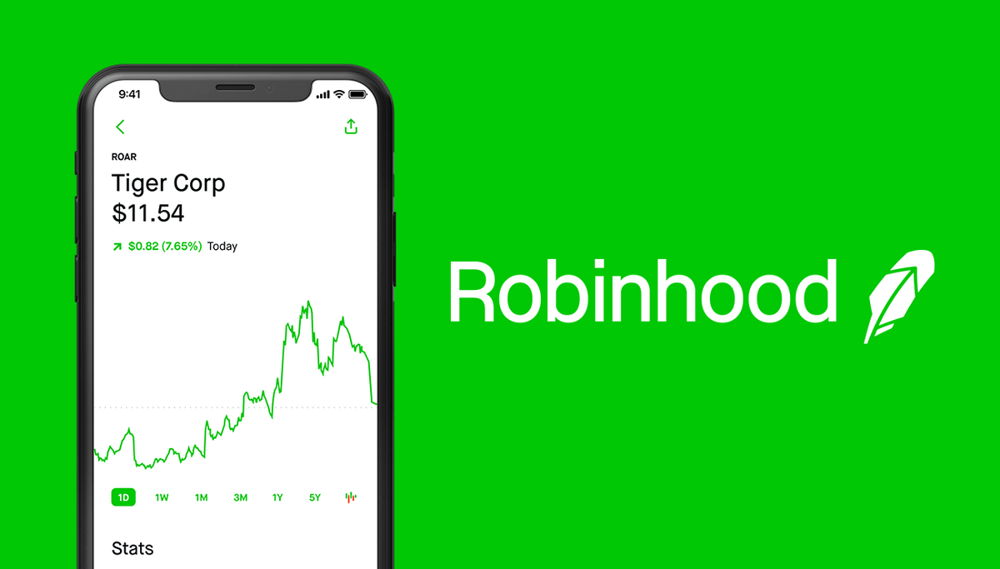

In recent years, investment platforms have witnessed an unprecedented surge in popularity, transforming how individuals engage with financial markets. This shift can be attributed to the democratization of investment opportunities facilitated by technology, which allows users to trade stocks, options, and other financial instruments with ease. Among the numerous platforms that have emerged, Robinhood stands out as a pivotal force in reshaping online trading.

Robinhood, established in 2014, caters to a growing demographic of tech-savvy investors by pioneering a commission-free trading model. This innovation aligns with the platform's mission to democratize finance for all, reducing barriers to market entry and encouraging broader participation in financial markets. Robinhood's user-friendly interface, characterized by its intuitive design and accessibility, further enhances its appeal among both novice and experienced investors.



Parallel to the rise of platforms like Robinhood, algorithmic trading has become increasingly relevant in modern investing. Algorithmic trading involves the use of computer programs to execute trades based on predefined strategies, allowing for swift and efficient transactions. This method is not only utilized by institutional players but is increasingly adopted by retail investors seeking to leverage technology to optimize their portfolios. The relevance of algorithmic trading lies in its potential to capitalize on market inefficiencies and to implement complex strategies that might be difficult for human traders to execute manually.

As investment platforms and trading technologies become more sophisticated, the importance of investor safety cannot be overstated. The digital investment landscape necessitates robust regulatory frameworks and protections to safeguard users' assets and personal data. Ensuring investor safety requires platforms to comply with legal standards and employ advanced security measures, thereby fostering trust and confidence among their users. Robinhood, among others, is subjected to regulatory oversight and offers specific protections to its account holders, underscoring the industry's commitment to maintaining a secure trading environment as digital investing continues to evolve.

## Table of Contents

## Robinhood: A Brief Overview

Robinhood, founded in 2014 by Vladimir Tenev and Baiju Bhatt, offers an innovative approach to trading by eliminating the traditional commission fees that often deterred casual and novice investors. Its inception marked a significant shift in the financial services industry, particularly among digital investment platforms, by promoting the democratization of finance. Rooted in the belief that everyone should have equal access to financial markets, Robinhood's mission is to "provide everyone with access to the financial markets, not just the wealthy."

The company's business model is structured around commission-free trades, empowering users to execute stock, [ETF](/wiki/etf-trading-strategies), options, and [cryptocurrency](/wiki/cryptocurrency) trades without the burden of associated fees. This approach disrupted the market, compelling many traditional brokerages to alter their fee structures similarly. The zero-commission model fundamentally alters how individuals engage with stock trading, making it more inclusive and accessible.

Robinhood's interface and design prioritize ease of use, catering to a demographic that favors simplicity and efficiency. The platform's mobile-first strategy capitalizes on the growing reliance on smartphones for managing personal finances. By providing a user-friendly interface, Robinhood reduces the complexity associated with trading, allowing individuals with limited financial backgrounds to interact with the stock market with relative ease. Its streamlined features and intuitive design contribute to an overall user experience that invites participation across various market sectors and asset types.

Furthermore, market accessibility is a cornerstone of Robinhood's offering. The platform enables fractional share investing, allowing users to buy portions of a stock instead of whole shares, thus lowering the entry barrier for high-priced stocks. This feature, combined with 24/7 availability and real-time market data, provides users with comprehensive tools to actively engage in investing, reflectively mirroring the broader trend of digital engagement in finance and aligning with its mission to foster accessible financial market participation for everyone.

## Investor Safety on Robinhood

Robinhood Markets, Inc., a prominent name in the fintech industry, ensures investor safety through compliance with regulatory standards and offering financial protections for users. It operates under the oversight of two major U.S. regulatory bodies: the Securities and Exchange Commission (SEC) and the Financial Industry Regulatory Authority (FINRA). Being a member of FINRA, Robinhood is subject to strict regulatory requirements, which are designed to promote market transparency, protect investors, and ensure the integrity of the securities industry [1].

In addition to regulatory compliance, Robinhood provides account protection through the Securities Investor Protection Corporation (SIPC). SIPC is a non-profit membership corporation funded by its member securities broker-dealers. It offers protections to investors in case a brokerage firm fails financially. Specifically, SIPC covers up to $500,000 per customer, including a $250,000 limit for cash claims. This protection ensures that investors are safeguarded against the loss of their securities and cash held in a brokerage account due to the firm's financial troubles [2].

Robinhood also extends additional layers of financial protection through excess insurance coverage provided in conjunction with Lloyd's of London. This excess of SIPC insurance covers brokerage services for the customer in case the limits of SIPC protection are exceeded. The insurance covers up to an additional $1.5 million for cash and $10 million for securities per customer, with an aggregate limit of $100 million [3]. This additional layer of insurance reinforces the safety net for investors, offering confidence and security for their investments.

By adhering to these regulations and offering comprehensive financial protections, Robinhood aims to foster a safe and reliable environment for investors engaging in digital trading platforms.

[1] "About FINRA." FINRA.org.  
[2] "Securities Investor Protection Corporation." SIPC.org.  
[3] Robinhood Financial LLC Disclosure Library.  

## Algorithmic Trading with Robinhood

Robinhood's foray into [algorithmic trading](/wiki/algorithmic-trading) is marked by the provision of its API (Application Programming Interface), which allows developers to create automated trading strategies. This API serves as a gateway for programmers to interact with Robinhood's trading platform, creating an environment for algorithmic trading where executing trades can be automated based on pre-defined criteria. Algorithmic trading leverages mathematical models and formulas to make high-speed decisions, minimizing human intervention and potentially capitalizing on market inefficiencies. 

The Robinhood platform offers several advantages for algorithmic traders. One of the most significant benefits is its commission-free structure, which allows traders to execute frequent trades without incurring traditional brokerage fees. This can be particularly advantageous in algorithmic trading where the strategy may involve numerous transactions within short time frames. The cost savings from avoiding per-trade commissions could enhance the overall profitability of algorithmic strategies by preserving margins that might otherwise be eroded by fees.

However, there are inherent disadvantages as well. Despite the seamless access provided by the API, Robinhood’s platform lacks some of the sophisticated tools and features available on other dedicated algorithmic trading platforms. Traders might find limitations in terms of data access, analytical tools, and execution speed which are crucial for developing and deploying complex algorithmic strategies. This makes Robinhood more suitable for relatively straightforward algorithmic systems rather than highly complex or high-frequency trading strategies.

For beginners, starting with algorithmic trading on Robinhood can be accessible, but it requires careful consideration. Prerequisites include a solid understanding of basic programming and trading principles, as well as a deep comprehension of the strategies being automated. Novice investors should be cautious of the risks involved and consider beginning with simple strategies, incrementally advancing as they grow more proficient with both the programming required and the market dynamics. 

Educational resources and tutorials are available to help new traders familiarize themselves with both algorithmic trading concepts and the specifics of Robinhood’s API. These resources can assist in developing the necessary skills to implement effective algorithms while ensuring risks are properly managed. As beginners gradually build their expertise, they can potentially expand their strategies to leverage Robinhood's cost-effective platform more effectively.

## Risks Involved with Algorithmic Trading

Algorithmic trading, by design, employs automated and pre-programmed strategies to execute trades at high speed, but this efficiency comes with inherent risks, especially on platforms like Robinhood. One of the primary risks is the potential for significant financial loss due to the automated nature of the process. When trades are executed rapidly without human intervention, minor errors in the algorithm can result in substantial unintended trades and losses. This risk is exacerbated during periods of market [volatility](/wiki/volatility-trading-strategies) when price swings can lead to rapid and unexpected losses.

Robinhood, while popular for its user-friendly and commission-free trading environment, has limitations in its trading tools that can affect algorithmic strategies. The platform's application programming interface (API) offers basic functionality suitable for simple algorithmic tasks but may not support more complex trading strategies. Unlike advanced trading systems used by professional traders that provide comprehensive access to detailed market data and sophisticated analysis tools, Robinhood's API is relatively limited. This restriction can impede traders from effectively implementing and optimizing intricate algorithms, potentially leading to suboptimal trading decisions.

Market volatility and trading restrictions also pose significant challenges to algorithmic trading on Robinhood. During times of extreme market movement, Robinhood may impose trading curbs, such as limiting the number of shares that can be bought or sold within a certain period. These restrictions can disrupt algorithmic trading strategies designed to capitalize on quick price fluctuations, leading to missed opportunities or forced liquidations at unfavorable prices. Additionally, high volatility can trigger sharp price movements, increasing the chances of an algorithm executing trades at significantly disadvantageous prices.

The importance of informed decision-making in algorithmic trading cannot be overstated. Traders must have a deep understanding of their algorithms and the market conditions under which these algorithms are designed to operate. Regular monitoring and adjustments are essential to adapt to changing market environments and ensure that the algorithm remains effective. Moreover, traders should conduct thorough [backtesting](/wiki/backtesting) using historical data to validate their strategies before deploying them in live trading. This thorough testing process helps identify potential weaknesses and optimize performance.

In conclusion, while algorithmic trading offers the potential for substantial gains, it also carries significant risks. The limitations inherent in Robinhood's platform, combined with market volatility and the automated nature of the process, necessitate a high level of vigilance and strategic planning from traders. Ensuring informed and educated decision-making is crucial for mitigating these risks and enhancing the potential for successful outcomes in algorithmic trading.

## Enhancing Investor Safety

Ensuring safety while using trading platforms like Robinhood involves a multifaceted approach. Here are best practices and strategies to enhance investor safety:

**Best Practices for Ensuring Safety**

1. **Enable Two-Factor Authentication (2FA):** Two-factor authentication provides an additional layer of security for user accounts, significantly reducing the risk of unauthorized access. Users should activate 2FA through their chosen platform settings.

2. **Regularly Update Software:** Keeping applications, including trading platforms and relevant software, up to date ensures users benefit from the latest security patches and features. This can prevent exploitation from known vulnerabilities.

3. **Strong Password Management:** Utilize complex, unique passwords for different accounts and consider using a password manager. Avoid using easily guessable or repeated passwords across various services.

4. **Monitor Account Activity:** Regularly review account statements and transaction histories. Promptly report any unauthorized activities to the platform's support team.

**Managing Risks Associated with Automated Trading**

1. **Algorithm Testing:** Before deploying algorithms in a live trading environment, thorough backtesting and paper trading should be conducted to evaluate performance under different market conditions. Python libraries such as `pandas` and `numpy` are helpful for analyzing historical data.

   ```python
   import pandas as pd

   # Example: Backtesting a trading strategy
   data = pd.read_csv('historical_stock_data.csv')
   data['Moving_Average'] = data['Close'].rolling(window=15).mean()
   # Further strategy testing code
   ```

2. **Set Precise Risk Controls:** Establish stop-loss and take-profit orders within trading algorithms to automatically manage risk exposure. This practice helps to mitigate significant financial loss during volatile market swings.

3. **Continuous Monitoring:** Automated systems should never run unsupervised. Regular surveillance allows traders to halt operations in case of system malfunctions or rapid market changes.

**Resources and Tools Available for Investor Education**

1. **Educational Platforms:** Utilize educational content available on platforms such as Investopedia and Coursera, which offer courses on trading strategies, risk management, and investing fundamentals.

2. **Broker Provided Resources:** Robinhood and other platforms typically provide a knowledge base, webinars, and tutorials that educate users about various investment products, trading techniques, and platform-specific features.

**Leveraging Robinhood’s Features for Safer Investments**

1. **Utilize Market Research and Data:** Robinhood provides users with access to real-time market data, analyst ratings, and news, which can inform more calculated investment decisions.

2. **Fractional Shares Investment:** By allowing investment in fractional shares, Robinhood enables users to diversify portfolios even with smaller capital amounts, reducing concentration risks.

3. **Cash Management Tools:** Taking advantage of Robinhood's cash management options can help investors properly allocate funds between investing and saving, preserving liquidity for strategic opportunities or emergencies.

By adhering to these practices, leveraging available educational tools, and correctly utilizing platform features, investors can significantly enhance their safety while engaging in online trading activities. It is crucial for every investor, regardless of experience level, to remain vigilant and informed, thereby optimizing both security and potential returns.

## The Future of Investment Platforms

Digital investment platforms are reshaping the landscape of personal finance, buoyed by continuous advancements in technology and user-oriented services. As these platforms evolve, a few key trends and developments are anticipated to define their future trajectory.

Predictions for the future of digital investment platforms include greater integration with [artificial intelligence](/wiki/ai-artificial-intelligence) to provide personalized financial advice. Machine learning algorithms have the potential to analyze vast datasets, offering insights tailored to individual investors' needs and preferences. This could lead to a more democratized investment space, where personalized insights are available to everyone, not just those who can afford traditional financial advisors.

The role of algorithmic trading is also anticipated to grow in personal finance, driven by its ability to make investment decisions at a speed and efficiency unattainable by human traders. In personal finance, these algorithms can automate routine investment tasks, like portfolio rebalancing, and optimize asset allocation to maximize returns. However, the reliance on algorithmic trading necessitates a careful understanding of its risks and limitations, particularly regarding market volatility and the potential for unintended trading behaviors.

Robinhood, a leader in commission-free trading, continues to play a significant role in transforming the investment landscape. The platform's potential developments in enhancing investor protection are likely to center around improving its educational resources and tools for risk management. This might include introducing more sophisticated features to help users make informed decisions, such as real-time data analytics or enhanced fraud detection mechanisms. Emphasizing transparency and providing clear communication regarding trading risks will be crucial as the platform continues to expand its offerings.

In conclusion, the future of digital investment platforms hinges on maintaining a delicate balance between innovation and safety. While the rapid technological developments promise increased accessibility and efficiency in investing, they also bring challenges in ensuring investor security and informed decision-making. Fintech companies like Robinhood will need to innovate responsibly, fostering environments where investors can safely harness the benefits of technology-driven trading. By prioritizing robust investor protection measures alongside cutting-edge features, these platforms can support a sustainable and inclusive financial ecosystem.

## References & Further Reading

[1]: ["About FINRA."](https://www.finra.org/about) FINRA.org.

[2]: ["Securities Investor Protection Corporation."](https://www.sipc.org/) SIPC.org.

[3]: Robinhood Financial LLC. ["Disclosure Library."](https://robinhood.com/us/en/about/legal/)

[4]: Bergstra, J., Bardenet, R., Bengio, Y., & Kégl, B. (2011). ["Algorithms for Hyper-Parameter Optimization."](https://dl.acm.org/doi/10.5555/2986459.2986743) Advances in Neural Information Processing Systems 24.

[5]: ["Advances in Financial Machine Learning"](https://www.amazon.com/Advances-Financial-Machine-Learning-Marcos/dp/1119482089) by Marcos Lopez de Prado

[6]: ["Machine Learning for Algorithmic Trading,"] (https://www.amazon.com/Machine-Learning-Algorithmic-Trading-alternative/dp/1839217715) by Stefan Jansen

[7]: ["Quantitative Trading: How to Build Your Own Algorithmic Trading Business,"](https://books.google.com/books/about/Quantitative_Trading.html?id=j70yEAAAQBAJ) by Ernest P. Chan

[8]: ["The Intelligent Investor: The Definitive Book on Value Investing."](https://www.amazon.com/Intelligent-Investor-3rd-Ed/dp/0063356724) by Benjamin Graham

[9]: ["The Little Book That Still Beats the Market"](https://www.amazon.com/Little-Book-Still-Beats-Market/dp/0470624159) by Joel Greenblatt