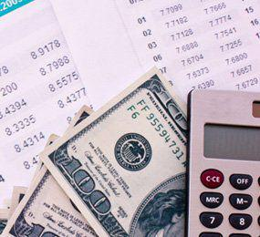

The world of finance is rich with history and modern innovation. Antique bonds, particularly railroad bonds, provide insights into the economic and technological milestones of past centuries. These bonds, once integral to the funding of expansive railroad networks across nations during the 19th and early 20th centuries, are now treasured by collectors and historians for their historical significance. As vintage financial instruments, they reflect the economic frameworks and investment landscapes of their times.

In contrast, modern bond valuation techniques and algorithmic trading represent the forefront of financial innovation. Bond valuation involves calculating the present worth of future cash flows, which is essential to differentiate between a bond's intrinsic and market values. This assessment takes into consideration variables like interest rates, discount rates, and economic conditions. Investors rely on these evaluations to make informed decisions about portfolio management and investment strategies.



Algorithmic trading, a recent advancement in the bond market, uses sophisticated algorithms to automate and refine trading strategies. This approach enhances the efficiency and speed of transactions, allowing for the rapid execution of trades based on real-time data analysis. By integrating complex algorithms that can process various market indicators simultaneously, traders are equipped to make more precise investment decisions.

This article will explore the significance of antique railroad bonds, the methods of bond valuation, and the impact of algorithmic trading on today's bond markets. These topics offer a comprehensive view, connecting the historical and contemporary aspects of financial markets. Readers will gain insights that can enhance their strategic investment decisions, navigating the complex landscape of modern finance through an understanding of its historical roots and technological advancements.

## Table of Contents

## Understanding Antique Railroad Bonds

Railroad bonds, a significant facet of the financial history of the United States, played a pivotal role in funding major infrastructure projects during the 19th and early 20th centuries. These financial instruments were primarily issued by railroad companies to raise funds necessary for the construction and expansion of extensive railway networks that connected various parts of the country, driving economic development and facilitating the movement of goods and people.

Today, antique railroad bonds have transcended their original purpose and are increasingly sought after by collectors and historical enthusiasts. Their appeal lies not only in their historical significance but also in their aesthetic value, often featuring intricate designs and ornate engravings. Collectors value these bonds for their historical context, which reflects the industrial growth and economic challenges of their time.

Determining the value of an antique railroad bond requires a multifaceted approach, taking into account several factors:

1. **Condition**: The physical state of the bond significantly influences its value. A bond in pristine condition, free from tears, stains, or excessive wear, is generally more desirable to collectors.

2. **Historical Importance**: The issuing company’s historical significance and the role the bond played in significant development projects add to its value. Bonds issued by notable companies or related to landmark projects tend to have higher collectible worth.

3. **Potential Redemption Value**: Although many antique bonds no longer hold financial value, some could still offer potential redemption if the issuing company or its successors are still operational. Verification often requires thorough legal and historical research.

To accurately assess and appraise these bonds, several research methods can be employed:

- **Existence of the Issuing Company**: Investigating whether the railroad company that issued the bond still exists, or if it was absorbed by another company, can reveal information on any potential redemption value.

- **Collectible Value Platforms**: Platforms and marketplaces dedicated to historical financial documents provide benchmarks and insights into the collectible value of specific bonds. These include auctions, online forums, and databases managed by numismatic and financial history organizations.

Resources such as the Archives Center at the National Museum of American History and the American Bank Note Company Archives offer valuable insights and documentation on historical financial instruments. Understanding these factors is crucial for collectors and investors interested in antique railroad bonds, helping them make informed decisions based on both sentimental and financial evaluation criteria.

## The Process of Bond Valuation

Bond valuation is essential for determining a bond's worth by evaluating its intrinsic value in comparison to its market value. This evaluation process involves several critical components that together provide a comprehensive understanding of a bond's financial potential and associated risks.

The present value of future cash flows forms the cornerstone of bond valuation. This involves calculating the current value of the bond's expected future interest payments, known as coupons, and the repayment of the bond's face value at maturity. The formula for calculating the present value (PV) of future cash flows is:

$$

PV = \sum_{t=1}^{n} \frac{C}{(1+r)^t} + \frac{F}{(1+r)^n} 
$$

where $C$ is the coupon payment, $F$ is the face value of the bond, $r$ is the discount rate, and $n$ is the total number of periods until maturity.

Interest rates significantly impact bond valuation as they influence the discount rate. As market interest rates rise, existing bonds with lower rates become less attractive, consequently decreasing their market value, and vice versa when interest rates fall.

The discount rate, often perceived as the bond's required rate of return, incorporates the [interest rate](/wiki/interest-rate-trading-strategies) and the risk premium associated with the bond issuer's creditworthiness. The riskier the issuer, the higher the discount rate applied, thus reducing the bond's present value.

Economic conditions also play a crucial role. During periods of economic stability, bonds from reputable issuers are considered safer investments, often reflected in their higher market values. Conversely, economic downturns may lead to increased perceived risks, affecting bond prices adversely.

Additionally, the concept of agio, which refers to the trading condition of a bond—either at a premium or discount to its face value—helps investors assess opportunities. A bond is said to trade at a premium when its market price is above its face value, usually due to higher interest payments than what is currently available in the market. Conversely, it trades at a discount when its market price is below the face value, often due to lower-than-market interest payments.

By employing these components and methodologies, investors can effectively perform complex calculations that reveal expected future earnings and the associated risks of a bond issuer. This comprehensive understanding aids in making informed and strategic investment choices.

## Algorithmic Trading in the Bond Market

Algorithmic trading represents a transformative advancement in the bond market, leveraging sophisticated computer algorithms to enhance and automate trading strategies. This technique has redefined how transactions are executed, driven by its ability to swiftly process large datasets and execute trades with remarkable speed and accuracy.

The primary advantage of [algorithmic trading](/wiki/algorithmic-trading) in the bond market lies in its efficiency. By employing algorithms, traders can automate the execution of trades, allowing for the management of high-frequency transactions that would be impossible to handle manually. These algorithms are designed to analyze numerous market variables, such as interest rates, bond yields, and economic indicators, enabling traders to make informed decisions based on real-time data.

Algorithmic trading systems often utilize complex mathematical models and statistical analyses. For example, an algorithm might be designed to execute a trade when the yield spread between two bonds reaches a certain threshold, or when predictive indicators suggest a potential price movement. These systems can continuously scan market conditions and execute trades far faster than a human trader could.

Consider the following Python pseudocode, which illustrates a simplistic example of an algorithmic trading strategy that executes trades based on moving average crossovers, a common technical analysis tool:

```python
# Simplistic example of an algorithmic trading strategy using moving averages

def moving_average(prices, window_size):
    return sum(prices[-window_size:]) / window_size

def trading_strategy(prices, short_window, long_window):
    short_moving_avg = moving_average(prices, short_window)
    long_moving_avg = moving_average(prices, long_window)

    if short_moving_avg > long_moving_avg:
        return "Buy"
    elif short_moving_avg < long_moving_avg:
        return "Sell"
    else:
        return "Hold"

# Example usage: trading_strategy(prices_list, short_window=5, long_window=20)
```

Despite its benefits, algorithmic trading demands extensive knowledge of financial markets and substantial technological resources. The creation of these algorithms typically involves teams of financial analysts, quants, and programmers who work together to refine and test strategies. Additionally, robust IT infrastructure is necessary to support the rapid data processing and execution that algorithmic trading requires.

Moreover, with the introduction of algorithmic trading, the bond market has experienced a surge in [liquidity](/wiki/liquidity-risk-premium) and a reduction in transaction costs, benefiting traders and investors alike. However, there is always the risk of market disruption if algorithms behave unexpectedly, underscoring the need for stringent risk management protocols.

In summary, algorithmic trading in the bond market offers a modern, efficient approach to trading, facilitating speed and precision in transaction execution. It embodies a convergence of financial acumen and technological prowess, marking a significant evolution in how bond trading is conducted today.

## The Interplay Between Bond Valuation and Algo Trading

Combining bond valuation with algorithmic trading enhances investment strategies through precise, data-driven insights. Bond valuation provides a solid foundation for understanding the intrinsic value of bonds, essential for making informed investment decisions. Algorithmic trading, on the other hand, facilitates the exploitation of opportunities in the bond market by automating and optimizing trading processes.

Traders use algorithms to monitor discrepancies between a bond’s intrinsic value and its market value, leveraging agio. Agio refers to a bond trading concept where a bond is assessed to determine whether it is trading at a premium or a discount relative to its face value. This analysis enables traders to identify potential profit opportunities, allowing them to execute buy or sell orders at opportune moments.

Advanced models, developed through [machine learning](/wiki/machine-learning) and [artificial intelligence](/wiki/ai-artificial-intelligence), are capable of predicting price fluctuations with remarkable accuracy. These models consider various market variables such as interest rate changes, economic indicators, and historical price data to generate forecasts about future price movements. By anticipating these shifts, traders can make more profitable trades, capitalizing on market inefficiencies.

This integration of bond valuation and algorithmic trading supports enhanced market liquidity and reduced transaction costs. Automated trading systems can execute trades at high frequencies, often in microseconds, ensuring that market participants experience lower spreads between bid and ask prices. Consequently, this leads to more efficient price discovery and a smoother functioning bond market, ultimately optimizing investment portfolios.

Moreover, algorithmic strategies minimize human error and emotional biases that can affect trading decisions. By relying on data-driven insights and automated processes, investors can achieve greater consistency and precision in their investment strategies. This technological advancement provides a competitive edge in the fast-paced financial landscape, where timely and accurate decision-making is crucial.

## Conclusion

Understanding antique railroad bonds, modern valuation techniques, and algorithmic trading offers significant insights into today’s financial markets. Antique railroad bonds provide a historical context that enhances our appreciation of present-day financial instruments, while modern valuation techniques, such as discounted cash flow analysis, offer a mathematical approach to determining the worth of financial assets. Algorithmic trading, which uses computer algorithms to execute trades at speeds and frequencies that are impossible for human traders, adds a technological dimension that further refines investment strategies.

These concepts represent a convergence of historical and technological perspectives that enrich investment opportunities. Antique bonds, as historical artifacts, help investors appreciate the evolution of financial instruments and market dynamics. On the other hand, the interplay of bond valuation and algorithmic trading underscores the importance of precision in decision-making. By leveraging data-driven insights and sophisticated algorithms, traders can exploit market inefficiencies, maximize returns, and manage risks more effectively.

As technology continues to evolve, so too will the methods and strategies within the bond market. Machine learning and artificial intelligence are increasingly being integrated into algorithmic trading, enabling systems to adapt to market changes with greater precision and speed. This evolution is expected to enhance market liquidity and reduce transaction costs, making markets more accessible and efficient.

Investors equipped with knowledge of both past and present financial tools can better navigate the complexities of modern investing. An understanding of historical instruments like antique railroad bonds broadens the investor’s perspective, while mastery of current valuation techniques and algorithmic trading provides the skills needed to thrive in today’s dynamic markets. By combining insights from both history and modern technology, investors can craft well-rounded, informed strategies that capitalize on market opportunities and withstand [volatility](/wiki/volatility-trading-strategies).

## References & Further Reading

[1]: Herbst, A. F. (1983). ["The Financial Role of the Railroad in American Economic Growth."](https://www.jstor.org/stable/2116005) Journal of Economic History, 43(3), 617-628.

[2]: Lopez de Prado, M. (2018). ["Advances in Financial Machine Learning."](https://www.amazon.com/Advances-Financial-Machine-Learning-Marcos/dp/1119482089) John Wiley & Sons.

[3]: Chan, E. P. (2009). ["Quantitative Trading: How to Build Your Own Algorithmic Trading Business."](https://github.com/ftvision/quant_trading_echan_book) John Wiley & Sons.

[4]: Aronson, D. R. (2006). ["Evidence-Based Technical Analysis: Applying the Scientific Method and Statistical Inference to Trading Signals."](https://www.amazon.com/Evidence-Based-Technical-Analysis-Scientific-Statistical/dp/0470008741) John Wiley & Sons.

[5]: Schwartz, R. A., & Francioni, R. (2004). ["Equity Markets in Action: The Fundamentals of Liquidity, Market Structure & Trading."](https://books.google.com/books/about/Equity_Markets_in_Action.html?id=fPV16sxH8oUC) John Wiley & Sons.