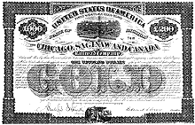

## Table of Contents

## What are old railroad bonds?

Old railroad bonds are financial securities that were issued by railroad companies a long time ago to raise money for building and expanding their railroads. These bonds promised to pay back the borrowed money with interest over a certain period. People and institutions bought these bonds as investments, hoping to earn money from the interest payments and the eventual return of their principal.

Many of these railroad companies went bankrupt or were taken over by other companies, which means that a lot of these old bonds never got paid back. Today, these bonds are mostly considered collectible items rather than financial investments. Collectors are interested in them because of their historical value and the stories behind the railroads. They often buy and sell them at auctions or through specialized dealers.

## Why might someone be interested in assessing the value of old railroad bonds?

Someone might want to know the value of old railroad bonds because they could be worth money as collectibles. Even though the companies that issued the bonds might not exist anymore, the bonds themselves can be interesting to people who like history or old things. These people might want to buy or sell the bonds, so knowing their value helps them decide if it's a good deal.

Another reason is that some people might have inherited old railroad bonds and want to know if they are worth anything. They might hope that the bonds still have some financial value, even if it's small. By finding out the value, they can decide whether to keep the bonds as a family keepsake or sell them to someone who collects them.

## How can you determine if an old railroad bond is still valid?

To find out if an old railroad bond is still valid, you need to check if the company that issued the bond still exists and if it is still paying back the money it owes. Many railroad companies from a long time ago went bankrupt or got bought by other companies. If the company no longer exists, the bond is probably not valid anymore. You can look up the company's history to see what happened to it.

If the company still exists, you need to see if the bond has reached its maturity date, which is when the company promised to pay back the money. If the bond has passed its maturity date and the company did not pay, the bond is likely not valid. You can contact the company or a financial expert to get more information about the bond's status.

## What factors influence the value of old railroad bonds?

The value of old railroad bonds depends on a few things. One big thing is how rare the bond is. If not many of a certain bond were made, or if it's from a famous railroad company, it can be worth more money. Another thing is the condition of the bond. If it's in good shape, without tears or stains, it will be worth more than one that's damaged. The history behind the bond also matters. If the bond is from a railroad that did something important or interesting, collectors might want it more.

Another [factor](/wiki/factor-investing) is what's happening in the market for collectibles. If a lot of people are interested in old railroad bonds right now, the value can go up. On the other hand, if not many people are buying them, the value might go down. Also, if the bond still has some chance of being paid back, even if it's small, that can add to its value. But usually, people are more interested in the bond as a piece of history than as a way to make money.

## Where can you find historical data on railroad companies to assess bond value?

To find historical data on railroad companies, you can start by looking at libraries and historical societies. Many big libraries have special sections with old [books](/wiki/algo-trading-books), newspapers, and documents about railroads. Historical societies often keep records and stories about local railroads. These places can help you learn about the company that issued the bond, like when it started, what it did, and if it went bankrupt.

Another good place to look is online. Websites like the Railroad History Database or the Library of Congress have lots of information about old railroads. You can also find old company reports and financial records on websites that keep historical business data. These can tell you if the company still exists and if the bond might still be worth something.

Talking to experts can also help. People who study railroad history or work in the collectible market know a lot about old railroad bonds. They can tell you about the bond's rarity, condition, and what collectors might pay for it. By using these different sources, you can get a good idea of the bond's value.

## How do market conditions affect the value of old railroad bonds?

Market conditions can change how much old railroad bonds are worth. If a lot of people are interested in collecting old things, the value of these bonds can go up. This is because more people want to buy them, so they are willing to pay more. On the other hand, if fewer people are interested in collecting, the value can go down. It's like how toys can be worth more if everyone wants them, but less if no one does.

Another thing that affects the value is what's happening in the economy. If people have more money to spend on hobbies and collectibles, they might be more likely to buy old railroad bonds. But if times are tough and people need to save their money, they might not want to spend it on things like old bonds. So, the value of these bonds can go up and down depending on how the economy is doing and how much people are interested in collecting them.

## What role does the bond's condition play in its valuation?

The condition of an old railroad bond is very important when figuring out how much it's worth. If the bond is in good shape, with no tears, stains, or writing on it, it will be worth more money. Collectors like things that look nice and are well-preserved, so they are willing to pay more for bonds that are in good condition.

On the other hand, if the bond is damaged or has been written on, its value will go down. Even small things like a little tear or a faded color can make the bond less valuable. Collectors want to have the best examples of these historical items, so they will pay less for bonds that are not in perfect condition.

## How can you verify the authenticity of an old railroad bond?

To check if an old railroad bond is real, you can start by looking at the bond itself. Real bonds usually have special features like watermarks, unique serial numbers, and official seals. If the bond has these things, it's more likely to be real. You can also compare it to pictures of other bonds from the same company to see if it looks the same. If something looks different or wrong, it might be fake.

Another way to verify the authenticity is to talk to experts. People who know a lot about old railroad bonds, like historians or collectors, can tell you if the bond is real. They might have seen many bonds before and can spot fakes easily. You can also send the bond to a professional service that checks the authenticity of old documents. They use special tools and methods to make sure the bond is not a fake.

## What are some common pitfalls to avoid when assessing old railroad bonds?

When looking at old railroad bonds, one common mistake is thinking they are still worth a lot of money as investments. Many of these bonds are from companies that went out of business long ago, so they won't pay you back. People sometimes think they can get the money the bond promised, but that's usually not true. Instead, you should see them as collectibles, where their value comes from how rare or interesting they are, not from the money they might pay back.

Another pitfall is not checking the bond's condition carefully. Even small damage like tears or stains can make the bond worth less to collectors. It's important to look at the bond closely and see if it's in good shape. Also, be careful about fakes. Some people might try to sell you a bond that isn't real, so always check with experts or use special services to make sure the bond is authentic.

## How do legal considerations impact the assessment of old railroad bonds?

Legal considerations can affect how much an old railroad bond is worth. If the company that issued the bond still exists, you might need to check if the bond is still valid under the law. Some bonds might have legal claims attached to them, meaning someone else might say they own the bond or that the company still owes money on it. If there are legal issues, it can make the bond less valuable because it might be hard to sell or use.

Another thing to think about is if the bond has been canceled or if it's past its maturity date. If the bond is no longer valid legally, it can only be worth something as a collectible. Also, laws about old debts and financial instruments can change over time, so you might need to talk to a lawyer to understand if there are any legal problems with the bond. This can help you know if the bond has any value beyond being a piece of history.

## What advanced techniques can be used to analyze the financial health of the issuing railroad company?

To understand how healthy the railroad company was when it issued the bond, you can look at old financial reports. These reports show how much money the company made and spent, how much debt it had, and if it was making a profit. You can find these reports in libraries or online at places like the Library of Congress or business history databases. By reading these reports, you can see if the company was doing well enough to pay back the bond or if it was struggling and might go bankrupt.

Another way to check the company's health is to use financial ratios. These are numbers that help you see how the company was doing compared to other companies. For example, you can look at the debt-to-equity ratio to see how much the company borrowed compared to what it owned. A high ratio might mean the company was risky and might not be able to pay back its bonds. You can also look at the company's credit ratings from back then, which tell you what people thought about the company's ability to pay its debts. By using these advanced techniques, you can get a better idea of how likely the bond was to be paid back.

## How can one predict future trends in the value of old railroad bonds?

Predicting future trends in the value of old railroad bonds can be tricky, but you can start by looking at what's happening in the collectibles market. If more people are getting interested in old things like railroad bonds, the value might go up. You can watch auction results and see how much people are paying for similar bonds. Also, if there's a big event or movie about railroads, it might make more people want to collect these bonds, which can push the value higher. Keeping an eye on these trends can help you guess where the value might go.

Another way to predict future trends is to think about the economy. If people have more money to spend on hobbies and collecting, they might be willing to pay more for old railroad bonds. On the other hand, if times are tough and people need to save their money, they might not want to buy collectibles, and the value could go down. Also, if new laws or rules change how people can buy and sell these bonds, it could affect their value. By watching these things, you can make a better guess about what might happen to the value of old railroad bonds in the future.

## What is the process of bond valuation?

Bond valuation is essential for determining a bond's worth by evaluating its intrinsic value in comparison to its market value. This evaluation process involves several critical components that together provide a comprehensive understanding of a bond's financial potential and associated risks.

The present value of future cash flows forms the cornerstone of bond valuation. This involves calculating the current value of the bond's expected future interest payments, known as coupons, and the repayment of the bond's face value at maturity. The formula for calculating the present value (PV) of future cash flows is:

$$

PV = \sum_{t=1}^{n} \frac{C}{(1+r)^t} + \frac{F}{(1+r)^n} 
$$

where $C$ is the coupon payment, $F$ is the face value of the bond, $r$ is the discount rate, and $n$ is the total number of periods until maturity.

Interest rates significantly impact bond valuation as they influence the discount rate. As market interest rates rise, existing bonds with lower rates become less attractive, consequently decreasing their market value, and vice versa when interest rates fall.

The discount rate, often perceived as the bond's required rate of return, incorporates the [interest rate](/wiki/interest-rate-trading-strategies) and the risk premium associated with the bond issuer's creditworthiness. The riskier the issuer, the higher the discount rate applied, thus reducing the bond's present value.

Economic conditions also play a crucial role. During periods of economic stability, bonds from reputable issuers are considered safer investments, often reflected in their higher market values. Conversely, economic downturns may lead to increased perceived risks, affecting bond prices adversely.

Additionally, the concept of agio, which refers to the trading condition of a bond—either at a premium or discount to its face value—helps investors assess opportunities. A bond is said to trade at a premium when its market price is above its face value, usually due to higher interest payments than what is currently available in the market. Conversely, it trades at a discount when its market price is below the face value, often due to lower-than-market interest payments.

By employing these components and methodologies, investors can effectively perform complex calculations that reveal expected future earnings and the associated risks of a bond issuer. This comprehensive understanding aids in making informed and strategic investment choices.

## References & Further Reading

[1]: Herbst, A. F. (1983). ["The Financial Role of the Railroad in American Economic Growth."](https://www.jstor.org/stable/2116005) Journal of Economic History, 43(3), 617-628.

[2]: Lopez de Prado, M. (2018). ["Advances in Financial Machine Learning."](https://www.amazon.com/Advances-Financial-Machine-Learning-Marcos/dp/1119482089) John Wiley & Sons.

[3]: Chan, E. P. (2009). ["Quantitative Trading: How to Build Your Own Algorithmic Trading Business."](https://github.com/ftvision/quant_trading_echan_book) John Wiley & Sons.

[4]: Aronson, D. R. (2006). ["Evidence-Based Technical Analysis: Applying the Scientific Method and Statistical Inference to Trading Signals."](https://www.amazon.com/Evidence-Based-Technical-Analysis-Scientific-Statistical/dp/0470008741) John Wiley & Sons.

[5]: Schwartz, R. A., & Francioni, R. (2004). ["Equity Markets in Action: The Fundamentals of Liquidity, Market Structure & Trading."](https://books.google.com/books/about/Equity_Markets_in_Action.html?id=fPV16sxH8oUC) John Wiley & Sons.