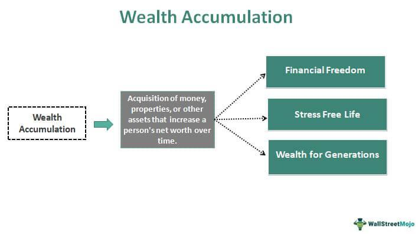

In the modern financial world, wealth building has taken on new dimensions, blending traditional strategies with technological advancements. The integration of technological tools such as algorithmic trading is reshaping how financial growth and asset accumulation are understood and practiced. These key concepts are evolving significantly, prompted by innovations in technology that offer new mechanisms for value creation and capital appreciation.

As investors navigate this dynamic landscape, it is crucial to examine the interactions between established financial methods and cutting-edge technological approaches. This article aims to explore these interactions in depth, offering insights into how investors can leverage modern tools to enhance their financial journey. By merging time-tested strategies with innovative solutions, individuals and businesses can devise comprehensive plans to secure their financial futures.



Understanding these intertwined concepts is essential for crafting robust financial strategies. Traditional methods such as diversified asset portfolios and regular savings still play a vital role, yet they must be augmented with new technologies to remain competitive in the rapidly evolving markets. Algorithmic trading, for example, has made it possible to execute trades with unprecedented speed and accuracy, offering investors a powerful tool for maximizing returns.

Throughout this exploration, emphasis will be placed on achieving a balance between conventional methods and innovative approaches. This equilibrium is key to maximizing wealth accumulation and ensuring long-term financial stability. By adopting a holistic approach that incorporates both traditional and modern strategies, investors can better position themselves to capitalize on opportunities and mitigate risks in an ever-changing financial environment.

## Table of Contents

## Understanding Financial Growth and Wealth Building

Financial growth is a multifaceted concept that traditionally relies on a combination of sound investments, strategic savings, and steady income generation. These elements provide the foundational pillars on which individuals and businesses build their financial stability and prosperity. Key to financial growth is the notion of forming a diversified portfolio, which typically includes a thoughtful mix of stocks, bonds, and real estate. Historically, such diversity has been crucial in mitigating risks and ensuring consistent growth across varying market conditions.

Wealth building, on the other hand, extends beyond the mere accumulation of money. It involves creating lasting value and capital that can weather financial uncertainties and contribute to long-term prosperity. This process necessitates a comprehensive understanding of market dynamics as well as advanced financial products that cater to contemporary needs. With the constant evolution of financial markets, traditional approaches to wealth building are increasingly being supplemented by modern techniques and products.

In today’s rapidly changing environment, the ability to understand and predict market dynamics is paramount. This understanding informs the selection of financial products and tools that align with an individual's or entity's broader financial goals. The financial markets offer a plethora of advanced products, from derivatives to ETFs and index funds, each with specific benefits and risks. Mastery of these products allows investors to strategically position themselves to leverage market movements to their advantage, thereby enhancing their overall wealth-building efforts.

The successful execution of wealth building often involves blending strategic foresight with tactical financial instruments. For instance, while strategic foresight may involve setting long-term financial goals and identifying growth areas within specific sectors, tactical instruments involve the actual financial products and methods used to achieve these goals. This could involve using hedging strategies to protect against unforeseen losses or opting for high-yield investments that align with broader strategic objectives.

Consider a simple Python script that calculates compound interest, a fundamental concept in financial growth and wealth building:

```python
def calculate_compound_interest(principal, rate, time, n):
    """
    Calculate compound interest.

    :param principal: Initial amount of money
    :param rate: Interest rate (as a decimal)
    :param time: Time the money is invested for, in years
    :param n: Number of times interest is compounded per year
    :return: Total amount after interest
    """
    amount = principal * (1 + rate/n)**(n*time)
    return amount

principal = 10000  # Initial investment
rate = 0.05  # 5% annual interest
time = 10  # Invested for 10 years
n = 4  # Compounded quarterly

total_amount = calculate_compound_interest(principal, rate, time, n)
print(f"Total after {time} years: ${total_amount:.2f}")
```

This script demonstrates how a principal investment grows at a fixed [interest rate](/wiki/interest-rate-trading-strategies), showcasing the fundamental growth mechanics that underpin any robust wealth-building strategy. In real-world applications, investors would employ more sophisticated models and tools tailored to their unique financial objectives and market conditions.

Ultimately, understanding and harnessing the principles of financial growth and wealth building are essential for securing a stable and prosperous future. It involves a judicious balance of traditional investment wisdom and modern financial insight, allowing individuals and businesses to optimize their strategies and effectively navigate the complexities of the financial landscape.

## The Role of Asset Accumulation

Asset accumulation is a critical component in the journey of wealth building, traditionally achieved through systematic [earning](/wiki/earning-announcement), saving, and investing. This process involves accumulating assets that can appreciate over time or generate income, thereby contributing to long-term financial growth. The effectiveness of asset accumulation can be assessed by examining either the total value of the accumulated assets or the income they produce. 

A comprehensive strategy of asset accumulation includes various financial instruments. Retirement accounts are often utilized due to their tax advantages, allowing for deferred taxation on earnings until withdrawal. Bonds represent a secure avenue for income generation, providing regular interest payments. Furthermore, dividend-paying stocks offer the dual benefits of potential capital appreciation and periodic income, aligning with a balanced growth and income strategy.

In addition to financial assets, asset accumulation within a business context encompasses tangible assets such as factories and equipment. These assets not only play a direct role in production and revenue generation but can also serve as collateral for further investment or expansion.

Effective strategies for asset accumulation involve diversification across different asset classes. A diversified portfolio reduces risk, as it is not overly reliant on the performance of a single type of asset. Furthermore, utilizing tax-advantaged retirement plans can enhance asset accumulation by maximizing after-tax returns. Diversifying internationally can also provide exposure to different economic cycles and growth opportunities.

Investors may also integrate modern analytical tools and technologies to optimize their asset accumulation strategies. For example, Python can be used for portfolio optimization and risk assessment:

```python
import numpy as np
import pandas as pd
from scipy.optimize import minimize

# Example: Optimizing a portfolio with given asset returns and covariances
returns = np.array([0.1, 0.12, 0.08])  # Example expected returns
cov_matrix = np.array([[0.005, -0.002, 0.004], [-0.002, 0.003, 0.002], [0.004, 0.002, 0.006]])  # Covariance matrix

# Define function to minimize (negative of portfolio return for maximization)
def portfolio_volatility(weights, cov_matrix):
    return np.sqrt(np.dot(weights.T, np.dot(cov_matrix, weights)))

# Constraints: weights must sum to 1
constraints = ({'type': 'eq', 'fun': lambda x: np.sum(x) - 1})

# Bounds: No short selling (weights between 0 and 1)
bounds = tuple((0, 1) for asset in range(len(returns)))

# Initial guess
initial_guess = len(returns) * [1. / len(returns),]

# Optimization
result = minimize(portfolio_volatility, initial_guess, args=cov_matrix, method='SLSQP', bounds=bounds, constraints=constraints)

# Optimized weights
optimized_weights = result.x
```

This Python code snippet exemplifies how computational tools can be leveraged to achieve efficient asset allocation. The method ensures that investors maintain optimal risk-return profiles, which is fundamental for successful asset accumulation over time.

In summary, asset accumulation remains a cornerstone of building lasting wealth. With a combination of traditional financial principles and modern technological tools, individuals and businesses can effectively grow and manage their asset portfolios, setting the foundation for a secure financial future.

## Algorithmic Trading: An Overview

Algorithmic trading employs sophisticated computer programs to execute trades according to predefined parameters. By leveraging the computational power of modern computers, [algorithmic trading](/wiki/algorithmic-trading) excels in speed and precision, and it can analyze vast data sets more efficiently than human traders. This method facilitates the identification of market patterns and trends, enabling traders to make informed decisions in real-time.

A variety of strategies underpin algorithmic trading, each tailored to exploit specific market conditions. Trend-following strategies, for example, capitalize on prevailing market directions, buying securities in upward-trending markets and selling them when trends reverse. Arbitrage strategies seek to exploit price differentials of the same asset across different markets, buying at a lower price in one market and simultaneously selling at a higher price in another. Statistical models, which may include [machine learning](/wiki/machine-learning) techniques, are employed to predict future price movements based on historical data patterns and correlations.

The evolution of algorithmic trading has democratized market access, opening opportunities for individual traders once reserved for institutional investors. These methods enable individual investors to compete with larger firms by automating complex and high-frequency trading strategies that operate at incredible speeds.

Algorithmic trading is intricately reshaping financial markets by promoting more sophisticated and rapid trading operations. Its growing prowess continues to challenge traditional trading paradigms, offering new approaches and dynamic strategies that redefine market engagement and efficiency. As these systems evolve, the potential for innovations in trading and investment strategies expands, continuously contributing to the modernization and complexity of financial markets.

## Integrating Algo Trading with Wealth Building Strategies

Algorithmic trading, a cutting-edge application of technology in finance, holds significant potential for enhancing wealth-building strategies. By utilizing computer programs that execute trades based on pre-set criteria, algorithmic trading brings efficiency and precision to handling complex financial strategies. This enables investors to capitalize on market opportunities with speed and accuracy that surpass human capabilities.

Integrating algorithmic trading into wealth-building strategies enhances the ability to monitor market conditions continuously and optimize asset growth. Algorithms analyze large volumes of data in real time, providing insights that guide strategic decisions. This real-time analysis enables a dynamic adjustment of investment portfolios, maximizing returns by capitalizing on short-term market fluctuations and long-term trends.

One of the primary benefits of algorithmic trading is its contribution to risk management. Automated decision-making processes reduce human error, allow for rapid execution of trades, and maintain consistency and speed. Algorithms can automatically adjust positions in response to market signals, thus minimizing potential losses and optimizing return on investment. This integration allows for more consistent execution of predefined strategies and prevents emotional biases from impacting trading decisions.

Quantitative hedge funds and technologically advanced investment firms exemplify successful integration of algorithmic trading with wealth-building approaches. These entities employ sophisticated algorithms to analyze market data and [statistics](/wiki/bayesian-statistics), identifying anomalies and trends that inform investment decisions. The adaptability of algorithmic trading enables these firms to quickly respond to changing market conditions, ensuring sustained performance.

For individual investors and financial institutions alike, merging traditional investment principles with modern technology can significantly leverage portfolios. By maintaining core investment disciplines like diversification and risk management while employing algorithms to optimize trade execution, investors can enhance their overall wealth-building strategy. Emphasizing this technological integration allows for the development of a more agile and responsive investment approach, effectively marrying conventional wisdom with the power of machine learning and data analytics.

To maximize the synergy between algorithmic trading and wealth building, investors should remain adaptive to new technological advancements. They must also maintain a keen awareness of evolving market dynamics, ensuring their strategy remains robust against external changes. Mechanizing the trading process offers an efficient path to optimizing financial growth, as long as it is underpinned by strategic foresight and informed by cutting-edge technological insights.

## Challenges and Considerations

Algorithmic trading, while offering numerous advantages, presents several challenges and considerations that investors must navigate carefully. One of the primary risks is market [volatility](/wiki/volatility-trading-strategies). Algorithms can react instantaneously to market changes, which, while often beneficial, can exacerbate volatility during turbulent times. The rapid execution of trades based on preset criteria might lead to unintended consequences in highly volatile markets, such as significant financial losses or flash crashes.

Technical failures represent another significant risk. Dependence on algorithmic systems means that any malfunction or error in the program can result in severe financial implications. Issues such as hardware failures, bugs in the code, or connectivity problems can disrupt trading operations. Therefore, robust system architecture and regular maintenance checks are crucial to ensure reliability.

Adaptation and continuous monitoring of trading strategies are essential to remain responsive to evolving market conditions. Markets are dynamic, and factors such as economic data, geopolitical events, and market sentiment can quickly alter trading landscapes. Algorithms must be regularly updated and backtested against historical data to refine their effectiveness. This necessitates a framework where continuous feedback loops are established to improve strategies iteratively.

Regulatory challenges also play a critical role. Algorithmic trading platforms must comply with various financial regulations, which can differ significantly across jurisdictions. Ensuring compliance requires an understanding of complex legal environments and implementing mechanisms that adhere to these regulations. Failure to comply can lead to substantial penalties or trading restrictions.

Human oversight coupled with algorithmic precision is crucial in managing these challenges. While algorithms can process data and execute trades faster than humans, they lack the nuanced understanding and contextual interpretation that human traders can provide. A balanced approach involves using human judgment to set strategic goals and monitor algorithmic performance. For instance, humans can intervene in situations where market conditions deviate from normal patterns, thereby averting potential algorithmic errors.

To mitigate both financial and operational risks, investors should adopt resilient systems. This includes implementing redundancy measures, such as backup systems and fail-safe procedures, to ensure trading operations can continue smoothly in case of disruptions. Risk management frameworks should be comprehensive, incorporating both quantitative assessments and qualitative evaluations to safeguard against unexpected developments.

Overall, algorithmic trading demands a careful equilibrium of technology and human expertise. By addressing the outlined challenges and considerations, investors can harness algorithmic trading effectively while minimizing associated risks.

## Conclusion

Successful financial growth and wealth accumulation in today's world demand a harmonious integration of both traditional and modern strategies. Conventional financial wisdom underscores the importance of sound investments, savings, and income generation, forming the bedrock of wealth building. However, the rapid advancement of technology offers exciting new avenues, such as algorithmic trading, which, when integrated properly, can significantly enhance the efficiency and potential returns on investments.

Algorithmic trading, with its ability to execute rapid and precise trades based on pre-defined criteria, offers invaluable opportunities for investors. By leveraging complex algorithms and vast data processing capabilities, it can execute trades that would be beyond traditional human abilities in terms of speed and accuracy. This technology, when fused with insights from organic growth strategies, empowers investors to make more informed and strategic investment decisions. Such integration ensures that portfolios are not only diversified but also strategically aligned with current market dynamics.

Navigating the ever-evolving financial landscape requires adaptability, continuous learning, and strategic foresight. Investors must be vigilant, consistently updating and adapting their strategies to align with the latest market developments and technological advancements. Understanding and embracing new technological tools like algorithmic trading, while maintaining a foundation in traditional investment strategies, equips investors with the insight needed to make sound financial decisions.

A sense of cautious optimism and an openness to embrace technological innovations are vital to crafting a secure financial future. As financial markets become increasingly complex and interconnected, those who successfully blend traditional methods with modern technology will likely be best positioned to capitalize on emerging opportunities. By maintaining a balance between cautious exploration and strategic application of new tools, individuals and businesses can safeguard their financial interests and enhance their wealth building processes in the long run.

## References & Further Reading

[1]: Bergstra, J., Bardenet, R., Bengio, Y., & Kégl, B. (2011). ["Algorithms for Hyper-Parameter Optimization."](https://dl.acm.org/doi/10.5555/2986459.2986743) Advances in Neural Information Processing Systems 24.

[2]: ["Advances in Financial Machine Learning"](https://www.amazon.com/Advances-Financial-Machine-Learning-Marcos/dp/1119482089) by Marcos Lopez de Prado

[3]: ["Evidence-Based Technical Analysis: Applying the Scientific Method and Statistical Inference to Trading Signals"](https://www.amazon.com/Evidence-Based-Technical-Analysis-Scientific-Statistical/dp/0470008741) by David Aronson

[4]: ["Machine Learning for Algorithmic Trading"](https://github.com/stefan-jansen/machine-learning-for-trading) by Stefan Jansen

[5]: ["Quantitative Trading: How to Build Your Own Algorithmic Trading Business"](https://github.com/LucindaYa/quant-resources/blob/master/Quantitative%20Trading%20How%20to%20Build%20Your%20Own%20Algorithmic%20Trading%20Business.pdf) by Ernest P. Chan