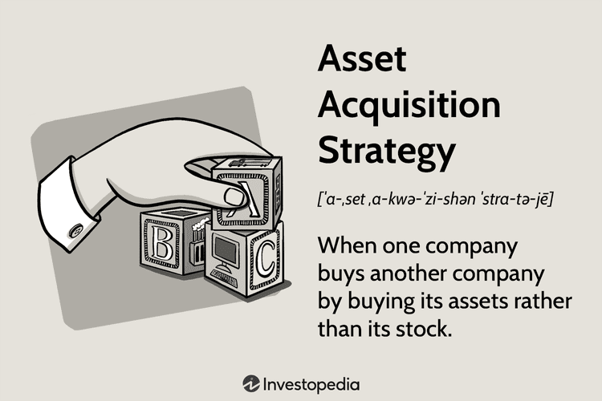

Investment strategies have continuously adapted in response to technological advancements and evolving market dynamics. The financial landscape is characterized by its complexity and the rapid pace of change, necessitating a deep understanding of core concepts to navigate it successfully. Among these concepts are business strategy, asset acquisition, and algorithmic trading, each playing a pivotal role in shaping modern investment frameworks.

Business strategy is the overarching plan that drives long-term financial objectives. It is crucial in defining how a company positions itself within the market, how it manages resources, and how it seeks growth opportunities. Effective business strategies incorporate sound investment principles, aiming to maximize returns while mitigating risks.



Asset acquisition represents another critical dimension of investment strategy, offering a strategic path to growth through the purchase of assets. This process allows companies to selectively acquire valuable resources while bypassing unwanted liabilities. It is particularly significant in industries prone to frequent bankruptcies or restructurings, where strategic acquisitions can bolster a company's market position and enhance profitability.

Algorithmic trading stands at the intersection of technology and finance. It utilizes computer algorithms to execute trades at speeds and volumes far surpassing human capabilities. By relying on predefined strategies, algorithmic trading minimizes human error and emotions, allowing traders to exploit fleeting market opportunities efficiently. As technology progresses, algorithmic trading has become increasingly sophisticated, offering a variety of algorithms tailored to diverse trading objectives.

These interconnected components are fundamental in shaping contemporary investment strategies. By understanding and integrating business strategy, asset acquisition, and algorithmic trading, investors can better position themselves in the volatile financial landscape. This article will explore these concepts in greater detail, examining their interplay and significance in modern investment practices.

## Table of Contents

## Investment Concepts and Business Strategy

Investment concepts serve as the foundational principles essential for navigating and making informed decisions in financial markets. These concepts encompass diverse elements such as risk management, portfolio diversification, time value of money, and the efficient market hypothesis. Understanding these principles allows investors to assess the potential risks and rewards associated with various financial instruments and strategies.

Business strategy in investment is a comprehensive approach that focuses on long-term planning to achieve specific financial goals. This strategy typically involves setting clear objectives, analyzing competitive environments, allocating resources efficiently, and continuously adapting to market changes. A sound business strategy aims not only to maximize returns but also to mitigate risks and sustain growth over time.

The integration of investment concepts into business strategy is crucial for companies looking to enhance their financial performance. By applying these concepts within their strategic frameworks, companies can make more informed decisions about capital allocation, risk management, and growth opportunities. For instance, incorporating the principles of portfolio diversification can help a company balance its investment portfolio across various asset classes, thereby reducing exposure to market [volatility](/wiki/volatility-trading-strategies) and unforeseen economic shifts.

Investment concepts such as the time value of money enable businesses to evaluate future cash flows and make decisions that align with their financial goals. They can use discounted cash flow (DCF) analysis, which involves estimating the present value of expected future cash inflows and outflows. This method helps in determining the feasibility and profitability of investment projects.

Additionally, businesses may apply algorithmic models to optimize their investment strategies. For example, a company might use Python to develop models that predict market trends based on historical data. A simple implementation of a linear regression model in Python to forecast stock prices could be as follows:

```python
import numpy as np
import pandas as pd
from sklearn.model_selection import train_test_split
from sklearn.linear_model import LinearRegression

# Sample dataset of stock prices
data = pd.DataFrame({
    'days': np.arange(1, 101),
    'prices': np.random.normal(100, 10, 100)
})

# Splitting the data into training and test sets
X = data[['days']]
y = data['prices']
X_train, X_test, y_train, y_test = train_test_split(X, y, test_size=0.2, random_state=42)

# Creating and training the linear regression model
model = LinearRegression()
model.fit(X_train, y_train)

# Predicting stock prices
predictions = model.predict(X_test)
```

By integrating sophisticated investment concepts and leveraging technology, businesses can not only maximize returns but also ensure sustainable management of growth. This holistic approach equips organizations to navigate complex financial landscapes efficiently and effectively.

## Understanding Asset Acquisition

Asset acquisition represents a critical strategic maneuver in business where one company seeks to purchase specific assets of another entity. This approach allows the acquiring company to selectively obtain valuable resources without assuming unwanted liabilities. Such selectivity makes asset acquisition an attractive option for businesses aiming to enhance their portfolios efficiently and strategically.

The process of asset acquisition typically involves detailed due diligence to identify and assess the target assets. This includes evaluating the assets' current market value, potential income generation, and alignment with the acquirer's long-term strategic objectives. The ability to cherry-pick assets means that companies can bolster their market position by acquiring high-value properties, patents, or technology without the burden of inheriting debt or unfavourable contracts associated with the entire entity.

One of the prominent advantages of asset acquisition is its capacity to drive external growth. This is particularly beneficial in industries characterized by volatility, frequent bankruptcies, or restructuring. For instance, in the tech industry, where innovation cycles are rapid and asset values can fluctuate significantly, companies often focus on acquiring specific breakthroughs or technologies to stay competitive. Similarly, in industries such as retail or manufacturing, acquiring key physical assets such as warehouses or machinery can provide immediate operational benefits and market expansion opportunities.

Moreover, asset acquisition can serve as a strategic entry method into new markets or segments. By acquiring assets like distribution networks or specific retail locations, companies can rapidly establish a presence in new geographical regions or market niches with minimal disruption.

In summary, asset acquisition offers a powerful tool for strategic growth, enabling companies to capitalize on opportunities in unstable sectors and allowing for optimal resource allocation. Organizations that effectively execute asset acquisitions enhance their competitive advantage, fuel growth, and often secure a more robust position in the market.

## Algorithmic Trading: An Overview

Algorithmic trading employs computer algorithms to execute buy and sell orders in financial markets with unparalleled speed and precision. These algorithms are designed to identify market opportunities and execute trading strategies at speeds beyond human capability, enabling the capitalization on minuscule price discrepancies across various assets and markets.

A key feature of [algorithmic trading](/wiki/algorithmic-trading) is its reliance on predetermined strategies, which helps mitigate human error and emotion-driven decision-making. By automating the trading process, these algorithms can identify trends and execute trades based on predefined criteria, such as timing, price, or complex mathematical models. This structured approach helps traders deploy a wide array of strategies that are computationally intensive.

Traders utilize various types of algorithms to achieve distinct trading objectives. Execution algorithms, for instance, are designed to optimize the execution of trades by minimizing market impact and slippage. Common examples include Volume-Weighted Average Price (VWAP) and Time-Weighted Average Price (TWAP) algorithms, which disperse large orders over time, reducing exposure to market fluctuations.

Another type of algorithm used in trading is statistical [arbitrage](/wiki/arbitrage), which capitalizes on price disparities across different assets or markets. These algorithms use statistical models to predict price movements and identify temporary inefficiencies in pricing, allowing traders to profit from anticipated corrections.

Overall, algorithmic trading represents a highly structured process that leverages computational power and sophisticated algorithms to execute trades. By reducing the influence of human factors and enhancing speed and efficiency, algorithmic trading has become an integral part of modern financial markets, offering traders the potential to optimize performance in high-frequency trading environments.

## The Role of Technology in Modern Investment

Technology's influence on modern investment is profound, as innovations continually reshape how investors and firms approach the markets. One key area is asset management, where technological tools optimize portfolio management processes. Advanced software allows for real-time tracking of assets, automatic rebalancing, and bespoke portfolio construction tailored to individual risk preferences. For instance, algorithm-driven platforms can predict asset performance using [machine learning](/wiki/machine-learning) models that analyze vast datasets.

Trading algorithms exemplify technology's impact by executing trades with unmatched speed and accuracy. These algorithms, ranging from simple, rule-based systems to sophisticated [artificial intelligence](/wiki/ai-artificial-intelligence) models, identify and leverage even the briefest market opportunities. By automating trades, algorithms mitigate risks associated with human errors and emotional decision-making, thus enhancing market efficiency.

Moreover, robust technology infrastructures enable complex trading strategies. High-frequency trading ([HFT](/wiki/high-frequency-trading-strategies)) systems, reliant on low-latency networks and powerful computational resources, execute thousands of trades per second, extracting profits from minute price discrepancies. Datacenters hosting these systems often utilize proximity hosting to stay close to major financial exchanges, minimizing the time taken for order execution.

Technology also contributes to improved transparency in financial markets. Blockchain, for example, offers an immutable ledger for recording transactions, ensuring data integrity and reducing fraud. This transparency builds trust with investors, who can verify trades independently without relying solely on third-party intermediaries.

The competitive edge provided by technology is undeniable. Investors equipped with sophisticated analytical tools can simulate multiple market scenarios, testing hypotheses and refining strategies based on data-driven insights. Python, a popular programming language in finance, allows investors to backtest strategies using libraries such as Pandas for data manipulation and NumPy for numerical computations.

While technological advancements unlock numerous opportunities, they also necessitate ongoing adaptation. Investors and firms must remain agile, embracing continuous learning to harness emerging technologies effectively. The integration of technology into investment practices is not merely advantageous; it is essential for maintaining competitiveness in today's rapidly evolving financial landscape.

## Benefits and Challenges of Algorithmic Trading

Algorithmic trading has fundamentally transformed the landscape of financial markets, providing a range of benefits that were previously unattainable through traditional trading methods. One of the primary advantages of algorithmic trading is its speed. Automated systems can execute orders in a fraction of a second, taking advantage of narrow windows of opportunity to capture gains that manual traders might miss. This capability is particularly valuable in fast-moving markets where timing is critical.

Alongside speed, efficiency is another significant benefit. Algorithms can process vast volumes of data and execute numerous trades simultaneously, ensuring that transactions are timed optimally to achieve the best possible prices. For instance, a trading algorithm can monitor fluctuations across multiple exchanges and act on arbitrage opportunities almost instantaneously. The reduction of human involvement minimizes errors, ensures consistency, and prevents emotionally-driven decision-making, leading to more rational and data-driven trading strategies.

However, algorithmic trading also introduces substantial challenges. Technical glitches are a prominent concern, as they can result in substantial financial losses. Issues such as network failures, software bugs, or unexpected market conditions can disrupt trading operations. Overfitting data is another challenge; this occurs when algorithms are excessively tailored to historical data, leading to models that perform poorly on new, unseen data. Continuous updates and re-calibration of strategies are required to prevent such scenarios and ensure that algorithms remain relevant in dynamic markets.

A critical consideration in algorithmic trading is the balance between technological reliance and human oversight. While technology provides robust tools for executing sophisticated trading strategies, human intervention remains essential. Traders must interpret and respond to broader market trends and unexpected events, ensuring that algorithms are aligned with overall investment objectives. Effective oversight involves regular monitoring of algorithm performance, analyzing outcomes, and adjusting parameters to adapt to changing market conditions.

In conclusion, while algorithmic trading offers remarkable advantages in terms of speed and efficiency, it is not without its challenges. The need for a balanced approach that combines technological innovation with human judgment is crucial for optimizing trading outcomes and maintaining robustness in algorithmic trading systems. This ensures that financial markets continue to benefit from technological advancements while safeguarding against the potential risks associated with automated trading.

## Conclusion

Integrating investment concepts such as business strategy, asset acquisition, and algorithmic trading is crucial to enhancing investment effectiveness. These components are interlinked to form a cohesive investment approach that maximizes returns while managing risks efficiently. By aligning investment concepts with business strategy, organizations can strategically plan and execute long-term financial goals. Understanding asset acquisition allows companies to grow externally by selectively acquiring valuable assets, thus avoiding unnecessary liabilities. Algorithmic trading further complements these strategies by executing trades rapidly and efficiently, leveraging opportunities that may be missed with manual trading.

Continuous learning and adaptation are essential in today's rapidly evolving market environments. Financial markets are influenced by numerous dynamic factors, including technological advancements, regulatory changes, and economic fluctuations. To remain competitive, investment professionals must stay updated with the latest trends and innovations, adjusting their strategies as needed to address emerging challenges and opportunities.

Professionals should leverage both theoretical knowledge and practical tools. Theoretical knowledge provides a deep understanding of market drivers, investment principles, and risk management. This knowledge serves as a foundation for designing robust investment strategies. Simultaneously, practical tools, such as trading platforms with algorithmic capabilities and advanced data analytics, enable traders to implement these strategies with precision and efficiency. Python, for example, offers powerful libraries like NumPy and Pandas that facilitate data handling and analysis, essential skills for implementing algorithmic trading strategies:

```python
import numpy as np
import pandas as pd

# Example code: Calculating moving average in a stock trading strategy
def moving_average(prices, window):
    return prices.rolling(window=window).mean()

# Load stock data
data = pd.DataFrame({'price': [100, 102, 104, 103, 105, 107, 106]})
data['moving_average'] = moving_average(data['price'], window=3)
print(data)
```

Investment professionals who integrate comprehensive knowledge with cutting-edge tools can optimize their strategies, adapt efficiently to market shifts, and ultimately improve investment outcomes.

## References & Further Reading

[1]: Bergstra, J., Bardenet, R., Bengio, Y., & Kégl, B. (2011). ["Algorithms for Hyper-Parameter Optimization."](https://dl.acm.org/doi/10.5555/2986459.2986743) Advances in Neural Information Processing Systems 24.

[2]: ["Advances in Financial Machine Learning"](https://www.amazon.com/Advances-Financial-Machine-Learning-Marcos/dp/1119482089) by Marcos Lopez de Prado

[3]: ["Evidence-Based Technical Analysis: Applying the Scientific Method and Statistical Inference to Trading Signals"](https://www.amazon.com/Evidence-Based-Technical-Analysis-Scientific-Statistical/dp/0470008741) by David Aronson

[4]: ["Machine Learning for Algorithmic Trading"](https://github.com/stefan-jansen/machine-learning-for-trading) by Stefan Jansen

[5]: ["Quantitative Trading: How to Build Your Own Algorithmic Trading Business"](https://www.amazon.com/Quantitative-Trading-Build-Algorithmic-Business/dp/1119800064) by Ernest P. Chan