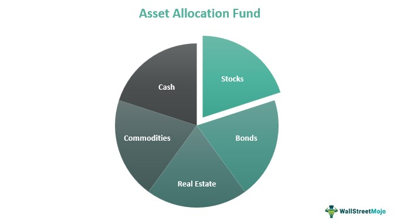

## Table of Contents

## What is an asset allocation fund?

An asset allocation fund is a type of mutual fund that spreads your money across different kinds of investments, like stocks, bonds, and cash. The goal is to balance risk and reward by not putting all your money in one place. This way, if one type of investment does poorly, the others might do better and help protect your overall investment.

These funds are managed by professionals who decide how much of the fund's money goes into each type of investment. They might change the mix over time, depending on what they think will perform best. This can be a good choice for people who want a diversified investment but don't want to manage it themselves.

## Why is asset allocation important in investing?

Asset allocation is important in investing because it helps spread out risk. When you put your money into different types of investments, like stocks, bonds, and cash, you're not betting everything on one thing. If one type of investment goes down in value, the others might stay the same or even go up, which can help protect your overall investment. This way, you're less likely to lose a lot of money all at once.

It also helps you match your investments to your goals and how much risk you're willing to take. For example, if you're saving for something you need in a few years, you might want to put more money in safer investments like bonds. But if you're saving for something far in the future, you might be okay with more risk and put more money in stocks. By choosing the right mix of investments, you can work towards your financial goals while feeling comfortable with the level of risk you're taking.

## What are the different types of asset allocation funds?

There are different kinds of asset allocation funds, and each one has its own way of mixing investments. One type is called a balanced fund. These funds usually have a set mix of stocks and bonds, like 60% stocks and 40% bonds. They are good for people who want a steady mix without too much change. Another type is a target-date fund. These funds change their mix over time based on when you plan to use the money. If you're saving for retirement in 20 years, the fund might start with more stocks and slowly move to more bonds as you get closer to that date.

Then there are lifecycle funds, which are a bit like target-date funds but might change their mix based on different stages of your life, not just a specific date. They can be good for people who want their investments to match their age and life changes. Lastly, there are tactical asset allocation funds. These funds change their mix based on what the fund manager thinks will do well in the short term. They might move money around a lot, trying to take advantage of market changes. This can be riskier but might also offer more chances for growth.

## How does a balanced fund differ from other asset allocation funds?

A balanced fund is different from other asset allocation funds because it keeps a steady mix of investments, usually a set percentage of stocks and bonds, like 60% stocks and 40% bonds. This mix doesn't change much over time, so it's good for people who want a simple and stable investment plan. Unlike balanced funds, target-date funds and lifecycle funds change their mix over time. Target-date funds adjust based on a specific date, like when you plan to retire. Lifecycle funds adjust based on different stages of your life, so they might be more flexible but also more complex.

Tactical asset allocation funds are different too because they change their mix a lot, trying to take advantage of short-term market changes. This makes them riskier than balanced funds but might offer more chances for growth. Balanced funds are easier to understand and manage because they don't change their mix often. They're good for people who want a simple way to invest without having to keep an eye on their investments all the time.

## What is the role of a target-date fund in asset allocation?

A target-date fund helps with asset allocation by changing the mix of investments over time based on when you plan to use the money. If you're saving for something like retirement, you pick a fund with a date close to when you'll retire. When you're young and have a long time until you need the money, the fund will have more stocks. Stocks can go up and down a lot, but they can also grow a lot over time. As you get closer to your target date, the fund slowly moves more money into bonds and cash. Bonds and cash are safer and don't change in value as much as stocks, so they help protect your money when you're about to use it.

Target-date funds are good for people who want their investments to change automatically without having to do much work. You just pick the right date, and the fund does the rest. This can be helpful if you don't want to keep track of your investments all the time or if you're not sure how to change your investments as you get older. But remember, even though target-date funds adjust over time, they can still lose value, especially if the stock market goes down a lot. So, it's good to understand how they work and make sure they fit with your plans and how much risk you're okay with taking.

## How do lifecycle funds adjust their asset allocation over time?

Lifecycle funds change their mix of investments over time based on different stages of your life. When you're young and just starting out, these funds will have more stocks because you have a long time until you need the money. Stocks can grow a lot over time, but they can also go up and down a lot. As you get older and move through different stages of life, like getting married, having kids, or nearing retirement, the fund will slowly move more money into bonds and cash. Bonds and cash are safer and don't change in value as much as stocks, so they help protect your money as you get closer to needing it.

These funds are good for people who want their investments to change without having to do much work. You pick a lifecycle fund that matches your age or life stage, and the fund does the rest. It's helpful if you don't want to keep track of your investments all the time or if you're not sure how to change your investments as you get older. But remember, even though lifecycle funds adjust over time, they can still lose value, especially if the stock market goes down a lot. So, it's good to understand how they work and make sure they fit with your plans and how much risk you're okay with taking.

## What are the benefits of investing in a fund of funds?

A fund of funds is a type of investment that holds other investment funds inside it. This can make investing easier because you don't have to pick and choose different funds yourself. Instead, you just invest in one fund of funds, and it does the work for you. It can also help spread out your risk because the fund of funds invests in many different kinds of funds. This means if one fund doesn't do well, the others might do better and help protect your overall investment.

Another benefit is that fund of funds can give you access to special or hard-to-reach investments. Some funds might need a lot of money to invest in or be hard to buy on your own. But a fund of funds can pool money from many investors and use it to buy into these special funds. This can open up more investment choices for you. Just remember, though, that fund of funds can have higher fees because you're paying for the management of the fund of funds and the fees of the funds it invests in. So, it's good to look at the costs and make sure they fit with your investment plans.

## How can risk tolerance influence the choice of an asset allocation fund?

Risk tolerance is how much risk you're okay with when you invest your money. It's really important when [picking](/wiki/asset-class-picking) an asset allocation fund because these funds mix different kinds of investments like stocks, bonds, and cash. If you're okay with a lot of risk, you might pick a fund with more stocks. Stocks can go up and down a lot, but they can also grow a lot over time. If you don't like much risk, you might pick a fund with more bonds and cash. Bonds and cash are safer and don't change in value as much, so they help keep your money more steady.

Your risk tolerance can help you choose the right type of asset allocation fund. For example, if you're young and saving for something far in the future, you might be okay with more risk and pick a fund with a lot of stocks, like a target-date fund for many years away. But if you're older or saving for something you need soon, you might want less risk and pick a balanced fund with more bonds. Understanding your risk tolerance helps you pick a fund that matches your comfort level and your investment goals.

## What are the tax implications of investing in different types of asset allocation funds?

When you invest in asset allocation funds, the tax you have to pay can change depending on the type of fund and how it's set up. Some funds, like mutual funds, might give you money back as dividends or capital gains, and you'll have to pay taxes on those. If the fund has a lot of stocks, the taxes might be higher because stock dividends and capital gains from stocks can be taxed at different rates. On the other hand, if the fund has more bonds, you might have to pay taxes on the interest you earn, which can be taxed at your regular income tax rate.

Some asset allocation funds are set up as exchange-traded funds (ETFs), and these can have different tax rules. ETFs are often more tax-efficient because they can move money around without selling investments as much, which can help lower the taxes you have to pay. Also, if you invest in a retirement account like an IRA or a 401(k), you might not have to pay taxes on the money you earn until you take it out. So, it's good to think about where you're investing and how it might affect your taxes when you pick an asset allocation fund.

## How do fees and expenses vary among different asset allocation funds?

Fees and expenses can be different for each type of asset allocation fund. Balanced funds, which keep a steady mix of stocks and bonds, usually have lower fees because they don't change their mix much. Target-date funds and lifecycle funds, which change their mix over time, might have higher fees because they need more work to manage. Tactical asset allocation funds, which change their mix a lot to try to do better in the market, often have the highest fees because they need a lot of active management.

Another thing to think about is how the fund is set up. Mutual funds, which are one kind of asset allocation fund, usually have fees like an expense ratio, which is a yearly cost for managing the fund. They might also have sales charges, called loads, if you buy or sell the fund. Exchange-traded funds (ETFs), another kind of asset allocation fund, often have lower expense ratios because they can be more tax-efficient and don't need as much active management. So, when you're picking an asset allocation fund, it's good to look at the fees and make sure they fit with your investment plans.

## What strategies do fund managers use to rebalance asset allocation funds?

Fund managers use different strategies to keep asset allocation funds balanced. One common strategy is called calendar rebalancing. This means the fund manager looks at the mix of investments on a set schedule, like every three or six months, and makes changes to bring it back to the original plan. For example, if the fund is supposed to have 60% stocks and 40% bonds, but stocks have gone up a lot and now make up 70%, the manager might sell some stocks and buy bonds to get back to the 60-40 mix.

Another strategy is called threshold rebalancing. With this method, the fund manager waits until the mix of investments gets too far away from the plan before making changes. If the plan is to have 60% stocks and 40% bonds, and the manager decides that a 5% change is too much, they will rebalance when stocks reach 65% or 55%. This way, the fund only changes when it really needs to, which can save on trading costs. Both strategies help keep the fund in line with its goals, but they work a bit differently depending on how often the manager wants to make changes and how much they want the mix to stay the same.

## How can an investor evaluate the performance of an asset allocation fund?

To evaluate the performance of an asset allocation fund, an investor should look at a few key things. First, check the fund's returns over different time periods, like one year, three years, and five years. This helps you see how the fund has done over time and not just in the short term. You can compare these returns to a benchmark, like the S&P 500 for stocks or the Bloomberg Barclays Aggregate Bond Index for bonds. This tells you if the fund is doing better or worse than the market as a whole. Also, look at the fund's risk, which you can measure with something called standard deviation. A higher standard deviation means the fund's returns go up and down a lot, which might be too risky for some investors.

Another important thing to consider is the fund's fees and expenses. These costs can eat into your returns, so a fund with high fees needs to perform really well to be worth it. You can find the expense ratio in the fund's prospectus, which tells you how much it costs to manage the fund each year. Also, think about how the fund fits with your investment goals and how much risk you're okay with taking. If the fund's mix of investments matches what you want, and it's doing well compared to similar funds, it might be a good choice for you. Remember, past performance doesn't guarantee future results, so always keep an eye on how the fund is doing and make changes if you need to.

## What are the fundamentals of asset allocation?

Asset allocation is a pivotal component of successful portfolio management, focusing on the distribution of investments across various asset classes to meet specific financial objectives. This process involves a strategic balance among asset categories such as stocks, bonds, and cash equivalents. Each asset class carries distinct risk-and-return characteristics, and the allocation decision influences the overall portfolio risk and potential returns.

Balancing asset proportions is foundational to aligning with investment goals. For instance, a portfolio emphasizing growth might allocate more to equities, whereas one designed for stability might favor bonds and cash. An optimal asset allocation requires an understanding of both market conditions and the investor's long-term strategy.

Asset allocation can be fixed or adaptable. Fixed asset allocation maintains a predetermined distribution irrespective of market fluctuations. This approach advocates for consistency and reduces the need for constant monitoring. Conversely, a modified approach responds to market conditions and evolving investment strategies, enabling the portfolio to adapt to new information or opportunities.

Different strategies within asset allocation include strategic, tactical, and dynamic methods. Strategic asset allocation involves setting target allocations and periodically rebalancing to maintain those levels. Tactical allocation allows for temporary deviations from the strategic mix to capitalize on short-term market conditions. Meanwhile, dynamic allocation continuously adjusts based on predefined rules, such as [volatility](/wiki/volatility-trading-strategies) or market trends.

The primary objective of asset allocation is to maximize returns while managing risk corresponding to the investor's risk tolerance and financial goals. By diversifying investments across different asset classes, investors can reduce the impact of adverse market movements on their portfolios. The risk-adjusted return is a crucial metric in this context, often calculated using formulas like the Sharpe ratio:

$$
\text{Sharpe Ratio} = \frac{(R_p - R_f)}{\sigma_p}
$$

where $R_p$ is the portfolio return, $R_f$ is the risk-free rate, and $\sigma_p$ is the standard deviation of portfolio returns. This ratio helps assess the added value of diversification versus taking on additional risk.

Proper asset allocation necessitates a careful evaluation of individual financial profiles and an ongoing assessment of market dynamics. Investors must adapt allocations to align with changing objectives and economic conditions, while also considering their own risk appetite and investment timelines.

## References & Further Reading

[1]: Bodie, Z., Kane, A., & Marcus, A. J. (2014). ["Investments."](https://books.google.com/books/about/EBOOK_Investments_Global_edition.html?id=BMsvEAAAQBAJ) McGraw-Hill Education.

[2]: Malkiel, B. G. (2019). ["A Random Walk Down Wall Street: The Time-Tested Strategy for Successful Investing."](https://yourknowledgedigest.org/wp-content/uploads/2020/04/a-random-walk-down-wall-street.pdf) W. W. Norton & Company.

[3]: López de Prado, M. (2018). ["Advances in Financial Machine Learning."](https://www.amazon.com/Advances-Financial-Machine-Learning-Marcos/dp/1119482089) Wiley.

[4]: Jansen, S. (2020). ["Machine Learning for Algorithmic Trading."](https://github.com/stefan-jansen/machine-learning-for-trading) Packt Publishing.

[5]: Chan, E. P. (2009). ["Quantitative Trading: How to Build Your Own Algorithmic Trading Business."](https://github.com/ftvision/quant_trading_echan_book) Wiley.